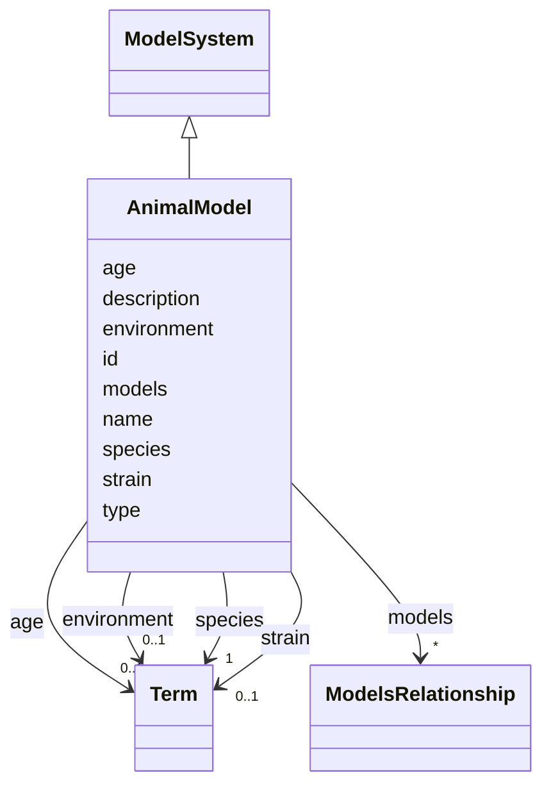

# Class: AnimalModel 


URI: [namo:AnimalModel](https://w3id.org/monarch-initiative/namo/AnimalModel)





## Inheritance
* [NamedThing](NamedThing.md)
    * [ModelSystem](ModelSystem.md)
        * **AnimalModel**


## Slots

| Name | Cardinality and Range | Description | Inheritance |
| ---  | --- | --- | --- |
| [species](species.md) | 1 <br/> [Term](Term.md) | The species of the animal used in the model system | direct |
| [strain](strain.md) | 0..1 <br/> [Term](Term.md) | The specific strain of the animal used in the model system | direct |
| [age](age.md) | 0..1 <br/> [Term](Term.md) | The age of the animal used in the model system | direct |
| [environment](environment.md) | 0..1 <br/> [Term](Term.md) | The environmental conditions under which the animal model is maintained | direct |
| [models](models.md) | * <br/> [ModelsRelationship](ModelsRelationship.md) |  | [ModelSystem](ModelSystem.md) |
| [id](id.md) | 1 <br/> [Uriorcurie](Uriorcurie.md) | A unique identifier for a thing | [NamedThing](NamedThing.md) |
| [name](name.md) | 0..1 <br/> [String](String.md) | A human-readable name for a thing | [NamedThing](NamedThing.md) |
| [description](description.md) | 0..1 <br/> [String](String.md) | A human-readable description for a thing | [NamedThing](NamedThing.md) |
| [type](type.md) | 0..1 <br/> [String](String.md) |  | [NamedThing](NamedThing.md) |


## Identifier and Mapping Information


### Schema Source


* from schema: https://w3id.org/monarch-initiative/namo


## Mappings

| Mapping Type | Mapped Value |
| ---  | ---  |
| self | namo:AnimalModel |
| native | namo:AnimalModel |


## LinkML Source

<!-- TODO: investigate https://stackoverflow.com/questions/37606292/how-to-create-tabbed-code-blocks-in-mkdocs-or-sphinx -->

### Direct

<details>
```yaml
name: AnimalModel
from_schema: https://w3id.org/monarch-initiative/namo
is_a: ModelSystem
attributes:
  species:
    name: species
    description: The species of the animal used in the model system.
    from_schema: https://w3id.org/monarch-initiative/namo
    rank: 1000
    domain_of:
    - AnimalModel
    range: Term
    bindings:
    - range: SpeciesEnum
      obligation_level: REQUIRED
      binds_value_of: id
    required: true
  strain:
    name: strain
    description: The specific strain of the animal used in the model system.
    from_schema: https://w3id.org/monarch-initiative/namo
    rank: 1000
    domain_of:
    - AnimalModel
    range: Term
    bindings:
    - range: StrainEnum
      obligation_level: REQUIRED
      binds_value_of: id
  age:
    name: age
    description: The age of the animal used in the model system.
    from_schema: https://w3id.org/monarch-initiative/namo
    rank: 1000
    domain_of:
    - AnimalModel
    range: Term
    bindings:
    - range: OrganismAgeEnum
      obligation_level: REQUIRED
      binds_value_of: id
  environment:
    name: environment
    description: The environmental conditions under which the animal model is maintained.
    from_schema: https://w3id.org/monarch-initiative/namo
    rank: 1000
    domain_of:
    - AnimalModel
    range: Term

```
</details>

### Induced

<details>
```yaml
name: AnimalModel
from_schema: https://w3id.org/monarch-initiative/namo
is_a: ModelSystem
attributes:
  species:
    name: species
    description: The species of the animal used in the model system.
    from_schema: https://w3id.org/monarch-initiative/namo
    rank: 1000
    alias: species
    owner: AnimalModel
    domain_of:
    - AnimalModel
    range: Term
    bindings:
    - range: SpeciesEnum
      obligation_level: REQUIRED
      binds_value_of: id
    required: true
  strain:
    name: strain
    description: The specific strain of the animal used in the model system.
    from_schema: https://w3id.org/monarch-initiative/namo
    rank: 1000
    alias: strain
    owner: AnimalModel
    domain_of:
    - AnimalModel
    range: Term
    bindings:
    - range: StrainEnum
      obligation_level: REQUIRED
      binds_value_of: id
  age:
    name: age
    description: The age of the animal used in the model system.
    from_schema: https://w3id.org/monarch-initiative/namo
    rank: 1000
    alias: age
    owner: AnimalModel
    domain_of:
    - AnimalModel
    range: Term
    bindings:
    - range: OrganismAgeEnum
      obligation_level: REQUIRED
      binds_value_of: id
  environment:
    name: environment
    description: The environmental conditions under which the animal model is maintained.
    from_schema: https://w3id.org/monarch-initiative/namo
    rank: 1000
    alias: environment
    owner: AnimalModel
    domain_of:
    - AnimalModel
    range: Term
  models:
    name: models
    from_schema: https://w3id.org/monarch-initiative/namo
    rank: 1000
    alias: models
    owner: AnimalModel
    domain_of:
    - ModelSystem
    range: ModelsRelationship
    multivalued: true
  id:
    name: id
    description: A unique identifier for a thing
    from_schema: https://w3id.org/monarch-initiative/namo
    rank: 1000
    slot_uri: schema:identifier
    identifier: true
    alias: id
    owner: AnimalModel
    domain_of:
    - NamedThing
    - Reference
    range: uriorcurie
    required: true
  name:
    name: name
    description: A human-readable name for a thing
    from_schema: https://w3id.org/monarch-initiative/namo
    rank: 1000
    slot_uri: schema:name
    alias: name
    owner: AnimalModel
    domain_of:
    - NamedThing
    range: string
  description:
    name: description
    description: A human-readable description for a thing
    from_schema: https://w3id.org/monarch-initiative/namo
    rank: 1000
    slot_uri: schema:description
    alias: description
    owner: AnimalModel
    domain_of:
    - NamedThing
    range: string
  type:
    name: type
    from_schema: https://w3id.org/monarch-initiative/namo
    rank: 1000
    designates_type: true
    alias: type
    owner: AnimalModel
    domain_of:
    - NamedThing
    range: string

```
</details>