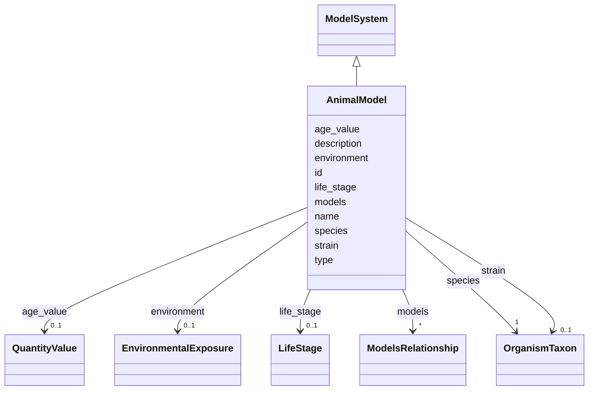

---
search:
  boost: 10.0
---

# Class: AnimalModel 

<div data-search-exclude markdown="1">


URI: [namo:AnimalModel](https://w3id.org/monarch-initiative/namo/AnimalModel)



```mermaid
 classDiagram
    class AnimalModel
    click AnimalModel href "../AnimalModel/"
      ModelSystem <|-- AnimalModel
        click ModelSystem href "../ModelSystem/"
      
      AnimalModel : age_value
        
          
    
        
        
        AnimalModel --> "0..1" QuantityValue : age_value
        click QuantityValue href "../QuantityValue/"
    

        
      AnimalModel : description
        
      AnimalModel : environment
        
          
    
        
        
        AnimalModel --> "0..1" EnvironmentalExposure : environment
        click EnvironmentalExposure href "../EnvironmentalExposure/"
    

        
      AnimalModel : id
        
      AnimalModel : life_stage
        
          
    
        
        
        AnimalModel --> "0..1" LifeStage : life_stage
        click LifeStage href "../LifeStage/"
    

        
      AnimalModel : models
        
          
    
        
        
        AnimalModel --> "*" ModelsRelationship : models
        click ModelsRelationship href "../ModelsRelationship/"
    

        
      AnimalModel : name
        
      AnimalModel : species
        
          
    
        
        
        AnimalModel --> "1" OrganismTaxon : species
        click OrganismTaxon href "../OrganismTaxon/"
    

        
      AnimalModel : strain
        
          
    
        
        
        AnimalModel --> "0..1" OrganismTaxon : strain
        click OrganismTaxon href "../OrganismTaxon/"
    

        
      AnimalModel : type
        
      
```


## Inheritance
* [NamedThing](NamedThing.md)
    * [ModelSystem](ModelSystem.md)
        * **AnimalModel**


## Slots

| Name | Cardinality and Range | Description | Inheritance |
| ---  | --- | --- | --- |
| [species](species.md) | 1 <br/> [OrganismTaxon](OrganismTaxon.md) | The species of the animal used in the model system | direct |
| [strain](strain.md) | 0..1 <br/> [OrganismTaxon](OrganismTaxon.md) | The specific strain of the animal used in the model system | direct |
| [life_stage](life_stage.md) | 0..1 <br/> [LifeStage](LifeStage.md) | The developmental or life-cycle stage of the animal used in the model system | direct |
| [age_value](age_value.md) | 0..1 <br/> [QuantityValue](QuantityValue.md) | Chronological age of the animal at the time of study, as a numeric value with... | direct |
| [environment](environment.md) | 0..1 <br/> [EnvironmentalExposure](EnvironmentalExposure.md) | The environmental conditions under which the animal model is maintained | direct |
| [models](models.md) | * <br/> [ModelsRelationship](ModelsRelationship.md) |  | [ModelSystem](ModelSystem.md) |
| [id](id.md) | 1 <br/> [Uriorcurie](Uriorcurie.md) | A unique identifier for a thing | [NamedThing](NamedThing.md) |
| [name](name.md) | 0..1 <br/> [String](String.md) | A human-readable name for a thing | [NamedThing](NamedThing.md) |
| [description](description.md) | 0..1 <br/> [String](String.md) | A human-readable description for a thing | [NamedThing](NamedThing.md) |
| [type](type.md) | 0..1 <br/> [String](String.md) |  | [NamedThing](NamedThing.md) |


## See Also

* [https://doi.org/10.1371/journal.pbio.3000410](https://doi.org/10.1371/journal.pbio.3000410)


## Identifier and Mapping Information


### Schema Source


* from schema: https://w3id.org/monarch-initiative/namo


## Mappings

| Mapping Type | Mapped Value |
| ---  | ---  |
| self | namo:AnimalModel |
| native | namo:AnimalModel |
| exact | ARRIVE:animal_model |


## LinkML Source

<!-- TODO: investigate https://stackoverflow.com/questions/37606292/how-to-create-tabbed-code-blocks-in-mkdocs-or-sphinx -->

### Direct

<details>
```yaml
name: AnimalModel
from_schema: https://w3id.org/monarch-initiative/namo
see_also:
- https://doi.org/10.1371/journal.pbio.3000410
exact_mappings:
- ARRIVE:animal_model
is_a: ModelSystem
attributes:
  species:
    name: species
    description: The species of the animal used in the model system.
    from_schema: https://w3id.org/monarch-initiative/namo
    rank: 1000
    domain_of:
    - AnimalModel
    range: OrganismTaxon
    bindings:
    - range: SpeciesEnum
      obligation_level: REQUIRED
      binds_value_of: id
    required: true
    inlined: true
  strain:
    name: strain
    description: 'The specific strain of the animal used in the model system. Deliberately
      unconstrained beyond the class: LinkML dynamic enums cannot filter by taxonomic
      rank, so any NCBITaxon-rooted enum would be indistinguishable from SpeciesEnum.'
    from_schema: https://w3id.org/monarch-initiative/namo
    rank: 1000
    domain_of:
    - AnimalModel
    range: OrganismTaxon
    inlined: true
  life_stage:
    name: life_stage
    description: The developmental or life-cycle stage of the animal used in the model
      system.
    from_schema: https://w3id.org/monarch-initiative/namo
    rank: 1000
    domain_of:
    - AnimalModel
    range: LifeStage
    bindings:
    - range: LifeStageEnum
      obligation_level: REQUIRED
      binds_value_of: id
    inlined: true
  age_value:
    name: age_value
    description: Chronological age of the animal at the time of study, as a numeric
      value with a unit.
    from_schema: https://w3id.org/monarch-initiative/namo
    rank: 1000
    domain_of:
    - AnimalModel
    range: QuantityValue
    inlined: true
  environment:
    name: environment
    description: The environmental conditions under which the animal model is maintained.
    from_schema: https://w3id.org/monarch-initiative/namo
    rank: 1000
    domain_of:
    - AnimalModel
    range: EnvironmentalExposure
    inlined: true

```
</details>

### Induced

<details>
```yaml
name: AnimalModel
from_schema: https://w3id.org/monarch-initiative/namo
see_also:
- https://doi.org/10.1371/journal.pbio.3000410
exact_mappings:
- ARRIVE:animal_model
is_a: ModelSystem
attributes:
  species:
    name: species
    description: The species of the animal used in the model system.
    from_schema: https://w3id.org/monarch-initiative/namo
    rank: 1000
    owner: AnimalModel
    domain_of:
    - AnimalModel
    range: OrganismTaxon
    bindings:
    - range: SpeciesEnum
      obligation_level: REQUIRED
      binds_value_of: id
    required: true
    inlined: true
  strain:
    name: strain
    description: 'The specific strain of the animal used in the model system. Deliberately
      unconstrained beyond the class: LinkML dynamic enums cannot filter by taxonomic
      rank, so any NCBITaxon-rooted enum would be indistinguishable from SpeciesEnum.'
    from_schema: https://w3id.org/monarch-initiative/namo
    rank: 1000
    owner: AnimalModel
    domain_of:
    - AnimalModel
    range: OrganismTaxon
    inlined: true
  life_stage:
    name: life_stage
    description: The developmental or life-cycle stage of the animal used in the model
      system.
    from_schema: https://w3id.org/monarch-initiative/namo
    rank: 1000
    owner: AnimalModel
    domain_of:
    - AnimalModel
    range: LifeStage
    bindings:
    - range: LifeStageEnum
      obligation_level: REQUIRED
      binds_value_of: id
    inlined: true
  age_value:
    name: age_value
    description: Chronological age of the animal at the time of study, as a numeric
      value with a unit.
    from_schema: https://w3id.org/monarch-initiative/namo
    rank: 1000
    owner: AnimalModel
    domain_of:
    - AnimalModel
    range: QuantityValue
    inlined: true
  environment:
    name: environment
    description: The environmental conditions under which the animal model is maintained.
    from_schema: https://w3id.org/monarch-initiative/namo
    rank: 1000
    owner: AnimalModel
    domain_of:
    - AnimalModel
    range: EnvironmentalExposure
    inlined: true
  models:
    name: models
    from_schema: https://w3id.org/monarch-initiative/namo
    rank: 1000
    owner: AnimalModel
    domain_of:
    - ModelSystem
    range: ModelsRelationship
    multivalued: true
  id:
    name: id
    description: A unique identifier for a thing
    from_schema: https://w3id.org/monarch-initiative/namo
    rank: 1000
    slot_uri: schema:identifier
    identifier: true
    owner: AnimalModel
    domain_of:
    - NamedThing
    - Reference
    - BiolinkEntity
    range: uriorcurie
    required: true
  name:
    name: name
    description: A human-readable name for a thing
    from_schema: https://w3id.org/monarch-initiative/namo
    rank: 1000
    slot_uri: schema:name
    owner: AnimalModel
    domain_of:
    - NamedThing
    - BiolinkEntity
    range: string
  description:
    name: description
    description: A human-readable description for a thing
    from_schema: https://w3id.org/monarch-initiative/namo
    rank: 1000
    slot_uri: schema:description
    owner: AnimalModel
    domain_of:
    - NamedThing
    - BiolinkEntity
    range: string
  type:
    name: type
    from_schema: https://w3id.org/monarch-initiative/namo
    rank: 1000
    designates_type: true
    owner: AnimalModel
    domain_of:
    - NamedThing
    range: string

```
</details></div>