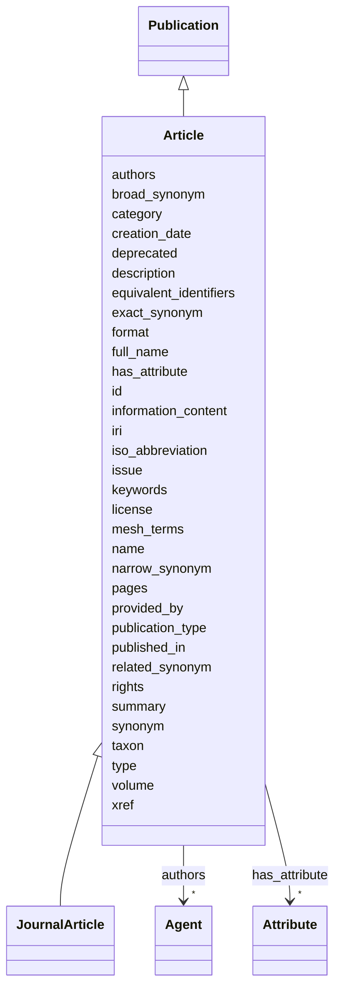

---
search:
  boost: 10.0
---

# Class: Article 


_a piece of writing on a particular topic presented as a stand-alone section of a larger publication_


<div data-search-exclude markdown="1">


URI: [namo:Article](https://w3id.org/monarch-initiative/namo/Article)





## Inheritance
* [Entity](Entity.md)
    * [NamedThing](NamedThing.md)
        * [InformationContentEntity](InformationContentEntity.md)
            * [Publication](Publication.md)
                * **Article**
                    * [JournalArticle](JournalArticle.md)


## Slots

| Name | Cardinality and Range | Description | Inheritance |
| ---  | --- | --- | --- |
| [published_in](published_in.md) | 1 <br/> [Uriorcurie](Uriorcurie.md) | The enclosing parent serial containing the article should have industry-stand... | direct |
| [iso_abbreviation](iso_abbreviation.md) | 0..1 <br/> [String](String.md) | Optional value, if used locally as a convenience, is set to the iso abbreviat... | direct |
| [volume](volume.md) | 0..1 <br/> [String](String.md) | volume of a book or music release in a collection/series or a published colle... | direct |
| [issue](issue.md) | 0..1 <br/> [String](String.md) | issue of a newspaper, a scientific journal or magazine for reference purpose | direct |
| [authors](authors.md) | * <br/> [Agent](Agent.md) | connects an publication to the list of authors who contributed to the publica... | [Publication](Publication.md) |
| [pages](pages.md) | * <br/> [String](String.md) | When a 2-tuple of page numbers are provided, they represent the start and end... | [Publication](Publication.md) |
| [summary](summary.md) | 0..1 <br/> [String](String.md) | executive  summary of a publication | [Publication](Publication.md) |
| [keywords](keywords.md) | * <br/> [String](String.md) | keywords tagging a publication | [Publication](Publication.md) |
| [mesh_terms](mesh_terms.md) | * <br/> [Uriorcurie](Uriorcurie.md) | mesh terms tagging a publication | [Publication](Publication.md) |
| [xref](xref.md) | * <br/> [Uriorcurie](Uriorcurie.md) | A database cross reference or alternative identifier for a NamedThing or edge... | [NamedThing](NamedThing.md), [Publication](Publication.md) |
| [publication_type](publication_type.md) | 1..* <br/> [String](String.md) | Ontology term for publication type may be drawn from Dublin Core types (https... | [Publication](Publication.md) |
| [license](license.md) | 0..1 <br/> [String](String.md) | A legal instrument under which the information content entity is made availab... | [InformationContentEntity](InformationContentEntity.md) |
| [rights](rights.md) | 0..1 <br/> [String](String.md) | A statement describing rights held in or over the information content entity,... | [InformationContentEntity](InformationContentEntity.md) |
| [format](format.md) | 0..1 <br/> [String](String.md) | The file format, physical medium, or representational form of the information... | [InformationContentEntity](InformationContentEntity.md) |
| [creation_date](creation_date.md) | 0..1 <br/> [Date](Date.md) | date on which an entity was created | [InformationContentEntity](InformationContentEntity.md) |
| [provided_by](provided_by.md) | * <br/> [String](String.md) | The value in this node property represents the knowledge provider that create... | [NamedThing](NamedThing.md) |
| [full_name](full_name.md) | 0..1 <br/> [LabelType](LabelType.md) | a long-form human readable name for a thing | [NamedThing](NamedThing.md) |
| [synonym](synonym.md) | * <br/> [LabelType](LabelType.md) | Alternate human-readable names for a thing | [NamedThing](NamedThing.md) |
| [exact_synonym](exact_synonym.md) | * <br/> [LabelType](LabelType.md) | An alternate label for an entity that denotes exactly the same meaning as the... | [NamedThing](NamedThing.md) |
| [broad_synonym](broad_synonym.md) | * <br/> [LabelType](LabelType.md) | An alternate label for an entity whose meaning is broader (more general) than... | [NamedThing](NamedThing.md) |
| [narrow_synonym](narrow_synonym.md) | * <br/> [LabelType](LabelType.md) | An alternate label for an entity whose meaning is narrower (more specific) th... | [NamedThing](NamedThing.md) |
| [related_synonym](related_synonym.md) | * <br/> [LabelType](LabelType.md) | An alternate label that is related to the primary label but is neither exactl... | [NamedThing](NamedThing.md) |
| [equivalent_identifiers](equivalent_identifiers.md) | * <br/> [Uriorcurie](Uriorcurie.md) | A set of identifiers that are considered equivalent to the primary identifier... | [NamedThing](NamedThing.md) |
| [information_content](information_content.md) | 0..1 <br/> [Float](Float.md) | Information content (IC) value for a term, primarily from Automats | [NamedThing](NamedThing.md) |
| [taxon](taxon.md) | 0..1 <br/> [Uriorcurie](Uriorcurie.md) | A property that indicates the taxonomic classification of an entity | [NamedThing](NamedThing.md) |
| [id](id.md) | 1 <br/> [String](String.md) | Different kinds of publication subtypes will have different preferred identif... | [Entity](Entity.md) |
| [iri](iri.md) | 0..1 <br/> [IriType](IriType.md) | An IRI for an entity | [Entity](Entity.md) |
| [category](category.md) | 1..* <br/> [Uriorcurie](Uriorcurie.md) | Name of the high level ontology class in which this entity is categorized | [Entity](Entity.md) |
| [type](type.md) | * <br/> [String](String.md) | An rdf:type property asserting that an entity is an instance of a particular ... | [Entity](Entity.md) |
| [name](name.md) | 0..1 <br/> [LabelType](LabelType.md) | the 'title' of the publication is generally recorded in the 'name' property (... | [Entity](Entity.md) |
| [description](description.md) | 0..1 <br/> [NarrativeText](NarrativeText.md) | a human-readable description of an entity | [Entity](Entity.md) |
| [has_attribute](has_attribute.md) | * <br/> [Attribute](Attribute.md) | connects any entity to an attribute | [Entity](Entity.md) |
| [deprecated](deprecated.md) | 0..1 <br/> [Boolean](Boolean.md) | A boolean flag indicating that an entity is no longer considered current or v... | [Entity](Entity.md) |


## In Subsets


* [ModelOrganismDatabase](ModelOrganismDatabase.md)


## Identifier and Mapping Information

### Valid ID Prefixes

Instances of this class *should* have identifiers with one of the following prefixes:

* PMID


### Schema Source


* from schema: https://w3id.org/monarch-initiative/namo


## Mappings

| Mapping Type | Mapped Value |
| ---  | ---  |
| self | namo:Article |
| native | namo:Article |
| exact | SIO:000154, fabio:article |


## LinkML Source

<!-- TODO: investigate https://stackoverflow.com/questions/37606292/how-to-create-tabbed-code-blocks-in-mkdocs-or-sphinx -->

### Direct

<details>
```yaml
name: article
id_prefixes:
- PMID
description: a piece of writing on a particular topic presented as a stand-alone section
  of a larger publication
in_subset:
- model_organism_database
from_schema: https://w3id.org/monarch-initiative/namo
exact_mappings:
- SIO:000154
- fabio:article
is_a: publication
slots:
- published in
- iso abbreviation
- volume
- issue
slot_usage:
  published in:
    name: published in
    description: The enclosing parent serial containing the article should have industry-standard
      identifier from ISSN.
    required: true
  iso abbreviation:
    name: iso abbreviation
    description: Optional value, if used locally as a convenience, is set to the iso
      abbreviation of the 'published in' parent.

```
</details>

### Induced

<details>
```yaml
name: article
id_prefixes:
- PMID
description: a piece of writing on a particular topic presented as a stand-alone section
  of a larger publication
in_subset:
- model_organism_database
from_schema: https://w3id.org/monarch-initiative/namo
exact_mappings:
- SIO:000154
- fabio:article
is_a: publication
slot_usage:
  published in:
    name: published in
    description: The enclosing parent serial containing the article should have industry-standard
      identifier from ISSN.
    required: true
  iso abbreviation:
    name: iso abbreviation
    description: Optional value, if used locally as a convenience, is set to the iso
      abbreviation of the 'published in' parent.
attributes:
  published in:
    name: published in
    description: The enclosing parent serial containing the article should have industry-standard
      identifier from ISSN.
    from_schema: https://w3id.org/monarch-initiative/namo
    exact_mappings:
    - WIKIDATA_PROPERTY:P1433
    rank: 1000
    is_a: node property
    values_from:
    - NLMID
    - issn
    - isbn
    domain: publication
    alias: published_in
    owner: article
    domain_of:
    - book chapter
    - article
    range: uriorcurie
    required: true
  iso abbreviation:
    name: iso abbreviation
    description: Optional value, if used locally as a convenience, is set to the iso
      abbreviation of the 'published in' parent.
    from_schema: https://w3id.org/monarch-initiative/namo
    exact_mappings:
    - WIKIDATA_PROPERTY:P1160
    rank: 1000
    is_a: node property
    domain: publication
    alias: iso_abbreviation
    owner: article
    domain_of:
    - serial
    - article
    range: string
  volume:
    name: volume
    description: volume of a book or music release in a collection/series or a published
      collection of journal issues in a serial publication
    from_schema: https://w3id.org/monarch-initiative/namo
    exact_mappings:
    - WIKIDATA_PROPERTY:P478
    rank: 1000
    is_a: node property
    domain: publication
    owner: article
    domain_of:
    - PBPKCompartment
    - book chapter
    - serial
    - article
    range: string
  issue:
    name: issue
    description: issue of a newspaper, a scientific journal or magazine for reference
      purpose
    from_schema: https://w3id.org/monarch-initiative/namo
    exact_mappings:
    - WIKIDATA_PROPERTY:P433
    rank: 1000
    is_a: node property
    domain: publication
    owner: article
    domain_of:
    - serial
    - article
    range: string
  authors:
    name: authors
    description: connects an publication to the list of authors who contributed to
      the publication. This property should be a comma-delimited list of author names.
      It is recommended that an author's name be formatted as "surname, firstname
      initial.".   Note that this property is a node annotation expressing the citation
      list of authorship which might typically otherwise be more completely documented
      in biolink:PublicationToProviderAssociation defined edges which point to full
      details about an author and possibly, some qualifiers which clarify the specific
      status of a given author in the publication.
    from_schema: https://w3id.org/monarch-initiative/namo
    rank: 1000
    is_a: node property
    domain: publication
    owner: article
    domain_of:
    - Reference
    - publication
    range: agent
    multivalued: true
  pages:
    name: pages
    description: When a 2-tuple of page numbers are provided, they represent the start
      and end page of the publication within its parent publication context. For books,
      this may be set to the total number of pages of the book.
    from_schema: https://w3id.org/monarch-initiative/namo
    exact_mappings:
    - WIKIDATA_PROPERTY:P304
    rank: 1000
    is_a: node property
    domain: publication
    owner: article
    domain_of:
    - publication
    range: string
    multivalued: true
  summary:
    name: summary
    description: executive  summary of a publication
    from_schema: https://w3id.org/monarch-initiative/namo
    aliases:
    - abstract
    exact_mappings:
    - dct:abstract
    - WIKIDATA:Q333291
    rank: 1000
    is_a: node property
    domain: publication
    owner: article
    domain_of:
    - publication
    range: string
  keywords:
    name: keywords
    description: keywords tagging a publication
    from_schema: https://w3id.org/monarch-initiative/namo
    rank: 1000
    is_a: node property
    domain: publication
    owner: article
    domain_of:
    - publication
    range: string
    multivalued: true
  mesh terms:
    name: mesh terms
    description: mesh terms tagging a publication
    from_schema: https://w3id.org/monarch-initiative/namo
    exact_mappings:
    - dcid:MeSHTerm
    rank: 1000
    is_a: node property
    values_from:
    - MESH
    domain: publication
    alias: mesh_terms
    owner: article
    domain_of:
    - publication
    range: uriorcurie
    multivalued: true
  xref:
    name: xref
    description: A database cross reference or alternative identifier for a NamedThing
      or edge between two NamedThings.  This property should point to a database record
      or webpage that supports the existence of the edge, or gives more detail about
      the edge. This property can be used on a node or edge to provide multiple URIs
      or CURIE cross references.
    in_subset:
    - translator_minimal
    from_schema: https://w3id.org/monarch-initiative/namo
    aliases:
    - dbxref
    - Dbxref
    - DbXref
    - record_url
    - source_record_urls
    narrow_mappings:
    - gff3:Dbxref
    - gpi:DB_Xrefs
    rank: 1000
    domain: named thing
    owner: article
    domain_of:
    - named thing
    - publication
    - retrieval source
    - gene
    - gene product mixin
    range: uriorcurie
    multivalued: true
  publication type:
    name: publication type
    description: Ontology term for publication type may be drawn from Dublin Core
      types (https://www.dublincore.org/specifications/dublin-core/dcmi-type-vocabulary/),
      FRBR-aligned Bibliographic Ontology (https://sparontologies.github.io/fabio/current/fabio.html),
      the MESH publication types (https://www.nlm.nih.gov/mesh/pubtypes.html), the
      Confederation of Open Access Repositories (COAR) Controlled Vocabulary for Resource
      Type Genres (http://vocabularies.coar-repositories.org/documentation/resource_types/),
      Wikidata (https://www.wikidata.org/wiki/Wikidata:Publication_types), or equivalent
      publication type ontology. When a given publication type ontology term is used
      within a given knowledge graph, then the CURIE identified term must be documented
      in the graph as a concept node of biolink:category biolink:OntologyClass.
    from_schema: https://w3id.org/monarch-initiative/namo
    rank: 1000
    values_from:
    - dctypes
    - fabio
    - MESH_PUB
    - COAR_RESOURCE
    - WIKIDATA
    slot_uri: dct:type
    alias: publication_type
    owner: article
    domain_of:
    - publication
    range: string
    required: true
    multivalued: true
  license:
    name: license
    description: A legal instrument under which the information content entity is
      made available, typically identified by a URL or CURIE pointing to a license
      document.
    from_schema: https://w3id.org/monarch-initiative/namo
    exact_mappings:
    - dct:license
    narrow_mappings:
    - WIKIDATA_PROPERTY:P275
    rank: 1000
    is_a: node property
    domain: information content entity
    owner: article
    domain_of:
    - information content entity
    range: string
  rights:
    name: rights
    description: A statement describing rights held in or over the information content
      entity, such as copyright, intellectual property, or access and usage rights.
    from_schema: https://w3id.org/monarch-initiative/namo
    exact_mappings:
    - dct:rights
    rank: 1000
    is_a: node property
    domain: information content entity
    owner: article
    domain_of:
    - information content entity
    range: string
  format:
    name: format
    description: The file format, physical medium, or representational form of the
      information content entity; for digital resources typically a MIME type or format
      identifier. Corresponds to dct:format.
    from_schema: https://w3id.org/monarch-initiative/namo
    exact_mappings:
    - dct:format
    - WIKIDATA_PROPERTY:P2701
    rank: 1000
    is_a: node property
    domain: information content entity
    owner: article
    domain_of:
    - information content entity
    range: string
  creation date:
    name: creation date
    description: date on which an entity was created. This can be applied to nodes
      or edges
    from_schema: https://w3id.org/monarch-initiative/namo
    aliases:
    - publication date
    - date started
    exact_mappings:
    - dct:createdOn
    - WIKIDATA_PROPERTY:P577
    rank: 1000
    is_a: node property
    domain: named thing
    alias: creation_date
    owner: article
    domain_of:
    - information content entity
    - clinical trial
    range: date
  provided by:
    name: provided by
    description: The value in this node property represents the knowledge provider
      that created or assembled the node and all of its attributes.  Used internally
      to represent how a particular node made its way into a knowledge provider or
      graph.
    from_schema: https://w3id.org/monarch-initiative/namo
    rank: 1000
    is_a: node property
    domain: named thing
    alias: provided_by
    owner: article
    domain_of:
    - named thing
    range: string
    multivalued: true
  full name:
    name: full name
    description: a long-form human readable name for a thing
    from_schema: https://w3id.org/monarch-initiative/namo
    rank: 1000
    is_a: node property
    domain: named thing
    alias: full_name
    owner: article
    domain_of:
    - named thing
    range: label type
  synonym:
    name: synonym
    description: Alternate human-readable names for a thing
    in_subset:
    - translator_minimal
    from_schema: https://w3id.org/monarch-initiative/namo
    aliases:
    - alias
    narrow_mappings:
    - skos:altLabel
    - gff3:Alias
    - AGRKB:synonyms
    - gpi:DB_Object_Synonyms
    - HANCESTRO:0330
    - IAO:0000136
    - RXNORM:has_tradename
    rank: 1000
    is_a: node property
    domain: named thing
    owner: article
    domain_of:
    - named thing
    - gene product mixin
    range: label type
    multivalued: true
  exact synonym:
    name: exact synonym
    description: An alternate label for an entity that denotes exactly the same meaning
      as the primary label and is interchangeable with it in all contexts.
    from_schema: https://w3id.org/monarch-initiative/namo
    exact_mappings:
    - oboInOwl:hasExactSynonym
    rank: 1000
    is_a: synonym
    domain: named thing
    alias: exact_synonym
    owner: article
    domain_of:
    - named thing
    range: label type
    multivalued: true
  broad synonym:
    name: broad synonym
    description: An alternate label for an entity whose meaning is broader (more general)
      than the primary label but is still useful as a lexical alternative.
    from_schema: https://w3id.org/monarch-initiative/namo
    exact_mappings:
    - oboInOwl:hasBroadSynonym
    rank: 1000
    is_a: synonym
    domain: named thing
    alias: broad_synonym
    owner: article
    domain_of:
    - named thing
    range: label type
    multivalued: true
  narrow synonym:
    name: narrow synonym
    description: An alternate label for an entity whose meaning is narrower (more
      specific) than the primary label, for example naming a particular sub-type.
    from_schema: https://w3id.org/monarch-initiative/namo
    exact_mappings:
    - oboInOwl:hasNarrowSynonym
    rank: 1000
    is_a: synonym
    domain: named thing
    alias: narrow_synonym
    owner: article
    domain_of:
    - named thing
    range: label type
    multivalued: true
  related synonym:
    name: related synonym
    description: An alternate label that is related to the primary label but is neither
      exactly synonymous nor cleanly broader or narrower; useful as a lexical pointer
      but not for strict equivalence. Corresponds to oboInOwl:hasRelatedSynonym.
    from_schema: https://w3id.org/monarch-initiative/namo
    exact_mappings:
    - oboInOwl:hasRelatedSynonym
    rank: 1000
    is_a: synonym
    domain: named thing
    alias: related_synonym
    owner: article
    domain_of:
    - named thing
    range: label type
    multivalued: true
  equivalent identifiers:
    name: equivalent identifiers
    description: A set of identifiers that are considered equivalent to the primary
      identifier of the entity. This attribute is used to represent a collection of
      identifiers that are considered equivalent to the primary identifier of an entity.
      These equivalent identifiers may come from different databases, ontologies,
      or naming conventions, but they all refer to the same underlying concept or
      entity. This attribute is particularly useful in data integration and interoperability
      scenarios, where it is important to recognize and link different representations
      of the same entity across various sources.
    from_schema: https://w3id.org/monarch-initiative/namo
    see_also:
    - biolink:xref
    - biolink:synonyms
    rank: 1000
    alias: equivalent_identifiers
    owner: article
    domain_of:
    - named thing
    range: uriorcurie
    multivalued: true
  information content:
    name: information content
    description: Information content (IC) value for a term, primarily from Automats.
    from_schema: https://w3id.org/monarch-initiative/namo
    rank: 1000
    alias: information_content
    owner: article
    domain_of:
    - named thing
    range: float
  taxon:
    name: taxon
    description: A property that indicates the taxonomic classification of an entity.
      Values for this slot should be from the NCBITaxon ontology.
    comments:
    - Note there is also a predicate 'in taxon' that can be used to instantiate an
      edge between a taxon entity and a thing with taxon entity.  This is an acceptable
      practice for KG construction, but for many applications it is more convenient
      to use this property slot to directly annotate the taxon on the entity itself.
    in_subset:
    - translator_minimal
    from_schema: https://w3id.org/monarch-initiative/namo
    rank: 1000
    is_a: node property
    domain: named thing
    owner: article
    domain_of:
    - named thing
    range: uriorcurie
  id:
    name: id
    description: 'Different kinds of publication subtypes will have different preferred
      identifiers (curies when feasible). Precedence of identifiers for scientific
      articles is as follows: PMID if available; DOI if not; actual alternate CURIE
      otherwise. Enclosing publications (i.e. referenced by ''published in'' node
      property) such as books and journals, should have industry-standard identifier
      such as from ISBN and ISSN.'
    in_subset:
    - translator_minimal
    from_schema: https://w3id.org/monarch-initiative/namo
    exact_mappings:
    - AGRKB:primaryId
    - gff3:ID
    - gpi:DB_Object_ID
    rank: 1000
    domain: entity
    identifier: true
    owner: article
    domain_of:
    - Reference
    - ontology class
    - entity
    range: string
    required: true
  iri:
    name: iri
    description: An IRI for an entity. This is determined by the id using expansion
      rules.
    in_subset:
    - translator_minimal
    - samples
    from_schema: https://w3id.org/monarch-initiative/namo
    exact_mappings:
    - WIKIDATA_PROPERTY:P854
    rank: 1000
    owner: article
    domain_of:
    - attribute
    - entity
    range: iri type
  category:
    name: category
    description: Name of the high level ontology class in which this entity is categorized.
      Corresponds to the label for the biolink entity type class. In a neo4j database
      this MAY correspond to the neo4j label tag. In an RDF database it should be
      a biolink model class URI. This field is multi-valued. It should include values
      for ancestors of the biolink class; for example, a protein such as Shh would
      have category values `biolink:Protein`, `biolink:GeneProduct`, `biolink:MolecularEntity`.
      In an RDF database, nodes will typically have an rdf:type triples. This can
      be to the most specific biolink class, or potentially to a class more specific
      than something in biolink. For example, a sequence feature `f` may have a rdf:type
      assertion to a SO class such as TF_binding_site, which is more specific than
      anything in biolink. Here we would have categories {biolink:GenomicEntity, biolink:MolecularEntity,
      biolink:NamedThing}
    in_subset:
    - translator_minimal
    from_schema: https://w3id.org/monarch-initiative/namo
    rank: 1000
    is_a: type
    domain: entity
    designates_type: true
    owner: article
    domain_of:
    - entity
    is_class_field: true
    range: uriorcurie
    required: true
    multivalued: true
  type:
    name: type
    description: An rdf:type property asserting that an entity is an instance of a
      particular class. In Biolink the value is typically used to indicate the most
      specific category of which the entity is an instance.
    from_schema: https://w3id.org/monarch-initiative/namo
    exact_mappings:
    - gff3:type
    - gpi:DB_Object_Type
    rank: 1000
    domain: entity
    slot_uri: rdf:type
    owner: article
    domain_of:
    - entity
    range: string
    multivalued: true
  name:
    name: name
    description: the 'title' of the publication is generally recorded in the 'name'
      property (inherited from NamedThing). The field name 'title' is now also tagged
      as an acceptable alias for the node property 'name' (just in case).
    in_subset:
    - translator_minimal
    - samples
    from_schema: https://w3id.org/monarch-initiative/namo
    aliases:
    - label
    - display name
    - title
    exact_mappings:
    - gff3:Name
    - gpi:DB_Object_Name
    narrow_mappings:
    - dct:title
    - WIKIDATA_PROPERTY:P1476
    rank: 1000
    domain: entity
    slot_uri: rdfs:label
    owner: article
    domain_of:
    - attribute
    - entity
    - macromolecular machine mixin
    range: label type
  description:
    name: description
    description: a human-readable description of an entity
    in_subset:
    - translator_minimal
    from_schema: https://w3id.org/monarch-initiative/namo
    aliases:
    - definition
    exact_mappings:
    - IAO:0000115
    - skos:definitions
    narrow_mappings:
    - gff3:Description
    rank: 1000
    slot_uri: dct:description
    owner: article
    domain_of:
    - entity
    range: narrative text
  has attribute:
    name: has attribute
    description: connects any entity to an attribute
    in_subset:
    - samples
    from_schema: https://w3id.org/monarch-initiative/namo
    exact_mappings:
    - SIO:000008
    close_mappings:
    - OBI:0001927
    narrow_mappings:
    - OBAN:association_has_subject_property
    - OBAN:association_has_object_property
    - CPT:has_possibly_included_panel_element
    - DRUGBANK:category
    - EFO:is_executed_in
    - HANCESTRO:0301
    - LOINC:has_action_guidance
    - LOINC:has_adjustment
    - LOINC:has_aggregation_view
    - LOINC:has_approach_guidance
    - LOINC:has_divisor
    - LOINC:has_exam
    - LOINC:has_method
    - LOINC:has_modality_subtype
    - LOINC:has_object_guidance
    - LOINC:has_scale
    - LOINC:has_suffix
    - LOINC:has_time_aspect
    - LOINC:has_time_modifier
    - LOINC:has_timing_of
    - NCIT:R88
    - NCIT:eo_disease_has_property_or_attribute
    - NCIT:has_data_element
    - NCIT:has_pharmaceutical_administration_method
    - NCIT:has_pharmaceutical_basic_dose_form
    - NCIT:has_pharmaceutical_intended_site
    - NCIT:has_pharmaceutical_release_characteristics
    - NCIT:has_pharmaceutical_state_of_matter
    - NCIT:has_pharmaceutical_transformation
    - NCIT:is_qualified_by
    - NCIT:qualifier_applies_to
    - NCIT:role_has_domain
    - NCIT:role_has_range
    - INO:0000154
    - HANCESTRO:0308
    - orphanet:C016
    - orphanet:C017
    - RO:0000053
    - RO:0000086
    - RO:0000087
    - SNOMED:has_access
    - SNOMED:has_clinical_course
    - SNOMED:has_count_of_base_of_active_ingredient
    - SNOMED:has_dose_form_administration_method
    - SNOMED:has_dose_form_release_characteristic
    - SNOMED:has_dose_form_transformation
    - SNOMED:has_finding_context
    - SNOMED:has_finding_informer
    - SNOMED:has_inherent_attribute
    - SNOMED:has_intent
    - SNOMED:has_interpretation
    - SNOMED:has_laterality
    - SNOMED:has_measurement_method
    - SNOMED:has_method
    - SNOMED:has_priority
    - SNOMED:has_procedure_context
    - SNOMED:has_process_duration
    - SNOMED:has_property
    - SNOMED:has_revision_status
    - SNOMED:has_scale_type
    - SNOMED:has_severity
    - SNOMED:has_specimen
    - SNOMED:has_state_of_matter
    - SNOMED:has_subject_relationship_context
    - SNOMED:has_surgical_approach
    - SNOMED:has_technique
    - SNOMED:has_temporal_context
    - SNOMED:has_time_aspect
    - SNOMED:has_units
    - UMLS:has_structural_class
    - UMLS:has_supported_concept_property
    - UMLS:has_supported_concept_relationship
    - UMLS:may_be_qualified_by
    rank: 1000
    domain: entity
    alias: has_attribute
    owner: article
    domain_of:
    - entity
    range: attribute
    multivalued: true
  deprecated:
    name: deprecated
    description: A boolean flag indicating that an entity is no longer considered
      current or valid.
    from_schema: https://w3id.org/monarch-initiative/namo
    exact_mappings:
    - oboInOwl:ObsoleteClass
    rank: 1000
    owner: article
    domain_of:
    - entity
    range: boolean

```
</details></div>