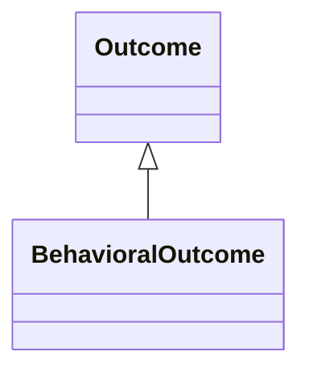

---
search:
  boost: 10.0
---

# Class: BehavioralOutcome 


_An outcome resulting from an exposure event which is the manifestation of human behavior._


<div data-search-exclude markdown="1">


URI: [namo:BehavioralOutcome](https://w3id.org/monarch-initiative/namo/BehavioralOutcome)





## Inheritance
* **BehavioralOutcome** [ [Outcome](Outcome.md)]


## Slots

| Name | Cardinality and Range | Description | Inheritance |
| ---  | --- | --- | --- |


## Identifier and Mapping Information


### Schema Source


* from schema: https://w3id.org/monarch-initiative/namo


## Mappings

| Mapping Type | Mapped Value |
| ---  | ---  |
| self | namo:BehavioralOutcome |
| native | namo:BehavioralOutcome |


## LinkML Source

<!-- TODO: investigate https://stackoverflow.com/questions/37606292/how-to-create-tabbed-code-blocks-in-mkdocs-or-sphinx -->

### Direct

<details>
```yaml
name: behavioral outcome
description: An outcome resulting from an exposure event which is the manifestation
  of human behavior.
from_schema: https://w3id.org/monarch-initiative/namo
mixins:
- outcome

```
</details>

### Induced

<details>
```yaml
name: behavioral outcome
description: An outcome resulting from an exposure event which is the manifestation
  of human behavior.
from_schema: https://w3id.org/monarch-initiative/namo
mixins:
- outcome

```
</details></div>