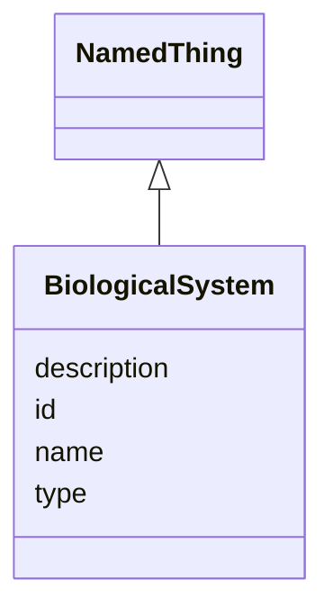

# Class: BiologicalSystem 


URI: [namo:BiologicalSystem](https://w3id.org/monarch-initiative/namo/BiologicalSystem)





## Inheritance
* [NamedThing](NamedThing.md)
    * **BiologicalSystem**


## Slots

| Name | Cardinality and Range | Description | Inheritance |
| ---  | --- | --- | --- |
| [id](id.md) | 1 <br/> [Uriorcurie](Uriorcurie.md) | A unique identifier for a thing | [NamedThing](NamedThing.md) |
| [name](name.md) | 0..1 <br/> [String](String.md) | A human-readable name for a thing | [NamedThing](NamedThing.md) |
| [description](description.md) | 0..1 <br/> [String](String.md) | A human-readable description for a thing | [NamedThing](NamedThing.md) |
| [type](type.md) | 0..1 <br/> [String](String.md) |  | [NamedThing](NamedThing.md) |


## Usages

| used by | used in | type | used |
| ---  | --- | --- | --- |
| [ModelsRelationship](ModelsRelationship.md) | [biological_system_modeled](biological_system_modeled.md) | range | [BiologicalSystem](BiologicalSystem.md) |


## Identifier and Mapping Information


### Schema Source


* from schema: https://w3id.org/monarch-initiative/namo


## Mappings

| Mapping Type | Mapped Value |
| ---  | ---  |
| self | namo:BiologicalSystem |
| native | namo:BiologicalSystem |


## LinkML Source

<!-- TODO: investigate https://stackoverflow.com/questions/37606292/how-to-create-tabbed-code-blocks-in-mkdocs-or-sphinx -->

### Direct

<details>
```yaml
name: BiologicalSystem
from_schema: https://w3id.org/monarch-initiative/namo
is_a: NamedThing

```
</details>

### Induced

<details>
```yaml
name: BiologicalSystem
from_schema: https://w3id.org/monarch-initiative/namo
is_a: NamedThing
attributes:
  id:
    name: id
    description: A unique identifier for a thing
    from_schema: https://w3id.org/monarch-initiative/namo
    rank: 1000
    slot_uri: schema:identifier
    identifier: true
    alias: id
    owner: BiologicalSystem
    domain_of:
    - NamedThing
    - Reference
    range: uriorcurie
    required: true
  name:
    name: name
    description: A human-readable name for a thing
    from_schema: https://w3id.org/monarch-initiative/namo
    rank: 1000
    slot_uri: schema:name
    alias: name
    owner: BiologicalSystem
    domain_of:
    - NamedThing
    range: string
  description:
    name: description
    description: A human-readable description for a thing
    from_schema: https://w3id.org/monarch-initiative/namo
    rank: 1000
    slot_uri: schema:description
    alias: description
    owner: BiologicalSystem
    domain_of:
    - NamedThing
    range: string
  type:
    name: type
    from_schema: https://w3id.org/monarch-initiative/namo
    rank: 1000
    designates_type: true
    alias: type
    owner: BiologicalSystem
    domain_of:
    - NamedThing
    range: string

```
</details>