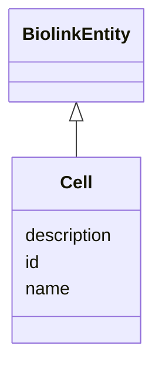

---
search:
  boost: 10.0
---

# Class: Cell 


_The basic structural and functional unit of all organisms. Includes the plasma membrane and any external encapsulating structures such as the cell wall and cell envelope._


<div data-search-exclude markdown="1">


URI: [biolink:Cell](https://w3id.org/biolink/Cell)





## Inheritance
* [BiolinkEntity](BiolinkEntity.md)
    * **Cell**


## Class Properties

| Property | Value |
| --- | --- |
| Class URI | [biolink:Cell](https://w3id.org/biolink/Cell) |


## Slots

| Name | Cardinality and Range | Description | Inheritance |
| ---  | --- | --- | --- |
| [id](id.md) | 1 <br/> [Uriorcurie](Uriorcurie.md) | A unique identifier for a thing | [BiolinkEntity](BiolinkEntity.md) |
| [name](name.md) | 0..1 <br/> [String](String.md) | A human-readable name for a thing | [BiolinkEntity](BiolinkEntity.md) |
| [description](description.md) | 0..1 <br/> [String](String.md) | A human-readable description for a thing | [BiolinkEntity](BiolinkEntity.md) |


## Usages

| used by | used in | type | used |
| ---  | --- | --- | --- |
| [CellularSystem](CellularSystem.md) | [cell_types](cell_types.md) | range | [Cell](Cell.md) |
| [TwoDCellCulture](TwoDCellCulture.md) | [cell_types](cell_types.md) | range | [Cell](Cell.md) |
| [ThreeDCellCulture](ThreeDCellCulture.md) | [cell_types](cell_types.md) | range | [Cell](Cell.md) |
| [CoCulture](CoCulture.md) | [cell_types](cell_types.md) | range | [Cell](Cell.md) |
| [Organoid](Organoid.md) | [cell_types](cell_types.md) | range | [Cell](Cell.md) |
| [CellLineModel](CellLineModel.md) | [cell_types](cell_types.md) | range | [Cell](Cell.md) |
| [OrganOnChip](OrganOnChip.md) | [cell_types](cell_types.md) | range | [Cell](Cell.md) |
| [CellRatio](CellRatio.md) | [cell_type](cell_type.md) | range | [Cell](Cell.md) |
| [CellTypeCoverage](CellTypeCoverage.md) | [represented_cell_types](represented_cell_types.md) | range | [Cell](Cell.md) |
| [CellTypeCoverage](CellTypeCoverage.md) | [missing_cell_types](missing_cell_types.md) | range | [Cell](Cell.md) |
| [CellTypeProportion](CellTypeProportion.md) | [cell_type](cell_type.md) | range | [Cell](Cell.md) |


## Identifier and Mapping Information

### Valid ID Prefixes

Instances of this class *should* have identifiers with one of the following prefixes:

* CL

* UBERON

* NCIT

* MESH


### Schema Source


* from schema: https://w3id.org/monarch-initiative/namo


## Mappings

| Mapping Type | Mapped Value |
| ---  | ---  |
| self | biolink:Cell |
| native | namo:Cell |


## LinkML Source

<!-- TODO: investigate https://stackoverflow.com/questions/37606292/how-to-create-tabbed-code-blocks-in-mkdocs-or-sphinx -->

### Direct

<details>
```yaml
name: Cell
id_prefixes:
- CL
- UBERON
- NCIT
- MESH
description: The basic structural and functional unit of all organisms. Includes the
  plasma membrane and any external encapsulating structures such as the cell wall
  and cell envelope.
from_schema: https://w3id.org/monarch-initiative/namo
is_a: BiolinkEntity
class_uri: biolink:Cell

```
</details>

### Induced

<details>
```yaml
name: Cell
id_prefixes:
- CL
- UBERON
- NCIT
- MESH
description: The basic structural and functional unit of all organisms. Includes the
  plasma membrane and any external encapsulating structures such as the cell wall
  and cell envelope.
from_schema: https://w3id.org/monarch-initiative/namo
is_a: BiolinkEntity
attributes:
  id:
    name: id
    description: A unique identifier for a thing
    from_schema: https://w3id.org/monarch-initiative/namo
    rank: 1000
    slot_uri: schema:identifier
    identifier: true
    owner: Cell
    domain_of:
    - NamedThing
    - Reference
    - BiolinkEntity
    range: uriorcurie
    required: true
  name:
    name: name
    description: A human-readable name for a thing
    from_schema: https://w3id.org/monarch-initiative/namo
    rank: 1000
    slot_uri: schema:name
    owner: Cell
    domain_of:
    - NamedThing
    - BiolinkEntity
    range: string
  description:
    name: description
    description: A human-readable description for a thing
    from_schema: https://w3id.org/monarch-initiative/namo
    rank: 1000
    slot_uri: schema:description
    owner: Cell
    domain_of:
    - NamedThing
    - BiolinkEntity
    range: string
class_uri: biolink:Cell

```
</details></div>