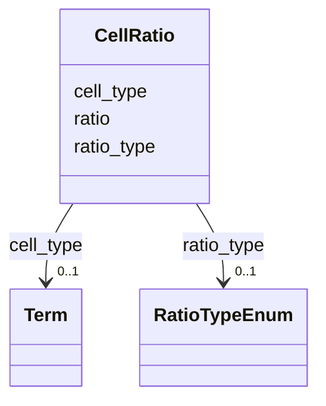

# Class: CellRatio 


_Ratio specification for different cell types in co-culture systems._


URI: [namo:CellRatio](https://w3id.org/monarch-initiative/namo/CellRatio)





<!-- no inheritance hierarchy -->


## Slots

| Name | Cardinality and Range | Description | Inheritance |
| ---  | --- | --- | --- |
| [cell_type](cell_type.md) | 0..1 <br/> [Term](Term.md) | The cell type for which the ratio is specified | direct |
| [ratio](ratio.md) | 0..1 <br/> [Float](Float.md) | Proportion or ratio of this cell type (0 | direct |
| [ratio_type](ratio_type.md) | 0..1 <br/> [RatioTypeEnum](RatioTypeEnum.md) | Type of ratio specification (percentage, absolute, fold) | direct |


## Usages

| used by | used in | type | used |
| ---  | --- | --- | --- |
| [CoCulture](CoCulture.md) | [cell_ratios](cell_ratios.md) | range | [CellRatio](CellRatio.md) |


## Identifier and Mapping Information


### Schema Source


* from schema: https://w3id.org/monarch-initiative/namo


## Mappings

| Mapping Type | Mapped Value |
| ---  | ---  |
| self | namo:CellRatio |
| native | namo:CellRatio |


## LinkML Source

<!-- TODO: investigate https://stackoverflow.com/questions/37606292/how-to-create-tabbed-code-blocks-in-mkdocs-or-sphinx -->

### Direct

<details>
```yaml
name: CellRatio
description: Ratio specification for different cell types in co-culture systems.
from_schema: https://w3id.org/monarch-initiative/namo
attributes:
  cell_type:
    name: cell_type
    description: The cell type for which the ratio is specified
    from_schema: https://w3id.org/monarch-initiative/namo
    rank: 1000
    domain_of:
    - CellRatio
    - CellTypeProportion
    range: Term
    inlined: true
  ratio:
    name: ratio
    description: Proportion or ratio of this cell type (0.0-1.0 or absolute numbers)
    from_schema: https://w3id.org/monarch-initiative/namo
    rank: 1000
    domain_of:
    - CellRatio
    range: float
  ratio_type:
    name: ratio_type
    description: Type of ratio specification (percentage, absolute, fold)
    from_schema: https://w3id.org/monarch-initiative/namo
    rank: 1000
    domain_of:
    - CellRatio
    range: RatioTypeEnum

```
</details>

### Induced

<details>
```yaml
name: CellRatio
description: Ratio specification for different cell types in co-culture systems.
from_schema: https://w3id.org/monarch-initiative/namo
attributes:
  cell_type:
    name: cell_type
    description: The cell type for which the ratio is specified
    from_schema: https://w3id.org/monarch-initiative/namo
    rank: 1000
    alias: cell_type
    owner: CellRatio
    domain_of:
    - CellRatio
    - CellTypeProportion
    range: Term
    inlined: true
  ratio:
    name: ratio
    description: Proportion or ratio of this cell type (0.0-1.0 or absolute numbers)
    from_schema: https://w3id.org/monarch-initiative/namo
    rank: 1000
    alias: ratio
    owner: CellRatio
    domain_of:
    - CellRatio
    range: float
  ratio_type:
    name: ratio_type
    description: Type of ratio specification (percentage, absolute, fold)
    from_schema: https://w3id.org/monarch-initiative/namo
    rank: 1000
    alias: ratio_type
    owner: CellRatio
    domain_of:
    - CellRatio
    range: RatioTypeEnum

```
</details>