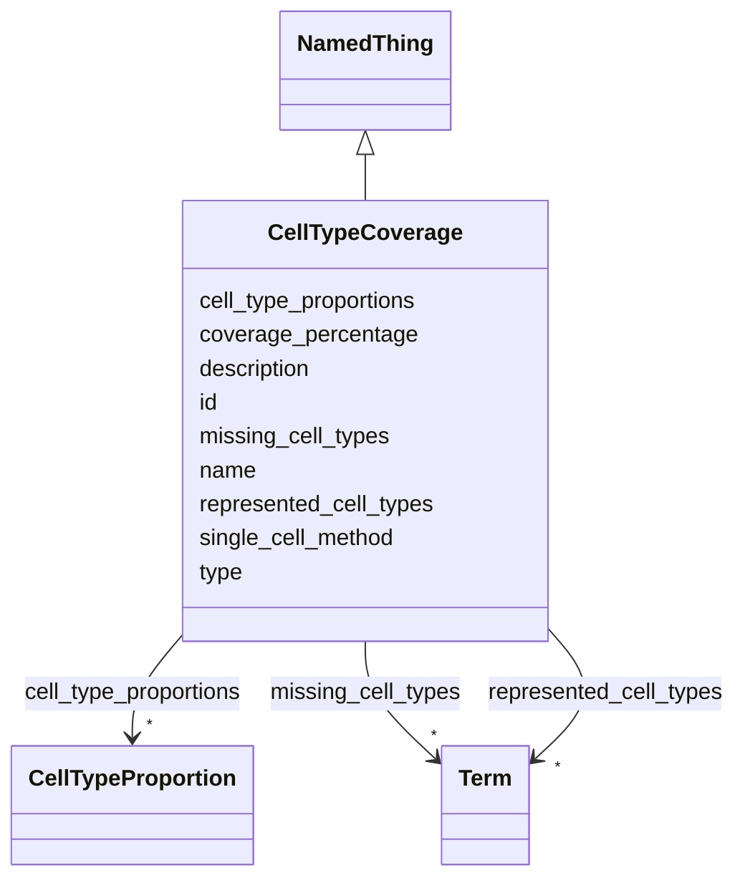

# Class: CellTypeCoverage 


_Assessment of cell type representation and cellular diversity between systems._


URI: [namo:CellTypeCoverage](https://w3id.org/monarch-initiative/namo/CellTypeCoverage)





## Inheritance
* [NamedThing](NamedThing.md)
    * **CellTypeCoverage**


## Slots

| Name | Cardinality and Range | Description | Inheritance |
| ---  | --- | --- | --- |
| [coverage_percentage](coverage_percentage.md) | 0..1 <br/> [Float](Float.md) | Percentage of target cell types represented in the model system | direct |
| [represented_cell_types](represented_cell_types.md) | * <br/> [Term](Term.md) | List of cell types present in both model and biological system | direct |
| [missing_cell_types](missing_cell_types.md) | * <br/> [Term](Term.md) | List of cell types present in biological system but missing in model | direct |
| [cell_type_proportions](cell_type_proportions.md) | * <br/> [CellTypeProportion](CellTypeProportion.md) | Quantitative comparison of cell type proportions | direct |
| [single_cell_method](single_cell_method.md) | 0..1 <br/> [String](String.md) | Method used for single-cell analysis (e | direct |
| [id](id.md) | 1 <br/> [Uriorcurie](Uriorcurie.md) | A unique identifier for a thing | [NamedThing](NamedThing.md) |
| [name](name.md) | 0..1 <br/> [String](String.md) | A human-readable name for a thing | [NamedThing](NamedThing.md) |
| [description](description.md) | 0..1 <br/> [String](String.md) | A human-readable description for a thing | [NamedThing](NamedThing.md) |
| [type](type.md) | 0..1 <br/> [String](String.md) |  | [NamedThing](NamedThing.md) |


## Usages

| used by | used in | type | used |
| ---  | --- | --- | --- |
| [StructuredConcordanceResult](StructuredConcordanceResult.md) | [cell_type_coverage](cell_type_coverage.md) | range | [CellTypeCoverage](CellTypeCoverage.md) |


## Identifier and Mapping Information


### Schema Source


* from schema: https://w3id.org/monarch-initiative/namo


## Mappings

| Mapping Type | Mapped Value |
| ---  | ---  |
| self | namo:CellTypeCoverage |
| native | namo:CellTypeCoverage |


## LinkML Source

<!-- TODO: investigate https://stackoverflow.com/questions/37606292/how-to-create-tabbed-code-blocks-in-mkdocs-or-sphinx -->

### Direct

<details>
```yaml
name: CellTypeCoverage
description: Assessment of cell type representation and cellular diversity between
  systems.
from_schema: https://w3id.org/monarch-initiative/namo
is_a: NamedThing
attributes:
  coverage_percentage:
    name: coverage_percentage
    description: Percentage of target cell types represented in the model system.
    from_schema: https://w3id.org/monarch-initiative/namo
    rank: 1000
    domain_of:
    - CellTypeCoverage
    range: float
  represented_cell_types:
    name: represented_cell_types
    description: List of cell types present in both model and biological system.
    from_schema: https://w3id.org/monarch-initiative/namo
    rank: 1000
    domain_of:
    - CellTypeCoverage
    range: Term
    multivalued: true
    inlined: true
    inlined_as_list: true
  missing_cell_types:
    name: missing_cell_types
    description: List of cell types present in biological system but missing in model.
    from_schema: https://w3id.org/monarch-initiative/namo
    rank: 1000
    domain_of:
    - CellTypeCoverage
    range: Term
    multivalued: true
    inlined: true
    inlined_as_list: true
  cell_type_proportions:
    name: cell_type_proportions
    description: Quantitative comparison of cell type proportions.
    from_schema: https://w3id.org/monarch-initiative/namo
    rank: 1000
    domain_of:
    - CellTypeCoverage
    range: CellTypeProportion
    multivalued: true
    inlined: true
    inlined_as_list: true
  single_cell_method:
    name: single_cell_method
    description: Method used for single-cell analysis (e.g., scRNA-seq, flow cytometry).
    from_schema: https://w3id.org/monarch-initiative/namo
    rank: 1000
    domain_of:
    - CellTypeCoverage

```
</details>

### Induced

<details>
```yaml
name: CellTypeCoverage
description: Assessment of cell type representation and cellular diversity between
  systems.
from_schema: https://w3id.org/monarch-initiative/namo
is_a: NamedThing
attributes:
  coverage_percentage:
    name: coverage_percentage
    description: Percentage of target cell types represented in the model system.
    from_schema: https://w3id.org/monarch-initiative/namo
    rank: 1000
    alias: coverage_percentage
    owner: CellTypeCoverage
    domain_of:
    - CellTypeCoverage
    range: float
  represented_cell_types:
    name: represented_cell_types
    description: List of cell types present in both model and biological system.
    from_schema: https://w3id.org/monarch-initiative/namo
    rank: 1000
    alias: represented_cell_types
    owner: CellTypeCoverage
    domain_of:
    - CellTypeCoverage
    range: Term
    multivalued: true
    inlined: true
    inlined_as_list: true
  missing_cell_types:
    name: missing_cell_types
    description: List of cell types present in biological system but missing in model.
    from_schema: https://w3id.org/monarch-initiative/namo
    rank: 1000
    alias: missing_cell_types
    owner: CellTypeCoverage
    domain_of:
    - CellTypeCoverage
    range: Term
    multivalued: true
    inlined: true
    inlined_as_list: true
  cell_type_proportions:
    name: cell_type_proportions
    description: Quantitative comparison of cell type proportions.
    from_schema: https://w3id.org/monarch-initiative/namo
    rank: 1000
    alias: cell_type_proportions
    owner: CellTypeCoverage
    domain_of:
    - CellTypeCoverage
    range: CellTypeProportion
    multivalued: true
    inlined: true
    inlined_as_list: true
  single_cell_method:
    name: single_cell_method
    description: Method used for single-cell analysis (e.g., scRNA-seq, flow cytometry).
    from_schema: https://w3id.org/monarch-initiative/namo
    rank: 1000
    alias: single_cell_method
    owner: CellTypeCoverage
    domain_of:
    - CellTypeCoverage
    range: string
  id:
    name: id
    description: A unique identifier for a thing
    from_schema: https://w3id.org/monarch-initiative/namo
    rank: 1000
    slot_uri: schema:identifier
    identifier: true
    alias: id
    owner: CellTypeCoverage
    domain_of:
    - NamedThing
    - Reference
    range: uriorcurie
    required: true
  name:
    name: name
    description: A human-readable name for a thing
    from_schema: https://w3id.org/monarch-initiative/namo
    rank: 1000
    slot_uri: schema:name
    alias: name
    owner: CellTypeCoverage
    domain_of:
    - NamedThing
    range: string
  description:
    name: description
    description: A human-readable description for a thing
    from_schema: https://w3id.org/monarch-initiative/namo
    rank: 1000
    slot_uri: schema:description
    alias: description
    owner: CellTypeCoverage
    domain_of:
    - NamedThing
    range: string
  type:
    name: type
    from_schema: https://w3id.org/monarch-initiative/namo
    rank: 1000
    designates_type: true
    alias: type
    owner: CellTypeCoverage
    domain_of:
    - NamedThing
    range: string

```
</details>