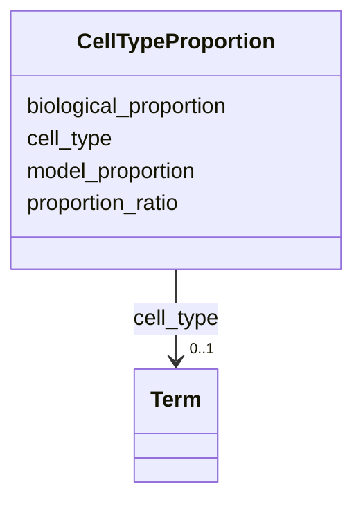

# Class: CellTypeProportion 


_Quantitative comparison of cell type proportions between systems._


URI: [namo:CellTypeProportion](https://w3id.org/monarch-initiative/namo/CellTypeProportion)





<!-- no inheritance hierarchy -->


## Slots

| Name | Cardinality and Range | Description | Inheritance |
| ---  | --- | --- | --- |
| [cell_type](cell_type.md) | 0..1 <br/> [Term](Term.md) | The cell type being compared | direct |
| [model_proportion](model_proportion.md) | 0..1 <br/> [Float](Float.md) | Proportion of this cell type in the model system | direct |
| [biological_proportion](biological_proportion.md) | 0..1 <br/> [Float](Float.md) | Proportion of this cell type in the biological system | direct |
| [proportion_ratio](proportion_ratio.md) | 0..1 <br/> [Float](Float.md) | Ratio of model to biological proportions | direct |


## Usages

| used by | used in | type | used |
| ---  | --- | --- | --- |
| [CellTypeCoverage](CellTypeCoverage.md) | [cell_type_proportions](cell_type_proportions.md) | range | [CellTypeProportion](CellTypeProportion.md) |


## Identifier and Mapping Information


### Schema Source


* from schema: https://w3id.org/monarch-initiative/namo


## Mappings

| Mapping Type | Mapped Value |
| ---  | ---  |
| self | namo:CellTypeProportion |
| native | namo:CellTypeProportion |


## LinkML Source

<!-- TODO: investigate https://stackoverflow.com/questions/37606292/how-to-create-tabbed-code-blocks-in-mkdocs-or-sphinx -->

### Direct

<details>
```yaml
name: CellTypeProportion
description: Quantitative comparison of cell type proportions between systems.
from_schema: https://w3id.org/monarch-initiative/namo
attributes:
  cell_type:
    name: cell_type
    description: The cell type being compared.
    from_schema: https://w3id.org/monarch-initiative/namo
    domain_of:
    - CellRatio
    - CellTypeProportion
    range: Term
    inlined: true
  model_proportion:
    name: model_proportion
    description: Proportion of this cell type in the model system.
    from_schema: https://w3id.org/monarch-initiative/namo
    rank: 1000
    domain_of:
    - CellTypeProportion
    range: float
  biological_proportion:
    name: biological_proportion
    description: Proportion of this cell type in the biological system.
    from_schema: https://w3id.org/monarch-initiative/namo
    rank: 1000
    domain_of:
    - CellTypeProportion
    range: float
  proportion_ratio:
    name: proportion_ratio
    description: Ratio of model to biological proportions.
    from_schema: https://w3id.org/monarch-initiative/namo
    rank: 1000
    domain_of:
    - CellTypeProportion
    range: float

```
</details>

### Induced

<details>
```yaml
name: CellTypeProportion
description: Quantitative comparison of cell type proportions between systems.
from_schema: https://w3id.org/monarch-initiative/namo
attributes:
  cell_type:
    name: cell_type
    description: The cell type being compared.
    from_schema: https://w3id.org/monarch-initiative/namo
    alias: cell_type
    owner: CellTypeProportion
    domain_of:
    - CellRatio
    - CellTypeProportion
    range: Term
    inlined: true
  model_proportion:
    name: model_proportion
    description: Proportion of this cell type in the model system.
    from_schema: https://w3id.org/monarch-initiative/namo
    rank: 1000
    alias: model_proportion
    owner: CellTypeProportion
    domain_of:
    - CellTypeProportion
    range: float
  biological_proportion:
    name: biological_proportion
    description: Proportion of this cell type in the biological system.
    from_schema: https://w3id.org/monarch-initiative/namo
    rank: 1000
    alias: biological_proportion
    owner: CellTypeProportion
    domain_of:
    - CellTypeProportion
    range: float
  proportion_ratio:
    name: proportion_ratio
    description: Ratio of model to biological proportions.
    from_schema: https://w3id.org/monarch-initiative/namo
    rank: 1000
    alias: proportion_ratio
    owner: CellTypeProportion
    domain_of:
    - CellTypeProportion
    range: float

```
</details>