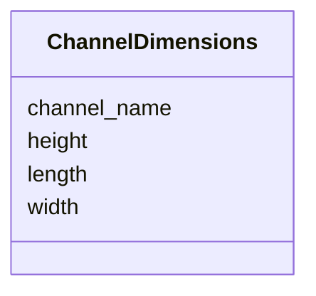

# Class: ChannelDimensions 


_Dimensions of a microfluidic channel_


URI: [namo:ChannelDimensions](https://w3id.org/monarch-initiative/namo/ChannelDimensions)





<!-- no inheritance hierarchy -->


## Slots

| Name | Cardinality and Range | Description | Inheritance |
| ---  | --- | --- | --- |
| [channel_name](channel_name.md) | 0..1 <br/> [String](String.md) | Name or identifier of the channel (e | direct |
| [width](width.md) | 0..1 <br/> [Float](Float.md) | Width of the channel in micrometers | direct |
| [height](height.md) | 0..1 <br/> [Float](Float.md) | Height of the channel in micrometers | direct |
| [length](length.md) | 0..1 <br/> [Float](Float.md) | Length of the channel in millimeters | direct |


## Usages

| used by | used in | type | used |
| ---  | --- | --- | --- |
| [MicrofluidicDesign](MicrofluidicDesign.md) | [channel_dimensions](channel_dimensions.md) | range | [ChannelDimensions](ChannelDimensions.md) |


## Identifier and Mapping Information


### Schema Source


* from schema: https://w3id.org/monarch-initiative/namo


## Mappings

| Mapping Type | Mapped Value |
| ---  | ---  |
| self | namo:ChannelDimensions |
| native | namo:ChannelDimensions |


## LinkML Source

<!-- TODO: investigate https://stackoverflow.com/questions/37606292/how-to-create-tabbed-code-blocks-in-mkdocs-or-sphinx -->

### Direct

<details>
```yaml
name: ChannelDimensions
description: Dimensions of a microfluidic channel
from_schema: https://w3id.org/monarch-initiative/namo
attributes:
  channel_name:
    name: channel_name
    description: Name or identifier of the channel (e.g., apical, basolateral, vascular)
    from_schema: https://w3id.org/monarch-initiative/namo
    rank: 1000
    domain_of:
    - ChannelDimensions
  width:
    name: width
    description: Width of the channel in micrometers
    from_schema: https://w3id.org/monarch-initiative/namo
    rank: 1000
    domain_of:
    - ChannelDimensions
    range: float
  height:
    name: height
    description: Height of the channel in micrometers
    from_schema: https://w3id.org/monarch-initiative/namo
    rank: 1000
    domain_of:
    - ChannelDimensions
    range: float
  length:
    name: length
    description: Length of the channel in millimeters
    from_schema: https://w3id.org/monarch-initiative/namo
    rank: 1000
    domain_of:
    - ChannelDimensions
    range: float

```
</details>

### Induced

<details>
```yaml
name: ChannelDimensions
description: Dimensions of a microfluidic channel
from_schema: https://w3id.org/monarch-initiative/namo
attributes:
  channel_name:
    name: channel_name
    description: Name or identifier of the channel (e.g., apical, basolateral, vascular)
    from_schema: https://w3id.org/monarch-initiative/namo
    rank: 1000
    alias: channel_name
    owner: ChannelDimensions
    domain_of:
    - ChannelDimensions
    range: string
  width:
    name: width
    description: Width of the channel in micrometers
    from_schema: https://w3id.org/monarch-initiative/namo
    rank: 1000
    alias: width
    owner: ChannelDimensions
    domain_of:
    - ChannelDimensions
    range: float
  height:
    name: height
    description: Height of the channel in micrometers
    from_schema: https://w3id.org/monarch-initiative/namo
    rank: 1000
    alias: height
    owner: ChannelDimensions
    domain_of:
    - ChannelDimensions
    range: float
  length:
    name: length
    description: Length of the channel in millimeters
    from_schema: https://w3id.org/monarch-initiative/namo
    rank: 1000
    alias: length
    owner: ChannelDimensions
    domain_of:
    - ChannelDimensions
    range: float

```
</details>