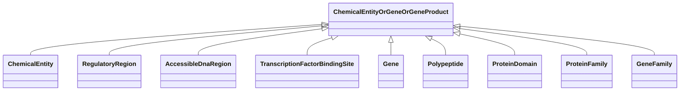

---
search:
  boost: 10.0
---

# Class: ChemicalEntityOrGeneOrGeneProduct 


_A union of chemical entities and children, and gene or gene product. This mixin is helpful to use when searching across chemical entities that must include genes and their children as chemical entities._


<div data-search-exclude markdown="1">


URI: [namo:ChemicalEntityOrGeneOrGeneProduct](https://w3id.org/monarch-initiative/namo/ChemicalEntityOrGeneOrGeneProduct)





<!-- no inheritance hierarchy -->

## Class Properties

| Property | Value |
| --- | --- |
| Mixin | Yes |


## Slots

| Name | Cardinality and Range | Description | Inheritance |
| ---  | --- | --- | --- |


## Mixin Usage

| mixed into | description |
| --- | --- |
| [ChemicalEntity](ChemicalEntity.md) | A chemical entity is a physical entity that pertains to chemistry or biochemi... |
| [RegulatoryRegion](RegulatoryRegion.md) | A region (or regions) of the genome that contains known or putative regulator... |
| [AccessibleDnaRegion](AccessibleDnaRegion.md) | A region (or regions) of a chromatinized genome that has been measured to be ... |
| [TranscriptionFactorBindingSite](TranscriptionFactorBindingSite.md) | A region (or regions) of the genome that contains a region of DNA known or pr... |
| [Gene](Gene.md) | A region (or regions) that includes all of the sequence elements necessary to... |
| [Polypeptide](Polypeptide.md) | A polypeptide is a molecular entity characterized by availability in protein ... |
| [ProteinDomain](ProteinDomain.md) | A conserved part of protein sequence and (tertiary) structure that can evolve... |
| [ProteinFamily](ProteinFamily.md) | A set of proteins coding for diverse functions which, by virtue of their high... |
| [GeneFamily](GeneFamily.md) | any grouping of multiple genes or gene products related by common descent |


## Usages

| used by | used in | type | used |
| ---  | --- | --- | --- |
| [ChemicalEntityToEntityAssociationMixin](ChemicalEntityToEntityAssociationMixin.md) | [subject](subject.md) | range | [ChemicalEntityOrGeneOrGeneProduct](ChemicalEntityOrGeneOrGeneProduct.md) |
| [ChemicalToEntityAssociationMixin](ChemicalToEntityAssociationMixin.md) | [subject](subject.md) | range | [ChemicalEntityOrGeneOrGeneProduct](ChemicalEntityOrGeneOrGeneProduct.md) |
| [GeneRegulatesGeneAssociation](GeneRegulatesGeneAssociation.md) | [subject](subject.md) | range | [ChemicalEntityOrGeneOrGeneProduct](ChemicalEntityOrGeneOrGeneProduct.md) |
| [GeneRegulatesGeneAssociation](GeneRegulatesGeneAssociation.md) | [object](object.md) | range | [ChemicalEntityOrGeneOrGeneProduct](ChemicalEntityOrGeneOrGeneProduct.md) |
| [GeneAffectsChemicalAssociation](GeneAffectsChemicalAssociation.md) | [subject](subject.md) | range | [ChemicalEntityOrGeneOrGeneProduct](ChemicalEntityOrGeneOrGeneProduct.md) |
| [ChemicalEntityOrGeneOrGeneProductRegulatesGeneAssociation](ChemicalEntityOrGeneOrGeneProductRegulatesGeneAssociation.md) | [subject](subject.md) | range | [ChemicalEntityOrGeneOrGeneProduct](ChemicalEntityOrGeneOrGeneProduct.md) |


## Identifier and Mapping Information


### Schema Source


* from schema: https://w3id.org/monarch-initiative/namo


## Mappings

| Mapping Type | Mapped Value |
| ---  | ---  |
| self | namo:ChemicalEntityOrGeneOrGeneProduct |
| native | namo:ChemicalEntityOrGeneOrGeneProduct |


## LinkML Source

<!-- TODO: investigate https://stackoverflow.com/questions/37606292/how-to-create-tabbed-code-blocks-in-mkdocs-or-sphinx -->

### Direct

<details>
```yaml
name: chemical entity or gene or gene product
description: A union of chemical entities and children, and gene or gene product.
  This mixin is helpful to use when searching across chemical entities that must include
  genes and their children as chemical entities.
from_schema: https://w3id.org/monarch-initiative/namo
mixin: true

```
</details>

### Induced

<details>
```yaml
name: chemical entity or gene or gene product
description: A union of chemical entities and children, and gene or gene product.
  This mixin is helpful to use when searching across chemical entities that must include
  genes and their children as chemical entities.
from_schema: https://w3id.org/monarch-initiative/namo
mixin: true

```
</details></div>