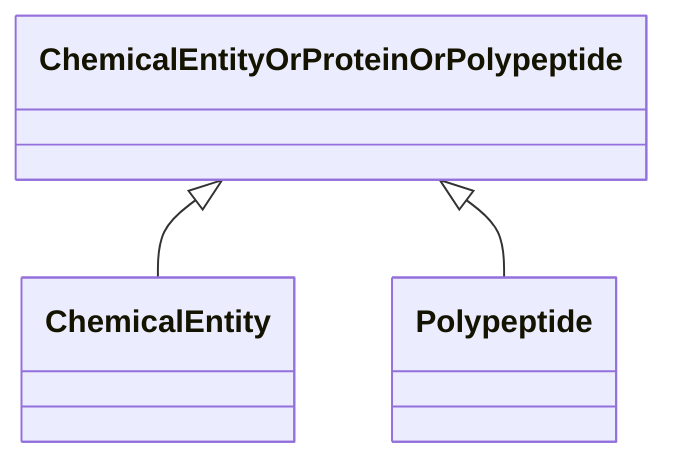

---
search:
  boost: 10.0
---

# Class: ChemicalEntityOrProteinOrPolypeptide 


_A union of chemical entities and children, and protein and polypeptide. This mixin is helpful to use when searching across chemical entities that must include genes and their children as chemical entities._


<div data-search-exclude markdown="1">


URI: [namo:ChemicalEntityOrProteinOrPolypeptide](https://w3id.org/monarch-initiative/namo/ChemicalEntityOrProteinOrPolypeptide)





<!-- no inheritance hierarchy -->

## Class Properties

| Property | Value |
| --- | --- |
| Mixin | Yes |


## Slots

| Name | Cardinality and Range | Description | Inheritance |
| ---  | --- | --- | --- |


## Mixin Usage

| mixed into | description |
| --- | --- |
| [ChemicalEntity](ChemicalEntity.md) | A chemical entity is a physical entity that pertains to chemistry or biochemi... |
| [Polypeptide](Polypeptide.md) | A polypeptide is a molecular entity characterized by availability in protein ... |


## Usages

| used by | used in | type | used |
| ---  | --- | --- | --- |
| [MacromolecularMachineHasSubstrateAssociation](MacromolecularMachineHasSubstrateAssociation.md) | [object](object.md) | range | [ChemicalEntityOrProteinOrPolypeptide](ChemicalEntityOrProteinOrPolypeptide.md) |


## Identifier and Mapping Information


### Schema Source


* from schema: https://w3id.org/monarch-initiative/namo


## Mappings

| Mapping Type | Mapped Value |
| ---  | ---  |
| self | namo:ChemicalEntityOrProteinOrPolypeptide |
| native | namo:ChemicalEntityOrProteinOrPolypeptide |


## LinkML Source

<!-- TODO: investigate https://stackoverflow.com/questions/37606292/how-to-create-tabbed-code-blocks-in-mkdocs-or-sphinx -->

### Direct

<details>
```yaml
name: chemical entity or protein or polypeptide
description: A union of chemical entities and children, and protein and polypeptide.
  This mixin is helpful to use when searching across chemical entities that must include
  genes and their children as chemical entities.
from_schema: https://w3id.org/monarch-initiative/namo
mixin: true

```
</details>

### Induced

<details>
```yaml
name: chemical entity or protein or polypeptide
description: A union of chemical entities and children, and protein and polypeptide.
  This mixin is helpful to use when searching across chemical entities that must include
  genes and their children as chemical entities.
from_schema: https://w3id.org/monarch-initiative/namo
mixin: true

```
</details></div>