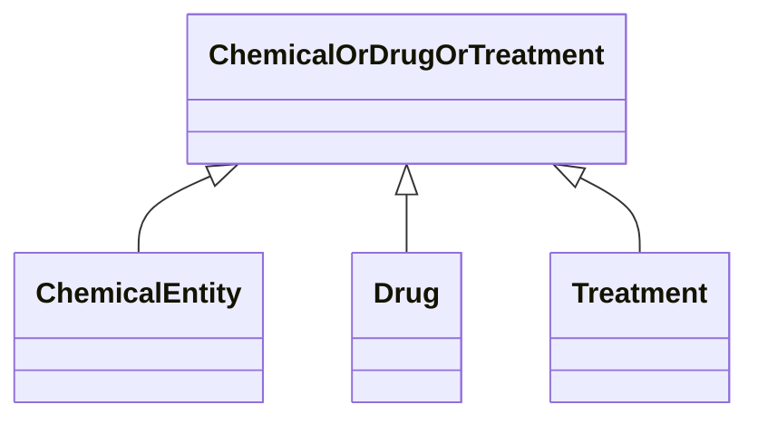

---
search:
  boost: 10.0
---

# Class: ChemicalOrDrugOrTreatment 


_A mixin for entities that represent chemical substances, pharmacological agents, or therapeutic interventions._


<div data-search-exclude markdown="1">


URI: [namo:ChemicalOrDrugOrTreatment](https://w3id.org/monarch-initiative/namo/ChemicalOrDrugOrTreatment)





<!-- no inheritance hierarchy -->

## Class Properties

| Property | Value |
| --- | --- |
| Mixin | Yes |


## Slots

| Name | Cardinality and Range | Description | Inheritance |
| ---  | --- | --- | --- |


## Mixin Usage

| mixed into | description |
| --- | --- |
| [ChemicalEntity](ChemicalEntity.md) | A chemical entity is a physical entity that pertains to chemistry or biochemi... |
| [Drug](Drug.md) | A substance intended for use in the diagnosis, cure, mitigation, treatment, o... |
| [Treatment](Treatment.md) | A treatment is targeted at a disease or phenotype and may involve multiple dr... |


## Identifier and Mapping Information

### Valid ID Prefixes

Instances of this class *should* have identifiers with one of the following prefixes:

* PUBCHEM.COMPOUND

* CHEMBL.COMPOUND

* CHEBI

* MAXO


### Schema Source


* from schema: https://w3id.org/monarch-initiative/namo


## Mappings

| Mapping Type | Mapped Value |
| ---  | ---  |
| self | namo:ChemicalOrDrugOrTreatment |
| native | namo:ChemicalOrDrugOrTreatment |


## LinkML Source

<!-- TODO: investigate https://stackoverflow.com/questions/37606292/how-to-create-tabbed-code-blocks-in-mkdocs-or-sphinx -->

### Direct

<details>
```yaml
name: chemical or drug or treatment
id_prefixes:
- PUBCHEM.COMPOUND
- CHEMBL.COMPOUND
- CHEBI
- MAXO
description: A mixin for entities that represent chemical substances, pharmacological
  agents, or therapeutic interventions.
from_schema: https://w3id.org/monarch-initiative/namo
mixin: true

```
</details>

### Induced

<details>
```yaml
name: chemical or drug or treatment
id_prefixes:
- PUBCHEM.COMPOUND
- CHEMBL.COMPOUND
- CHEBI
- MAXO
description: A mixin for entities that represent chemical substances, pharmacological
  agents, or therapeutic interventions.
from_schema: https://w3id.org/monarch-initiative/namo
mixin: true

```
</details></div>