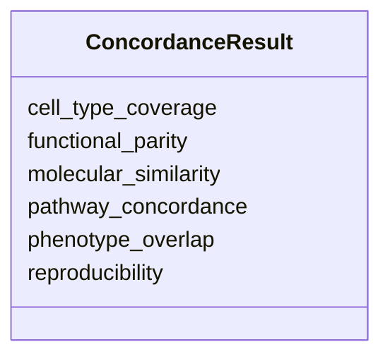

# Class: ConcordanceResult 


URI: [namo:ConcordanceResult](https://w3id.org/monarch-initiative/namo/ConcordanceResult)





<!-- no inheritance hierarchy -->


## Slots

| Name | Cardinality and Range | Description | Inheritance |
| ---  | --- | --- | --- |
| [phenotype_overlap](phenotype_overlap.md) | 0..1 <br/> [String](String.md) |  | direct |
| [molecular_similarity](molecular_similarity.md) | 0..1 <br/> [String](String.md) |  | direct |
| [pathway_concordance](pathway_concordance.md) | 0..1 <br/> [String](String.md) |  | direct |
| [cell_type_coverage](cell_type_coverage.md) | 0..1 <br/> [String](String.md) |  | direct |
| [functional_parity](functional_parity.md) | 0..1 <br/> [String](String.md) |  | direct |
| [reproducibility](reproducibility.md) | 0..1 <br/> [String](String.md) |  | direct |


## Usages

| used by | used in | type | used |
| ---  | --- | --- | --- |
| [ModelsRelationship](ModelsRelationship.md) | [concordance](concordance.md) | range | [ConcordanceResult](ConcordanceResult.md) |


## Identifier and Mapping Information


### Schema Source


* from schema: https://w3id.org/monarch-initiative/namo


## Mappings

| Mapping Type | Mapped Value |
| ---  | ---  |
| self | namo:ConcordanceResult |
| native | namo:ConcordanceResult |


## LinkML Source

<!-- TODO: investigate https://stackoverflow.com/questions/37606292/how-to-create-tabbed-code-blocks-in-mkdocs-or-sphinx -->

### Direct

<details>
```yaml
name: ConcordanceResult
from_schema: https://w3id.org/monarch-initiative/namo
attributes:
  phenotype_overlap:
    name: phenotype_overlap
    from_schema: https://w3id.org/monarch-initiative/namo
    rank: 1000
    domain_of:
    - ConcordanceResult
    - StructuredConcordanceResult
  molecular_similarity:
    name: molecular_similarity
    from_schema: https://w3id.org/monarch-initiative/namo
    rank: 1000
    domain_of:
    - ConcordanceResult
    - StructuredConcordanceResult
  pathway_concordance:
    name: pathway_concordance
    from_schema: https://w3id.org/monarch-initiative/namo
    rank: 1000
    domain_of:
    - ConcordanceResult
    - StructuredConcordanceResult
  cell_type_coverage:
    name: cell_type_coverage
    from_schema: https://w3id.org/monarch-initiative/namo
    rank: 1000
    domain_of:
    - ConcordanceResult
    - StructuredConcordanceResult
  functional_parity:
    name: functional_parity
    from_schema: https://w3id.org/monarch-initiative/namo
    rank: 1000
    domain_of:
    - ConcordanceResult
    - StructuredConcordanceResult
  reproducibility:
    name: reproducibility
    from_schema: https://w3id.org/monarch-initiative/namo
    rank: 1000
    domain_of:
    - ConcordanceResult
    - StructuredConcordanceResult

```
</details>

### Induced

<details>
```yaml
name: ConcordanceResult
from_schema: https://w3id.org/monarch-initiative/namo
attributes:
  phenotype_overlap:
    name: phenotype_overlap
    from_schema: https://w3id.org/monarch-initiative/namo
    rank: 1000
    alias: phenotype_overlap
    owner: ConcordanceResult
    domain_of:
    - ConcordanceResult
    - StructuredConcordanceResult
    range: string
  molecular_similarity:
    name: molecular_similarity
    from_schema: https://w3id.org/monarch-initiative/namo
    rank: 1000
    alias: molecular_similarity
    owner: ConcordanceResult
    domain_of:
    - ConcordanceResult
    - StructuredConcordanceResult
    range: string
  pathway_concordance:
    name: pathway_concordance
    from_schema: https://w3id.org/monarch-initiative/namo
    rank: 1000
    alias: pathway_concordance
    owner: ConcordanceResult
    domain_of:
    - ConcordanceResult
    - StructuredConcordanceResult
    range: string
  cell_type_coverage:
    name: cell_type_coverage
    from_schema: https://w3id.org/monarch-initiative/namo
    rank: 1000
    alias: cell_type_coverage
    owner: ConcordanceResult
    domain_of:
    - ConcordanceResult
    - StructuredConcordanceResult
    range: string
  functional_parity:
    name: functional_parity
    from_schema: https://w3id.org/monarch-initiative/namo
    rank: 1000
    alias: functional_parity
    owner: ConcordanceResult
    domain_of:
    - ConcordanceResult
    - StructuredConcordanceResult
    range: string
  reproducibility:
    name: reproducibility
    from_schema: https://w3id.org/monarch-initiative/namo
    rank: 1000
    alias: reproducibility
    owner: ConcordanceResult
    domain_of:
    - ConcordanceResult
    - StructuredConcordanceResult
    range: string

```
</details>