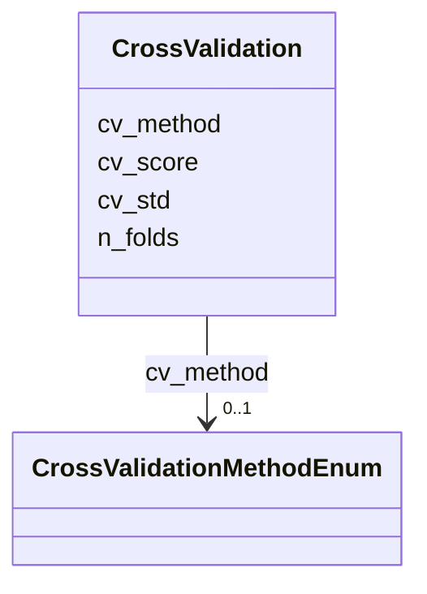

# Class: CrossValidation 


_Cross-validation strategy and results for ML models._


URI: [namo:CrossValidation](https://w3id.org/monarch-initiative/namo/CrossValidation)





<!-- no inheritance hierarchy -->


## Slots

| Name | Cardinality and Range | Description | Inheritance |
| ---  | --- | --- | --- |
| [cv_method](cv_method.md) | 0..1 <br/> [CrossValidationMethodEnum](CrossValidationMethodEnum.md) | Type of cross-validation used | direct |
| [n_folds](n_folds.md) | 0..1 <br/> [Integer](Integer.md) | Number of folds in cross-validation | direct |
| [cv_score](cv_score.md) | 0..1 <br/> [Float](Float.md) | Average cross-validation score | direct |
| [cv_std](cv_std.md) | 0..1 <br/> [Float](Float.md) | Standard deviation of cross-validation scores | direct |


## Usages

| used by | used in | type | used |
| ---  | --- | --- | --- |
| [MLModel](MLModel.md) | [cross_validation](cross_validation.md) | range | [CrossValidation](CrossValidation.md) |


## Identifier and Mapping Information


### Schema Source


* from schema: https://w3id.org/monarch-initiative/namo


## Mappings

| Mapping Type | Mapped Value |
| ---  | ---  |
| self | namo:CrossValidation |
| native | namo:CrossValidation |


## LinkML Source

<!-- TODO: investigate https://stackoverflow.com/questions/37606292/how-to-create-tabbed-code-blocks-in-mkdocs-or-sphinx -->

### Direct

<details>
```yaml
name: CrossValidation
description: Cross-validation strategy and results for ML models.
from_schema: https://w3id.org/monarch-initiative/namo
attributes:
  cv_method:
    name: cv_method
    description: Type of cross-validation used
    from_schema: https://w3id.org/monarch-initiative/namo
    rank: 1000
    domain_of:
    - CrossValidation
    range: CrossValidationMethodEnum
  n_folds:
    name: n_folds
    description: Number of folds in cross-validation
    from_schema: https://w3id.org/monarch-initiative/namo
    rank: 1000
    domain_of:
    - CrossValidation
    range: integer
  cv_score:
    name: cv_score
    description: Average cross-validation score
    from_schema: https://w3id.org/monarch-initiative/namo
    rank: 1000
    domain_of:
    - CrossValidation
    range: float
  cv_std:
    name: cv_std
    description: Standard deviation of cross-validation scores
    from_schema: https://w3id.org/monarch-initiative/namo
    rank: 1000
    domain_of:
    - CrossValidation
    range: float

```
</details>

### Induced

<details>
```yaml
name: CrossValidation
description: Cross-validation strategy and results for ML models.
from_schema: https://w3id.org/monarch-initiative/namo
attributes:
  cv_method:
    name: cv_method
    description: Type of cross-validation used
    from_schema: https://w3id.org/monarch-initiative/namo
    rank: 1000
    alias: cv_method
    owner: CrossValidation
    domain_of:
    - CrossValidation
    range: CrossValidationMethodEnum
  n_folds:
    name: n_folds
    description: Number of folds in cross-validation
    from_schema: https://w3id.org/monarch-initiative/namo
    rank: 1000
    alias: n_folds
    owner: CrossValidation
    domain_of:
    - CrossValidation
    range: integer
  cv_score:
    name: cv_score
    description: Average cross-validation score
    from_schema: https://w3id.org/monarch-initiative/namo
    rank: 1000
    alias: cv_score
    owner: CrossValidation
    domain_of:
    - CrossValidation
    range: float
  cv_std:
    name: cv_std
    description: Standard deviation of cross-validation scores
    from_schema: https://w3id.org/monarch-initiative/namo
    rank: 1000
    alias: cv_std
    owner: CrossValidation
    domain_of:
    - CrossValidation
    range: float

```
</details>