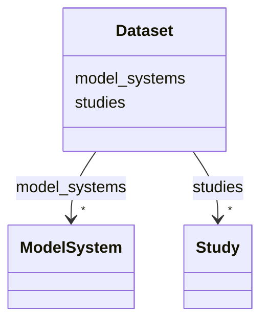

# Class: Dataset 


URI: [namo:Dataset](https://w3id.org/monarch-initiative/namo/Dataset)





<!-- no inheritance hierarchy -->


## Slots

| Name | Cardinality and Range | Description | Inheritance |
| ---  | --- | --- | --- |
| [model_systems](model_systems.md) | * <br/> [ModelSystem](ModelSystem.md) |  | direct |
| [studies](studies.md) | * <br/> [Study](Study.md) |  | direct |


## Identifier and Mapping Information


### Schema Source


* from schema: https://w3id.org/monarch-initiative/namo


## Mappings

| Mapping Type | Mapped Value |
| ---  | ---  |
| self | namo:Dataset |
| native | namo:Dataset |


## LinkML Source

<!-- TODO: investigate https://stackoverflow.com/questions/37606292/how-to-create-tabbed-code-blocks-in-mkdocs-or-sphinx -->

### Direct

<details>
```yaml
name: Dataset
from_schema: https://w3id.org/monarch-initiative/namo
attributes:
  model_systems:
    name: model_systems
    from_schema: https://w3id.org/monarch-initiative/namo
    rank: 1000
    domain_of:
    - Dataset
    range: ModelSystem
    multivalued: true
    inlined: true
    inlined_as_list: true
  studies:
    name: studies
    from_schema: https://w3id.org/monarch-initiative/namo
    rank: 1000
    domain_of:
    - Dataset
    range: Study
    multivalued: true
    inlined: true
    inlined_as_list: true

```
</details>

### Induced

<details>
```yaml
name: Dataset
from_schema: https://w3id.org/monarch-initiative/namo
attributes:
  model_systems:
    name: model_systems
    from_schema: https://w3id.org/monarch-initiative/namo
    rank: 1000
    alias: model_systems
    owner: Dataset
    domain_of:
    - Dataset
    range: ModelSystem
    multivalued: true
    inlined_as_list: true
  studies:
    name: studies
    from_schema: https://w3id.org/monarch-initiative/namo
    rank: 1000
    alias: studies
    owner: Dataset
    domain_of:
    - Dataset
    range: Study
    multivalued: true
    inlined_as_list: true

```
</details>