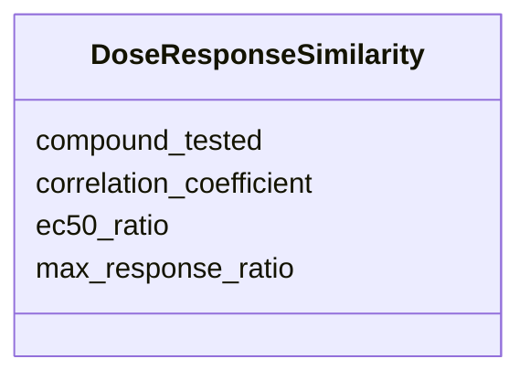

# Class: DoseResponseSimilarity 


_Comparison of dose-response relationships between model and biological systems._


URI: [namo:DoseResponseSimilarity](https://w3id.org/monarch-initiative/namo/DoseResponseSimilarity)





<!-- no inheritance hierarchy -->


## Slots

| Name | Cardinality and Range | Description | Inheritance |
| ---  | --- | --- | --- |
| [correlation_coefficient](correlation_coefficient.md) | 0..1 <br/> [Float](Float.md) | Correlation coefficient between dose-response curves | direct |
| [ec50_ratio](ec50_ratio.md) | 0..1 <br/> [Float](Float.md) | Ratio of EC50 values between model and biological system | direct |
| [max_response_ratio](max_response_ratio.md) | 0..1 <br/> [Float](Float.md) | Ratio of maximum responses between systems | direct |
| [compound_tested](compound_tested.md) | 0..1 <br/> [String](String.md) | Name of compound used in dose-response testing | direct |


## Usages

| used by | used in | type | used |
| ---  | --- | --- | --- |
| [FunctionalParity](FunctionalParity.md) | [dose_response_similarity](dose_response_similarity.md) | range | [DoseResponseSimilarity](DoseResponseSimilarity.md) |


## Identifier and Mapping Information


### Schema Source


* from schema: https://w3id.org/monarch-initiative/namo


## Mappings

| Mapping Type | Mapped Value |
| ---  | ---  |
| self | namo:DoseResponseSimilarity |
| native | namo:DoseResponseSimilarity |


## LinkML Source

<!-- TODO: investigate https://stackoverflow.com/questions/37606292/how-to-create-tabbed-code-blocks-in-mkdocs-or-sphinx -->

### Direct

<details>
```yaml
name: DoseResponseSimilarity
description: Comparison of dose-response relationships between model and biological
  systems.
from_schema: https://w3id.org/monarch-initiative/namo
attributes:
  correlation_coefficient:
    name: correlation_coefficient
    description: Correlation coefficient between dose-response curves.
    from_schema: https://w3id.org/monarch-initiative/namo
    domain_of:
    - MolecularSimilarity
    - DoseResponseSimilarity
    range: float
  ec50_ratio:
    name: ec50_ratio
    description: Ratio of EC50 values between model and biological system.
    from_schema: https://w3id.org/monarch-initiative/namo
    rank: 1000
    domain_of:
    - DoseResponseSimilarity
    range: float
  max_response_ratio:
    name: max_response_ratio
    description: Ratio of maximum responses between systems.
    from_schema: https://w3id.org/monarch-initiative/namo
    rank: 1000
    domain_of:
    - DoseResponseSimilarity
    range: float
  compound_tested:
    name: compound_tested
    description: Name of compound used in dose-response testing.
    from_schema: https://w3id.org/monarch-initiative/namo
    rank: 1000
    domain_of:
    - DoseResponseSimilarity

```
</details>

### Induced

<details>
```yaml
name: DoseResponseSimilarity
description: Comparison of dose-response relationships between model and biological
  systems.
from_schema: https://w3id.org/monarch-initiative/namo
attributes:
  correlation_coefficient:
    name: correlation_coefficient
    description: Correlation coefficient between dose-response curves.
    from_schema: https://w3id.org/monarch-initiative/namo
    alias: correlation_coefficient
    owner: DoseResponseSimilarity
    domain_of:
    - MolecularSimilarity
    - DoseResponseSimilarity
    range: float
  ec50_ratio:
    name: ec50_ratio
    description: Ratio of EC50 values between model and biological system.
    from_schema: https://w3id.org/monarch-initiative/namo
    rank: 1000
    alias: ec50_ratio
    owner: DoseResponseSimilarity
    domain_of:
    - DoseResponseSimilarity
    range: float
  max_response_ratio:
    name: max_response_ratio
    description: Ratio of maximum responses between systems.
    from_schema: https://w3id.org/monarch-initiative/namo
    rank: 1000
    alias: max_response_ratio
    owner: DoseResponseSimilarity
    domain_of:
    - DoseResponseSimilarity
    range: float
  compound_tested:
    name: compound_tested
    description: Name of compound used in dose-response testing.
    from_schema: https://w3id.org/monarch-initiative/namo
    rank: 1000
    alias: compound_tested
    owner: DoseResponseSimilarity
    domain_of:
    - DoseResponseSimilarity
    range: string

```
</details>