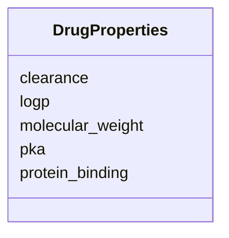

# Class: DrugProperties 


_Physicochemical and pharmacological properties of a drug in PBPK models._


URI: [namo:DrugProperties](https://w3id.org/monarch-initiative/namo/DrugProperties)





<!-- no inheritance hierarchy -->


## Slots

| Name | Cardinality and Range | Description | Inheritance |
| ---  | --- | --- | --- |
| [molecular_weight](molecular_weight.md) | 0..1 <br/> [Float](Float.md) | Molecular weight (g/mol) | direct |
| [logp](logp.md) | 0..1 <br/> [Float](Float.md) | Lipophilicity (log P) | direct |
| [pka](pka.md) | 0..1 <br/> [Float](Float.md) | Acid dissociation constant | direct |
| [protein_binding](protein_binding.md) | 0..1 <br/> [Float](Float.md) | Fraction bound to plasma proteins (0 | direct |
| [clearance](clearance.md) | 0..1 <br/> [Float](Float.md) | Total body clearance (L/h) | direct |


## Usages

| used by | used in | type | used |
| ---  | --- | --- | --- |
| [PBPKModel](PBPKModel.md) | [drug_properties](drug_properties.md) | range | [DrugProperties](DrugProperties.md) |


## Identifier and Mapping Information


### Schema Source


* from schema: https://w3id.org/monarch-initiative/namo


## Mappings

| Mapping Type | Mapped Value |
| ---  | ---  |
| self | namo:DrugProperties |
| native | namo:DrugProperties |


## LinkML Source

<!-- TODO: investigate https://stackoverflow.com/questions/37606292/how-to-create-tabbed-code-blocks-in-mkdocs-or-sphinx -->

### Direct

<details>
```yaml
name: DrugProperties
description: Physicochemical and pharmacological properties of a drug in PBPK models.
from_schema: https://w3id.org/monarch-initiative/namo
attributes:
  molecular_weight:
    name: molecular_weight
    description: Molecular weight (g/mol)
    from_schema: https://w3id.org/monarch-initiative/namo
    rank: 1000
    domain_of:
    - DrugProperties
    range: float
  logp:
    name: logp
    description: Lipophilicity (log P)
    from_schema: https://w3id.org/monarch-initiative/namo
    rank: 1000
    domain_of:
    - DrugProperties
    range: float
  pka:
    name: pka
    description: Acid dissociation constant
    from_schema: https://w3id.org/monarch-initiative/namo
    rank: 1000
    domain_of:
    - DrugProperties
    range: float
  protein_binding:
    name: protein_binding
    description: Fraction bound to plasma proteins (0.0-1.0)
    from_schema: https://w3id.org/monarch-initiative/namo
    rank: 1000
    domain_of:
    - DrugProperties
    range: float
  clearance:
    name: clearance
    description: Total body clearance (L/h)
    from_schema: https://w3id.org/monarch-initiative/namo
    rank: 1000
    domain_of:
    - DrugProperties
    range: float

```
</details>

### Induced

<details>
```yaml
name: DrugProperties
description: Physicochemical and pharmacological properties of a drug in PBPK models.
from_schema: https://w3id.org/monarch-initiative/namo
attributes:
  molecular_weight:
    name: molecular_weight
    description: Molecular weight (g/mol)
    from_schema: https://w3id.org/monarch-initiative/namo
    rank: 1000
    alias: molecular_weight
    owner: DrugProperties
    domain_of:
    - DrugProperties
    range: float
  logp:
    name: logp
    description: Lipophilicity (log P)
    from_schema: https://w3id.org/monarch-initiative/namo
    rank: 1000
    alias: logp
    owner: DrugProperties
    domain_of:
    - DrugProperties
    range: float
  pka:
    name: pka
    description: Acid dissociation constant
    from_schema: https://w3id.org/monarch-initiative/namo
    rank: 1000
    alias: pka
    owner: DrugProperties
    domain_of:
    - DrugProperties
    range: float
  protein_binding:
    name: protein_binding
    description: Fraction bound to plasma proteins (0.0-1.0)
    from_schema: https://w3id.org/monarch-initiative/namo
    rank: 1000
    alias: protein_binding
    owner: DrugProperties
    domain_of:
    - DrugProperties
    range: float
  clearance:
    name: clearance
    description: Total body clearance (L/h)
    from_schema: https://w3id.org/monarch-initiative/namo
    rank: 1000
    alias: clearance
    owner: DrugProperties
    domain_of:
    - DrugProperties
    range: float

```
</details>