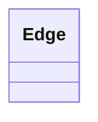

---
search:
  boost: 10.0
---

# Class: Edge 


_A generic edge in a KGX-formatted knowledge graph, representing a directed relationship between a subject node and an object node qualified by a predicate. This class serves as the structural superclass for `association` in Biolink, providing the minimal KGX-compliant contract (subject, predicate, object, and associated metadata) that any biolink relationship participating in a knowledge graph must satisfy._


<div data-search-exclude markdown="1">


URI: [namo:Edge](https://w3id.org/monarch-initiative/namo/Edge)





<!-- no inheritance hierarchy -->

## Slots

| Name | Cardinality and Range | Description | Inheritance |
| ---  | --- | --- | --- |


## Identifier and Mapping Information


### Schema Source


* from schema: https://w3id.org/monarch-initiative/namo


## Mappings

| Mapping Type | Mapped Value |
| ---  | ---  |
| self | namo:Edge |
| native | namo:Edge |


## LinkML Source

<!-- TODO: investigate https://stackoverflow.com/questions/37606292/how-to-create-tabbed-code-blocks-in-mkdocs-or-sphinx -->

### Direct

<details>
```yaml
name: Edge
description: A generic edge in a KGX-formatted knowledge graph, representing a directed
  relationship between a subject node and an object node qualified by a predicate.
  This class serves as the structural superclass for `association` in Biolink, providing
  the minimal KGX-compliant contract (subject, predicate, object, and associated metadata)
  that any biolink relationship participating in a knowledge graph must satisfy.
from_schema: https://w3id.org/monarch-initiative/namo

```
</details>

### Induced

<details>
```yaml
name: Edge
description: A generic edge in a KGX-formatted knowledge graph, representing a directed
  relationship between a subject node and an object node qualified by a predicate.
  This class serves as the structural superclass for `association` in Biolink, providing
  the minimal KGX-compliant contract (subject, predicate, object, and associated metadata)
  that any biolink relationship participating in a knowledge graph must satisfy.
from_schema: https://w3id.org/monarch-initiative/namo

```
</details></div>