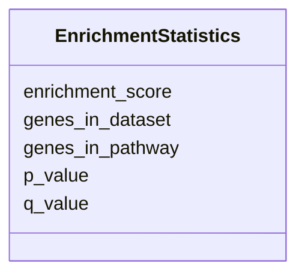

# Class: EnrichmentStatistics 


_Statistical measures for pathway enrichment analysis._


URI: [namo:EnrichmentStatistics](https://w3id.org/monarch-initiative/namo/EnrichmentStatistics)





<!-- no inheritance hierarchy -->


## Slots

| Name | Cardinality and Range | Description | Inheritance |
| ---  | --- | --- | --- |
| [enrichment_score](enrichment_score.md) | 0..1 <br/> [Float](Float.md) | Quantitative enrichment score | direct |
| [p_value](p_value.md) | 0..1 <br/> [Float](Float.md) | Statistical p-value for enrichment | direct |
| [q_value](q_value.md) | 0..1 <br/> [Float](Float.md) | False discovery rate corrected p-value | direct |
| [genes_in_pathway](genes_in_pathway.md) | 0..1 <br/> [Integer](Integer.md) | Number of genes in the pathway | direct |
| [genes_in_dataset](genes_in_dataset.md) | 0..1 <br/> [Integer](Integer.md) | Number of genes from dataset found in pathway | direct |


## Usages

| used by | used in | type | used |
| ---  | --- | --- | --- |
| [PathwayConcordance](PathwayConcordance.md) | [enrichment_statistics](enrichment_statistics.md) | range | [EnrichmentStatistics](EnrichmentStatistics.md) |


## Identifier and Mapping Information


### Schema Source


* from schema: https://w3id.org/monarch-initiative/namo


## Mappings

| Mapping Type | Mapped Value |
| ---  | ---  |
| self | namo:EnrichmentStatistics |
| native | namo:EnrichmentStatistics |


## LinkML Source

<!-- TODO: investigate https://stackoverflow.com/questions/37606292/how-to-create-tabbed-code-blocks-in-mkdocs-or-sphinx -->

### Direct

<details>
```yaml
name: EnrichmentStatistics
description: Statistical measures for pathway enrichment analysis.
from_schema: https://w3id.org/monarch-initiative/namo
attributes:
  enrichment_score:
    name: enrichment_score
    description: Quantitative enrichment score.
    from_schema: https://w3id.org/monarch-initiative/namo
    domain_of:
    - Pathway
    - EnrichmentStatistics
    range: float
  p_value:
    name: p_value
    description: Statistical p-value for enrichment.
    from_schema: https://w3id.org/monarch-initiative/namo
    domain_of:
    - Gene
    - StatisticalSignificance
    - EnrichmentStatistics
    range: float
  q_value:
    name: q_value
    description: False discovery rate corrected p-value.
    from_schema: https://w3id.org/monarch-initiative/namo
    rank: 1000
    domain_of:
    - EnrichmentStatistics
    range: float
  genes_in_pathway:
    name: genes_in_pathway
    description: Number of genes in the pathway.
    from_schema: https://w3id.org/monarch-initiative/namo
    rank: 1000
    domain_of:
    - EnrichmentStatistics
    range: integer
  genes_in_dataset:
    name: genes_in_dataset
    description: Number of genes from dataset found in pathway.
    from_schema: https://w3id.org/monarch-initiative/namo
    rank: 1000
    domain_of:
    - EnrichmentStatistics
    range: integer

```
</details>

### Induced

<details>
```yaml
name: EnrichmentStatistics
description: Statistical measures for pathway enrichment analysis.
from_schema: https://w3id.org/monarch-initiative/namo
attributes:
  enrichment_score:
    name: enrichment_score
    description: Quantitative enrichment score.
    from_schema: https://w3id.org/monarch-initiative/namo
    alias: enrichment_score
    owner: EnrichmentStatistics
    domain_of:
    - Pathway
    - EnrichmentStatistics
    range: float
  p_value:
    name: p_value
    description: Statistical p-value for enrichment.
    from_schema: https://w3id.org/monarch-initiative/namo
    alias: p_value
    owner: EnrichmentStatistics
    domain_of:
    - Gene
    - StatisticalSignificance
    - EnrichmentStatistics
    range: float
  q_value:
    name: q_value
    description: False discovery rate corrected p-value.
    from_schema: https://w3id.org/monarch-initiative/namo
    rank: 1000
    alias: q_value
    owner: EnrichmentStatistics
    domain_of:
    - EnrichmentStatistics
    range: float
  genes_in_pathway:
    name: genes_in_pathway
    description: Number of genes in the pathway.
    from_schema: https://w3id.org/monarch-initiative/namo
    rank: 1000
    alias: genes_in_pathway
    owner: EnrichmentStatistics
    domain_of:
    - EnrichmentStatistics
    range: integer
  genes_in_dataset:
    name: genes_in_dataset
    description: Number of genes from dataset found in pathway.
    from_schema: https://w3id.org/monarch-initiative/namo
    rank: 1000
    alias: genes_in_dataset
    owner: EnrichmentStatistics
    domain_of:
    - EnrichmentStatistics
    range: integer

```
</details>