---
search:
  boost: 10.0
---

# Class: EntityToDiseaseAssociationMixin 


_mixin class for any association whose object (target node) is a disease_


<div data-search-exclude markdown="1">


URI: [namo:EntityToDiseaseAssociationMixin](https://w3id.org/monarch-initiative/namo/EntityToDiseaseAssociationMixin)

```mermaid
 classDiagram
    class EntityToDiseaseAssociationMixin
    click EntityToDiseaseAssociationMixin href "../EntityToDiseaseAssociationMixin/"
      EntityToFeatureOrDiseaseQualifiersMixin <|-- EntityToDiseaseAssociationMixin
        click EntityToFeatureOrDiseaseQualifiersMixin href "../EntityToFeatureOrDiseaseQualifiersMixin/"
      

      EntityToDiseaseAssociationMixin <|-- DiseaseToDiseaseAssociation
        click DiseaseToDiseaseAssociation href "../DiseaseToDiseaseAssociation/"
      EntityToDiseaseAssociationMixin <|-- CorrelatedGeneToDiseaseAssociation
        click CorrelatedGeneToDiseaseAssociation href "../CorrelatedGeneToDiseaseAssociation/"
      EntityToDiseaseAssociationMixin <|-- DruggableGeneToDiseaseAssociation
        click DruggableGeneToDiseaseAssociation href "../DruggableGeneToDiseaseAssociation/"
      EntityToDiseaseAssociationMixin <|-- PhenotypicFeatureToDiseaseAssociation
        click PhenotypicFeatureToDiseaseAssociation href "../PhenotypicFeatureToDiseaseAssociation/"
      EntityToDiseaseAssociationMixin <|-- VariantToDiseaseAssociation
        click VariantToDiseaseAssociation href "../VariantToDiseaseAssociation/"
      EntityToDiseaseAssociationMixin <|-- GenotypeToDiseaseAssociation
        click GenotypeToDiseaseAssociation href "../GenotypeToDiseaseAssociation/"
      EntityToDiseaseAssociationMixin <|-- GeneAsAModelOfDiseaseAssociation
        click GeneAsAModelOfDiseaseAssociation href "../GeneAsAModelOfDiseaseAssociation/"
      EntityToDiseaseAssociationMixin <|-- VariantAsAModelOfDiseaseAssociation
        click VariantAsAModelOfDiseaseAssociation href "../VariantAsAModelOfDiseaseAssociation/"
      EntityToDiseaseAssociationMixin <|-- GenotypeAsAModelOfDiseaseAssociation
        click GenotypeAsAModelOfDiseaseAssociation href "../GenotypeAsAModelOfDiseaseAssociation/"
      EntityToDiseaseAssociationMixin <|-- CellLineAsAModelOfDiseaseAssociation
        click CellLineAsAModelOfDiseaseAssociation href "../CellLineAsAModelOfDiseaseAssociation/"
      EntityToDiseaseAssociationMixin <|-- OrganismalEntityAsAModelOfDiseaseAssociation
        click OrganismalEntityAsAModelOfDiseaseAssociation href "../OrganismalEntityAsAModelOfDiseaseAssociation/"
      

      EntityToDiseaseAssociationMixin : disease_context_qualifier
        
          
    
        
        
        EntityToDiseaseAssociationMixin --> "0..1" Disease : disease_context_qualifier
        click Disease href "../Disease/"
    

        
      EntityToDiseaseAssociationMixin : frequency_qualifier
        
      EntityToDiseaseAssociationMixin : object
        
          
    
        
        
        EntityToDiseaseAssociationMixin --> "1" Disease : object
        click Disease href "../Disease/"
    

        
      EntityToDiseaseAssociationMixin : object_aspect_qualifier
        
          
    
        
        
        EntityToDiseaseAssociationMixin --> "0..1" GeneOrGeneProductOrChemicalEntityAspectEnum : object_aspect_qualifier
        click GeneOrGeneProductOrChemicalEntityAspectEnum href "../GeneOrGeneProductOrChemicalEntityAspectEnum/"
    

        
      EntityToDiseaseAssociationMixin : object_direction_qualifier
        
          
    
        
        
        EntityToDiseaseAssociationMixin --> "0..1" DirectionQualifierEnum : object_direction_qualifier
        click DirectionQualifierEnum href "../DirectionQualifierEnum/"
    

        
      EntityToDiseaseAssociationMixin : predicate
        
      EntityToDiseaseAssociationMixin : qualified_predicate
        
      EntityToDiseaseAssociationMixin : subject
        
          
    
        
        
        EntityToDiseaseAssociationMixin --> "1" NamedThing : subject
        click NamedThing href "../NamedThing/"
    

        
      EntityToDiseaseAssociationMixin : subject_aspect_qualifier
        
          
    
        
        
        EntityToDiseaseAssociationMixin --> "0..1" GeneOrGeneProductOrChemicalEntityAspectEnum : subject_aspect_qualifier
        click GeneOrGeneProductOrChemicalEntityAspectEnum href "../GeneOrGeneProductOrChemicalEntityAspectEnum/"
    

        
      EntityToDiseaseAssociationMixin : subject_direction_qualifier
        
          
    
        
        
        EntityToDiseaseAssociationMixin --> "0..1" DirectionQualifierEnum : subject_direction_qualifier
        click DirectionQualifierEnum href "../DirectionQualifierEnum/"
    

        
      
```





## Inheritance
* [FrequencyQualifierMixin](FrequencyQualifierMixin.md)
    * [EntityToFeatureOrDiseaseQualifiersMixin](EntityToFeatureOrDiseaseQualifiersMixin.md)
        * **EntityToDiseaseAssociationMixin**


## Class Properties

| Property | Value |
| --- | --- |
| Mixin | Yes |


## Slots

| Name | Cardinality and Range | Description | Inheritance |
| ---  | --- | --- | --- |
| [subject_aspect_qualifier](subject_aspect_qualifier.md) | 0..1 <br/> [GeneOrGeneProductOrChemicalEntityAspectEnum](GeneOrGeneProductOrChemicalEntityAspectEnum.md) | Composes with the core concept to describe new concepts of a different ontolo... | [EntityToFeatureOrDiseaseQualifiersMixin](EntityToFeatureOrDiseaseQualifiersMixin.md) |
| [subject_direction_qualifier](subject_direction_qualifier.md) | 0..1 <br/> [DirectionQualifierEnum](DirectionQualifierEnum.md) | Composes with the core concept (+ aspect if provided) to describe a change in... | [EntityToFeatureOrDiseaseQualifiersMixin](EntityToFeatureOrDiseaseQualifiersMixin.md) |
| [object_aspect_qualifier](object_aspect_qualifier.md) | 0..1 <br/> [GeneOrGeneProductOrChemicalEntityAspectEnum](GeneOrGeneProductOrChemicalEntityAspectEnum.md) | Composes with the core concept to describe new concepts of a different ontolo... | [EntityToFeatureOrDiseaseQualifiersMixin](EntityToFeatureOrDiseaseQualifiersMixin.md) |
| [object_direction_qualifier](object_direction_qualifier.md) | 0..1 <br/> [DirectionQualifierEnum](DirectionQualifierEnum.md) | Composes with the core concept (+ aspect if provided) to describe a change in... | [EntityToFeatureOrDiseaseQualifiersMixin](EntityToFeatureOrDiseaseQualifiersMixin.md) |
| [qualified_predicate](qualified_predicate.md) | 0..1 <br/> [Uriorcurie](Uriorcurie.md) | Predicate to be used in an association when subject and object qualifiers are... | [EntityToFeatureOrDiseaseQualifiersMixin](EntityToFeatureOrDiseaseQualifiersMixin.md) |
| [disease_context_qualifier](disease_context_qualifier.md) | 0..1 <br/> [Disease](Disease.md) | A context qualifier representing a disease or condition in which a relationsh... | [EntityToFeatureOrDiseaseQualifiersMixin](EntityToFeatureOrDiseaseQualifiersMixin.md) |
| [frequency_qualifier](frequency_qualifier.md) | 0..1 <br/> [FrequencyValue](FrequencyValue.md) | a qualifier used in a phenotypic association to state how frequent the phenot... | [FrequencyQualifierMixin](FrequencyQualifierMixin.md) |
| [subject](subject.md) | 1 <br/> [NamedThing](NamedThing.md) | connects an association to the subject of the association | [FrequencyQualifierMixin](FrequencyQualifierMixin.md) |
| [predicate](predicate.md) | 1 <br/> [Uriorcurie](Uriorcurie.md) | Has a value from the Biolink 'related_to' hierarchy | [FrequencyQualifierMixin](FrequencyQualifierMixin.md) |
| [object](object.md) | 1 <br/> [Disease](Disease.md) | disease | [FrequencyQualifierMixin](FrequencyQualifierMixin.md) |

## Defining Slots

This class is defined by the following slots:


* [object](object.md)


## Mixin Usage

| mixed into | description |
| --- | --- |
| [DiseaseToDiseaseAssociation](DiseaseToDiseaseAssociation.md) | An association between two diseases |
| [CorrelatedGeneToDiseaseAssociation](CorrelatedGeneToDiseaseAssociation.md) | An association between a gene (or gene product) and a disease for which the g... |
| [DruggableGeneToDiseaseAssociation](DruggableGeneToDiseaseAssociation.md) | An association between a gene (or gene product) and a disease in which the ge... |
| [PhenotypicFeatureToDiseaseAssociation](PhenotypicFeatureToDiseaseAssociation.md) | An association between a phenotypic feature (sign or symptom) and a disease, ... |
| [VariantToDiseaseAssociation](VariantToDiseaseAssociation.md) | An association between a sequence variant and a disease, in which the allele ... |
| [GenotypeToDiseaseAssociation](GenotypeToDiseaseAssociation.md) | An association between a genotype and a disease, in which the genotype (typic... |
| [GeneAsAModelOfDiseaseAssociation](GeneAsAModelOfDiseaseAssociation.md) | An association in which a gene (e |
| [VariantAsAModelOfDiseaseAssociation](VariantAsAModelOfDiseaseAssociation.md) | An association in which a sequence variant serves as a model of a disease, re... |
| [GenotypeAsAModelOfDiseaseAssociation](GenotypeAsAModelOfDiseaseAssociation.md) | An association in which a genotype serves as a model of a disease, recapitula... |
| [CellLineAsAModelOfDiseaseAssociation](CellLineAsAModelOfDiseaseAssociation.md) | An association in which a cell line - typically derived from an organismal en... |
| [OrganismalEntityAsAModelOfDiseaseAssociation](OrganismalEntityAsAModelOfDiseaseAssociation.md) | An association in which an organismal entity (e |


## Identifier and Mapping Information


### Schema Source


* from schema: https://w3id.org/monarch-initiative/namo


## Mappings

| Mapping Type | Mapped Value |
| ---  | ---  |
| self | namo:EntityToDiseaseAssociationMixin |
| native | namo:EntityToDiseaseAssociationMixin |


## LinkML Source

<!-- TODO: investigate https://stackoverflow.com/questions/37606292/how-to-create-tabbed-code-blocks-in-mkdocs-or-sphinx -->

### Direct

<details>
```yaml
name: entity to disease association mixin
description: mixin class for any association whose object (target node) is a disease
from_schema: https://w3id.org/monarch-initiative/namo
is_a: entity to feature or disease qualifiers mixin
mixin: true
slot_usage:
  object:
    name: object
    description: disease
    examples:
    - value: MONDO:0020066
      description: Ehlers-Danlos syndrome
    range: disease
defining_slots:
- object

```
</details>

### Induced

<details>
```yaml
name: entity to disease association mixin
description: mixin class for any association whose object (target node) is a disease
from_schema: https://w3id.org/monarch-initiative/namo
is_a: entity to feature or disease qualifiers mixin
mixin: true
slot_usage:
  object:
    name: object
    description: disease
    examples:
    - value: MONDO:0020066
      description: Ehlers-Danlos syndrome
    range: disease
attributes:
  subject aspect qualifier:
    name: subject aspect qualifier
    description: 'Composes with the core concept to describe new concepts of a different
      ontological type. e.g. a process in which the core concept participates, a function/activity/role
      held by the core concept, or a characteristic/quality that inheres in the core
      concept.  The purpose of the aspect slot is to indicate what aspect is being
      affected in an ''affects'' association.  This qualifier specifies a change in
      the subject of an association (aka: statement).'
    examples:
    - value: stability
    - value: abundance
    - value: expression
    - value: exposure
    in_subset:
    - translator_minimal
    from_schema: https://w3id.org/monarch-initiative/namo
    rank: 1000
    is_a: aspect qualifier
    domain: association
    alias: subject_aspect_qualifier
    owner: entity to disease association mixin
    domain_of:
    - predicate mapping
    - gene to gene association
    - named thing associated with likelihood of named thing association
    - macromolecular machine has substrate association
    - chemical affects biological entity association
    - chemical gene sensitivity association
    - gene affects chemical association
    - entity to feature or disease qualifiers mixin
    - entity to feature or variant qualifiers mixin
    - entity to feature or gene qualifiers mixin
    - feature or disease qualifiers to entity mixin
    - gene to phenotypic feature association
    - gene to disease association
    - causal gene to disease association
    - correlated gene to disease association
    range: GeneOrGeneProductOrChemicalEntityAspectEnum
  subject direction qualifier:
    name: subject direction qualifier
    description: 'Composes with the core concept (+ aspect if provided) to describe
      a change in its direction or degree. This qualifier qualifies the subject of
      an association (aka: statement).'
    examples:
    - value: increased
    - value: downregulated
    in_subset:
    - translator_minimal
    from_schema: https://w3id.org/monarch-initiative/namo
    rank: 1000
    is_a: direction qualifier
    domain: association
    alias: subject_direction_qualifier
    owner: entity to disease association mixin
    domain_of:
    - predicate mapping
    - gene to gene association
    - macromolecular machine has substrate association
    - chemical affects biological entity association
    - chemical gene sensitivity association
    - gene affects chemical association
    - entity to feature or disease qualifiers mixin
    - entity to feature or variant qualifiers mixin
    - entity to feature or gene qualifiers mixin
    - feature or disease qualifiers to entity mixin
    range: DirectionQualifierEnum
  object aspect qualifier:
    name: object aspect qualifier
    description: 'Composes with the core concept to describe new concepts of a different
      ontological type. e.g. a process in which the core concept participates, a function/activity/role
      held by the core concept, or a characteristic/quality that inheres in the core
      concept.  The purpose of the aspect slot is to indicate what aspect is being
      affected in an ''affects'' association.  This qualifier specifies a change in
      the object of an association (aka: statement).'
    examples:
    - value: stability
    - value: abundance
    - value: expression
    - value: exposure
    in_subset:
    - translator_minimal
    from_schema: https://w3id.org/monarch-initiative/namo
    rank: 1000
    is_a: aspect qualifier
    domain: association
    alias: object_aspect_qualifier
    owner: entity to disease association mixin
    domain_of:
    - predicate mapping
    - gene to gene association
    - named thing associated with likelihood of named thing association
    - chemical gene interaction association
    - macromolecular machine has substrate association
    - gene regulates gene association
    - chemical affects biological entity association
    - chemical gene sensitivity association
    - gene affects chemical association
    - entity to feature or disease qualifiers mixin
    - entity to feature or variant qualifiers mixin
    - entity to feature or gene qualifiers mixin
    - feature or disease qualifiers to entity mixin
    range: GeneOrGeneProductOrChemicalEntityAspectEnum
  object direction qualifier:
    name: object direction qualifier
    description: 'Composes with the core concept (+ aspect if provided) to describe
      a change in its direction or degree. This qualifier qualifies the object of
      an association (aka: statement).'
    examples:
    - value: increased
    - value: downregulated
    in_subset:
    - translator_minimal
    from_schema: https://w3id.org/monarch-initiative/namo
    rank: 1000
    is_a: direction qualifier
    domain: association
    alias: object_direction_qualifier
    owner: entity to disease association mixin
    domain_of:
    - predicate mapping
    - gene to gene association
    - chemical entity to biological process association
    - chemical gene interaction association
    - macromolecular machine has substrate association
    - gene regulates gene association
    - chemical affects biological entity association
    - chemical gene sensitivity association
    - gene affects chemical association
    - entity to feature or disease qualifiers mixin
    - entity to feature or variant qualifiers mixin
    - entity to feature or gene qualifiers mixin
    - feature or disease qualifiers to entity mixin
    - gene to phenotypic feature association
    - gene to disease association
    - causal gene to disease association
    - correlated gene to disease association
    - chemical entity or gene or gene product regulates gene association
    range: DirectionQualifierEnum
  qualified predicate:
    name: qualified predicate
    description: Predicate to be used in an association when subject and object qualifiers
      are present and the full reading of the statement requires a qualification to
      the predicate in use in order to refine or increase the specificity of the full
      statement reading.  Has a value from the Biolink 'related_to' hierarchy, for
      example, biolink:related_to, biolink:causes, biolink:treats This qualifier holds
      a relationship to be used instead of that expressed by the primary predicate,
      in a ‘full statement’ reading of the association, where qualifier-based semantics
      are included. This is necessary only in cases where the primary predicate does
      not work in a full statement reading.
    notes:
    - 'to express the statement that “Chemical X causes increased expression of Gene
      Y”, the core triple is read using the fields subject:ChemX, predicate:affects,
      object:GeneY . . . and the full statement is read using the fields subject:ChemX,
      qualified_predicate:causes, object:GeneY, object_aspect: expression, object_direction:increased.
      The predicate ‘affects’ is needed for the core triple reading, but does not
      make sense in the full statement reading  (because “Chemical X affects increased
      expression of Gene Y'''' is not what we mean to say here: it causes increased
      expression of Gene Y)'
    examples:
    - value: biolink:causes
      description: used with `affects` predicate to express causal statements
    from_schema: https://w3id.org/monarch-initiative/namo
    rank: 1000
    is_a: qualifier
    domain: association
    alias: qualified_predicate
    owner: entity to disease association mixin
    domain_of:
    - predicate mapping
    - gene to gene association
    - chemical entity to biological process association
    - chemical gene interaction association
    - macromolecular machine has substrate association
    - gene regulates gene association
    - chemical affects biological entity association
    - chemical gene sensitivity association
    - gene affects chemical association
    - entity to feature or disease qualifiers mixin
    - entity to feature or variant qualifiers mixin
    - entity to feature or gene qualifiers mixin
    - feature or disease qualifiers to entity mixin
    - gene to disease association
    - causal gene to disease association
    - correlated gene to disease association
    range: uriorcurie
  disease context qualifier:
    name: disease context qualifier
    description: A context qualifier representing a disease or condition in which
      a relationship expressed in an association took place.
    examples:
    - value: MONDO:0004979
      description: asthma
    - value: MONDO:0005148
      description: type 2 diabetes mellitus
    in_subset:
    - translator_minimal
    from_schema: https://w3id.org/monarch-initiative/namo
    rank: 1000
    is_a: context qualifier
    domain: association
    alias: disease_context_qualifier
    owner: entity to disease association mixin
    domain_of:
    - entity to feature or disease qualifiers mixin
    - entity to disease or phenotypic feature association mixin
    range: disease
  frequency qualifier:
    name: frequency qualifier
    description: a qualifier used in a phenotypic association to state how frequent
      the phenotype is observed in the subject
    in_subset:
    - translator_minimal
    from_schema: https://w3id.org/monarch-initiative/namo
    rank: 1000
    is_a: qualifier
    domain: association
    alias: frequency_qualifier
    owner: entity to disease association mixin
    domain_of:
    - frequency qualifier mixin
    range: frequency value
  subject:
    name: subject
    local_names:
      ga4gh:
        local_name_source: ga4gh
        local_name_value: annotation subject
      neo4j:
        local_name_source: neo4j
        local_name_value: node with outgoing relationship
    description: connects an association to the subject of the association. For example,
      in a gene-to-phenotype association, the gene is subject and phenotype is object.
    from_schema: https://w3id.org/monarch-initiative/namo
    exact_mappings:
    - owl:annotatedSource
    - OBAN:association_has_subject
    rank: 1000
    is_a: association slot
    domain: association
    slot_uri: rdf:subject
    owner: entity to disease association mixin
    domain_of:
    - association
    - gene to gene association
    - cell line to entity association mixin
    - chemical entity to entity association mixin
    - drug to entity association mixin
    - chemical to entity association mixin
    - case to entity association mixin
    - chemical entity to chemical entity association
    - named thing associated with likelihood of named thing association
    - material sample to entity association mixin
    - material sample derivation association
    - disease to entity association mixin
    - entity to exposure event association mixin
    - entity to outcome association mixin
    - frequency qualifier mixin
    - entity to phenotypic feature association mixin
    - disease or phenotypic feature to entity association mixin
    - entity to disease or phenotypic feature association mixin
    - genotype to entity association mixin
    - case to disease association
    - case to variant association
    - case to gene association
    - gene to entity association mixin
    - variant to entity association mixin
    - model to disease association mixin
    - macromolecular machine to entity association mixin
    - organism taxon to entity association
    range: named thing
    required: true
  predicate:
    name: predicate
    local_names:
      ga4gh:
        local_name_source: ga4gh
        local_name_value: annotation predicate
      translator:
        local_name_source: translator
        local_name_value: predicate
    description: Has a value from the Biolink 'related_to' hierarchy. In RDF,  this
      corresponds to rdf:predicate and in Neo4j this corresponds to the relationship
      type. The convention is for an edge label in snake_case form. For example, biolink:related_to,
      biolink:causes, biolink:treats
    from_schema: https://w3id.org/monarch-initiative/namo
    exact_mappings:
    - owl:annotatedProperty
    - OBAN:association_has_predicate
    rank: 1000
    is_a: association slot
    domain: association
    slot_uri: rdf:predicate
    owner: entity to disease association mixin
    domain_of:
    - predicate mapping
    - association
    - gene to gene association
    - cell line to entity association mixin
    - chemical entity to entity association mixin
    - drug to entity association mixin
    - chemical to entity association mixin
    - case to entity association mixin
    - chemical entity to chemical entity association
    - named thing associated with likelihood of named thing association
    - material sample to entity association mixin
    - material sample derivation association
    - disease to entity association mixin
    - entity to exposure event association mixin
    - entity to outcome association mixin
    - frequency qualifier mixin
    - entity to phenotypic feature association mixin
    - disease or phenotypic feature to entity association mixin
    - entity to disease or phenotypic feature association mixin
    - genotype to entity association mixin
    - case to disease association
    - case to variant association
    - case to gene association
    - gene to entity association mixin
    - variant to entity association mixin
    - model to disease association mixin
    - macromolecular machine to entity association mixin
    - organism taxon to entity association
    range: uriorcurie
    required: true
  object:
    name: object
    local_names:
      ga4gh:
        local_name_source: ga4gh
        local_name_value: descriptor
      neo4j:
        local_name_source: neo4j
        local_name_value: node with incoming relationship
    description: disease
    examples:
    - value: MONDO:0020066
      description: Ehlers-Danlos syndrome
    from_schema: https://w3id.org/monarch-initiative/namo
    exact_mappings:
    - owl:annotatedTarget
    - OBAN:association_has_object
    rank: 1000
    is_a: association slot
    domain: association
    slot_uri: rdf:object
    owner: entity to disease association mixin
    domain_of:
    - association
    - gene to gene association
    - cell line to entity association mixin
    - chemical entity to entity association mixin
    - drug to entity association mixin
    - chemical to entity association mixin
    - case to entity association mixin
    - chemical entity to chemical entity association
    - named thing associated with likelihood of named thing association
    - material sample to entity association mixin
    - material sample derivation association
    - disease to entity association mixin
    - entity to exposure event association mixin
    - entity to outcome association mixin
    - frequency qualifier mixin
    - entity to phenotypic feature association mixin
    - disease or phenotypic feature to entity association mixin
    - entity to disease or phenotypic feature association mixin
    - genotype to entity association mixin
    - case to disease association
    - case to variant association
    - case to gene association
    - gene to entity association mixin
    - variant to entity association mixin
    - model to disease association mixin
    - macromolecular machine to entity association mixin
    - organism taxon to entity association
    range: disease
    required: true
defining_slots:
- object

```
</details></div>