---
search:
  boost: 10.0
---

# Class: EntityToDiseaseOrPhenotypicFeatureAssociationMixin 

<div data-search-exclude markdown="1">


URI: [namo:EntityToDiseaseOrPhenotypicFeatureAssociationMixin](https://w3id.org/monarch-initiative/namo/EntityToDiseaseOrPhenotypicFeatureAssociationMixin)

```mermaid
 classDiagram
    class EntityToDiseaseOrPhenotypicFeatureAssociationMixin
    click EntityToDiseaseOrPhenotypicFeatureAssociationMixin href "../EntityToDiseaseOrPhenotypicFeatureAssociationMixin/"
      EntityToDiseaseOrPhenotypicFeatureAssociationMixin <|-- CellLineToDiseaseOrPhenotypicFeatureAssociation
        click CellLineToDiseaseOrPhenotypicFeatureAssociation href "../CellLineToDiseaseOrPhenotypicFeatureAssociation/"
      EntityToDiseaseOrPhenotypicFeatureAssociationMixin <|-- ChemicalEntityToDiseaseOrPhenotypicFeatureAssociation
        click ChemicalEntityToDiseaseOrPhenotypicFeatureAssociation href "../ChemicalEntityToDiseaseOrPhenotypicFeatureAssociation/"
      EntityToDiseaseOrPhenotypicFeatureAssociationMixin <|-- ChemicalOrDrugOrTreatmentToDiseaseOrPhenotypicFeatureAssociation
        click ChemicalOrDrugOrTreatmentToDiseaseOrPhenotypicFeatureAssociation href "../ChemicalOrDrugOrTreatmentToDiseaseOrPhenotypicFeatureAssociation/"
      EntityToDiseaseOrPhenotypicFeatureAssociationMixin <|-- ChemicalOrDrugOrTreatmentAdverseEventAssociation
        click ChemicalOrDrugOrTreatmentAdverseEventAssociation href "../ChemicalOrDrugOrTreatmentAdverseEventAssociation/"
      EntityToDiseaseOrPhenotypicFeatureAssociationMixin <|-- ChemicalOrDrugOrTreatmentSideEffectAssociation
        click ChemicalOrDrugOrTreatmentSideEffectAssociation href "../ChemicalOrDrugOrTreatmentSideEffectAssociation/"
      EntityToDiseaseOrPhenotypicFeatureAssociationMixin <|-- MaterialSampleToDiseaseOrPhenotypicFeatureAssociation
        click MaterialSampleToDiseaseOrPhenotypicFeatureAssociation href "../MaterialSampleToDiseaseOrPhenotypicFeatureAssociation/"
      
      EntityToDiseaseOrPhenotypicFeatureAssociationMixin : anatomical_context_qualifier
        
      EntityToDiseaseOrPhenotypicFeatureAssociationMixin : disease_context_qualifier
        
          
    
        
        
        EntityToDiseaseOrPhenotypicFeatureAssociationMixin --> "0..1" Disease : disease_context_qualifier
        click Disease href "../Disease/"
    

        
      EntityToDiseaseOrPhenotypicFeatureAssociationMixin : object
        
          
    
        
        
        EntityToDiseaseOrPhenotypicFeatureAssociationMixin --> "1" DiseaseOrPhenotypicFeature : object
        click DiseaseOrPhenotypicFeature href "../DiseaseOrPhenotypicFeature/"
    

        
      EntityToDiseaseOrPhenotypicFeatureAssociationMixin : object_specialization_qualifier
        
      EntityToDiseaseOrPhenotypicFeatureAssociationMixin : predicate
        
      EntityToDiseaseOrPhenotypicFeatureAssociationMixin : subject
        
          
    
        
        
        EntityToDiseaseOrPhenotypicFeatureAssociationMixin --> "1" NamedThing : subject
        click NamedThing href "../NamedThing/"
    

        
      EntityToDiseaseOrPhenotypicFeatureAssociationMixin : subject_specialization_qualifier
        
      
```





<!-- no inheritance hierarchy -->

## Class Properties

| Property | Value |
| --- | --- |
| Mixin | Yes |


## Slots

| Name | Cardinality and Range | Description | Inheritance |
| ---  | --- | --- | --- |
| [subject](subject.md) | 1 <br/> [NamedThing](NamedThing.md) | connects an association to the subject of the association | direct |
| [predicate](predicate.md) | 1 <br/> [Uriorcurie](Uriorcurie.md) | Has a value from the Biolink 'related_to' hierarchy | direct |
| [object](object.md) | 1 <br/> [DiseaseOrPhenotypicFeature](DiseaseOrPhenotypicFeature.md) | disease or phenotype | direct |
| [disease_context_qualifier](disease_context_qualifier.md) | 0..1 <br/> [Disease](Disease.md) | A context qualifier representing a disease or condition in which a relationsh... | direct |
| [subject_specialization_qualifier](subject_specialization_qualifier.md) | 0..1 <br/> [Uriorcurie](Uriorcurie.md) | A qualifier that composes with a core subject/object concept to define a more... | direct |
| [object_specialization_qualifier](object_specialization_qualifier.md) | 0..1 <br/> [Uriorcurie](Uriorcurie.md) | A qualifier that composes with a core subject/object concept to define a more... | direct |
| [anatomical_context_qualifier](anatomical_context_qualifier.md) | * <br/> [String](String.md) | A statement qualifier representing an anatomical location where an relationsh... | direct |

## Defining Slots

This class is defined by the following slots:


* [subject](subject.md)
* [predicate](predicate.md)
* [object](object.md)


## Mixin Usage

| mixed into | description |
| --- | --- |
| [CellLineToDiseaseOrPhenotypicFeatureAssociation](CellLineToDiseaseOrPhenotypicFeatureAssociation.md) | An relationship between a cell line and a disease or a phenotype, where the c... |
| [ChemicalEntityToDiseaseOrPhenotypicFeatureAssociation](ChemicalEntityToDiseaseOrPhenotypicFeatureAssociation.md) | An interaction between a chemical entity and a phenotype or disease, where th... |
| [ChemicalOrDrugOrTreatmentToDiseaseOrPhenotypicFeatureAssociation](ChemicalOrDrugOrTreatmentToDiseaseOrPhenotypicFeatureAssociation.md) | This association defines a relationship between a chemical or treatment (or p... |
| [ChemicalOrDrugOrTreatmentAdverseEventAssociation](ChemicalOrDrugOrTreatmentAdverseEventAssociation.md) | This association defines a relationship between a chemical or treatment (or p... |
| [ChemicalOrDrugOrTreatmentSideEffectAssociation](ChemicalOrDrugOrTreatmentSideEffectAssociation.md) | This association defines a relationship between a chemical or treatment (or p... |
| [MaterialSampleToDiseaseOrPhenotypicFeatureAssociation](MaterialSampleToDiseaseOrPhenotypicFeatureAssociation.md) | An association between a material sample and a disease or phenotype |


## Identifier and Mapping Information


### Schema Source


* from schema: https://w3id.org/monarch-initiative/namo


## Mappings

| Mapping Type | Mapped Value |
| ---  | ---  |
| self | namo:EntityToDiseaseOrPhenotypicFeatureAssociationMixin |
| native | namo:EntityToDiseaseOrPhenotypicFeatureAssociationMixin |


## LinkML Source

<!-- TODO: investigate https://stackoverflow.com/questions/37606292/how-to-create-tabbed-code-blocks-in-mkdocs-or-sphinx -->

### Direct

<details>
```yaml
name: entity to disease or phenotypic feature association mixin
from_schema: https://w3id.org/monarch-initiative/namo
mixin: true
slots:
- subject
- predicate
- object
- disease context qualifier
- subject specialization qualifier
- object specialization qualifier
- anatomical context qualifier
slot_usage:
  object:
    name: object
    description: disease or phenotype
    examples:
    - value: MONDO:0017314
      description: Ehlers-Danlos syndrome, vascular type
    - value: MP:0013229
      description: abnormal brain ventricle size
    range: disease or phenotypic feature
defining_slots:
- subject
- predicate
- object

```
</details>

### Induced

<details>
```yaml
name: entity to disease or phenotypic feature association mixin
from_schema: https://w3id.org/monarch-initiative/namo
mixin: true
slot_usage:
  object:
    name: object
    description: disease or phenotype
    examples:
    - value: MONDO:0017314
      description: Ehlers-Danlos syndrome, vascular type
    - value: MP:0013229
      description: abnormal brain ventricle size
    range: disease or phenotypic feature
attributes:
  subject:
    name: subject
    local_names:
      ga4gh:
        local_name_source: ga4gh
        local_name_value: annotation subject
      neo4j:
        local_name_source: neo4j
        local_name_value: node with outgoing relationship
    description: connects an association to the subject of the association. For example,
      in a gene-to-phenotype association, the gene is subject and phenotype is object.
    from_schema: https://w3id.org/monarch-initiative/namo
    exact_mappings:
    - owl:annotatedSource
    - OBAN:association_has_subject
    rank: 1000
    is_a: association slot
    domain: association
    slot_uri: rdf:subject
    owner: entity to disease or phenotypic feature association mixin
    domain_of:
    - association
    - gene to gene association
    - cell line to entity association mixin
    - chemical entity to entity association mixin
    - drug to entity association mixin
    - chemical to entity association mixin
    - case to entity association mixin
    - chemical entity to chemical entity association
    - named thing associated with likelihood of named thing association
    - material sample to entity association mixin
    - material sample derivation association
    - disease to entity association mixin
    - entity to exposure event association mixin
    - entity to outcome association mixin
    - frequency qualifier mixin
    - entity to phenotypic feature association mixin
    - disease or phenotypic feature to entity association mixin
    - entity to disease or phenotypic feature association mixin
    - genotype to entity association mixin
    - case to disease association
    - case to variant association
    - case to gene association
    - gene to entity association mixin
    - variant to entity association mixin
    - model to disease association mixin
    - macromolecular machine to entity association mixin
    - organism taxon to entity association
    range: named thing
    required: true
  predicate:
    name: predicate
    local_names:
      ga4gh:
        local_name_source: ga4gh
        local_name_value: annotation predicate
      translator:
        local_name_source: translator
        local_name_value: predicate
    description: Has a value from the Biolink 'related_to' hierarchy. In RDF,  this
      corresponds to rdf:predicate and in Neo4j this corresponds to the relationship
      type. The convention is for an edge label in snake_case form. For example, biolink:related_to,
      biolink:causes, biolink:treats
    from_schema: https://w3id.org/monarch-initiative/namo
    exact_mappings:
    - owl:annotatedProperty
    - OBAN:association_has_predicate
    rank: 1000
    is_a: association slot
    domain: association
    slot_uri: rdf:predicate
    owner: entity to disease or phenotypic feature association mixin
    domain_of:
    - predicate mapping
    - association
    - gene to gene association
    - cell line to entity association mixin
    - chemical entity to entity association mixin
    - drug to entity association mixin
    - chemical to entity association mixin
    - case to entity association mixin
    - chemical entity to chemical entity association
    - named thing associated with likelihood of named thing association
    - material sample to entity association mixin
    - material sample derivation association
    - disease to entity association mixin
    - entity to exposure event association mixin
    - entity to outcome association mixin
    - frequency qualifier mixin
    - entity to phenotypic feature association mixin
    - disease or phenotypic feature to entity association mixin
    - entity to disease or phenotypic feature association mixin
    - genotype to entity association mixin
    - case to disease association
    - case to variant association
    - case to gene association
    - gene to entity association mixin
    - variant to entity association mixin
    - model to disease association mixin
    - macromolecular machine to entity association mixin
    - organism taxon to entity association
    range: uriorcurie
    required: true
  object:
    name: object
    local_names:
      ga4gh:
        local_name_source: ga4gh
        local_name_value: descriptor
      neo4j:
        local_name_source: neo4j
        local_name_value: node with incoming relationship
    description: disease or phenotype
    examples:
    - value: MONDO:0017314
      description: Ehlers-Danlos syndrome, vascular type
    - value: MP:0013229
      description: abnormal brain ventricle size
    from_schema: https://w3id.org/monarch-initiative/namo
    exact_mappings:
    - owl:annotatedTarget
    - OBAN:association_has_object
    rank: 1000
    is_a: association slot
    domain: association
    slot_uri: rdf:object
    owner: entity to disease or phenotypic feature association mixin
    domain_of:
    - association
    - gene to gene association
    - cell line to entity association mixin
    - chemical entity to entity association mixin
    - drug to entity association mixin
    - chemical to entity association mixin
    - case to entity association mixin
    - chemical entity to chemical entity association
    - named thing associated with likelihood of named thing association
    - material sample to entity association mixin
    - material sample derivation association
    - disease to entity association mixin
    - entity to exposure event association mixin
    - entity to outcome association mixin
    - frequency qualifier mixin
    - entity to phenotypic feature association mixin
    - disease or phenotypic feature to entity association mixin
    - entity to disease or phenotypic feature association mixin
    - genotype to entity association mixin
    - case to disease association
    - case to variant association
    - case to gene association
    - gene to entity association mixin
    - variant to entity association mixin
    - model to disease association mixin
    - macromolecular machine to entity association mixin
    - organism taxon to entity association
    range: disease or phenotypic feature
    required: true
  disease context qualifier:
    name: disease context qualifier
    description: A context qualifier representing a disease or condition in which
      a relationship expressed in an association took place.
    examples:
    - value: MONDO:0004979
      description: asthma
    - value: MONDO:0005148
      description: type 2 diabetes mellitus
    in_subset:
    - translator_minimal
    from_schema: https://w3id.org/monarch-initiative/namo
    rank: 1000
    is_a: context qualifier
    domain: association
    alias: disease_context_qualifier
    owner: entity to disease or phenotypic feature association mixin
    domain_of:
    - entity to feature or disease qualifiers mixin
    - entity to disease or phenotypic feature association mixin
    range: disease
  subject specialization qualifier:
    name: subject specialization qualifier
    description: A qualifier that composes with a core subject/object concept to define
      a more specific version of the subject concept, specifically using an ontology
      term that is not a subclass or descendant of the core concept and in the vast
      majority of cases, is of a different ontological namespace than the category
      or namespace of the subject identifier.
    in_subset:
    - translator_minimal
    from_schema: https://w3id.org/monarch-initiative/namo
    rank: 1000
    is_a: specialization qualifier
    domain: association
    alias: subject_specialization_qualifier
    owner: entity to disease or phenotypic feature association mixin
    domain_of:
    - entity to disease or phenotypic feature association mixin
    range: uriorcurie
  object specialization qualifier:
    name: object specialization qualifier
    description: A qualifier that composes with a core subject/object concept to define
      a more specific version of the subject concept, specifically using an ontology
      term that is not a subclass or descendant of the core concept and in the vast
      majority of cases, is of a different ontological namespace than the category
      or namespace of the subject identifier.
    in_subset:
    - translator_minimal
    from_schema: https://w3id.org/monarch-initiative/namo
    rank: 1000
    is_a: specialization qualifier
    domain: association
    alias: object_specialization_qualifier
    owner: entity to disease or phenotypic feature association mixin
    domain_of:
    - entity to disease or phenotypic feature association mixin
    - gene to expression site association
    range: uriorcurie
  anatomical context qualifier:
    name: anatomical context qualifier
    description: A statement qualifier representing an anatomical location where an
      relationship expressed in an association took place (can be a tissue, cell type,
      or sub-cellular location).
    notes:
    - Anatomical context values can be any term from UBERON. For example, the context
      qualifier ‘cerebral cortext’ combines with a core concept of ‘neuron’ to express
      the composed concept ‘neuron in the cerebral cortext’. The species_context_qualifier
      applies taxonomic context.  Ontology CURIEs are expected as values here, the
      examples below are intended to help clarify the content of the CURIEs.
    examples:
    - value: UBERON:0000178
      description: blood
    - value: UBERON:0000956
      description: cerebral cortex
    - value: GO:0005794
      description: Golgi apparatus
    in_subset:
    - translator_minimal
    from_schema: https://w3id.org/monarch-initiative/namo
    rank: 1000
    is_a: statement qualifier
    domain: association
    alias: anatomical_context_qualifier
    owner: entity to disease or phenotypic feature association mixin
    domain_of:
    - predicate mapping
    - chemical entity to biological process association
    - chemical gene interaction association
    - macromolecular machine has substrate association
    - chemical affects biological entity association
    - chemical gene sensitivity association
    - gene affects chemical association
    - entity to disease or phenotypic feature association mixin
    range: string
    multivalued: true
defining_slots:
- subject
- predicate
- object

```
</details></div>