---
search:
  boost: 10.0
---

# Class: EntityToPhenotypicFeatureAssociation 


_An association between any entity and a phenotypic feature, capturing clinical context such as approval status, research phase, FDA regulatory approvals, and number of cases._


<div data-search-exclude markdown="1">


URI: [namo:EntityToPhenotypicFeatureAssociation](https://w3id.org/monarch-initiative/namo/EntityToPhenotypicFeatureAssociation)

```mermaid
 classDiagram
    class EntityToPhenotypicFeatureAssociation
    click EntityToPhenotypicFeatureAssociation href "../EntityToPhenotypicFeatureAssociation/"
      Association <|-- EntityToPhenotypicFeatureAssociation
        click Association href "../Association/"
      
      EntityToPhenotypicFeatureAssociation : adjusted_p_value
        
      EntityToPhenotypicFeatureAssociation : agent_type
        
          
    
        
        
        EntityToPhenotypicFeatureAssociation --> "1" AgentTypeEnum : agent_type
        click AgentTypeEnum href "../AgentTypeEnum/"
    

        
      EntityToPhenotypicFeatureAssociation : aggregator_knowledge_source
        
      EntityToPhenotypicFeatureAssociation : category
        
      EntityToPhenotypicFeatureAssociation : clinical_approval_status
        
          
    
        
        
        EntityToPhenotypicFeatureAssociation --> "0..1" ClinicalApprovalStatusEnum : clinical_approval_status
        click ClinicalApprovalStatusEnum href "../ClinicalApprovalStatusEnum/"
    

        
      EntityToPhenotypicFeatureAssociation : deprecated
        
      EntityToPhenotypicFeatureAssociation : description
        
      EntityToPhenotypicFeatureAssociation : elevate_to_prediction
        
      EntityToPhenotypicFeatureAssociation : evidence_count
        
      EntityToPhenotypicFeatureAssociation : FDA_regulatory_approvals
        
      EntityToPhenotypicFeatureAssociation : has_attribute
        
          
    
        
        
        EntityToPhenotypicFeatureAssociation --> "*" Attribute : has_attribute
        click Attribute href "../Attribute/"
    

        
      EntityToPhenotypicFeatureAssociation : has_confidence_score
        
      EntityToPhenotypicFeatureAssociation : has_evidence
        
          
    
        
        
        EntityToPhenotypicFeatureAssociation --> "*" InformationContentEntity : has_evidence
        click InformationContentEntity href "../InformationContentEntity/"
    

        
      EntityToPhenotypicFeatureAssociation : has_evidence_of_type
        
          
    
        
        
        EntityToPhenotypicFeatureAssociation --> "*" EvidenceType : has_evidence_of_type
        click EvidenceType href "../EvidenceType/"
    

        
      EntityToPhenotypicFeatureAssociation : has_supporting_studies
        
          
    
        
        
        EntityToPhenotypicFeatureAssociation --> "*" Study : has_supporting_studies
        click Study href "../Study/"
    

        
      EntityToPhenotypicFeatureAssociation : id
        
      EntityToPhenotypicFeatureAssociation : iri
        
      EntityToPhenotypicFeatureAssociation : knowledge_level
        
          
    
        
        
        EntityToPhenotypicFeatureAssociation --> "1" KnowledgeLevelEnum : knowledge_level
        click KnowledgeLevelEnum href "../KnowledgeLevelEnum/"
    

        
      EntityToPhenotypicFeatureAssociation : knowledge_source
        
      EntityToPhenotypicFeatureAssociation : max_research_phase
        
          
    
        
        
        EntityToPhenotypicFeatureAssociation --> "0..1" ResearchPhaseEnum : max_research_phase
        click ResearchPhaseEnum href "../ResearchPhaseEnum/"
    

        
      EntityToPhenotypicFeatureAssociation : name
        
      EntityToPhenotypicFeatureAssociation : negated
        
      EntityToPhenotypicFeatureAssociation : number_of_cases
        
      EntityToPhenotypicFeatureAssociation : object
        
          
    
        
        
        EntityToPhenotypicFeatureAssociation --> "1" NamedThing : object
        click NamedThing href "../NamedThing/"
    

        
      EntityToPhenotypicFeatureAssociation : object_category
        
          
    
        
        
        EntityToPhenotypicFeatureAssociation --> "0..1" OntologyClass : object_category
        click OntologyClass href "../OntologyClass/"
    

        
      EntityToPhenotypicFeatureAssociation : object_category_closure
        
          
    
        
        
        EntityToPhenotypicFeatureAssociation --> "*" OntologyClass : object_category_closure
        click OntologyClass href "../OntologyClass/"
    

        
      EntityToPhenotypicFeatureAssociation : object_closure
        
      EntityToPhenotypicFeatureAssociation : object_feature_name
        
      EntityToPhenotypicFeatureAssociation : object_label_closure
        
      EntityToPhenotypicFeatureAssociation : object_namespace
        
      EntityToPhenotypicFeatureAssociation : original_object
        
      EntityToPhenotypicFeatureAssociation : original_predicate
        
      EntityToPhenotypicFeatureAssociation : original_subject
        
      EntityToPhenotypicFeatureAssociation : p_value
        
      EntityToPhenotypicFeatureAssociation : predicate
        
      EntityToPhenotypicFeatureAssociation : primary_knowledge_source
        
      EntityToPhenotypicFeatureAssociation : publications
        
          
    
        
        
        EntityToPhenotypicFeatureAssociation --> "*" Publication : publications
        click Publication href "../Publication/"
    

        
      EntityToPhenotypicFeatureAssociation : qualifier
        
      EntityToPhenotypicFeatureAssociation : qualifiers
        
          
    
        
        
        EntityToPhenotypicFeatureAssociation --> "*" OntologyClass : qualifiers
        click OntologyClass href "../OntologyClass/"
    

        
      EntityToPhenotypicFeatureAssociation : retrieval_source_ids
        
          
    
        
        
        EntityToPhenotypicFeatureAssociation --> "*" RetrievalSource : retrieval_source_ids
        click RetrievalSource href "../RetrievalSource/"
    

        
      EntityToPhenotypicFeatureAssociation : semmed_agreement_count
        
      EntityToPhenotypicFeatureAssociation : sources
        
          
    
        
        
        EntityToPhenotypicFeatureAssociation --> "*" RetrievalSource : sources
        click RetrievalSource href "../RetrievalSource/"
    

        
      EntityToPhenotypicFeatureAssociation : subject
        
          
    
        
        
        EntityToPhenotypicFeatureAssociation --> "1" NamedThing : subject
        click NamedThing href "../NamedThing/"
    

        
      EntityToPhenotypicFeatureAssociation : subject_category
        
          
    
        
        
        EntityToPhenotypicFeatureAssociation --> "0..1" OntologyClass : subject_category
        click OntologyClass href "../OntologyClass/"
    

        
      EntityToPhenotypicFeatureAssociation : subject_category_closure
        
          
    
        
        
        EntityToPhenotypicFeatureAssociation --> "*" OntologyClass : subject_category_closure
        click OntologyClass href "../OntologyClass/"
    

        
      EntityToPhenotypicFeatureAssociation : subject_closure
        
      EntityToPhenotypicFeatureAssociation : subject_feature_name
        
      EntityToPhenotypicFeatureAssociation : subject_label_closure
        
      EntityToPhenotypicFeatureAssociation : subject_namespace
        
      EntityToPhenotypicFeatureAssociation : supporting_text
        
      EntityToPhenotypicFeatureAssociation : timepoint
        
      EntityToPhenotypicFeatureAssociation : type
        
      EntityToPhenotypicFeatureAssociation : update_date
        
      
```





## Inheritance
* [Entity](Entity.md)
    * [Association](Association.md)
        * **EntityToPhenotypicFeatureAssociation**


## Slots

| Name | Cardinality and Range | Description | Inheritance |
| ---  | --- | --- | --- |
| [clinical_approval_status](clinical_approval_status.md) | 0..1 <br/> [ClinicalApprovalStatusEnum](ClinicalApprovalStatusEnum.md) | The clinical approval status of a chemical entity for treating a specific dis... | direct |
| [max_research_phase](max_research_phase.md) | 0..1 <br/> [ResearchPhaseEnum](ResearchPhaseEnum.md) | The maximum research phase reached for a specific chemical-disease pair, indi... | direct |
| [FDA_regulatory_approvals](FDA_regulatory_approvals.md) | * <br/> [String](String.md) | Numbers that identify specific drug applications | direct |
| [number_of_cases](number_of_cases.md) | 0..1 <br/> [Integer](Integer.md) | The number of cases in a study or clinical trial, primarily used in conversio... | direct |
| [subject](subject.md) | 1 <br/> [NamedThing](NamedThing.md) | connects an association to the subject of the association | [Association](Association.md) |
| [predicate](predicate.md) | 1 <br/> [Uriorcurie](Uriorcurie.md) | Has a value from the Biolink 'related_to' hierarchy | [Association](Association.md) |
| [object](object.md) | 1 <br/> [NamedThing](NamedThing.md) | connects an association to the object of the association | [Association](Association.md) |
| [negated](negated.md) | 0..1 <br/> [Boolean](Boolean.md) | if set to true, then the association is negated i | [Association](Association.md) |
| [qualifier](qualifier.md) | 0..1 <br/> [String](String.md) | grouping slot for all qualifiers on an edge | [Association](Association.md) |
| [qualifiers](qualifiers.md) | * <br/> [OntologyClass](OntologyClass.md) | connects an association to qualifiers that modify or qualify the meaning of t... | [Association](Association.md) |
| [publications](publications.md) | * <br/> [Publication](Publication.md) | One or more publications that report the statement expressed in an Associatio... | [Association](Association.md) |
| [sources](sources.md) | * <br/> [RetrievalSource](RetrievalSource.md) | A set of RetrievalSources, which traces where the statement expressed in an A... | [Association](Association.md) |
| [has_evidence_of_type](has_evidence_of_type.md) | * <br/> [EvidenceType](EvidenceType.md) | Connects an association to an evidence type ontology term | [Association](Association.md) |
| [has_evidence](has_evidence.md) | * <br/> [InformationContentEntity](InformationContentEntity.md) | Connects an association to detailed information providing supporting evidence | [Association](Association.md) |
| [knowledge_source](knowledge_source.md) | 0..1 <br/> [String](String.md) | An Information Resource from which the knowledge expressed in an Association ... | [Association](Association.md) |
| [primary_knowledge_source](primary_knowledge_source.md) | 0..1 <br/> [String](String.md) | The most upstream source of the knowledge expressed in an Association that an... | [Association](Association.md) |
| [aggregator_knowledge_source](aggregator_knowledge_source.md) | * <br/> [String](String.md) | An intermediate aggregator resource from which knowledge expressed in an Asso... | [Association](Association.md) |
| [knowledge_level](knowledge_level.md) | 1 <br/> [KnowledgeLevelEnum](KnowledgeLevelEnum.md) | Describes the level of knowledge expressed in a statement, based on the reaso... | [Association](Association.md) |
| [agent_type](agent_type.md) | 1 <br/> [AgentTypeEnum](AgentTypeEnum.md) | Describes the high-level category of agent who originally generated a stateme... | [Association](Association.md) |
| [timepoint](timepoint.md) | 0..1 <br/> [TimeType](TimeType.md) | a point in time | [Association](Association.md) |
| [original_subject](original_subject.md) | 0..1 <br/> [String](String.md) | used to hold the original subject of a relation (or predicate) that an extern... | [Association](Association.md) |
| [original_predicate](original_predicate.md) | 0..1 <br/> [Uriorcurie](Uriorcurie.md) | used to hold the original relation/predicate that an external knowledge sourc... | [Association](Association.md) |
| [original_object](original_object.md) | 0..1 <br/> [String](String.md) | used to hold the original object of a relation (or predicate) that an externa... | [Association](Association.md) |
| [subject_feature_name](subject_feature_name.md) | 0..1 <br/> [String](String.md) | Used to describe a subordinate feature of the associated subject for example,... | [Association](Association.md) |
| [object_feature_name](object_feature_name.md) | 0..1 <br/> [String](String.md) | Used to describe a subordinate feature of the associated object for example, ... | [Association](Association.md) |
| [subject_category](subject_category.md) | 0..1 <br/> [OntologyClass](OntologyClass.md) | Used to hold the biolink class/category of an association | [Association](Association.md) |
| [object_category](object_category.md) | 0..1 <br/> [OntologyClass](OntologyClass.md) | Used to hold the biolink class/category of an association | [Association](Association.md) |
| [subject_closure](subject_closure.md) | * <br/> [String](String.md) | Used to hold the subject closure of an association | [Association](Association.md) |
| [object_closure](object_closure.md) | * <br/> [String](String.md) | Used to hold the object closure of an association | [Association](Association.md) |
| [subject_category_closure](subject_category_closure.md) | * <br/> [OntologyClass](OntologyClass.md) | Used to hold the subject category closure of an association | [Association](Association.md) |
| [object_category_closure](object_category_closure.md) | * <br/> [OntologyClass](OntologyClass.md) | Used to hold the object category closure of an association | [Association](Association.md) |
| [subject_namespace](subject_namespace.md) | 0..1 <br/> [String](String.md) | Used to hold the subject namespace of an association | [Association](Association.md) |
| [object_namespace](object_namespace.md) | 0..1 <br/> [String](String.md) | Used to hold the object namespace of an association | [Association](Association.md) |
| [subject_label_closure](subject_label_closure.md) | * <br/> [String](String.md) | Used to hold the subject label closure of an association | [Association](Association.md) |
| [object_label_closure](object_label_closure.md) | * <br/> [String](String.md) | Used to hold the object label closure of an association | [Association](Association.md) |
| [retrieval_source_ids](retrieval_source_ids.md) | * <br/> [RetrievalSource](RetrievalSource.md) | A list of retrieval sources that served as a source of knowledge expressed in... | [Association](Association.md) |
| [p_value](p_value.md) | 0..1 <br/> [Float](Float.md) | A quantitative confidence value that represents the probability of obtaining ... | [Association](Association.md) |
| [adjusted_p_value](adjusted_p_value.md) | 0..1 <br/> [Float](Float.md) | The adjusted p-value is the probability of obtaining test results at least as... | [Association](Association.md) |
| [supporting_text](supporting_text.md) | * <br/> [String](String.md) | The segment of text from a document that supports the mined assertion | [Association](Association.md) |
| [has_supporting_studies](has_supporting_studies.md) | * <br/> [Study](Study.md) | Studies that produced information used as evidence to generate the knowledge ... | [Association](Association.md) |
| [update_date](update_date.md) | 0..1 <br/> [Date](Date.md) | date on which an entity was updated | [Association](Association.md) |
| [has_confidence_score](has_confidence_score.md) | 0..1 <br/> [Float](Float.md) | connects an association to a quantitative (numeric) value that can be interpr... | [Association](Association.md) |
| [elevate_to_prediction](elevate_to_prediction.md) | 0..1 <br/> [Boolean](Boolean.md) | A boolean flag indicating whether a clinical trial finding should be elevated... | [Association](Association.md) |
| [evidence_count](evidence_count.md) | 0..1 <br/> [Integer](Integer.md) | The number of evidence instances that are connected to an association | [Association](Association.md) |
| [semmed_agreement_count](semmed_agreement_count.md) | 0..1 <br/> [Integer](Integer.md) | The number of times this concept has been asserted in the SemMedDB literature... | [Association](Association.md) |
| [id](id.md) | 1 <br/> [String](String.md) | A unique identifier for an entity | [Entity](Entity.md) |
| [iri](iri.md) | 0..1 <br/> [IriType](IriType.md) | An IRI for an entity | [Entity](Entity.md) |
| [category](category.md) | * <br/> [Uriorcurie](Uriorcurie.md) | Name of the high level ontology class in which this entity is categorized | [Entity](Entity.md) |
| [type](type.md) | * <br/> [String](String.md) | rdf:type of biolink:Association should be fixed at rdf:Statement | [Entity](Entity.md) |
| [name](name.md) | 0..1 <br/> [LabelType](LabelType.md) | A human-readable name for an attribute or entity | [Entity](Entity.md) |
| [description](description.md) | 0..1 <br/> [NarrativeText](NarrativeText.md) | a human-readable description of an entity | [Entity](Entity.md) |
| [has_attribute](has_attribute.md) | * <br/> [Attribute](Attribute.md) | connects any entity to an attribute | [Entity](Entity.md) |
| [deprecated](deprecated.md) | 0..1 <br/> [Boolean](Boolean.md) | A boolean flag indicating that an entity is no longer considered current or v... | [Entity](Entity.md) |

## Defining Slots

This class is defined by the following slots:


* [subject](subject.md)
* [object](object.md)


## Examples

| Value |
| --- |
| None |
| None |
| None |
| None |


## Identifier and Mapping Information


### Schema Source


* from schema: https://w3id.org/monarch-initiative/namo


## Mappings

| Mapping Type | Mapped Value |
| ---  | ---  |
| self | namo:EntityToPhenotypicFeatureAssociation |
| native | namo:EntityToPhenotypicFeatureAssociation |


## LinkML Source

<!-- TODO: investigate https://stackoverflow.com/questions/37606292/how-to-create-tabbed-code-blocks-in-mkdocs-or-sphinx -->

### Direct

<details>
```yaml
name: entity to phenotypic feature association
description: An association between any entity and a phenotypic feature, capturing
  clinical context such as approval status, research phase, FDA regulatory approvals,
  and number of cases.
examples:
- object:
    subject: GTOPDB:13663
    predicate: biolink:in_clinical_trials_for
    object: NCIT:C146753
    category: biolink:EntityToPhenotypicFeatureAssociation
    knowledge_level: knowledge_assertion
    agent_type: manual_agent
- object:
    subject: CHEBI:6339
    predicate: biolink:treats
    object: HP:0001822
    category: biolink:EntityToPhenotypicFeatureAssociation
    knowledge_level: knowledge_assertion
    agent_type: manual_agent
- object:
    subject: CHEBI:78538
    predicate: biolink:applied_to_treat
    object: MONDO:0005294
    category: biolink:EntityToPhenotypicFeatureAssociation
    knowledge_level: observation
    agent_type: manual_validation_of_automated_agent
- object:
    subject: RXCUI:617430
    predicate: biolink:contraindicated_in
    object: HP:0001410
    category: biolink:EntityToPhenotypicFeatureAssociation
    knowledge_level: knowledge_assertion
    agent_type: manual_validation_of_automated_agent
    publications:
    - 2970fe7e-9e1f-47aa-85ad-663ee15c7e06
    - a5fa252a-d39e-4099-a230-b665fbb97a80
    - b897c800-24a2-4e76-8668-498c5515c3d0
    - babf3b8d-f2ce-407d-9407-728c45eb19ee
    - d74e93e5-11c9-434e-a60c-4a4f911dd0f8
from_schema: https://w3id.org/monarch-initiative/namo
is_a: association
slots:
- clinical approval status
- max research phase
- FDA regulatory approvals
- number of cases
defining_slots:
- subject
- object

```
</details>

### Induced

<details>
```yaml
name: entity to phenotypic feature association
description: An association between any entity and a phenotypic feature, capturing
  clinical context such as approval status, research phase, FDA regulatory approvals,
  and number of cases.
examples:
- object:
    subject: GTOPDB:13663
    predicate: biolink:in_clinical_trials_for
    object: NCIT:C146753
    category: biolink:EntityToPhenotypicFeatureAssociation
    knowledge_level: knowledge_assertion
    agent_type: manual_agent
- object:
    subject: CHEBI:6339
    predicate: biolink:treats
    object: HP:0001822
    category: biolink:EntityToPhenotypicFeatureAssociation
    knowledge_level: knowledge_assertion
    agent_type: manual_agent
- object:
    subject: CHEBI:78538
    predicate: biolink:applied_to_treat
    object: MONDO:0005294
    category: biolink:EntityToPhenotypicFeatureAssociation
    knowledge_level: observation
    agent_type: manual_validation_of_automated_agent
- object:
    subject: RXCUI:617430
    predicate: biolink:contraindicated_in
    object: HP:0001410
    category: biolink:EntityToPhenotypicFeatureAssociation
    knowledge_level: knowledge_assertion
    agent_type: manual_validation_of_automated_agent
    publications:
    - 2970fe7e-9e1f-47aa-85ad-663ee15c7e06
    - a5fa252a-d39e-4099-a230-b665fbb97a80
    - b897c800-24a2-4e76-8668-498c5515c3d0
    - babf3b8d-f2ce-407d-9407-728c45eb19ee
    - d74e93e5-11c9-434e-a60c-4a4f911dd0f8
from_schema: https://w3id.org/monarch-initiative/namo
is_a: association
attributes:
  clinical approval status:
    name: clinical approval status
    description: The clinical approval status of a chemical entity for treating a
      specific disease or condition, as captured in the context of the association
      between the chemical and the disease.
    from_schema: https://w3id.org/monarch-initiative/namo
    rank: 1000
    is_a: association slot
    domain: association
    alias: clinical_approval_status
    owner: entity to phenotypic feature association
    domain_of:
    - chemical entity to disease or phenotypic feature association
    - entity to disease association
    - entity to phenotypic feature association
    range: ClinicalApprovalStatusEnum
  max research phase:
    name: max research phase
    description: The maximum research phase reached for a specific chemical-disease
      pair, indicating the highest clinical trial phase achieved for the chemical
      entity's investigation as a treatment for the associated disease or condition.
    from_schema: https://w3id.org/monarch-initiative/namo
    rank: 1000
    is_a: association slot
    domain: association
    alias: max_research_phase
    owner: entity to phenotypic feature association
    domain_of:
    - chemical entity to disease or phenotypic feature association
    - entity to disease association
    - entity to phenotypic feature association
    range: ResearchPhaseEnum
  FDA regulatory approvals:
    name: FDA regulatory approvals
    description: Numbers that identify specific drug applications. Each drug can have
      multiple approval numbers (for example, as seen with ranitidine having both
      ANADA200536 and ANDA200536).
    from_schema: https://w3id.org/monarch-initiative/namo
    rank: 1000
    alias: FDA_regulatory_approvals
    owner: entity to phenotypic feature association
    domain_of:
    - entity to disease association
    - entity to phenotypic feature association
    range: string
    multivalued: true
  number of cases:
    name: number of cases
    description: The number of cases in a study or clinical trial, primarily used
      in conversion of drug approval data.
    from_schema: https://w3id.org/monarch-initiative/namo
    rank: 1000
    is_a: has count
    domain: named thing
    alias: number_of_cases
    owner: entity to phenotypic feature association
    domain_of:
    - entity to disease association
    - entity to phenotypic feature association
    range: integer
  subject:
    name: subject
    local_names:
      ga4gh:
        local_name_source: ga4gh
        local_name_value: annotation subject
      neo4j:
        local_name_source: neo4j
        local_name_value: node with outgoing relationship
    description: connects an association to the subject of the association. For example,
      in a gene-to-phenotype association, the gene is subject and phenotype is object.
    from_schema: https://w3id.org/monarch-initiative/namo
    exact_mappings:
    - owl:annotatedSource
    - OBAN:association_has_subject
    rank: 1000
    is_a: association slot
    domain: association
    slot_uri: rdf:subject
    owner: entity to phenotypic feature association
    domain_of:
    - association
    - gene to gene association
    - cell line to entity association mixin
    - chemical entity to entity association mixin
    - drug to entity association mixin
    - chemical to entity association mixin
    - case to entity association mixin
    - chemical entity to chemical entity association
    - named thing associated with likelihood of named thing association
    - material sample to entity association mixin
    - material sample derivation association
    - disease to entity association mixin
    - entity to exposure event association mixin
    - entity to outcome association mixin
    - frequency qualifier mixin
    - entity to phenotypic feature association mixin
    - disease or phenotypic feature to entity association mixin
    - entity to disease or phenotypic feature association mixin
    - genotype to entity association mixin
    - case to disease association
    - case to variant association
    - case to gene association
    - gene to entity association mixin
    - variant to entity association mixin
    - model to disease association mixin
    - macromolecular machine to entity association mixin
    - organism taxon to entity association
    range: named thing
    required: true
  predicate:
    name: predicate
    local_names:
      ga4gh:
        local_name_source: ga4gh
        local_name_value: annotation predicate
      translator:
        local_name_source: translator
        local_name_value: predicate
    description: Has a value from the Biolink 'related_to' hierarchy. In RDF,  this
      corresponds to rdf:predicate and in Neo4j this corresponds to the relationship
      type. The convention is for an edge label in snake_case form. For example, biolink:related_to,
      biolink:causes, biolink:treats
    from_schema: https://w3id.org/monarch-initiative/namo
    exact_mappings:
    - owl:annotatedProperty
    - OBAN:association_has_predicate
    rank: 1000
    is_a: association slot
    domain: association
    slot_uri: rdf:predicate
    owner: entity to phenotypic feature association
    domain_of:
    - predicate mapping
    - association
    - gene to gene association
    - cell line to entity association mixin
    - chemical entity to entity association mixin
    - drug to entity association mixin
    - chemical to entity association mixin
    - case to entity association mixin
    - chemical entity to chemical entity association
    - named thing associated with likelihood of named thing association
    - material sample to entity association mixin
    - material sample derivation association
    - disease to entity association mixin
    - entity to exposure event association mixin
    - entity to outcome association mixin
    - frequency qualifier mixin
    - entity to phenotypic feature association mixin
    - disease or phenotypic feature to entity association mixin
    - entity to disease or phenotypic feature association mixin
    - genotype to entity association mixin
    - case to disease association
    - case to variant association
    - case to gene association
    - gene to entity association mixin
    - variant to entity association mixin
    - model to disease association mixin
    - macromolecular machine to entity association mixin
    - organism taxon to entity association
    range: uriorcurie
    required: true
  object:
    name: object
    local_names:
      ga4gh:
        local_name_source: ga4gh
        local_name_value: descriptor
      neo4j:
        local_name_source: neo4j
        local_name_value: node with incoming relationship
    description: connects an association to the object of the association. For example,
      in a gene-to-phenotype association, the gene is subject and phenotype is object.
    from_schema: https://w3id.org/monarch-initiative/namo
    exact_mappings:
    - owl:annotatedTarget
    - OBAN:association_has_object
    rank: 1000
    is_a: association slot
    domain: association
    slot_uri: rdf:object
    owner: entity to phenotypic feature association
    domain_of:
    - association
    - gene to gene association
    - cell line to entity association mixin
    - chemical entity to entity association mixin
    - drug to entity association mixin
    - chemical to entity association mixin
    - case to entity association mixin
    - chemical entity to chemical entity association
    - named thing associated with likelihood of named thing association
    - material sample to entity association mixin
    - material sample derivation association
    - disease to entity association mixin
    - entity to exposure event association mixin
    - entity to outcome association mixin
    - frequency qualifier mixin
    - entity to phenotypic feature association mixin
    - disease or phenotypic feature to entity association mixin
    - entity to disease or phenotypic feature association mixin
    - genotype to entity association mixin
    - case to disease association
    - case to variant association
    - case to gene association
    - gene to entity association mixin
    - variant to entity association mixin
    - model to disease association mixin
    - macromolecular machine to entity association mixin
    - organism taxon to entity association
    range: named thing
    required: true
  negated:
    name: negated
    description: if set to true, then the association is negated i.e. is not true
    from_schema: https://w3id.org/monarch-initiative/namo
    rank: 1000
    is_a: association slot
    domain: association
    owner: entity to phenotypic feature association
    domain_of:
    - association
    - case to phenotypic feature association
    range: boolean
  qualifier:
    name: qualifier
    description: grouping slot for all qualifiers on an edge.  useful for testing
      compliance with association classes
    in_subset:
    - translator_minimal
    from_schema: https://w3id.org/monarch-initiative/namo
    rank: 1000
    is_a: association slot
    domain: association
    owner: entity to phenotypic feature association
    domain_of:
    - association
    range: string
  qualifiers:
    name: qualifiers
    local_names:
      ga4gh:
        local_name_source: ga4gh
        local_name_value: annotation qualifier
    description: connects an association to qualifiers that modify or qualify the
      meaning of that association
    deprecated: 'true'
    from_schema: https://w3id.org/monarch-initiative/namo
    rank: 1000
    is_a: association slot
    domain: association
    owner: entity to phenotypic feature association
    domain_of:
    - association
    range: ontology class
    multivalued: true
  publications:
    name: publications
    description: One or more publications that report the statement expressed in an
      Association, or provide information used as evidence supporting this statement.
    comments:
    - The notion of a ‘Publication’ is considered broadly to include any document
      made available for public consumption. It covers journal issues, individual
      articles, and books - and also things like article pre-prints, white papers,
      patents, drug labels, web pages, protocol documents, etc.
    from_schema: https://w3id.org/monarch-initiative/namo
    aliases:
    - supporting publications
    - supporting documents
    rank: 1000
    is_a: association slot
    domain: association
    owner: entity to phenotypic feature association
    domain_of:
    - association
    range: publication
    multivalued: true
  sources:
    name: sources
    description: A set of RetrievalSources, which traces where the statement expressed
      in an Association came from. For example, the provenance of a Gene-Chemical
      Edge might be traced through the Translator Resource that provided it (e.g.
      MolePro) to one or more intermediate aggregator resources (e.g. ChEMBL), and
      finally to the resource that originally created/curated it (e.g. ClinicalTrials.org).
    comments:
    - Note that source retrieval provenance concerns the mechanical retrieval and
      transformation of data between web accessible information systems. It does not
      trace the source of knowledge back to specific publications or data sets. And
      it is not concerned with the reasoning, inference or analysis activities that
      generate knowledge in the first place (this is instead covered by 'knowledge
      level' and 'agent type' properties).
    from_schema: https://w3id.org/monarch-initiative/namo
    aliases:
    - source retrieval provenance
    rank: 1000
    is_a: association slot
    domain: association
    owner: entity to phenotypic feature association
    domain_of:
    - association
    range: retrieval source
    multivalued: true
    inlined: true
    inlined_as_list: true
  has evidence of type:
    name: has evidence of type
    description: Connects an association to an evidence type ontology term. Generally
      represents terms from the ECO ontology.
    from_schema: https://w3id.org/monarch-initiative/namo
    rank: 1000
    is_a: association slot
    domain: association
    alias: has_evidence_of_type
    owner: entity to phenotypic feature association
    domain_of:
    - association
    range: evidence type
    multivalued: true
  has evidence:
    name: has evidence
    description: Connects an association to detailed information providing supporting
      evidence.
    from_schema: https://w3id.org/monarch-initiative/namo
    exact_mappings:
    - RO:0002558
    rank: 1000
    is_a: association slot
    domain: association
    alias: has_evidence
    owner: entity to phenotypic feature association
    domain_of:
    - association
    range: information content entity
    multivalued: true
    inlined: false
  knowledge source:
    name: knowledge source
    description: An Information Resource from which the knowledge expressed in an
      Association was retrieved, directly or indirectly. This can be any resource
      through which the knowledge passed on its way to its currently serialized form.
      In practice, implementers should use one of the more specific subtypes of this
      generic property.
    from_schema: https://w3id.org/monarch-initiative/namo
    close_mappings:
    - pav:providedBy
    rank: 1000
    is_a: association slot
    domain: association
    alias: knowledge_source
    owner: entity to phenotypic feature association
    domain_of:
    - association
    range: string
  primary knowledge source:
    name: primary knowledge source
    description: The most upstream source of the knowledge expressed in an Association
      that an implementer can identify.  Performing a rigorous analysis of upstream
      data providers is expected; every effort is made to catalog the most upstream
      source of data in this property.  Only one data source should be declared primary
      in any association.  "aggregator knowledge source" can be used to capture non-primary
      sources.
    notes:
    - 'For example: a single ChemicalToGene Edge originally curated by ClinicalTrials.org,
      is aggregated by ChEMBL, then incorporated into the MolePro KP, then sent via
      TRAPI message to the ARAGORN ARA, and finally sent to the NCATS ARS. The retrieval
      path for this Edge is as follows: ARS--retrieved_from-->  ARAGORN  --retrieved_from-->   MolePro  --retrieved_from-->
      ChEMBL --retrieved_from-->  ClinicalTrials.gov The "primary knowledge source"
      for this edge is "infores:clinical-trials-gov".  "infores:chembl" and "infores:molecular_data_provider"
      are listed in the "aggregator knowledge source" property.'
    from_schema: https://w3id.org/monarch-initiative/namo
    rank: 1000
    is_a: knowledge source
    domain: association
    alias: primary_knowledge_source
    owner: entity to phenotypic feature association
    domain_of:
    - association
    range: string
    multivalued: false
  aggregator knowledge source:
    name: aggregator knowledge source
    description: An intermediate aggregator resource from which knowledge expressed
      in an Association was retrieved downstream of the original source, on its path
      to its current serialized form.
    notes:
    - 'For example, in this Feature Variable Association Edge generated by the Exposure
      Agent’s ICEES KP, through statistical analysis of clinical and environmental
      data supplied by the UNC Clinical Data Warehouse, the Edge is passed to the
      Ranking Agent’s ARAGORN ARA, and then on to the ARS. The retrieval path for
      this Edge is as follows: ARS--retrieved_from-->  ARAGORN  --retrieved_from-->   ICEES
      --supporting_data_from-->  UNC Data Warehouse This example illustrates how to
      represent the source provenance of KP-generated knowledge, including the source
      of data from which the knowledge was derived. The "primary knowledge source"
      for this edge is "infores:icees-asthma". A "supporting data source" for this
      KP- generated knowledge is "infores:unc-cdw-health."  The "aggregator knowledge
      source" for this data is "infores:aragorn-ara"'
    from_schema: https://w3id.org/monarch-initiative/namo
    rank: 1000
    is_a: knowledge source
    domain: association
    alias: aggregator_knowledge_source
    owner: entity to phenotypic feature association
    domain_of:
    - association
    range: string
    multivalued: true
  knowledge level:
    name: knowledge level
    description: Describes the level of knowledge expressed in a statement, based
      on the reasoning or analysis methods used to generate the statement, or the
      scope or specificity of what the statement expresses to be true.
    notes:
    - The notion of a 'level' of knowledge can in one sense relate to the strength
      of a statement - i.e. how confident we are that it says something true about
      our domain of discourse. Here, we can generally consider Assertions to be stronger
      than Entailments to be stronger than Predictions. But in another sense, 'level'
      of knowledge can refer to the scope or specificity of what a statement expresses
      - on a spectrum from context-specific results of a data analysis, to generalized
      assertions of knowledge or fact. Here, Statistical Associations and  Observations
      represent more foundational statements that are only slightly removed from the
      data on which they are based (the former reporting the direct results of  an
      analysis in terms of correlations between variables in the data, and the latter
      describing phenomena that were observed/reported to have occurred).
    examples:
    - value: knowledge_assertion
    - value: prediction
    - value: statistical_association
    from_schema: https://w3id.org/monarch-initiative/namo
    aliases:
    - knowledge type
    rank: 1000
    is_a: association slot
    domain: association
    alias: knowledge_level
    owner: entity to phenotypic feature association
    domain_of:
    - association
    range: KnowledgeLevelEnum
    required: true
    multivalued: false
  agent type:
    name: agent type
    description: Describes the high-level category of agent who originally generated
      a statement of knowledge or other type of information.
    notes:
    - Note that this property indicates the type of agent who produced a final statement
      of knowledge, which is often different from the agent oragents who produced
      information used as evidence to support generation of this knowledge. For example,
      if a human curator concludes that a particular gene variant causes a medical
      condition - based on their interpretation of information produced by computational
      modeling tools, automated data analysis pipelines, and robotic laboratory assay
      systems - the agent_type for this statement is 'manual agent' - despite all
      of the evidence being created by automated agents. But if any of these systems
      is programmed to generate knowledge statements directly and without human assistance,
      the statement would be attributed to an 'automated_agent'.
    examples:
    - value: manual_agent
    - value: automated_agent
    - value: computational_model
    - value: text_mining_agent
    from_schema: https://w3id.org/monarch-initiative/namo
    rank: 1000
    is_a: association slot
    domain: association
    alias: agent_type
    owner: entity to phenotypic feature association
    domain_of:
    - association
    range: AgentTypeEnum
    required: true
    multivalued: false
  timepoint:
    name: timepoint
    description: a point in time
    from_schema: https://w3id.org/monarch-initiative/namo
    aliases:
    - duration
    rank: 1000
    owner: entity to phenotypic feature association
    domain_of:
    - geographic location at time
    - exposure event
    - association
    range: time type
  original subject:
    name: original subject
    description: used to hold the original subject of a relation (or predicate) that
      an external knowledge source uses before transformation to match the biolink-model
      specification.
    from_schema: https://w3id.org/monarch-initiative/namo
    rank: 1000
    is_a: association slot
    domain: association
    alias: original_subject
    owner: entity to phenotypic feature association
    domain_of:
    - association
    range: string
  original predicate:
    name: original predicate
    id_prefixes:
    - RO
    - BSPO
    - SIO
    description: used to hold the original relation/predicate that an external knowledge
      source uses before transformation to match the biolink-model specification.
    from_schema: https://w3id.org/monarch-initiative/namo
    aliases:
    - original relation
    - relation
    rank: 1000
    is_a: association slot
    domain: association
    alias: original_predicate
    owner: entity to phenotypic feature association
    domain_of:
    - association
    range: uriorcurie
  original object:
    name: original object
    description: used to hold the original object of a relation (or predicate) that
      an external knowledge source uses before transformation to match the biolink-model
      specification.
    from_schema: https://w3id.org/monarch-initiative/namo
    rank: 1000
    is_a: association slot
    domain: association
    alias: original_object
    owner: entity to phenotypic feature association
    domain_of:
    - association
    range: string
  subject feature name:
    name: subject feature name
    description: Used to describe a subordinate feature of the associated subject
      for example, a particular sequence variant of a gene
    from_schema: https://w3id.org/monarch-initiative/namo
    rank: 1000
    is_a: association slot
    domain: association
    alias: subject_feature_name
    owner: entity to phenotypic feature association
    domain_of:
    - association
    range: string
  object feature name:
    name: object feature name
    description: Used to describe a subordinate feature of the associated object for
      example, a symptom diagnosis of a disease
    from_schema: https://w3id.org/monarch-initiative/namo
    rank: 1000
    is_a: association slot
    domain: association
    alias: object_feature_name
    owner: entity to phenotypic feature association
    domain_of:
    - association
    range: string
  subject category:
    name: subject category
    annotations:
      denormalized:
        tag: denormalized
        value: true
    description: Used to hold the biolink class/category of an association. This is
      a denormalized field used primarily in the SQL serialization of a knowledge
      graph via KGX.
    examples:
    - value: biolink:Gene
      description: The subject category of the association between the gene 'BRCA1'
        and the disease 'breast cancer' is 'biolink:Gene'.
    from_schema: https://w3id.org/monarch-initiative/namo
    rank: 1000
    is_a: association slot
    domain: association
    alias: subject_category
    owner: entity to phenotypic feature association
    domain_of:
    - association
    range: ontology class
    multivalued: false
  object category:
    name: object category
    annotations:
      denormalized:
        tag: denormalized
        value: true
    description: Used to hold the biolink class/category of an association. This is
      a denormalized field used primarily in the SQL serialization of a knowledge
      graph via KGX.
    examples:
    - value: biolink:Disease
      description: The object category of the association between the gene 'BRCA1'
        and the disease 'breast cancer' is 'biolink:Disease'.
    from_schema: https://w3id.org/monarch-initiative/namo
    rank: 1000
    is_a: association slot
    domain: association
    alias: object_category
    owner: entity to phenotypic feature association
    domain_of:
    - association
    range: ontology class
    multivalued: false
  subject closure:
    name: subject closure
    annotations:
      denormalized:
        tag: denormalized
        value: true
    description: Used to hold the subject closure of an association. This is a denormalized
      field used primarily in the SQL serialization of a knowledge graph via KGX.
    from_schema: https://w3id.org/monarch-initiative/namo
    rank: 1000
    is_a: association slot
    domain: association
    alias: subject_closure
    owner: entity to phenotypic feature association
    domain_of:
    - association
    range: string
    multivalued: true
  object closure:
    name: object closure
    annotations:
      denormalized:
        tag: denormalized
        value: true
    description: Used to hold the object closure of an association. This is a denormalized
      field used primarily in the SQL serialization of a knowledge graph via KGX.
    examples:
    - value: '[''MONDO:0000167'', ''MONDO:0005395'']'
      description: 'The object closure of the association between the gene ''BRCA1''
        and the disease ''breast cancer'' is the set of all diseases that are ancestors
        of ''breast cancer'' in the MONDO ontology.  Note: typically the "subclass
        of" and "part of" relations are used to construct the closure, but other relations
        may be used as well.'
    from_schema: https://w3id.org/monarch-initiative/namo
    rank: 1000
    is_a: association slot
    domain: association
    alias: object_closure
    owner: entity to phenotypic feature association
    domain_of:
    - association
    range: string
    multivalued: true
  subject category closure:
    name: subject category closure
    annotations:
      denormalized:
        tag: denormalized
        value: true
    description: Used to hold the subject category closure of an association. This
      is a denormalized field used primarily in the SQL serialization of a knowledge
      graph via KGX.
    examples:
    - value: '[''biolink:Gene'', ''biolink:NamedThing'']'
      description: 'The subject category closure of the association between the gene
        ''BRCA1'' and the disease ''breast cancer'' is the set of all biolink classes
        that are ancestors of ''biolink:Gene'' in the biolink model.  Note: typically
        the "subclass of" and "part of" relations are used to construct the closure,
        but other relations may be used as well.'
    from_schema: https://w3id.org/monarch-initiative/namo
    rank: 1000
    is_a: association slot
    domain: association
    alias: subject_category_closure
    owner: entity to phenotypic feature association
    domain_of:
    - association
    range: ontology class
    multivalued: true
  object category closure:
    name: object category closure
    annotations:
      denormalized:
        tag: denormalized
        value: true
    description: Used to hold the object category closure of an association. This
      is a denormalized field used primarily in the SQL serialization of a knowledge
      graph via KGX.
    examples:
    - value: '[''biolink:Disease'', ''biolink:NamedThing'']'
      description: 'The object category closure of the association between the gene
        ''BRCA1'' and the disease ''breast cancer'' is the set of all biolink classes
        that are ancestors of ''biolink:Disease'' in the biolink model.  Note: typically
        the "subclass of" and "part of" relations are used to construct the closure,
        but other relations may be used as well.'
    from_schema: https://w3id.org/monarch-initiative/namo
    rank: 1000
    is_a: association slot
    domain: association
    alias: object_category_closure
    owner: entity to phenotypic feature association
    domain_of:
    - association
    range: ontology class
    multivalued: true
  subject namespace:
    name: subject namespace
    annotations:
      denormalized:
        tag: denormalized
        value: true
    description: Used to hold the subject namespace of an association. This is a denormalized
      field used primarily in the SQL serialization of a knowledge graph via KGX.
    examples:
    - value: NCBIGene
      description: The subject namespace of the association between the gene 'BRCA1'
        and the disease 'breast cancer' is 'NCBIGene'.
    from_schema: https://w3id.org/monarch-initiative/namo
    aliases:
    - subject prefix
    rank: 1000
    is_a: association slot
    domain: association
    alias: subject_namespace
    owner: entity to phenotypic feature association
    domain_of:
    - association
    range: string
    multivalued: false
  object namespace:
    name: object namespace
    annotations:
      denormalized:
        tag: denormalized
        value: true
    description: Used to hold the object namespace of an association. This is a denormalized
      field used primarily in the SQL serialization of a knowledge graph via KGX.
    examples:
    - value: MONDO
      description: The object namespace of the association between the gene 'BRCA1'
        and the disease 'breast cancer' is 'MONDO'.
    from_schema: https://w3id.org/monarch-initiative/namo
    aliases:
    - object prefix
    rank: 1000
    is_a: association slot
    domain: association
    alias: object_namespace
    owner: entity to phenotypic feature association
    domain_of:
    - association
    range: string
    multivalued: false
  subject label closure:
    name: subject label closure
    annotations:
      denormalized:
        tag: denormalized
        value: true
    description: Used to hold the subject label closure of an association. This is
      a denormalized field used primarily in the SQL serialization of a knowledge
      graph via KGX.
    examples:
    - value: '[''BRCA1'']'
      description: The subject label closure of the association between the gene 'BRCA1'
        and the disease 'breast cancer' is the set of all labels that are ancestors
        of 'BRCA1' in the biolink model.
    from_schema: https://w3id.org/monarch-initiative/namo
    rank: 1000
    is_a: association slot
    domain: association
    alias: subject_label_closure
    owner: entity to phenotypic feature association
    domain_of:
    - association
    range: string
    multivalued: true
  object label closure:
    name: object label closure
    annotations:
      denormalized:
        tag: denormalized
        value: true
    description: Used to hold the object label closure of an association. This is
      a denormalized field used primarily in the SQL serialization of a knowledge
      graph via KGX.
    examples:
    - value: breast cancer
      description: The object label closure of the association between the gene 'BRCA1'
        and the disease 'breast cancer' is the set of all labels that are ancestors
        of 'breast cancer' in the biolink model.
    - value: cancer
    from_schema: https://w3id.org/monarch-initiative/namo
    rank: 1000
    is_a: association slot
    domain: association
    alias: object_label_closure
    owner: entity to phenotypic feature association
    domain_of:
    - association
    range: string
    multivalued: true
  retrieval source ids:
    name: retrieval source ids
    description: A list of retrieval sources that served as a source of knowledge
      expressed in an Edge, or a source of data used to generate this knowledge.
    in_subset:
    - translator_minimal
    from_schema: https://w3id.org/monarch-initiative/namo
    rank: 1000
    alias: retrieval_source_ids
    owner: entity to phenotypic feature association
    domain_of:
    - association
    range: retrieval source
    multivalued: true
  p value:
    name: p value
    description: A quantitative confidence value that represents the probability of
      obtaining a result at least as extreme as that actually obtained, assuming that
      the actual value was the result of chance alone.
    from_schema: https://w3id.org/monarch-initiative/namo
    aliases:
    - unadjusted p value
    exact_mappings:
    - OBI:0000175
    - NCIT:C44185
    - EDAM-DATA:1669
    rank: 1000
    is_a: association slot
    domain: association
    alias: p_value
    owner: entity to phenotypic feature association
    domain_of:
    - association
    range: float
  adjusted p value:
    name: adjusted p value
    description: The adjusted p-value is the probability of obtaining test results
      at least as extreme as the results actually observed, under the assumption that
      the null hypothesis is correct, adjusted for multiple comparisons. P is always
      italicized and capitalized. The actual P value* should be expressed (P=. 04)
      rather than expressing a statement of inequality (P<. 05), unless P<.
    from_schema: https://w3id.org/monarch-initiative/namo
    rank: 1000
    is_a: p value
    domain: association
    alias: adjusted_p_value
    owner: entity to phenotypic feature association
    domain_of:
    - association
    range: float
  supporting text:
    name: supporting text
    description: The segment of text from a document that supports the mined assertion.
    examples:
    - value: Here, we report two new cases of rivaroxaban-induced hepatitis.
    from_schema: https://w3id.org/monarch-initiative/namo
    rank: 1000
    is_a: association slot
    domain: association
    alias: supporting_text
    owner: entity to phenotypic feature association
    domain_of:
    - text mining study result
    - association
    range: string
    multivalued: true
  has supporting studies:
    name: has supporting studies
    description: Studies that produced information used as evidence to generate the
      knowledge expressed in an Association.
    from_schema: https://w3id.org/monarch-initiative/namo
    close_mappings:
    - OBAN:has_study_id
    rank: 1000
    is_a: association slot
    domain: association
    alias: has_supporting_studies
    owner: entity to phenotypic feature association
    domain_of:
    - association
    range: study
    multivalued: true
    inlined: true
  update date:
    name: update date
    description: date on which an entity was updated. This can be applied to nodes
      or edges
    from_schema: https://w3id.org/monarch-initiative/namo
    rank: 1000
    is_a: node property
    domain: named thing
    alias: update_date
    owner: entity to phenotypic feature association
    domain_of:
    - association
    range: date
  has confidence score:
    name: has confidence score
    description: connects an association to a quantitative (numeric) value that can
      be interpreted as an indicator of the degree of confidence that a piece of information
      is true, and accurately reflects the aspect of reality it is about.
    from_schema: https://w3id.org/monarch-initiative/namo
    exact_mappings:
    - SEPIO:0000168
    close_mappings:
    - SEPIO:0000187
    - SEPIO:0000167
    rank: 1000
    is_a: association slot
    domain: association
    alias: has_confidence_score
    owner: entity to phenotypic feature association
    domain_of:
    - association
    range: float
  elevate to prediction:
    name: elevate to prediction
    description: A boolean flag indicating whether a clinical trial finding should
      be elevated to a prediction.
    from_schema: https://w3id.org/monarch-initiative/namo
    rank: 1000
    is_a: node property
    domain: named thing
    alias: elevate_to_prediction
    owner: entity to phenotypic feature association
    domain_of:
    - association
    range: boolean
  evidence count:
    name: evidence count
    description: The number of evidence instances that are connected to an association.
    from_schema: https://w3id.org/monarch-initiative/namo
    rank: 1000
    is_a: association slot
    domain: association
    alias: evidence_count
    owner: entity to phenotypic feature association
    domain_of:
    - association
    - chemical affects gene association
    - chemical gene sensitivity association
    range: integer
  semmed agreement count:
    name: semmed agreement count
    description: The number of times this concept has been asserted in the SemMedDB
      literature database.
    in_subset:
    - translator_minimal
    from_schema: https://w3id.org/monarch-initiative/namo
    rank: 1000
    is_a: association slot
    domain: association
    alias: semmed_agreement_count
    owner: entity to phenotypic feature association
    domain_of:
    - association
    range: integer
  id:
    name: id
    description: A unique identifier for an entity. Must be either a CURIE shorthand
      for a URI or a complete URI
    in_subset:
    - translator_minimal
    from_schema: https://w3id.org/monarch-initiative/namo
    exact_mappings:
    - AGRKB:primaryId
    - gff3:ID
    - gpi:DB_Object_ID
    rank: 1000
    domain: entity
    identifier: true
    owner: entity to phenotypic feature association
    domain_of:
    - Reference
    - ontology class
    - entity
    range: string
    required: true
  iri:
    name: iri
    description: An IRI for an entity. This is determined by the id using expansion
      rules.
    in_subset:
    - translator_minimal
    - samples
    from_schema: https://w3id.org/monarch-initiative/namo
    exact_mappings:
    - WIKIDATA_PROPERTY:P854
    rank: 1000
    owner: entity to phenotypic feature association
    domain_of:
    - attribute
    - entity
    range: iri type
  category:
    name: category
    description: Name of the high level ontology class in which this entity is categorized.
      Corresponds to the label for the biolink entity type class. In a neo4j database
      this MAY correspond to the neo4j label tag. In an RDF database it should be
      a biolink model class URI. This field is multi-valued. It should include values
      for ancestors of the biolink class; for example, a protein such as Shh would
      have category values `biolink:Protein`, `biolink:GeneProduct`, `biolink:MolecularEntity`.
      In an RDF database, nodes will typically have an rdf:type triples. This can
      be to the most specific biolink class, or potentially to a class more specific
      than something in biolink. For example, a sequence feature `f` may have a rdf:type
      assertion to a SO class such as TF_binding_site, which is more specific than
      anything in biolink. Here we would have categories {biolink:GenomicEntity, biolink:MolecularEntity,
      biolink:NamedThing}
    in_subset:
    - translator_minimal
    from_schema: https://w3id.org/monarch-initiative/namo
    rank: 1000
    is_a: type
    domain: entity
    designates_type: true
    owner: entity to phenotypic feature association
    domain_of:
    - entity
    is_class_field: true
    range: uriorcurie
    required: false
    multivalued: true
  type:
    name: type
    description: rdf:type of biolink:Association should be fixed at rdf:Statement
    from_schema: https://w3id.org/monarch-initiative/namo
    exact_mappings:
    - gff3:type
    - gpi:DB_Object_Type
    rank: 1000
    domain: entity
    slot_uri: rdf:type
    owner: entity to phenotypic feature association
    domain_of:
    - entity
    range: string
    multivalued: true
  name:
    name: name
    description: A human-readable name for an attribute or entity.
    in_subset:
    - translator_minimal
    - samples
    from_schema: https://w3id.org/monarch-initiative/namo
    aliases:
    - label
    - display name
    - title
    exact_mappings:
    - gff3:Name
    - gpi:DB_Object_Name
    narrow_mappings:
    - dct:title
    - WIKIDATA_PROPERTY:P1476
    rank: 1000
    domain: entity
    slot_uri: rdfs:label
    owner: entity to phenotypic feature association
    domain_of:
    - attribute
    - entity
    - macromolecular machine mixin
    range: label type
  description:
    name: description
    description: a human-readable description of an entity
    in_subset:
    - translator_minimal
    from_schema: https://w3id.org/monarch-initiative/namo
    aliases:
    - definition
    exact_mappings:
    - IAO:0000115
    - skos:definitions
    narrow_mappings:
    - gff3:Description
    rank: 1000
    slot_uri: dct:description
    owner: entity to phenotypic feature association
    domain_of:
    - entity
    range: narrative text
  has attribute:
    name: has attribute
    description: connects any entity to an attribute
    in_subset:
    - samples
    from_schema: https://w3id.org/monarch-initiative/namo
    exact_mappings:
    - SIO:000008
    close_mappings:
    - OBI:0001927
    narrow_mappings:
    - OBAN:association_has_subject_property
    - OBAN:association_has_object_property
    - CPT:has_possibly_included_panel_element
    - DRUGBANK:category
    - EFO:is_executed_in
    - HANCESTRO:0301
    - LOINC:has_action_guidance
    - LOINC:has_adjustment
    - LOINC:has_aggregation_view
    - LOINC:has_approach_guidance
    - LOINC:has_divisor
    - LOINC:has_exam
    - LOINC:has_method
    - LOINC:has_modality_subtype
    - LOINC:has_object_guidance
    - LOINC:has_scale
    - LOINC:has_suffix
    - LOINC:has_time_aspect
    - LOINC:has_time_modifier
    - LOINC:has_timing_of
    - NCIT:R88
    - NCIT:eo_disease_has_property_or_attribute
    - NCIT:has_data_element
    - NCIT:has_pharmaceutical_administration_method
    - NCIT:has_pharmaceutical_basic_dose_form
    - NCIT:has_pharmaceutical_intended_site
    - NCIT:has_pharmaceutical_release_characteristics
    - NCIT:has_pharmaceutical_state_of_matter
    - NCIT:has_pharmaceutical_transformation
    - NCIT:is_qualified_by
    - NCIT:qualifier_applies_to
    - NCIT:role_has_domain
    - NCIT:role_has_range
    - INO:0000154
    - HANCESTRO:0308
    - orphanet:C016
    - orphanet:C017
    - RO:0000053
    - RO:0000086
    - RO:0000087
    - SNOMED:has_access
    - SNOMED:has_clinical_course
    - SNOMED:has_count_of_base_of_active_ingredient
    - SNOMED:has_dose_form_administration_method
    - SNOMED:has_dose_form_release_characteristic
    - SNOMED:has_dose_form_transformation
    - SNOMED:has_finding_context
    - SNOMED:has_finding_informer
    - SNOMED:has_inherent_attribute
    - SNOMED:has_intent
    - SNOMED:has_interpretation
    - SNOMED:has_laterality
    - SNOMED:has_measurement_method
    - SNOMED:has_method
    - SNOMED:has_priority
    - SNOMED:has_procedure_context
    - SNOMED:has_process_duration
    - SNOMED:has_property
    - SNOMED:has_revision_status
    - SNOMED:has_scale_type
    - SNOMED:has_severity
    - SNOMED:has_specimen
    - SNOMED:has_state_of_matter
    - SNOMED:has_subject_relationship_context
    - SNOMED:has_surgical_approach
    - SNOMED:has_technique
    - SNOMED:has_temporal_context
    - SNOMED:has_time_aspect
    - SNOMED:has_units
    - UMLS:has_structural_class
    - UMLS:has_supported_concept_property
    - UMLS:has_supported_concept_relationship
    - UMLS:may_be_qualified_by
    rank: 1000
    domain: entity
    alias: has_attribute
    owner: entity to phenotypic feature association
    domain_of:
    - entity
    range: attribute
    multivalued: true
  deprecated:
    name: deprecated
    description: A boolean flag indicating that an entity is no longer considered
      current or valid.
    from_schema: https://w3id.org/monarch-initiative/namo
    exact_mappings:
    - oboInOwl:ObsoleteClass
    rank: 1000
    owner: entity to phenotypic feature association
    domain_of:
    - entity
    range: boolean
defining_slots:
- subject
- object

```
</details></div>