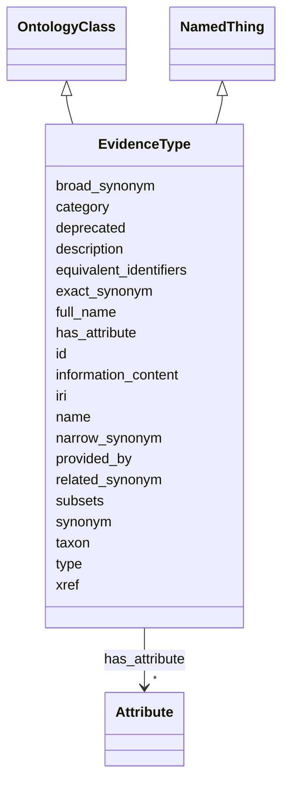

---
search:
  boost: 10.0
---

# Class: EvidenceType 


_Class of evidence that supports an association_


<div data-search-exclude markdown="1">


URI: [namo:EvidenceType](https://w3id.org/monarch-initiative/namo/EvidenceType)





## Inheritance
* [Entity](Entity.md)
    * [NamedThing](NamedThing.md)
        * **EvidenceType** [ [OntologyClass](OntologyClass.md)]


## Slots

| Name | Cardinality and Range | Description | Inheritance |
| ---  | --- | --- | --- |
| [id](id.md) | 1 <br/> [String](String.md) | A unique identifier for an entity | [Entity](Entity.md), [OntologyClass](OntologyClass.md) |
| [subsets](subsets.md) | * <br/> [String](String.md) | The set of ontology subsets a term belongs to (e | [OntologyClass](OntologyClass.md) |
| [provided_by](provided_by.md) | * <br/> [String](String.md) | The value in this node property represents the knowledge provider that create... | [NamedThing](NamedThing.md) |
| [xref](xref.md) | * <br/> [Uriorcurie](Uriorcurie.md) | A database cross reference or alternative identifier for a NamedThing or edge... | [NamedThing](NamedThing.md) |
| [full_name](full_name.md) | 0..1 <br/> [LabelType](LabelType.md) | a long-form human readable name for a thing | [NamedThing](NamedThing.md) |
| [synonym](synonym.md) | * <br/> [LabelType](LabelType.md) | Alternate human-readable names for a thing | [NamedThing](NamedThing.md) |
| [exact_synonym](exact_synonym.md) | * <br/> [LabelType](LabelType.md) | An alternate label for an entity that denotes exactly the same meaning as the... | [NamedThing](NamedThing.md) |
| [broad_synonym](broad_synonym.md) | * <br/> [LabelType](LabelType.md) | An alternate label for an entity whose meaning is broader (more general) than... | [NamedThing](NamedThing.md) |
| [narrow_synonym](narrow_synonym.md) | * <br/> [LabelType](LabelType.md) | An alternate label for an entity whose meaning is narrower (more specific) th... | [NamedThing](NamedThing.md) |
| [related_synonym](related_synonym.md) | * <br/> [LabelType](LabelType.md) | An alternate label that is related to the primary label but is neither exactl... | [NamedThing](NamedThing.md) |
| [equivalent_identifiers](equivalent_identifiers.md) | * <br/> [Uriorcurie](Uriorcurie.md) | A set of identifiers that are considered equivalent to the primary identifier... | [NamedThing](NamedThing.md) |
| [information_content](information_content.md) | 0..1 <br/> [Float](Float.md) | Information content (IC) value for a term, primarily from Automats | [NamedThing](NamedThing.md) |
| [taxon](taxon.md) | 0..1 <br/> [Uriorcurie](Uriorcurie.md) | A property that indicates the taxonomic classification of an entity | [NamedThing](NamedThing.md) |
| [iri](iri.md) | 0..1 <br/> [IriType](IriType.md) | An IRI for an entity | [Entity](Entity.md) |
| [category](category.md) | 1..* <br/> [Uriorcurie](Uriorcurie.md) | Name of the high level ontology class in which this entity is categorized | [Entity](Entity.md) |
| [type](type.md) | * <br/> [String](String.md) | An rdf:type property asserting that an entity is an instance of a particular ... | [Entity](Entity.md) |
| [name](name.md) | 0..1 <br/> [LabelType](LabelType.md) | A human-readable name for an attribute or entity | [Entity](Entity.md) |
| [description](description.md) | 0..1 <br/> [NarrativeText](NarrativeText.md) | a human-readable description of an entity | [Entity](Entity.md) |
| [has_attribute](has_attribute.md) | * <br/> [Attribute](Attribute.md) | connects any entity to an attribute | [Entity](Entity.md) |
| [deprecated](deprecated.md) | 0..1 <br/> [Boolean](Boolean.md) | A boolean flag indicating that an entity is no longer considered current or v... | [Entity](Entity.md) |


## Usages

| used by | used in | type | used |
| ---  | --- | --- | --- |
| [Association](Association.md) | [has_evidence_of_type](has_evidence_of_type.md) | range | [EvidenceType](EvidenceType.md) |
| [DiseaseAssociatedWithResponseToChemicalEntityAssociation](DiseaseAssociatedWithResponseToChemicalEntityAssociation.md) | [has_evidence_of_type](has_evidence_of_type.md) | range | [EvidenceType](EvidenceType.md) |
| [ChemicalEntityAssessesNamedThingAssociation](ChemicalEntityAssessesNamedThingAssociation.md) | [has_evidence_of_type](has_evidence_of_type.md) | range | [EvidenceType](EvidenceType.md) |
| [ContributorAssociation](ContributorAssociation.md) | [has_evidence_of_type](has_evidence_of_type.md) | range | [EvidenceType](EvidenceType.md) |
| [GenotypeToGenotypePartAssociation](GenotypeToGenotypePartAssociation.md) | [has_evidence_of_type](has_evidence_of_type.md) | range | [EvidenceType](EvidenceType.md) |
| [GenotypeToGeneAssociation](GenotypeToGeneAssociation.md) | [has_evidence_of_type](has_evidence_of_type.md) | range | [EvidenceType](EvidenceType.md) |
| [GenotypeToVariantAssociation](GenotypeToVariantAssociation.md) | [has_evidence_of_type](has_evidence_of_type.md) | range | [EvidenceType](EvidenceType.md) |
| [GeneToGeneAssociation](GeneToGeneAssociation.md) | [has_evidence_of_type](has_evidence_of_type.md) | range | [EvidenceType](EvidenceType.md) |
| [GeneToGeneHomologyAssociation](GeneToGeneHomologyAssociation.md) | [has_evidence_of_type](has_evidence_of_type.md) | range | [EvidenceType](EvidenceType.md) |
| [GeneToGeneFamilyAssociation](GeneToGeneFamilyAssociation.md) | [has_evidence_of_type](has_evidence_of_type.md) | range | [EvidenceType](EvidenceType.md) |
| [GeneFamilyToGeneOrGeneProductOrGeneFamilyAssociation](GeneFamilyToGeneOrGeneProductOrGeneFamilyAssociation.md) | [has_evidence_of_type](has_evidence_of_type.md) | range | [EvidenceType](EvidenceType.md) |
| [GeneOrGeneProductOrGeneFamilyToBiologicalProcessOrActivityAssociation](GeneOrGeneProductOrGeneFamilyToBiologicalProcessOrActivityAssociation.md) | [has_evidence_of_type](has_evidence_of_type.md) | range | [EvidenceType](EvidenceType.md) |
| [BiologicalProcessOrActivityToGeneOrGeneProductOrGeneFamilyAssociation](BiologicalProcessOrActivityToGeneOrGeneProductOrGeneFamilyAssociation.md) | [has_evidence_of_type](has_evidence_of_type.md) | range | [EvidenceType](EvidenceType.md) |
| [BiologicalProcessOrActivityToBiologicalProcessOrActivityAssociation](BiologicalProcessOrActivityToBiologicalProcessOrActivityAssociation.md) | [has_evidence_of_type](has_evidence_of_type.md) | range | [EvidenceType](EvidenceType.md) |
| [GeneToGeneCoexpressionAssociation](GeneToGeneCoexpressionAssociation.md) | [has_evidence_of_type](has_evidence_of_type.md) | range | [EvidenceType](EvidenceType.md) |
| [PairwiseGeneToGeneInteraction](PairwiseGeneToGeneInteraction.md) | [has_evidence_of_type](has_evidence_of_type.md) | range | [EvidenceType](EvidenceType.md) |
| [PairwiseMolecularInteraction](PairwiseMolecularInteraction.md) | [has_evidence_of_type](has_evidence_of_type.md) | range | [EvidenceType](EvidenceType.md) |
| [CellLineToDiseaseOrPhenotypicFeatureAssociation](CellLineToDiseaseOrPhenotypicFeatureAssociation.md) | [has_evidence_of_type](has_evidence_of_type.md) | range | [EvidenceType](EvidenceType.md) |
| [ChemicalEntityToChemicalEntityAssociation](ChemicalEntityToChemicalEntityAssociation.md) | [has_evidence_of_type](has_evidence_of_type.md) | range | [EvidenceType](EvidenceType.md) |
| [ReactionToParticipantAssociation](ReactionToParticipantAssociation.md) | [has_evidence_of_type](has_evidence_of_type.md) | range | [EvidenceType](EvidenceType.md) |
| [ReactionToCatalystAssociation](ReactionToCatalystAssociation.md) | [has_evidence_of_type](has_evidence_of_type.md) | range | [EvidenceType](EvidenceType.md) |
| [ChemicalEntityToChemicalDerivationAssociation](ChemicalEntityToChemicalDerivationAssociation.md) | [has_evidence_of_type](has_evidence_of_type.md) | range | [EvidenceType](EvidenceType.md) |
| [ChemicalEntityToDiseaseOrPhenotypicFeatureAssociation](ChemicalEntityToDiseaseOrPhenotypicFeatureAssociation.md) | [has_evidence_of_type](has_evidence_of_type.md) | range | [EvidenceType](EvidenceType.md) |
| [ChemicalOrDrugOrTreatmentToDiseaseOrPhenotypicFeatureAssociation](ChemicalOrDrugOrTreatmentToDiseaseOrPhenotypicFeatureAssociation.md) | [has_evidence_of_type](has_evidence_of_type.md) | range | [EvidenceType](EvidenceType.md) |
| [ChemicalOrDrugOrTreatmentAdverseEventAssociation](ChemicalOrDrugOrTreatmentAdverseEventAssociation.md) | [has_evidence_of_type](has_evidence_of_type.md) | range | [EvidenceType](EvidenceType.md) |
| [ChemicalOrDrugOrTreatmentSideEffectAssociation](ChemicalOrDrugOrTreatmentSideEffectAssociation.md) | [has_evidence_of_type](has_evidence_of_type.md) | range | [EvidenceType](EvidenceType.md) |
| [GeneToPathwayAssociation](GeneToPathwayAssociation.md) | [has_evidence_of_type](has_evidence_of_type.md) | range | [EvidenceType](EvidenceType.md) |
| [MolecularActivityToPathwayAssociation](MolecularActivityToPathwayAssociation.md) | [has_evidence_of_type](has_evidence_of_type.md) | range | [EvidenceType](EvidenceType.md) |
| [ChemicalEntityToPathwayAssociation](ChemicalEntityToPathwayAssociation.md) | [has_evidence_of_type](has_evidence_of_type.md) | range | [EvidenceType](EvidenceType.md) |
| [ChemicalEntityToBiologicalProcessAssociation](ChemicalEntityToBiologicalProcessAssociation.md) | [has_evidence_of_type](has_evidence_of_type.md) | range | [EvidenceType](EvidenceType.md) |
| [NamedThingAssociatedWithLikelihoodOfNamedThingAssociation](NamedThingAssociatedWithLikelihoodOfNamedThingAssociation.md) | [has_evidence_of_type](has_evidence_of_type.md) | range | [EvidenceType](EvidenceType.md) |
| [ChemicalGeneInteractionAssociation](ChemicalGeneInteractionAssociation.md) | [has_evidence_of_type](has_evidence_of_type.md) | range | [EvidenceType](EvidenceType.md) |
| [MacromolecularMachineHasSubstrateAssociation](MacromolecularMachineHasSubstrateAssociation.md) | [has_evidence_of_type](has_evidence_of_type.md) | range | [EvidenceType](EvidenceType.md) |
| [GeneRegulatesGeneAssociation](GeneRegulatesGeneAssociation.md) | [has_evidence_of_type](has_evidence_of_type.md) | range | [EvidenceType](EvidenceType.md) |
| [ProcessRegulatesProcessAssociation](ProcessRegulatesProcessAssociation.md) | [has_evidence_of_type](has_evidence_of_type.md) | range | [EvidenceType](EvidenceType.md) |
| [ChemicalAffectsBiologicalEntityAssociation](ChemicalAffectsBiologicalEntityAssociation.md) | [has_evidence_of_type](has_evidence_of_type.md) | range | [EvidenceType](EvidenceType.md) |
| [ChemicalAffectsGeneAssociation](ChemicalAffectsGeneAssociation.md) | [has_evidence_of_type](has_evidence_of_type.md) | range | [EvidenceType](EvidenceType.md) |
| [ChemicalGeneSensitivityAssociation](ChemicalGeneSensitivityAssociation.md) | [has_evidence_of_type](has_evidence_of_type.md) | range | [EvidenceType](EvidenceType.md) |
| [GeneAffectsChemicalAssociation](GeneAffectsChemicalAssociation.md) | [has_evidence_of_type](has_evidence_of_type.md) | range | [EvidenceType](EvidenceType.md) |
| [DrugToGeneAssociation](DrugToGeneAssociation.md) | [has_evidence_of_type](has_evidence_of_type.md) | range | [EvidenceType](EvidenceType.md) |
| [MaterialSampleDerivationAssociation](MaterialSampleDerivationAssociation.md) | [has_evidence_of_type](has_evidence_of_type.md) | range | [EvidenceType](EvidenceType.md) |
| [MaterialSampleToDiseaseOrPhenotypicFeatureAssociation](MaterialSampleToDiseaseOrPhenotypicFeatureAssociation.md) | [has_evidence_of_type](has_evidence_of_type.md) | range | [EvidenceType](EvidenceType.md) |
| [DiseaseToExposureEventAssociation](DiseaseToExposureEventAssociation.md) | [has_evidence_of_type](has_evidence_of_type.md) | range | [EvidenceType](EvidenceType.md) |
| [ExposureEventToOutcomeAssociation](ExposureEventToOutcomeAssociation.md) | [has_evidence_of_type](has_evidence_of_type.md) | range | [EvidenceType](EvidenceType.md) |
| [PhenotypicFeatureToPhenotypicFeatureAssociation](PhenotypicFeatureToPhenotypicFeatureAssociation.md) | [has_evidence_of_type](has_evidence_of_type.md) | range | [EvidenceType](EvidenceType.md) |
| [InformationContentEntityToNamedThingAssociation](InformationContentEntityToNamedThingAssociation.md) | [has_evidence_of_type](has_evidence_of_type.md) | range | [EvidenceType](EvidenceType.md) |
| [DiseaseOrPhenotypicFeatureToLocationAssociation](DiseaseOrPhenotypicFeatureToLocationAssociation.md) | [has_evidence_of_type](has_evidence_of_type.md) | range | [EvidenceType](EvidenceType.md) |
| [DiseaseOrPhenotypicFeatureToGeneticInheritanceAssociation](DiseaseOrPhenotypicFeatureToGeneticInheritanceAssociation.md) | [has_evidence_of_type](has_evidence_of_type.md) | range | [EvidenceType](EvidenceType.md) |
| [GenotypeToPhenotypicFeatureAssociation](GenotypeToPhenotypicFeatureAssociation.md) | [has_evidence_of_type](has_evidence_of_type.md) | range | [EvidenceType](EvidenceType.md) |
| [ExposureEventToPhenotypicFeatureAssociation](ExposureEventToPhenotypicFeatureAssociation.md) | [has_evidence_of_type](has_evidence_of_type.md) | range | [EvidenceType](EvidenceType.md) |
| [DiseaseToPhenotypicFeatureAssociation](DiseaseToPhenotypicFeatureAssociation.md) | [has_evidence_of_type](has_evidence_of_type.md) | range | [EvidenceType](EvidenceType.md) |
| [DiseaseToDiseaseAssociation](DiseaseToDiseaseAssociation.md) | [has_evidence_of_type](has_evidence_of_type.md) | range | [EvidenceType](EvidenceType.md) |
| [CaseToPhenotypicFeatureAssociation](CaseToPhenotypicFeatureAssociation.md) | [has_evidence_of_type](has_evidence_of_type.md) | range | [EvidenceType](EvidenceType.md) |
| [CaseToDiseaseAssociation](CaseToDiseaseAssociation.md) | [has_evidence_of_type](has_evidence_of_type.md) | range | [EvidenceType](EvidenceType.md) |
| [CaseToVariantAssociation](CaseToVariantAssociation.md) | [has_evidence_of_type](has_evidence_of_type.md) | range | [EvidenceType](EvidenceType.md) |
| [CaseToGeneAssociation](CaseToGeneAssociation.md) | [has_evidence_of_type](has_evidence_of_type.md) | range | [EvidenceType](EvidenceType.md) |
| [BehaviorToBehavioralFeatureAssociation](BehaviorToBehavioralFeatureAssociation.md) | [has_evidence_of_type](has_evidence_of_type.md) | range | [EvidenceType](EvidenceType.md) |
| [GeneToPhenotypicFeatureAssociation](GeneToPhenotypicFeatureAssociation.md) | [has_evidence_of_type](has_evidence_of_type.md) | range | [EvidenceType](EvidenceType.md) |
| [GeneToDiseaseAssociation](GeneToDiseaseAssociation.md) | [has_evidence_of_type](has_evidence_of_type.md) | range | [EvidenceType](EvidenceType.md) |
| [CausalGeneToDiseaseAssociation](CausalGeneToDiseaseAssociation.md) | [has_evidence_of_type](has_evidence_of_type.md) | range | [EvidenceType](EvidenceType.md) |
| [CorrelatedGeneToDiseaseAssociation](CorrelatedGeneToDiseaseAssociation.md) | [has_evidence_of_type](has_evidence_of_type.md) | range | [EvidenceType](EvidenceType.md) |
| [DruggableGeneToDiseaseAssociation](DruggableGeneToDiseaseAssociation.md) | [has_evidence_of_type](has_evidence_of_type.md) | range | [EvidenceType](EvidenceType.md) |
| [PhenotypicFeatureToDiseaseAssociation](PhenotypicFeatureToDiseaseAssociation.md) | [has_evidence_of_type](has_evidence_of_type.md) | range | [EvidenceType](EvidenceType.md) |
| [VariantToGeneAssociation](VariantToGeneAssociation.md) | [has_evidence_of_type](has_evidence_of_type.md) | range | [EvidenceType](EvidenceType.md) |
| [VariantToGeneExpressionAssociation](VariantToGeneExpressionAssociation.md) | [has_evidence_of_type](has_evidence_of_type.md) | range | [EvidenceType](EvidenceType.md) |
| [VariantToPopulationAssociation](VariantToPopulationAssociation.md) | [has_evidence_of_type](has_evidence_of_type.md) | range | [EvidenceType](EvidenceType.md) |
| [PopulationToPopulationAssociation](PopulationToPopulationAssociation.md) | [has_evidence_of_type](has_evidence_of_type.md) | range | [EvidenceType](EvidenceType.md) |
| [VariantToPhenotypicFeatureAssociation](VariantToPhenotypicFeatureAssociation.md) | [has_evidence_of_type](has_evidence_of_type.md) | range | [EvidenceType](EvidenceType.md) |
| [VariantToDiseaseAssociation](VariantToDiseaseAssociation.md) | [has_evidence_of_type](has_evidence_of_type.md) | range | [EvidenceType](EvidenceType.md) |
| [GenotypeToDiseaseAssociation](GenotypeToDiseaseAssociation.md) | [has_evidence_of_type](has_evidence_of_type.md) | range | [EvidenceType](EvidenceType.md) |
| [GeneAsAModelOfDiseaseAssociation](GeneAsAModelOfDiseaseAssociation.md) | [has_evidence_of_type](has_evidence_of_type.md) | range | [EvidenceType](EvidenceType.md) |
| [VariantAsAModelOfDiseaseAssociation](VariantAsAModelOfDiseaseAssociation.md) | [has_evidence_of_type](has_evidence_of_type.md) | range | [EvidenceType](EvidenceType.md) |
| [GenotypeAsAModelOfDiseaseAssociation](GenotypeAsAModelOfDiseaseAssociation.md) | [has_evidence_of_type](has_evidence_of_type.md) | range | [EvidenceType](EvidenceType.md) |
| [CellLineAsAModelOfDiseaseAssociation](CellLineAsAModelOfDiseaseAssociation.md) | [has_evidence_of_type](has_evidence_of_type.md) | range | [EvidenceType](EvidenceType.md) |
| [OrganismalEntityAsAModelOfDiseaseAssociation](OrganismalEntityAsAModelOfDiseaseAssociation.md) | [has_evidence_of_type](has_evidence_of_type.md) | range | [EvidenceType](EvidenceType.md) |
| [OrganismToOrganismAssociation](OrganismToOrganismAssociation.md) | [has_evidence_of_type](has_evidence_of_type.md) | range | [EvidenceType](EvidenceType.md) |
| [TaxonToTaxonAssociation](TaxonToTaxonAssociation.md) | [has_evidence_of_type](has_evidence_of_type.md) | range | [EvidenceType](EvidenceType.md) |
| [GeneHasVariantThatContributesToDiseaseAssociation](GeneHasVariantThatContributesToDiseaseAssociation.md) | [has_evidence_of_type](has_evidence_of_type.md) | range | [EvidenceType](EvidenceType.md) |
| [GeneToExpressionSiteAssociation](GeneToExpressionSiteAssociation.md) | [has_evidence_of_type](has_evidence_of_type.md) | range | [EvidenceType](EvidenceType.md) |
| [SequenceVariantModulatesTreatmentAssociation](SequenceVariantModulatesTreatmentAssociation.md) | [has_evidence_of_type](has_evidence_of_type.md) | range | [EvidenceType](EvidenceType.md) |
| [FunctionalAssociation](FunctionalAssociation.md) | [has_evidence_of_type](has_evidence_of_type.md) | range | [EvidenceType](EvidenceType.md) |
| [MacromolecularMachineToMolecularActivityAssociation](MacromolecularMachineToMolecularActivityAssociation.md) | [has_evidence_of_type](has_evidence_of_type.md) | range | [EvidenceType](EvidenceType.md) |
| [MacromolecularMachineToBiologicalProcessAssociation](MacromolecularMachineToBiologicalProcessAssociation.md) | [has_evidence_of_type](has_evidence_of_type.md) | range | [EvidenceType](EvidenceType.md) |
| [MacromolecularMachineToCellularComponentAssociation](MacromolecularMachineToCellularComponentAssociation.md) | [has_evidence_of_type](has_evidence_of_type.md) | range | [EvidenceType](EvidenceType.md) |
| [MolecularActivityToChemicalEntityAssociation](MolecularActivityToChemicalEntityAssociation.md) | [has_evidence_of_type](has_evidence_of_type.md) | range | [EvidenceType](EvidenceType.md) |
| [MolecularActivityToMolecularActivityAssociation](MolecularActivityToMolecularActivityAssociation.md) | [has_evidence_of_type](has_evidence_of_type.md) | range | [EvidenceType](EvidenceType.md) |
| [GeneToGoTermAssociation](GeneToGoTermAssociation.md) | [has_evidence_of_type](has_evidence_of_type.md) | range | [EvidenceType](EvidenceType.md) |
| [EntityToDiseaseAssociation](EntityToDiseaseAssociation.md) | [has_evidence_of_type](has_evidence_of_type.md) | range | [EvidenceType](EvidenceType.md) |
| [EntityToPhenotypicFeatureAssociation](EntityToPhenotypicFeatureAssociation.md) | [has_evidence_of_type](has_evidence_of_type.md) | range | [EvidenceType](EvidenceType.md) |
| [SequenceAssociation](SequenceAssociation.md) | [has_evidence_of_type](has_evidence_of_type.md) | range | [EvidenceType](EvidenceType.md) |
| [GenomicSequenceLocalization](GenomicSequenceLocalization.md) | [has_evidence_of_type](has_evidence_of_type.md) | range | [EvidenceType](EvidenceType.md) |
| [SequenceFeatureRelationship](SequenceFeatureRelationship.md) | [has_evidence_of_type](has_evidence_of_type.md) | range | [EvidenceType](EvidenceType.md) |
| [TranscriptToGeneRelationship](TranscriptToGeneRelationship.md) | [has_evidence_of_type](has_evidence_of_type.md) | range | [EvidenceType](EvidenceType.md) |
| [GeneToGeneProductRelationship](GeneToGeneProductRelationship.md) | [has_evidence_of_type](has_evidence_of_type.md) | range | [EvidenceType](EvidenceType.md) |
| [ExonToTranscriptRelationship](ExonToTranscriptRelationship.md) | [has_evidence_of_type](has_evidence_of_type.md) | range | [EvidenceType](EvidenceType.md) |
| [ChemicalEntityOrGeneOrGeneProductRegulatesGeneAssociation](ChemicalEntityOrGeneOrGeneProductRegulatesGeneAssociation.md) | [has_evidence_of_type](has_evidence_of_type.md) | range | [EvidenceType](EvidenceType.md) |
| [AnatomicalEntityToAnatomicalEntityAssociation](AnatomicalEntityToAnatomicalEntityAssociation.md) | [has_evidence_of_type](has_evidence_of_type.md) | range | [EvidenceType](EvidenceType.md) |
| [AnatomicalEntityHasPartAnatomicalEntityAssociation](AnatomicalEntityHasPartAnatomicalEntityAssociation.md) | [has_evidence_of_type](has_evidence_of_type.md) | range | [EvidenceType](EvidenceType.md) |
| [AnatomicalEntityPartOfAnatomicalEntityAssociation](AnatomicalEntityPartOfAnatomicalEntityAssociation.md) | [has_evidence_of_type](has_evidence_of_type.md) | range | [EvidenceType](EvidenceType.md) |
| [AnatomicalEntityToAnatomicalEntityOntogenicAssociation](AnatomicalEntityToAnatomicalEntityOntogenicAssociation.md) | [has_evidence_of_type](has_evidence_of_type.md) | range | [EvidenceType](EvidenceType.md) |
| [GeneOrGeneProductOrGeneFamilyToAnatomicalEntityAssociation](GeneOrGeneProductOrGeneFamilyToAnatomicalEntityAssociation.md) | [has_evidence_of_type](has_evidence_of_type.md) | range | [EvidenceType](EvidenceType.md) |
| [BiologicalProcessOrActivityToAnatomicalEntityAssociation](BiologicalProcessOrActivityToAnatomicalEntityAssociation.md) | [has_evidence_of_type](has_evidence_of_type.md) | range | [EvidenceType](EvidenceType.md) |
| [OrganismTaxonToOrganismTaxonAssociation](OrganismTaxonToOrganismTaxonAssociation.md) | [has_evidence_of_type](has_evidence_of_type.md) | range | [EvidenceType](EvidenceType.md) |
| [OrganismTaxonToOrganismTaxonSpecialization](OrganismTaxonToOrganismTaxonSpecialization.md) | [has_evidence_of_type](has_evidence_of_type.md) | range | [EvidenceType](EvidenceType.md) |
| [OrganismTaxonToOrganismTaxonInteraction](OrganismTaxonToOrganismTaxonInteraction.md) | [has_evidence_of_type](has_evidence_of_type.md) | range | [EvidenceType](EvidenceType.md) |
| [OrganismTaxonToEnvironmentAssociation](OrganismTaxonToEnvironmentAssociation.md) | [has_evidence_of_type](has_evidence_of_type.md) | range | [EvidenceType](EvidenceType.md) |


## Aliases


* evidence code


## Identifier and Mapping Information


### Schema Source


* from schema: https://w3id.org/monarch-initiative/namo


## Mappings

| Mapping Type | Mapped Value |
| ---  | ---  |
| self | namo:EvidenceType |
| native | namo:EvidenceType |
| exact | ECO:0000000 |


## LinkML Source

<!-- TODO: investigate https://stackoverflow.com/questions/37606292/how-to-create-tabbed-code-blocks-in-mkdocs-or-sphinx -->

### Direct

<details>
```yaml
name: evidence type
description: Class of evidence that supports an association
from_schema: https://w3id.org/monarch-initiative/namo
aliases:
- evidence code
exact_mappings:
- ECO:0000000
is_a: named thing
mixins:
- ontology class
values_from:
- eco

```
</details>

### Induced

<details>
```yaml
name: evidence type
description: Class of evidence that supports an association
from_schema: https://w3id.org/monarch-initiative/namo
aliases:
- evidence code
exact_mappings:
- ECO:0000000
is_a: named thing
mixins:
- ontology class
values_from:
- eco
attributes:
  id:
    name: id
    description: A unique identifier for an entity. Must be either a CURIE shorthand
      for a URI or a complete URI
    in_subset:
    - translator_minimal
    from_schema: https://w3id.org/monarch-initiative/namo
    exact_mappings:
    - AGRKB:primaryId
    - gff3:ID
    - gpi:DB_Object_ID
    rank: 1000
    domain: entity
    identifier: true
    owner: evidence type
    domain_of:
    - Reference
    - ontology class
    - entity
    range: string
    required: true
  subsets:
    name: subsets
    description: The set of ontology subsets a term belongs to (e.g. GO slim subsets,
      MONDO rare disease subset). Carries the values of `oboInOwl:inSubset` annotations
      from source ontologies through to downstream knowledge graphs.
    from_schema: https://w3id.org/monarch-initiative/namo
    exact_mappings:
    - oboInOwl:inSubset
    rank: 1000
    is_a: node property
    domain: named thing
    owner: evidence type
    domain_of:
    - ontology class
    range: string
    multivalued: true
  provided by:
    name: provided by
    description: The value in this node property represents the knowledge provider
      that created or assembled the node and all of its attributes.  Used internally
      to represent how a particular node made its way into a knowledge provider or
      graph.
    from_schema: https://w3id.org/monarch-initiative/namo
    rank: 1000
    is_a: node property
    domain: named thing
    alias: provided_by
    owner: evidence type
    domain_of:
    - named thing
    range: string
    multivalued: true
  xref:
    name: xref
    description: A database cross reference or alternative identifier for a NamedThing
      or edge between two NamedThings.  This property should point to a database record
      or webpage that supports the existence of the edge, or gives more detail about
      the edge. This property can be used on a node or edge to provide multiple URIs
      or CURIE cross references.
    in_subset:
    - translator_minimal
    from_schema: https://w3id.org/monarch-initiative/namo
    aliases:
    - dbxref
    - Dbxref
    - DbXref
    - record_url
    - source_record_urls
    narrow_mappings:
    - gff3:Dbxref
    - gpi:DB_Xrefs
    rank: 1000
    domain: named thing
    owner: evidence type
    domain_of:
    - named thing
    - publication
    - retrieval source
    - gene
    - gene product mixin
    range: uriorcurie
    multivalued: true
  full name:
    name: full name
    description: a long-form human readable name for a thing
    from_schema: https://w3id.org/monarch-initiative/namo
    rank: 1000
    is_a: node property
    domain: named thing
    alias: full_name
    owner: evidence type
    domain_of:
    - named thing
    range: label type
  synonym:
    name: synonym
    description: Alternate human-readable names for a thing
    in_subset:
    - translator_minimal
    from_schema: https://w3id.org/monarch-initiative/namo
    aliases:
    - alias
    narrow_mappings:
    - skos:altLabel
    - gff3:Alias
    - AGRKB:synonyms
    - gpi:DB_Object_Synonyms
    - HANCESTRO:0330
    - IAO:0000136
    - RXNORM:has_tradename
    rank: 1000
    is_a: node property
    domain: named thing
    owner: evidence type
    domain_of:
    - named thing
    - gene product mixin
    range: label type
    multivalued: true
  exact synonym:
    name: exact synonym
    description: An alternate label for an entity that denotes exactly the same meaning
      as the primary label and is interchangeable with it in all contexts.
    from_schema: https://w3id.org/monarch-initiative/namo
    exact_mappings:
    - oboInOwl:hasExactSynonym
    rank: 1000
    is_a: synonym
    domain: named thing
    alias: exact_synonym
    owner: evidence type
    domain_of:
    - named thing
    range: label type
    multivalued: true
  broad synonym:
    name: broad synonym
    description: An alternate label for an entity whose meaning is broader (more general)
      than the primary label but is still useful as a lexical alternative.
    from_schema: https://w3id.org/monarch-initiative/namo
    exact_mappings:
    - oboInOwl:hasBroadSynonym
    rank: 1000
    is_a: synonym
    domain: named thing
    alias: broad_synonym
    owner: evidence type
    domain_of:
    - named thing
    range: label type
    multivalued: true
  narrow synonym:
    name: narrow synonym
    description: An alternate label for an entity whose meaning is narrower (more
      specific) than the primary label, for example naming a particular sub-type.
    from_schema: https://w3id.org/monarch-initiative/namo
    exact_mappings:
    - oboInOwl:hasNarrowSynonym
    rank: 1000
    is_a: synonym
    domain: named thing
    alias: narrow_synonym
    owner: evidence type
    domain_of:
    - named thing
    range: label type
    multivalued: true
  related synonym:
    name: related synonym
    description: An alternate label that is related to the primary label but is neither
      exactly synonymous nor cleanly broader or narrower; useful as a lexical pointer
      but not for strict equivalence. Corresponds to oboInOwl:hasRelatedSynonym.
    from_schema: https://w3id.org/monarch-initiative/namo
    exact_mappings:
    - oboInOwl:hasRelatedSynonym
    rank: 1000
    is_a: synonym
    domain: named thing
    alias: related_synonym
    owner: evidence type
    domain_of:
    - named thing
    range: label type
    multivalued: true
  equivalent identifiers:
    name: equivalent identifiers
    description: A set of identifiers that are considered equivalent to the primary
      identifier of the entity. This attribute is used to represent a collection of
      identifiers that are considered equivalent to the primary identifier of an entity.
      These equivalent identifiers may come from different databases, ontologies,
      or naming conventions, but they all refer to the same underlying concept or
      entity. This attribute is particularly useful in data integration and interoperability
      scenarios, where it is important to recognize and link different representations
      of the same entity across various sources.
    from_schema: https://w3id.org/monarch-initiative/namo
    see_also:
    - biolink:xref
    - biolink:synonyms
    rank: 1000
    alias: equivalent_identifiers
    owner: evidence type
    domain_of:
    - named thing
    range: uriorcurie
    multivalued: true
  information content:
    name: information content
    description: Information content (IC) value for a term, primarily from Automats.
    from_schema: https://w3id.org/monarch-initiative/namo
    rank: 1000
    alias: information_content
    owner: evidence type
    domain_of:
    - named thing
    range: float
  taxon:
    name: taxon
    description: A property that indicates the taxonomic classification of an entity.
      Values for this slot should be from the NCBITaxon ontology.
    comments:
    - Note there is also a predicate 'in taxon' that can be used to instantiate an
      edge between a taxon entity and a thing with taxon entity.  This is an acceptable
      practice for KG construction, but for many applications it is more convenient
      to use this property slot to directly annotate the taxon on the entity itself.
    in_subset:
    - translator_minimal
    from_schema: https://w3id.org/monarch-initiative/namo
    rank: 1000
    is_a: node property
    domain: named thing
    owner: evidence type
    domain_of:
    - named thing
    range: uriorcurie
  iri:
    name: iri
    description: An IRI for an entity. This is determined by the id using expansion
      rules.
    in_subset:
    - translator_minimal
    - samples
    from_schema: https://w3id.org/monarch-initiative/namo
    exact_mappings:
    - WIKIDATA_PROPERTY:P854
    rank: 1000
    owner: evidence type
    domain_of:
    - attribute
    - entity
    range: iri type
  category:
    name: category
    description: Name of the high level ontology class in which this entity is categorized.
      Corresponds to the label for the biolink entity type class. In a neo4j database
      this MAY correspond to the neo4j label tag. In an RDF database it should be
      a biolink model class URI. This field is multi-valued. It should include values
      for ancestors of the biolink class; for example, a protein such as Shh would
      have category values `biolink:Protein`, `biolink:GeneProduct`, `biolink:MolecularEntity`.
      In an RDF database, nodes will typically have an rdf:type triples. This can
      be to the most specific biolink class, or potentially to a class more specific
      than something in biolink. For example, a sequence feature `f` may have a rdf:type
      assertion to a SO class such as TF_binding_site, which is more specific than
      anything in biolink. Here we would have categories {biolink:GenomicEntity, biolink:MolecularEntity,
      biolink:NamedThing}
    in_subset:
    - translator_minimal
    from_schema: https://w3id.org/monarch-initiative/namo
    rank: 1000
    is_a: type
    domain: entity
    designates_type: true
    owner: evidence type
    domain_of:
    - entity
    is_class_field: true
    range: uriorcurie
    required: true
    multivalued: true
  type:
    name: type
    description: An rdf:type property asserting that an entity is an instance of a
      particular class. In Biolink the value is typically used to indicate the most
      specific category of which the entity is an instance.
    from_schema: https://w3id.org/monarch-initiative/namo
    exact_mappings:
    - gff3:type
    - gpi:DB_Object_Type
    rank: 1000
    domain: entity
    slot_uri: rdf:type
    owner: evidence type
    domain_of:
    - entity
    range: string
    multivalued: true
  name:
    name: name
    description: A human-readable name for an attribute or entity.
    in_subset:
    - translator_minimal
    - samples
    from_schema: https://w3id.org/monarch-initiative/namo
    aliases:
    - label
    - display name
    - title
    exact_mappings:
    - gff3:Name
    - gpi:DB_Object_Name
    narrow_mappings:
    - dct:title
    - WIKIDATA_PROPERTY:P1476
    rank: 1000
    domain: entity
    slot_uri: rdfs:label
    owner: evidence type
    domain_of:
    - attribute
    - entity
    - macromolecular machine mixin
    range: label type
  description:
    name: description
    description: a human-readable description of an entity
    in_subset:
    - translator_minimal
    from_schema: https://w3id.org/monarch-initiative/namo
    aliases:
    - definition
    exact_mappings:
    - IAO:0000115
    - skos:definitions
    narrow_mappings:
    - gff3:Description
    rank: 1000
    slot_uri: dct:description
    owner: evidence type
    domain_of:
    - entity
    range: narrative text
  has attribute:
    name: has attribute
    description: connects any entity to an attribute
    in_subset:
    - samples
    from_schema: https://w3id.org/monarch-initiative/namo
    exact_mappings:
    - SIO:000008
    close_mappings:
    - OBI:0001927
    narrow_mappings:
    - OBAN:association_has_subject_property
    - OBAN:association_has_object_property
    - CPT:has_possibly_included_panel_element
    - DRUGBANK:category
    - EFO:is_executed_in
    - HANCESTRO:0301
    - LOINC:has_action_guidance
    - LOINC:has_adjustment
    - LOINC:has_aggregation_view
    - LOINC:has_approach_guidance
    - LOINC:has_divisor
    - LOINC:has_exam
    - LOINC:has_method
    - LOINC:has_modality_subtype
    - LOINC:has_object_guidance
    - LOINC:has_scale
    - LOINC:has_suffix
    - LOINC:has_time_aspect
    - LOINC:has_time_modifier
    - LOINC:has_timing_of
    - NCIT:R88
    - NCIT:eo_disease_has_property_or_attribute
    - NCIT:has_data_element
    - NCIT:has_pharmaceutical_administration_method
    - NCIT:has_pharmaceutical_basic_dose_form
    - NCIT:has_pharmaceutical_intended_site
    - NCIT:has_pharmaceutical_release_characteristics
    - NCIT:has_pharmaceutical_state_of_matter
    - NCIT:has_pharmaceutical_transformation
    - NCIT:is_qualified_by
    - NCIT:qualifier_applies_to
    - NCIT:role_has_domain
    - NCIT:role_has_range
    - INO:0000154
    - HANCESTRO:0308
    - orphanet:C016
    - orphanet:C017
    - RO:0000053
    - RO:0000086
    - RO:0000087
    - SNOMED:has_access
    - SNOMED:has_clinical_course
    - SNOMED:has_count_of_base_of_active_ingredient
    - SNOMED:has_dose_form_administration_method
    - SNOMED:has_dose_form_release_characteristic
    - SNOMED:has_dose_form_transformation
    - SNOMED:has_finding_context
    - SNOMED:has_finding_informer
    - SNOMED:has_inherent_attribute
    - SNOMED:has_intent
    - SNOMED:has_interpretation
    - SNOMED:has_laterality
    - SNOMED:has_measurement_method
    - SNOMED:has_method
    - SNOMED:has_priority
    - SNOMED:has_procedure_context
    - SNOMED:has_process_duration
    - SNOMED:has_property
    - SNOMED:has_revision_status
    - SNOMED:has_scale_type
    - SNOMED:has_severity
    - SNOMED:has_specimen
    - SNOMED:has_state_of_matter
    - SNOMED:has_subject_relationship_context
    - SNOMED:has_surgical_approach
    - SNOMED:has_technique
    - SNOMED:has_temporal_context
    - SNOMED:has_time_aspect
    - SNOMED:has_units
    - UMLS:has_structural_class
    - UMLS:has_supported_concept_property
    - UMLS:has_supported_concept_relationship
    - UMLS:may_be_qualified_by
    rank: 1000
    domain: entity
    alias: has_attribute
    owner: evidence type
    domain_of:
    - entity
    range: attribute
    multivalued: true
  deprecated:
    name: deprecated
    description: A boolean flag indicating that an entity is no longer considered
      current or valid.
    from_schema: https://w3id.org/monarch-initiative/namo
    exact_mappings:
    - oboInOwl:ObsoleteClass
    rank: 1000
    owner: evidence type
    domain_of:
    - entity
    range: boolean

```
</details></div>