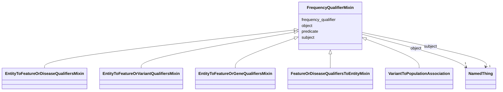

---
search:
  boost: 10.0
---

# Class: FrequencyQualifierMixin 


_Qualifier for frequency type associations_


<div data-search-exclude markdown="1">


URI: [namo:FrequencyQualifierMixin](https://w3id.org/monarch-initiative/namo/FrequencyQualifierMixin)





## Inheritance
* **FrequencyQualifierMixin**
    * [EntityToFeatureOrDiseaseQualifiersMixin](EntityToFeatureOrDiseaseQualifiersMixin.md)
    * [EntityToFeatureOrVariantQualifiersMixin](EntityToFeatureOrVariantQualifiersMixin.md)
    * [EntityToFeatureOrGeneQualifiersMixin](EntityToFeatureOrGeneQualifiersMixin.md)
    * [FeatureOrDiseaseQualifiersToEntityMixin](FeatureOrDiseaseQualifiersToEntityMixin.md)


## Class Properties

| Property | Value |
| --- | --- |
| Mixin | Yes |


## Slots

| Name | Cardinality and Range | Description | Inheritance |
| ---  | --- | --- | --- |
| [frequency_qualifier](frequency_qualifier.md) | 0..1 <br/> [FrequencyValue](FrequencyValue.md) | a qualifier used in a phenotypic association to state how frequent the phenot... | direct |
| [subject](subject.md) | 1 <br/> [NamedThing](NamedThing.md) | connects an association to the subject of the association | direct |
| [predicate](predicate.md) | 1 <br/> [Uriorcurie](Uriorcurie.md) | Has a value from the Biolink 'related_to' hierarchy | direct |
| [object](object.md) | 1 <br/> [NamedThing](NamedThing.md) | connects an association to the object of the association | direct |


## Mixin Usage

| mixed into | description |
| --- | --- |
| [VariantToPopulationAssociation](VariantToPopulationAssociation.md) | An association between a variant and a population, where the variant has part... |


## Identifier and Mapping Information


### Schema Source


* from schema: https://w3id.org/monarch-initiative/namo


## Mappings

| Mapping Type | Mapped Value |
| ---  | ---  |
| self | namo:FrequencyQualifierMixin |
| native | namo:FrequencyQualifierMixin |


## LinkML Source

<!-- TODO: investigate https://stackoverflow.com/questions/37606292/how-to-create-tabbed-code-blocks-in-mkdocs-or-sphinx -->

### Direct

<details>
```yaml
name: frequency qualifier mixin
description: Qualifier for frequency type associations
from_schema: https://w3id.org/monarch-initiative/namo
mixin: true
slots:
- frequency qualifier
- subject
- predicate
- object

```
</details>

### Induced

<details>
```yaml
name: frequency qualifier mixin
description: Qualifier for frequency type associations
from_schema: https://w3id.org/monarch-initiative/namo
mixin: true
attributes:
  frequency qualifier:
    name: frequency qualifier
    description: a qualifier used in a phenotypic association to state how frequent
      the phenotype is observed in the subject
    in_subset:
    - translator_minimal
    from_schema: https://w3id.org/monarch-initiative/namo
    rank: 1000
    is_a: qualifier
    domain: association
    alias: frequency_qualifier
    owner: frequency qualifier mixin
    domain_of:
    - frequency qualifier mixin
    range: frequency value
  subject:
    name: subject
    local_names:
      ga4gh:
        local_name_source: ga4gh
        local_name_value: annotation subject
      neo4j:
        local_name_source: neo4j
        local_name_value: node with outgoing relationship
    description: connects an association to the subject of the association. For example,
      in a gene-to-phenotype association, the gene is subject and phenotype is object.
    from_schema: https://w3id.org/monarch-initiative/namo
    exact_mappings:
    - owl:annotatedSource
    - OBAN:association_has_subject
    rank: 1000
    is_a: association slot
    domain: association
    slot_uri: rdf:subject
    owner: frequency qualifier mixin
    domain_of:
    - association
    - gene to gene association
    - cell line to entity association mixin
    - chemical entity to entity association mixin
    - drug to entity association mixin
    - chemical to entity association mixin
    - case to entity association mixin
    - chemical entity to chemical entity association
    - named thing associated with likelihood of named thing association
    - material sample to entity association mixin
    - material sample derivation association
    - disease to entity association mixin
    - entity to exposure event association mixin
    - entity to outcome association mixin
    - frequency qualifier mixin
    - entity to phenotypic feature association mixin
    - disease or phenotypic feature to entity association mixin
    - entity to disease or phenotypic feature association mixin
    - genotype to entity association mixin
    - case to disease association
    - case to variant association
    - case to gene association
    - gene to entity association mixin
    - variant to entity association mixin
    - model to disease association mixin
    - macromolecular machine to entity association mixin
    - organism taxon to entity association
    range: named thing
    required: true
  predicate:
    name: predicate
    local_names:
      ga4gh:
        local_name_source: ga4gh
        local_name_value: annotation predicate
      translator:
        local_name_source: translator
        local_name_value: predicate
    description: Has a value from the Biolink 'related_to' hierarchy. In RDF,  this
      corresponds to rdf:predicate and in Neo4j this corresponds to the relationship
      type. The convention is for an edge label in snake_case form. For example, biolink:related_to,
      biolink:causes, biolink:treats
    from_schema: https://w3id.org/monarch-initiative/namo
    exact_mappings:
    - owl:annotatedProperty
    - OBAN:association_has_predicate
    rank: 1000
    is_a: association slot
    domain: association
    slot_uri: rdf:predicate
    owner: frequency qualifier mixin
    domain_of:
    - predicate mapping
    - association
    - gene to gene association
    - cell line to entity association mixin
    - chemical entity to entity association mixin
    - drug to entity association mixin
    - chemical to entity association mixin
    - case to entity association mixin
    - chemical entity to chemical entity association
    - named thing associated with likelihood of named thing association
    - material sample to entity association mixin
    - material sample derivation association
    - disease to entity association mixin
    - entity to exposure event association mixin
    - entity to outcome association mixin
    - frequency qualifier mixin
    - entity to phenotypic feature association mixin
    - disease or phenotypic feature to entity association mixin
    - entity to disease or phenotypic feature association mixin
    - genotype to entity association mixin
    - case to disease association
    - case to variant association
    - case to gene association
    - gene to entity association mixin
    - variant to entity association mixin
    - model to disease association mixin
    - macromolecular machine to entity association mixin
    - organism taxon to entity association
    range: uriorcurie
    required: true
  object:
    name: object
    local_names:
      ga4gh:
        local_name_source: ga4gh
        local_name_value: descriptor
      neo4j:
        local_name_source: neo4j
        local_name_value: node with incoming relationship
    description: connects an association to the object of the association. For example,
      in a gene-to-phenotype association, the gene is subject and phenotype is object.
    from_schema: https://w3id.org/monarch-initiative/namo
    exact_mappings:
    - owl:annotatedTarget
    - OBAN:association_has_object
    rank: 1000
    is_a: association slot
    domain: association
    slot_uri: rdf:object
    owner: frequency qualifier mixin
    domain_of:
    - association
    - gene to gene association
    - cell line to entity association mixin
    - chemical entity to entity association mixin
    - drug to entity association mixin
    - chemical to entity association mixin
    - case to entity association mixin
    - chemical entity to chemical entity association
    - named thing associated with likelihood of named thing association
    - material sample to entity association mixin
    - material sample derivation association
    - disease to entity association mixin
    - entity to exposure event association mixin
    - entity to outcome association mixin
    - frequency qualifier mixin
    - entity to phenotypic feature association mixin
    - disease or phenotypic feature to entity association mixin
    - entity to disease or phenotypic feature association mixin
    - genotype to entity association mixin
    - case to disease association
    - case to variant association
    - case to gene association
    - gene to entity association mixin
    - variant to entity association mixin
    - model to disease association mixin
    - macromolecular machine to entity association mixin
    - organism taxon to entity association
    range: named thing
    required: true

```
</details></div>