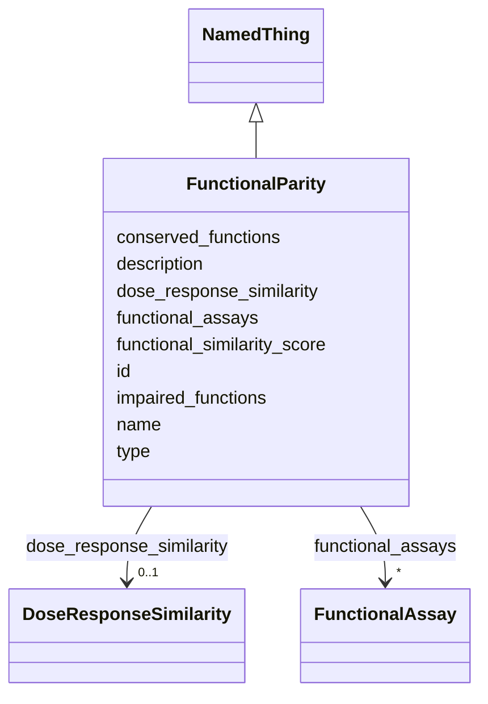

# Class: FunctionalParity 


_Evaluation of functional capabilities and physiological responses between systems._


URI: [namo:FunctionalParity](https://w3id.org/monarch-initiative/namo/FunctionalParity)





## Inheritance
* [NamedThing](NamedThing.md)
    * **FunctionalParity**


## Slots

| Name | Cardinality and Range | Description | Inheritance |
| ---  | --- | --- | --- |
| [functional_similarity_score](functional_similarity_score.md) | 0..1 <br/> [Float](Float.md) | Quantitative score (0 | direct |
| [conserved_functions](conserved_functions.md) | * <br/> [String](String.md) | List of biological functions conserved between model and biological system | direct |
| [impaired_functions](impaired_functions.md) | * <br/> [String](String.md) | List of functions that are impaired or absent in the model system | direct |
| [functional_assays](functional_assays.md) | * <br/> [FunctionalAssay](FunctionalAssay.md) | List of functional assays used to assess parity | direct |
| [dose_response_similarity](dose_response_similarity.md) | 0..1 <br/> [DoseResponseSimilarity](DoseResponseSimilarity.md) | Comparison of dose-response relationships for therapeutic compounds | direct |
| [id](id.md) | 1 <br/> [Uriorcurie](Uriorcurie.md) | A unique identifier for a thing | [NamedThing](NamedThing.md) |
| [name](name.md) | 0..1 <br/> [String](String.md) | A human-readable name for a thing | [NamedThing](NamedThing.md) |
| [description](description.md) | 0..1 <br/> [String](String.md) | A human-readable description for a thing | [NamedThing](NamedThing.md) |
| [type](type.md) | 0..1 <br/> [String](String.md) |  | [NamedThing](NamedThing.md) |


## Usages

| used by | used in | type | used |
| ---  | --- | --- | --- |
| [StructuredConcordanceResult](StructuredConcordanceResult.md) | [functional_parity](functional_parity.md) | range | [FunctionalParity](FunctionalParity.md) |


## Identifier and Mapping Information


### Schema Source


* from schema: https://w3id.org/monarch-initiative/namo


## Mappings

| Mapping Type | Mapped Value |
| ---  | ---  |
| self | namo:FunctionalParity |
| native | namo:FunctionalParity |


## LinkML Source

<!-- TODO: investigate https://stackoverflow.com/questions/37606292/how-to-create-tabbed-code-blocks-in-mkdocs-or-sphinx -->

### Direct

<details>
```yaml
name: FunctionalParity
description: Evaluation of functional capabilities and physiological responses between
  systems.
from_schema: https://w3id.org/monarch-initiative/namo
is_a: NamedThing
attributes:
  functional_similarity_score:
    name: functional_similarity_score
    description: Quantitative score (0.0-1.0) representing functional similarity.
    from_schema: https://w3id.org/monarch-initiative/namo
    rank: 1000
    domain_of:
    - FunctionalParity
    range: float
  conserved_functions:
    name: conserved_functions
    description: List of biological functions conserved between model and biological
      system.
    from_schema: https://w3id.org/monarch-initiative/namo
    rank: 1000
    domain_of:
    - FunctionalParity
    multivalued: true
  impaired_functions:
    name: impaired_functions
    description: List of functions that are impaired or absent in the model system.
    from_schema: https://w3id.org/monarch-initiative/namo
    rank: 1000
    domain_of:
    - FunctionalParity
    multivalued: true
  functional_assays:
    name: functional_assays
    description: List of functional assays used to assess parity.
    from_schema: https://w3id.org/monarch-initiative/namo
    rank: 1000
    domain_of:
    - FunctionalParity
    range: FunctionalAssay
    multivalued: true
    inlined: true
    inlined_as_list: true
  dose_response_similarity:
    name: dose_response_similarity
    description: Comparison of dose-response relationships for therapeutic compounds.
    from_schema: https://w3id.org/monarch-initiative/namo
    rank: 1000
    domain_of:
    - FunctionalParity
    range: DoseResponseSimilarity
    inlined: true

```
</details>

### Induced

<details>
```yaml
name: FunctionalParity
description: Evaluation of functional capabilities and physiological responses between
  systems.
from_schema: https://w3id.org/monarch-initiative/namo
is_a: NamedThing
attributes:
  functional_similarity_score:
    name: functional_similarity_score
    description: Quantitative score (0.0-1.0) representing functional similarity.
    from_schema: https://w3id.org/monarch-initiative/namo
    rank: 1000
    alias: functional_similarity_score
    owner: FunctionalParity
    domain_of:
    - FunctionalParity
    range: float
  conserved_functions:
    name: conserved_functions
    description: List of biological functions conserved between model and biological
      system.
    from_schema: https://w3id.org/monarch-initiative/namo
    rank: 1000
    alias: conserved_functions
    owner: FunctionalParity
    domain_of:
    - FunctionalParity
    range: string
    multivalued: true
  impaired_functions:
    name: impaired_functions
    description: List of functions that are impaired or absent in the model system.
    from_schema: https://w3id.org/monarch-initiative/namo
    rank: 1000
    alias: impaired_functions
    owner: FunctionalParity
    domain_of:
    - FunctionalParity
    range: string
    multivalued: true
  functional_assays:
    name: functional_assays
    description: List of functional assays used to assess parity.
    from_schema: https://w3id.org/monarch-initiative/namo
    rank: 1000
    alias: functional_assays
    owner: FunctionalParity
    domain_of:
    - FunctionalParity
    range: FunctionalAssay
    multivalued: true
    inlined: true
    inlined_as_list: true
  dose_response_similarity:
    name: dose_response_similarity
    description: Comparison of dose-response relationships for therapeutic compounds.
    from_schema: https://w3id.org/monarch-initiative/namo
    rank: 1000
    alias: dose_response_similarity
    owner: FunctionalParity
    domain_of:
    - FunctionalParity
    range: DoseResponseSimilarity
    inlined: true
  id:
    name: id
    description: A unique identifier for a thing
    from_schema: https://w3id.org/monarch-initiative/namo
    rank: 1000
    slot_uri: schema:identifier
    identifier: true
    alias: id
    owner: FunctionalParity
    domain_of:
    - NamedThing
    - Reference
    range: uriorcurie
    required: true
  name:
    name: name
    description: A human-readable name for a thing
    from_schema: https://w3id.org/monarch-initiative/namo
    rank: 1000
    slot_uri: schema:name
    alias: name
    owner: FunctionalParity
    domain_of:
    - NamedThing
    range: string
  description:
    name: description
    description: A human-readable description for a thing
    from_schema: https://w3id.org/monarch-initiative/namo
    rank: 1000
    slot_uri: schema:description
    alias: description
    owner: FunctionalParity
    domain_of:
    - NamedThing
    range: string
  type:
    name: type
    from_schema: https://w3id.org/monarch-initiative/namo
    rank: 1000
    designates_type: true
    alias: type
    owner: FunctionalParity
    domain_of:
    - NamedThing
    range: string

```
</details>