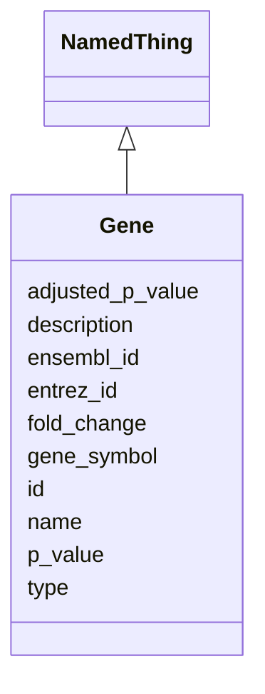

# Class: Gene 


_A gene entity with identifiers and expression information._


URI: [namo:Gene](https://w3id.org/monarch-initiative/namo/Gene)





## Inheritance
* [NamedThing](NamedThing.md)
    * **Gene**


## Slots

| Name | Cardinality and Range | Description | Inheritance |
| ---  | --- | --- | --- |
| [gene_symbol](gene_symbol.md) | 0..1 <br/> [String](String.md) | Standard gene symbol (e | direct |
| [ensembl_id](ensembl_id.md) | 0..1 <br/> [String](String.md) | Ensembl gene identifier | direct |
| [entrez_id](entrez_id.md) | 0..1 <br/> [Integer](Integer.md) | NCBI Entrez gene identifier | direct |
| [fold_change](fold_change.md) | 0..1 <br/> [Float](Float.md) | Fold change in expression compared to control or reference | direct |
| [p_value](p_value.md) | 0..1 <br/> [Float](Float.md) | Statistical p-value for differential expression | direct |
| [adjusted_p_value](adjusted_p_value.md) | 0..1 <br/> [Float](Float.md) | Multiple testing corrected p-value | direct |
| [id](id.md) | 1 <br/> [Uriorcurie](Uriorcurie.md) | A unique identifier for a thing | [NamedThing](NamedThing.md) |
| [name](name.md) | 0..1 <br/> [String](String.md) | A human-readable name for a thing | [NamedThing](NamedThing.md) |
| [description](description.md) | 0..1 <br/> [String](String.md) | A human-readable description for a thing | [NamedThing](NamedThing.md) |
| [type](type.md) | 0..1 <br/> [String](String.md) |  | [NamedThing](NamedThing.md) |


## Usages

| used by | used in | type | used |
| ---  | --- | --- | --- |
| [MolecularSimilarity](MolecularSimilarity.md) | [differentially_expressed_genes](differentially_expressed_genes.md) | range | [Gene](Gene.md) |
| [MolecularSimilarity](MolecularSimilarity.md) | [conserved_genes](conserved_genes.md) | range | [Gene](Gene.md) |


## Identifier and Mapping Information


### Schema Source


* from schema: https://w3id.org/monarch-initiative/namo


## Mappings

| Mapping Type | Mapped Value |
| ---  | ---  |
| self | namo:Gene |
| native | namo:Gene |


## LinkML Source

<!-- TODO: investigate https://stackoverflow.com/questions/37606292/how-to-create-tabbed-code-blocks-in-mkdocs-or-sphinx -->

### Direct

<details>
```yaml
name: Gene
description: A gene entity with identifiers and expression information.
from_schema: https://w3id.org/monarch-initiative/namo
is_a: NamedThing
attributes:
  gene_symbol:
    name: gene_symbol
    description: Standard gene symbol (e.g., HGNC symbol for human genes).
    from_schema: https://w3id.org/monarch-initiative/namo
    rank: 1000
    domain_of:
    - Gene
  ensembl_id:
    name: ensembl_id
    description: Ensembl gene identifier.
    from_schema: https://w3id.org/monarch-initiative/namo
    rank: 1000
    domain_of:
    - Gene
  entrez_id:
    name: entrez_id
    description: NCBI Entrez gene identifier.
    from_schema: https://w3id.org/monarch-initiative/namo
    rank: 1000
    domain_of:
    - Gene
    range: integer
  fold_change:
    name: fold_change
    description: Fold change in expression compared to control or reference.
    from_schema: https://w3id.org/monarch-initiative/namo
    rank: 1000
    domain_of:
    - Gene
    range: float
  p_value:
    name: p_value
    description: Statistical p-value for differential expression.
    from_schema: https://w3id.org/monarch-initiative/namo
    rank: 1000
    domain_of:
    - Gene
    - StatisticalSignificance
    - EnrichmentStatistics
    range: float
  adjusted_p_value:
    name: adjusted_p_value
    description: Multiple testing corrected p-value.
    from_schema: https://w3id.org/monarch-initiative/namo
    rank: 1000
    domain_of:
    - Gene
    - StatisticalSignificance
    range: float

```
</details>

### Induced

<details>
```yaml
name: Gene
description: A gene entity with identifiers and expression information.
from_schema: https://w3id.org/monarch-initiative/namo
is_a: NamedThing
attributes:
  gene_symbol:
    name: gene_symbol
    description: Standard gene symbol (e.g., HGNC symbol for human genes).
    from_schema: https://w3id.org/monarch-initiative/namo
    rank: 1000
    alias: gene_symbol
    owner: Gene
    domain_of:
    - Gene
    range: string
  ensembl_id:
    name: ensembl_id
    description: Ensembl gene identifier.
    from_schema: https://w3id.org/monarch-initiative/namo
    rank: 1000
    alias: ensembl_id
    owner: Gene
    domain_of:
    - Gene
    range: string
  entrez_id:
    name: entrez_id
    description: NCBI Entrez gene identifier.
    from_schema: https://w3id.org/monarch-initiative/namo
    rank: 1000
    alias: entrez_id
    owner: Gene
    domain_of:
    - Gene
    range: integer
  fold_change:
    name: fold_change
    description: Fold change in expression compared to control or reference.
    from_schema: https://w3id.org/monarch-initiative/namo
    rank: 1000
    alias: fold_change
    owner: Gene
    domain_of:
    - Gene
    range: float
  p_value:
    name: p_value
    description: Statistical p-value for differential expression.
    from_schema: https://w3id.org/monarch-initiative/namo
    rank: 1000
    alias: p_value
    owner: Gene
    domain_of:
    - Gene
    - StatisticalSignificance
    - EnrichmentStatistics
    range: float
  adjusted_p_value:
    name: adjusted_p_value
    description: Multiple testing corrected p-value.
    from_schema: https://w3id.org/monarch-initiative/namo
    rank: 1000
    alias: adjusted_p_value
    owner: Gene
    domain_of:
    - Gene
    - StatisticalSignificance
    range: float
  id:
    name: id
    description: A unique identifier for a thing
    from_schema: https://w3id.org/monarch-initiative/namo
    rank: 1000
    slot_uri: schema:identifier
    identifier: true
    alias: id
    owner: Gene
    domain_of:
    - NamedThing
    - Reference
    range: uriorcurie
    required: true
  name:
    name: name
    description: A human-readable name for a thing
    from_schema: https://w3id.org/monarch-initiative/namo
    rank: 1000
    slot_uri: schema:name
    alias: name
    owner: Gene
    domain_of:
    - NamedThing
    range: string
  description:
    name: description
    description: A human-readable description for a thing
    from_schema: https://w3id.org/monarch-initiative/namo
    rank: 1000
    slot_uri: schema:description
    alias: description
    owner: Gene
    domain_of:
    - NamedThing
    range: string
  type:
    name: type
    from_schema: https://w3id.org/monarch-initiative/namo
    rank: 1000
    designates_type: true
    alias: type
    owner: Gene
    domain_of:
    - NamedThing
    range: string

```
</details>