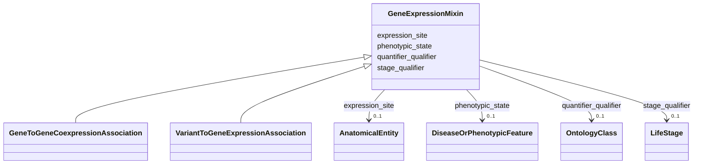

---
search:
  boost: 10.0
---

# Class: GeneExpressionMixin 


_Observed gene expression intensity, context (site, stage) and associated phenotypic status within which the expression occurs._


<div data-search-exclude markdown="1">


URI: [namo:GeneExpressionMixin](https://w3id.org/monarch-initiative/namo/GeneExpressionMixin)





<!-- no inheritance hierarchy -->

## Class Properties

| Property | Value |
| --- | --- |
| Mixin | Yes |


## Slots

| Name | Cardinality and Range | Description | Inheritance |
| ---  | --- | --- | --- |
| [quantifier_qualifier](quantifier_qualifier.md) | 0..1 <br/> [OntologyClass](OntologyClass.md) | Optional quantitative value indicating degree of expression | direct |
| [expression_site](expression_site.md) | 0..1 <br/> [AnatomicalEntity](AnatomicalEntity.md) | location in which gene or protein expression takes place | direct |
| [stage_qualifier](stage_qualifier.md) | 0..1 <br/> [LifeStage](LifeStage.md) | stage during which gene or protein expression of takes place | direct |
| [phenotypic_state](phenotypic_state.md) | 0..1 <br/> [DiseaseOrPhenotypicFeature](DiseaseOrPhenotypicFeature.md) | in experiments (e | direct |


## Mixin Usage

| mixed into | description |
| --- | --- |
| [GeneToGeneCoexpressionAssociation](GeneToGeneCoexpressionAssociation.md) | Indicates that two genes are co-expressed, generally under the same condition... |
| [VariantToGeneExpressionAssociation](VariantToGeneExpressionAssociation.md) | An association between a variant and expression of a gene (i |


## Identifier and Mapping Information


### Schema Source


* from schema: https://w3id.org/monarch-initiative/namo


## Mappings

| Mapping Type | Mapped Value |
| ---  | ---  |
| self | namo:GeneExpressionMixin |
| native | namo:GeneExpressionMixin |


## LinkML Source

<!-- TODO: investigate https://stackoverflow.com/questions/37606292/how-to-create-tabbed-code-blocks-in-mkdocs-or-sphinx -->

### Direct

<details>
```yaml
name: gene expression mixin
description: Observed gene expression intensity, context (site, stage) and associated
  phenotypic status within which the expression occurs.
from_schema: https://w3id.org/monarch-initiative/namo
mixin: true
slots:
- quantifier qualifier
- expression site
- stage qualifier
- phenotypic state
slot_usage:
  quantifier qualifier:
    name: quantifier qualifier
    description: Optional quantitative value indicating degree of expression.

```
</details>

### Induced

<details>
```yaml
name: gene expression mixin
description: Observed gene expression intensity, context (site, stage) and associated
  phenotypic status within which the expression occurs.
from_schema: https://w3id.org/monarch-initiative/namo
mixin: true
slot_usage:
  quantifier qualifier:
    name: quantifier qualifier
    description: Optional quantitative value indicating degree of expression.
attributes:
  quantifier qualifier:
    name: quantifier qualifier
    description: Optional quantitative value indicating degree of expression.
    from_schema: https://w3id.org/monarch-initiative/namo
    narrow_mappings:
    - LOINC:analyzes
    - LOINC:measured_by
    - LOINC:property_of
    - SEMMEDDB:MEASURES
    - UMLS:measures
    rank: 1000
    is_a: association slot
    domain: association
    alias: quantifier_qualifier
    owner: gene expression mixin
    domain_of:
    - gene expression mixin
    - gene to expression site association
    range: ontology class
  expression site:
    name: expression site
    description: location in which gene or protein expression takes place. May be
      cell, tissue, or organ.
    examples:
    - value: UBERON:0002037
      description: cerebellum
    from_schema: https://w3id.org/monarch-initiative/namo
    rank: 1000
    is_a: association slot
    domain: association
    alias: expression_site
    owner: gene expression mixin
    domain_of:
    - gene expression mixin
    range: anatomical entity
  stage qualifier:
    name: stage qualifier
    description: stage during which gene or protein expression of takes place.
    examples:
    - value: UBERON:0000069
      description: larval stage
    in_subset:
    - translator_minimal
    from_schema: https://w3id.org/monarch-initiative/namo
    rank: 1000
    is_a: statement qualifier
    domain: association
    alias: stage_qualifier
    owner: gene expression mixin
    domain_of:
    - gene expression mixin
    - gene to expression site association
    range: life stage
  phenotypic state:
    name: phenotypic state
    description: in experiments (e.g. gene expression) assaying diseased or unhealthy
      tissue, the phenotypic state can be put here, e.g. MONDO ID. For healthy tissues,
      use XXX.
    from_schema: https://w3id.org/monarch-initiative/namo
    rank: 1000
    is_a: association slot
    domain: association
    alias: phenotypic_state
    owner: gene expression mixin
    domain_of:
    - gene expression mixin
    range: disease or phenotypic feature

```
</details></div>