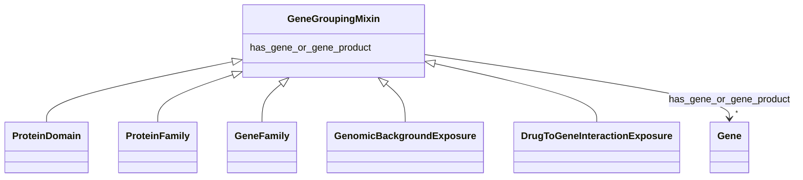

---
search:
  boost: 10.0
---

# Class: GeneGroupingMixin 


_any grouping of multiple genes or gene products_


<div data-search-exclude markdown="1">


URI: [namo:GeneGroupingMixin](https://w3id.org/monarch-initiative/namo/GeneGroupingMixin)





<!-- no inheritance hierarchy -->

## Class Properties

| Property | Value |
| --- | --- |
| Mixin | Yes |


## Slots

| Name | Cardinality and Range | Description | Inheritance |
| ---  | --- | --- | --- |
| [has_gene_or_gene_product](has_gene_or_gene_product.md) | * <br/> [Gene](Gene.md) | connects an entity with one or more gene or gene products | direct |


## Mixin Usage

| mixed into | description |
| --- | --- |
| [ProteinDomain](ProteinDomain.md) | A conserved part of protein sequence and (tertiary) structure that can evolve... |
| [ProteinFamily](ProteinFamily.md) | A set of proteins coding for diverse functions which, by virtue of their high... |
| [GeneFamily](GeneFamily.md) | any grouping of multiple genes or gene products related by common descent |
| [GenomicBackgroundExposure](GenomicBackgroundExposure.md) | A genomic background exposure is where an individual's specific genomic backg... |
| [DrugToGeneInteractionExposure](DrugToGeneInteractionExposure.md) | drug to gene interaction exposure is a drug exposure is where the interaction... |


## Identifier and Mapping Information


### Schema Source


* from schema: https://w3id.org/monarch-initiative/namo


## Mappings

| Mapping Type | Mapped Value |
| ---  | ---  |
| self | namo:GeneGroupingMixin |
| native | namo:GeneGroupingMixin |


## LinkML Source

<!-- TODO: investigate https://stackoverflow.com/questions/37606292/how-to-create-tabbed-code-blocks-in-mkdocs-or-sphinx -->

### Direct

<details>
```yaml
name: gene grouping mixin
description: any grouping of multiple genes or gene products
from_schema: https://w3id.org/monarch-initiative/namo
mixin: true
slots:
- has gene or gene product

```
</details>

### Induced

<details>
```yaml
name: gene grouping mixin
description: any grouping of multiple genes or gene products
from_schema: https://w3id.org/monarch-initiative/namo
mixin: true
attributes:
  has gene or gene product:
    name: has gene or gene product
    description: connects an entity with one or more gene or gene products
    from_schema: https://w3id.org/monarch-initiative/namo
    rank: 1000
    is_a: node property
    domain: named thing
    alias: has_gene_or_gene_product
    owner: gene grouping mixin
    domain_of:
    - gene grouping mixin
    range: gene
    multivalued: true

```
</details></div>