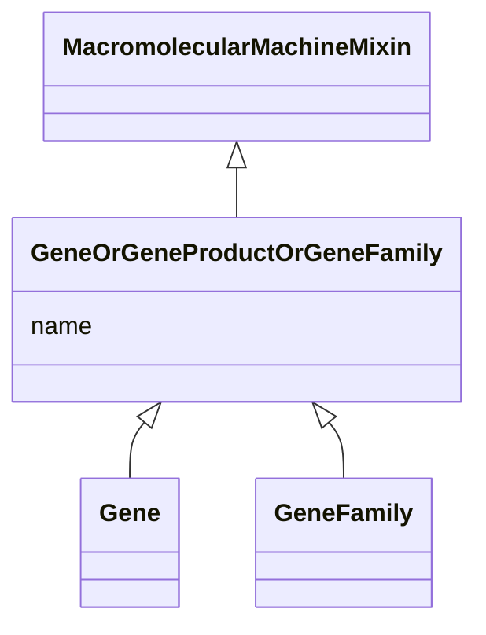

---
search:
  boost: 10.0
---

# Class: GeneOrGeneProductOrGeneFamily 


_A union of gene family or gene loci or gene products, useful to define the association between a gene or gene product or gene family and some other general class of entity._


<div data-search-exclude markdown="1">


URI: [namo:GeneOrGeneProductOrGeneFamily](https://w3id.org/monarch-initiative/namo/GeneOrGeneProductOrGeneFamily)





## Inheritance
* [MacromolecularMachineMixin](MacromolecularMachineMixin.md)
    * **GeneOrGeneProductOrGeneFamily**


## Class Properties

| Property | Value |
| --- | --- |
| Mixin | Yes |


## Slots

| Name | Cardinality and Range | Description | Inheritance |
| ---  | --- | --- | --- |
| [name](name.md) | 0..1 <br/> [SymbolType](SymbolType.md) | genes are typically designated by a short symbol and a full name | [MacromolecularMachineMixin](MacromolecularMachineMixin.md) |


## Mixin Usage

| mixed into | description |
| --- | --- |
| [Gene](Gene.md) | A region (or regions) that includes all of the sequence elements necessary to... |
| [GeneFamily](GeneFamily.md) | any grouping of multiple genes or gene products related by common descent |


## Usages

| used by | used in | type | used |
| ---  | --- | --- | --- |
| [GeneOrGeneProductOrGeneFamilyToBiologicalProcessOrActivityAssociation](GeneOrGeneProductOrGeneFamilyToBiologicalProcessOrActivityAssociation.md) | [subject](subject.md) | range | [GeneOrGeneProductOrGeneFamily](GeneOrGeneProductOrGeneFamily.md) |
| [BiologicalProcessOrActivityToGeneOrGeneProductOrGeneFamilyAssociation](BiologicalProcessOrActivityToGeneOrGeneProductOrGeneFamilyAssociation.md) | [object](object.md) | range | [GeneOrGeneProductOrGeneFamily](GeneOrGeneProductOrGeneFamily.md) |
| [GeneOrGeneProductOrGeneFamilyToAnatomicalEntityAssociation](GeneOrGeneProductOrGeneFamilyToAnatomicalEntityAssociation.md) | [subject](subject.md) | range | [GeneOrGeneProductOrGeneFamily](GeneOrGeneProductOrGeneFamily.md) |


## Identifier and Mapping Information


### Schema Source


* from schema: https://w3id.org/monarch-initiative/namo


## Mappings

| Mapping Type | Mapped Value |
| ---  | ---  |
| self | namo:GeneOrGeneProductOrGeneFamily |
| native | namo:GeneOrGeneProductOrGeneFamily |


## LinkML Source

<!-- TODO: investigate https://stackoverflow.com/questions/37606292/how-to-create-tabbed-code-blocks-in-mkdocs-or-sphinx -->

### Direct

<details>
```yaml
name: gene or gene product or gene family
description: A union of gene family or gene loci or gene products, useful to define
  the association between a gene or gene product or gene family and some other general
  class of entity.
from_schema: https://w3id.org/monarch-initiative/namo
is_a: macromolecular machine mixin
mixin: true

```
</details>

### Induced

<details>
```yaml
name: gene or gene product or gene family
description: A union of gene family or gene loci or gene products, useful to define
  the association between a gene or gene product or gene family and some other general
  class of entity.
from_schema: https://w3id.org/monarch-initiative/namo
is_a: macromolecular machine mixin
mixin: true
attributes:
  name:
    name: name
    description: genes are typically designated by a short symbol and a full name.
      We map the symbol to the default display name and use an additional slot for
      full name
    in_subset:
    - translator_minimal
    - samples
    from_schema: https://w3id.org/monarch-initiative/namo
    aliases:
    - label
    - display name
    - title
    exact_mappings:
    - gff3:Name
    - gpi:DB_Object_Name
    narrow_mappings:
    - dct:title
    - WIKIDATA_PROPERTY:P1476
    rank: 1000
    domain: entity
    slot_uri: rdfs:label
    owner: gene or gene product or gene family
    domain_of:
    - attribute
    - entity
    - macromolecular machine mixin
    range: symbol type

```
</details></div>