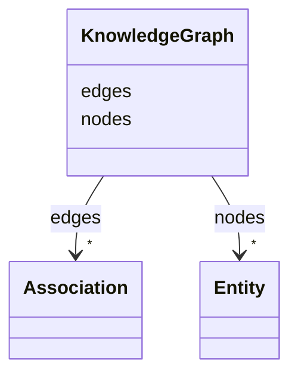

---
search:
  boost: 10.0
---

# Class: KnowledgeGraph 


_A knowledge graph is a structured representation of knowledge in the form of a graph, where nodes represent entities or concepts, and edges represent relationships between them. Knowledge graphs are used to organize and connect information from various sources, enabling better understanding, analysis, and reasoning about complex domains._


<div data-search-exclude markdown="1">


* __NOTE__: this is an abstract class and should not be instantiated directly


URI: [namo:KnowledgeGraph](https://w3id.org/monarch-initiative/namo/KnowledgeGraph)





<!-- no inheritance hierarchy -->

## Class Properties

| Property | Value |
| --- | --- |
| Tree Root | Yes |


## Slots

| Name | Cardinality and Range | Description | Inheritance |
| ---  | --- | --- | --- |
| [nodes](nodes.md) | * <br/> [Entity](Entity.md) | A list of entities that can be a subject or object of an association | direct |
| [edges](edges.md) | * <br/> [Association](Association.md) | A list of associations between two entities | direct |


## Identifier and Mapping Information


### Schema Source


* from schema: https://w3id.org/monarch-initiative/namo


## Mappings

| Mapping Type | Mapped Value |
| ---  | ---  |
| self | namo:KnowledgeGraph |
| native | namo:KnowledgeGraph |


## LinkML Source

<!-- TODO: investigate https://stackoverflow.com/questions/37606292/how-to-create-tabbed-code-blocks-in-mkdocs-or-sphinx -->

### Direct

<details>
```yaml
name: knowledge graph
description: A knowledge graph is a structured representation of knowledge in the
  form of a graph, where nodes represent entities or concepts, and edges represent
  relationships between them. Knowledge graphs are used to organize and connect information
  from various sources, enabling better understanding, analysis, and reasoning about
  complex domains.
from_schema: https://w3id.org/monarch-initiative/namo
abstract: true
slots:
- nodes
- edges
tree_root: true

```
</details>

### Induced

<details>
```yaml
name: knowledge graph
description: A knowledge graph is a structured representation of knowledge in the
  form of a graph, where nodes represent entities or concepts, and edges represent
  relationships between them. Knowledge graphs are used to organize and connect information
  from various sources, enabling better understanding, analysis, and reasoning about
  complex domains.
from_schema: https://w3id.org/monarch-initiative/namo
abstract: true
attributes:
  nodes:
    name: nodes
    description: A list of entities that can be a subject or object of an association
    from_schema: https://w3id.org/monarch-initiative/namo
    rank: 1000
    owner: knowledge graph
    domain_of:
    - KnowledgeGraph
    - knowledge graph
    range: entity
    multivalued: true
    inlined: true
    inlined_as_list: true
  edges:
    name: edges
    description: A list of associations between two entities.
    from_schema: https://w3id.org/monarch-initiative/namo
    rank: 1000
    owner: knowledge graph
    domain_of:
    - KnowledgeGraph
    - knowledge graph
    range: association
    multivalued: true
    inlined: true
    inlined_as_list: true
tree_root: true

```
</details></div>