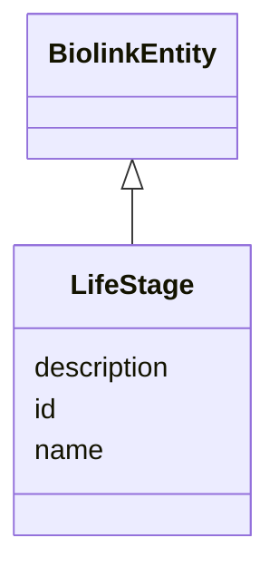

---
search:
  boost: 10.0
---

# Class: LifeStage 


_A stage of development or growth of an organism, including post-natal adult stages._


<div data-search-exclude markdown="1">


URI: [biolink:LifeStage](https://w3id.org/biolink/LifeStage)





## Inheritance
* [BiolinkEntity](BiolinkEntity.md)
    * **LifeStage**


## Class Properties

| Property | Value |
| --- | --- |
| Class URI | [biolink:LifeStage](https://w3id.org/biolink/LifeStage) |


## Slots

| Name | Cardinality and Range | Description | Inheritance |
| ---  | --- | --- | --- |
| [id](id.md) | 1 <br/> [Uriorcurie](Uriorcurie.md) | A unique identifier for a thing | [BiolinkEntity](BiolinkEntity.md) |
| [name](name.md) | 0..1 <br/> [String](String.md) | A human-readable name for a thing | [BiolinkEntity](BiolinkEntity.md) |
| [description](description.md) | 0..1 <br/> [String](String.md) | A human-readable description for a thing | [BiolinkEntity](BiolinkEntity.md) |


## Usages

| used by | used in | type | used |
| ---  | --- | --- | --- |
| [AnimalModel](AnimalModel.md) | [life_stage](life_stage.md) | range | [LifeStage](LifeStage.md) |


## Identifier and Mapping Information

### Valid ID Prefixes

Instances of this class *should* have identifiers with one of the following prefixes:

* HsapDv

* MmusDv

* UBERON


### Schema Source


* from schema: https://w3id.org/monarch-initiative/namo


## Mappings

| Mapping Type | Mapped Value |
| ---  | ---  |
| self | biolink:LifeStage |
| native | namo:LifeStage |


## LinkML Source

<!-- TODO: investigate https://stackoverflow.com/questions/37606292/how-to-create-tabbed-code-blocks-in-mkdocs-or-sphinx -->

### Direct

<details>
```yaml
name: LifeStage
id_prefixes:
- HsapDv
- MmusDv
- UBERON
description: A stage of development or growth of an organism, including post-natal
  adult stages.
from_schema: https://w3id.org/monarch-initiative/namo
is_a: BiolinkEntity
class_uri: biolink:LifeStage

```
</details>

### Induced

<details>
```yaml
name: LifeStage
id_prefixes:
- HsapDv
- MmusDv
- UBERON
description: A stage of development or growth of an organism, including post-natal
  adult stages.
from_schema: https://w3id.org/monarch-initiative/namo
is_a: BiolinkEntity
attributes:
  id:
    name: id
    description: A unique identifier for a thing
    from_schema: https://w3id.org/monarch-initiative/namo
    rank: 1000
    slot_uri: schema:identifier
    identifier: true
    owner: LifeStage
    domain_of:
    - NamedThing
    - Reference
    - BiolinkEntity
    range: uriorcurie
    required: true
  name:
    name: name
    description: A human-readable name for a thing
    from_schema: https://w3id.org/monarch-initiative/namo
    rank: 1000
    slot_uri: schema:name
    owner: LifeStage
    domain_of:
    - NamedThing
    - BiolinkEntity
    range: string
  description:
    name: description
    description: A human-readable description for a thing
    from_schema: https://w3id.org/monarch-initiative/namo
    rank: 1000
    slot_uri: schema:description
    owner: LifeStage
    domain_of:
    - NamedThing
    - BiolinkEntity
    range: string
class_uri: biolink:LifeStage

```
</details></div>