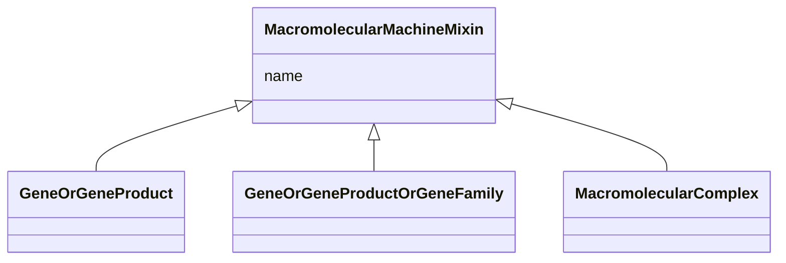

---
search:
  boost: 10.0
---

# Class: MacromolecularMachineMixin 


_A union of gene locus, gene product, and macromolecular complex. These are the basic units of function in a cell. They either carry out individual biological activities, or they encode molecules which do this._


<div data-search-exclude markdown="1">


URI: [namo:MacromolecularMachineMixin](https://w3id.org/monarch-initiative/namo/MacromolecularMachineMixin)





## Inheritance
* **MacromolecularMachineMixin**
    * [GeneOrGeneProduct](GeneOrGeneProduct.md)
    * [GeneOrGeneProductOrGeneFamily](GeneOrGeneProductOrGeneFamily.md)


## Class Properties

| Property | Value |
| --- | --- |
| Mixin | Yes |


## Slots

| Name | Cardinality and Range | Description | Inheritance |
| ---  | --- | --- | --- |
| [name](name.md) | 0..1 <br/> [SymbolType](SymbolType.md) | genes are typically designated by a short symbol and a full name | direct |


## Mixin Usage

| mixed into | description |
| --- | --- |
| [MacromolecularComplex](MacromolecularComplex.md) | A stable assembly of two or more macromolecules, i |


## Usages

| used by | used in | type | used |
| ---  | --- | --- | --- |
| [MolecularActivity](MolecularActivity.md) | [enabled_by](enabled_by.md) | range | [MacromolecularMachineMixin](MacromolecularMachineMixin.md) |
| [ChemicalEntityToChemicalDerivationAssociation](ChemicalEntityToChemicalDerivationAssociation.md) | [catalyst_qualifier](catalyst_qualifier.md) | range | [MacromolecularMachineMixin](MacromolecularMachineMixin.md) |
| [MacromolecularMachineHasSubstrateAssociation](MacromolecularMachineHasSubstrateAssociation.md) | [subject](subject.md) | range | [MacromolecularMachineMixin](MacromolecularMachineMixin.md) |
| [FunctionalAssociation](FunctionalAssociation.md) | [subject](subject.md) | range | [MacromolecularMachineMixin](MacromolecularMachineMixin.md) |
| [MacromolecularMachineToEntityAssociationMixin](MacromolecularMachineToEntityAssociationMixin.md) | [subject](subject.md) | domain | [MacromolecularMachineMixin](MacromolecularMachineMixin.md) |
| [MacromolecularMachineToMolecularActivityAssociation](MacromolecularMachineToMolecularActivityAssociation.md) | [subject](subject.md) | domain | [MacromolecularMachineMixin](MacromolecularMachineMixin.md) |
| [MacromolecularMachineToMolecularActivityAssociation](MacromolecularMachineToMolecularActivityAssociation.md) | [subject](subject.md) | range | [MacromolecularMachineMixin](MacromolecularMachineMixin.md) |
| [MacromolecularMachineToBiologicalProcessAssociation](MacromolecularMachineToBiologicalProcessAssociation.md) | [subject](subject.md) | domain | [MacromolecularMachineMixin](MacromolecularMachineMixin.md) |
| [MacromolecularMachineToBiologicalProcessAssociation](MacromolecularMachineToBiologicalProcessAssociation.md) | [subject](subject.md) | range | [MacromolecularMachineMixin](MacromolecularMachineMixin.md) |
| [MacromolecularMachineToCellularComponentAssociation](MacromolecularMachineToCellularComponentAssociation.md) | [subject](subject.md) | domain | [MacromolecularMachineMixin](MacromolecularMachineMixin.md) |
| [MacromolecularMachineToCellularComponentAssociation](MacromolecularMachineToCellularComponentAssociation.md) | [subject](subject.md) | range | [MacromolecularMachineMixin](MacromolecularMachineMixin.md) |


## Identifier and Mapping Information


### Schema Source


* from schema: https://w3id.org/monarch-initiative/namo


## Mappings

| Mapping Type | Mapped Value |
| ---  | ---  |
| self | namo:MacromolecularMachineMixin |
| native | namo:MacromolecularMachineMixin |


## LinkML Source

<!-- TODO: investigate https://stackoverflow.com/questions/37606292/how-to-create-tabbed-code-blocks-in-mkdocs-or-sphinx -->

### Direct

<details>
```yaml
name: macromolecular machine mixin
description: A union of gene locus, gene product, and macromolecular complex. These
  are the basic units of function in a cell. They either carry out individual biological
  activities, or they encode molecules which do this.
from_schema: https://w3id.org/monarch-initiative/namo
mixin: true
slots:
- name
slot_usage:
  name:
    name: name
    description: genes are typically designated by a short symbol and a full name.
      We map the symbol to the default display name and use an additional slot for
      full name
    range: symbol type

```
</details>

### Induced

<details>
```yaml
name: macromolecular machine mixin
description: A union of gene locus, gene product, and macromolecular complex. These
  are the basic units of function in a cell. They either carry out individual biological
  activities, or they encode molecules which do this.
from_schema: https://w3id.org/monarch-initiative/namo
mixin: true
slot_usage:
  name:
    name: name
    description: genes are typically designated by a short symbol and a full name.
      We map the symbol to the default display name and use an additional slot for
      full name
    range: symbol type
attributes:
  name:
    name: name
    description: genes are typically designated by a short symbol and a full name.
      We map the symbol to the default display name and use an additional slot for
      full name
    in_subset:
    - translator_minimal
    - samples
    from_schema: https://w3id.org/monarch-initiative/namo
    aliases:
    - label
    - display name
    - title
    exact_mappings:
    - gff3:Name
    - gpi:DB_Object_Name
    narrow_mappings:
    - dct:title
    - WIKIDATA_PROPERTY:P1476
    rank: 1000
    domain: entity
    slot_uri: rdfs:label
    owner: macromolecular machine mixin
    domain_of:
    - attribute
    - entity
    - macromolecular machine mixin
    range: symbol type

```
</details></div>