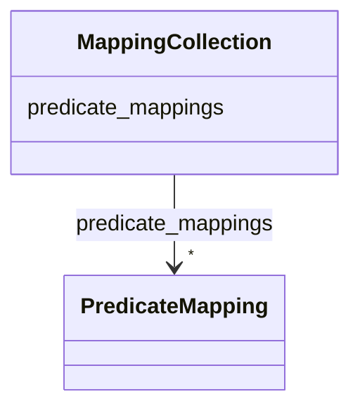

---
search:
  boost: 10.0
---

# Class: MappingCollection 


_An abstract container class that holds a set of predicate mappings. Serves as a top-level root for documents that enumerate how third-party or deprecated predicates should be rewritten to Biolink predicates and their associated qualifiers._


<div data-search-exclude markdown="1">


* __NOTE__: this is an abstract class and should not be instantiated directly


URI: [namo:MappingCollection](https://w3id.org/monarch-initiative/namo/MappingCollection)





<!-- no inheritance hierarchy -->

## Class Properties

| Property | Value |
| --- | --- |
| Tree Root | Yes |


## Slots

| Name | Cardinality and Range | Description | Inheritance |
| ---  | --- | --- | --- |
| [predicate_mappings](predicate_mappings.md) | * <br/> [PredicateMapping](PredicateMapping.md) | A collection of relationships that are not used in biolink, but have biolink ... | direct |


## Identifier and Mapping Information


### Schema Source


* from schema: https://w3id.org/monarch-initiative/namo


## Mappings

| Mapping Type | Mapped Value |
| ---  | ---  |
| self | namo:MappingCollection |
| native | namo:MappingCollection |


## LinkML Source

<!-- TODO: investigate https://stackoverflow.com/questions/37606292/how-to-create-tabbed-code-blocks-in-mkdocs-or-sphinx -->

### Direct

<details>
```yaml
name: mapping collection
description: An abstract container class that holds a set of predicate mappings. Serves
  as a top-level root for documents that enumerate how third-party or deprecated predicates
  should be rewritten to Biolink predicates and their associated qualifiers.
from_schema: https://w3id.org/monarch-initiative/namo
abstract: true
slots:
- predicate mappings
tree_root: true

```
</details>

### Induced

<details>
```yaml
name: mapping collection
description: An abstract container class that holds a set of predicate mappings. Serves
  as a top-level root for documents that enumerate how third-party or deprecated predicates
  should be rewritten to Biolink predicates and their associated qualifiers.
from_schema: https://w3id.org/monarch-initiative/namo
abstract: true
attributes:
  predicate mappings:
    name: predicate mappings
    description: A collection of relationships that are not used in biolink, but have
      biolink patterns that can be used to replace them.  This is a temporary slot
      to help with the transition to the fully qualified predicate model in Biolink3.
    from_schema: https://w3id.org/monarch-initiative/namo
    rank: 1000
    alias: predicate_mappings
    owner: mapping collection
    domain_of:
    - mapping collection
    range: predicate mapping
    multivalued: true
    inlined: true
    inlined_as_list: true
tree_root: true

```
</details></div>