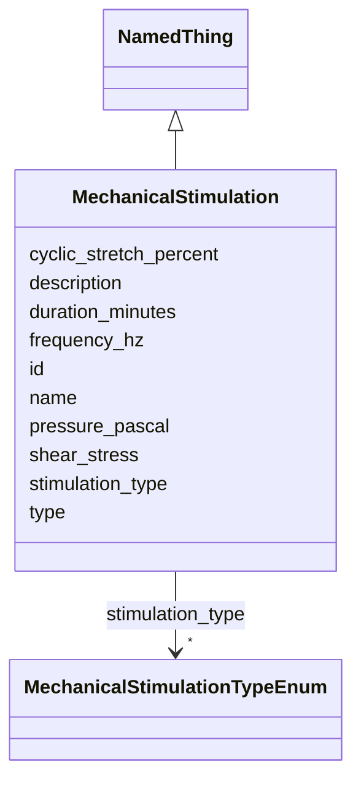

# Class: MechanicalStimulation 


_Specification of mechanical forces applied to the model system_


URI: [namo:MechanicalStimulation](https://w3id.org/monarch-initiative/namo/MechanicalStimulation)





## Inheritance
* [NamedThing](NamedThing.md)
    * **MechanicalStimulation**


## Slots

| Name | Cardinality and Range | Description | Inheritance |
| ---  | --- | --- | --- |
| [stimulation_type](stimulation_type.md) | * <br/> [MechanicalStimulationTypeEnum](MechanicalStimulationTypeEnum.md) | Type of mechanical stimulation applied | direct |
| [cyclic_stretch_percent](cyclic_stretch_percent.md) | 0..1 <br/> [Float](Float.md) | Percentage of cyclic stretch applied (if applicable) | direct |
| [frequency_hz](frequency_hz.md) | 0..1 <br/> [Float](Float.md) | Frequency of mechanical stimulation in Hertz | direct |
| [shear_stress](shear_stress.md) | 0..1 <br/> [Float](Float.md) | Shear stress applied in dyn/cm² | direct |
| [pressure_pascal](pressure_pascal.md) | 0..1 <br/> [Float](Float.md) | Pressure applied in Pascals | direct |
| [duration_minutes](duration_minutes.md) | 0..1 <br/> [Float](Float.md) | Duration of mechanical stimulation in minutes | direct |
| [id](id.md) | 1 <br/> [Uriorcurie](Uriorcurie.md) | A unique identifier for a thing | [NamedThing](NamedThing.md) |
| [name](name.md) | 0..1 <br/> [String](String.md) | A human-readable name for a thing | [NamedThing](NamedThing.md) |
| [description](description.md) | 0..1 <br/> [String](String.md) | A human-readable description for a thing | [NamedThing](NamedThing.md) |
| [type](type.md) | 0..1 <br/> [String](String.md) |  | [NamedThing](NamedThing.md) |


## Usages

| used by | used in | type | used |
| ---  | --- | --- | --- |
| [MicrophysiologicalSystem](MicrophysiologicalSystem.md) | [mechanical_forces](mechanical_forces.md) | range | [MechanicalStimulation](MechanicalStimulation.md) |
| [OrganOnChip](OrganOnChip.md) | [mechanical_forces](mechanical_forces.md) | range | [MechanicalStimulation](MechanicalStimulation.md) |
| [TissueOnChip](TissueOnChip.md) | [mechanical_forces](mechanical_forces.md) | range | [MechanicalStimulation](MechanicalStimulation.md) |


## Identifier and Mapping Information


### Schema Source


* from schema: https://w3id.org/monarch-initiative/namo


## Mappings

| Mapping Type | Mapped Value |
| ---  | ---  |
| self | namo:MechanicalStimulation |
| native | namo:MechanicalStimulation |


## LinkML Source

<!-- TODO: investigate https://stackoverflow.com/questions/37606292/how-to-create-tabbed-code-blocks-in-mkdocs-or-sphinx -->

### Direct

<details>
```yaml
name: MechanicalStimulation
description: Specification of mechanical forces applied to the model system
from_schema: https://w3id.org/monarch-initiative/namo
is_a: NamedThing
attributes:
  stimulation_type:
    name: stimulation_type
    description: Type of mechanical stimulation applied
    from_schema: https://w3id.org/monarch-initiative/namo
    rank: 1000
    domain_of:
    - MechanicalStimulation
    range: MechanicalStimulationTypeEnum
    multivalued: true
  cyclic_stretch_percent:
    name: cyclic_stretch_percent
    description: Percentage of cyclic stretch applied (if applicable)
    from_schema: https://w3id.org/monarch-initiative/namo
    rank: 1000
    domain_of:
    - MechanicalStimulation
    range: float
  frequency_hz:
    name: frequency_hz
    description: Frequency of mechanical stimulation in Hertz
    from_schema: https://w3id.org/monarch-initiative/namo
    rank: 1000
    domain_of:
    - MechanicalStimulation
    range: float
  shear_stress:
    name: shear_stress
    description: Shear stress applied in dyn/cm²
    from_schema: https://w3id.org/monarch-initiative/namo
    rank: 1000
    domain_of:
    - MechanicalStimulation
    range: float
  pressure_pascal:
    name: pressure_pascal
    description: Pressure applied in Pascals
    from_schema: https://w3id.org/monarch-initiative/namo
    rank: 1000
    domain_of:
    - MechanicalStimulation
    range: float
  duration_minutes:
    name: duration_minutes
    description: Duration of mechanical stimulation in minutes
    from_schema: https://w3id.org/monarch-initiative/namo
    rank: 1000
    domain_of:
    - MechanicalStimulation
    range: float

```
</details>

### Induced

<details>
```yaml
name: MechanicalStimulation
description: Specification of mechanical forces applied to the model system
from_schema: https://w3id.org/monarch-initiative/namo
is_a: NamedThing
attributes:
  stimulation_type:
    name: stimulation_type
    description: Type of mechanical stimulation applied
    from_schema: https://w3id.org/monarch-initiative/namo
    rank: 1000
    alias: stimulation_type
    owner: MechanicalStimulation
    domain_of:
    - MechanicalStimulation
    range: MechanicalStimulationTypeEnum
    multivalued: true
  cyclic_stretch_percent:
    name: cyclic_stretch_percent
    description: Percentage of cyclic stretch applied (if applicable)
    from_schema: https://w3id.org/monarch-initiative/namo
    rank: 1000
    alias: cyclic_stretch_percent
    owner: MechanicalStimulation
    domain_of:
    - MechanicalStimulation
    range: float
  frequency_hz:
    name: frequency_hz
    description: Frequency of mechanical stimulation in Hertz
    from_schema: https://w3id.org/monarch-initiative/namo
    rank: 1000
    alias: frequency_hz
    owner: MechanicalStimulation
    domain_of:
    - MechanicalStimulation
    range: float
  shear_stress:
    name: shear_stress
    description: Shear stress applied in dyn/cm²
    from_schema: https://w3id.org/monarch-initiative/namo
    rank: 1000
    alias: shear_stress
    owner: MechanicalStimulation
    domain_of:
    - MechanicalStimulation
    range: float
  pressure_pascal:
    name: pressure_pascal
    description: Pressure applied in Pascals
    from_schema: https://w3id.org/monarch-initiative/namo
    rank: 1000
    alias: pressure_pascal
    owner: MechanicalStimulation
    domain_of:
    - MechanicalStimulation
    range: float
  duration_minutes:
    name: duration_minutes
    description: Duration of mechanical stimulation in minutes
    from_schema: https://w3id.org/monarch-initiative/namo
    rank: 1000
    alias: duration_minutes
    owner: MechanicalStimulation
    domain_of:
    - MechanicalStimulation
    range: float
  id:
    name: id
    description: A unique identifier for a thing
    from_schema: https://w3id.org/monarch-initiative/namo
    rank: 1000
    slot_uri: schema:identifier
    identifier: true
    alias: id
    owner: MechanicalStimulation
    domain_of:
    - NamedThing
    - Reference
    range: uriorcurie
    required: true
  name:
    name: name
    description: A human-readable name for a thing
    from_schema: https://w3id.org/monarch-initiative/namo
    rank: 1000
    slot_uri: schema:name
    alias: name
    owner: MechanicalStimulation
    domain_of:
    - NamedThing
    range: string
  description:
    name: description
    description: A human-readable description for a thing
    from_schema: https://w3id.org/monarch-initiative/namo
    rank: 1000
    slot_uri: schema:description
    alias: description
    owner: MechanicalStimulation
    domain_of:
    - NamedThing
    range: string
  type:
    name: type
    from_schema: https://w3id.org/monarch-initiative/namo
    rank: 1000
    designates_type: true
    alias: type
    owner: MechanicalStimulation
    domain_of:
    - NamedThing
    range: string

```
</details>