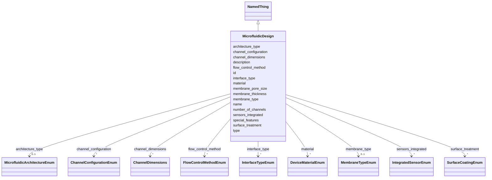

# Class: MicrofluidicDesign 


_Detailed specification of a microfluidic device design including its architecture, materials, dimensions, and functional features._


URI: [namo:MicrofluidicDesign](https://w3id.org/monarch-initiative/namo/MicrofluidicDesign)





## Inheritance
* [NamedThing](NamedThing.md)
    * **MicrofluidicDesign**


## Slots

| Name | Cardinality and Range | Description | Inheritance |
| ---  | --- | --- | --- |
| [architecture_type](architecture_type.md) | 0..1 <br/> [MicrofluidicArchitectureEnum](MicrofluidicArchitectureEnum.md) | The overall architecture type of the microfluidic device | direct |
| [number_of_channels](number_of_channels.md) | 0..1 <br/> [Integer](Integer.md) | Total number of channels in the device | direct |
| [channel_configuration](channel_configuration.md) | * <br/> [ChannelConfigurationEnum](ChannelConfigurationEnum.md) | Configuration of channels (e | direct |
| [membrane_type](membrane_type.md) | 0..1 <br/> [MembraneTypeEnum](MembraneTypeEnum.md) | Type of membrane used in the device if applicable | direct |
| [membrane_pore_size](membrane_pore_size.md) | 0..1 <br/> [Float](Float.md) | Pore size of the membrane in micrometers | direct |
| [membrane_thickness](membrane_thickness.md) | 0..1 <br/> [Float](Float.md) | Thickness of the membrane in micrometers | direct |
| [interface_type](interface_type.md) | * <br/> [InterfaceTypeEnum](InterfaceTypeEnum.md) | Type of interface(s) present in the device | direct |
| [channel_dimensions](channel_dimensions.md) | * <br/> [ChannelDimensions](ChannelDimensions.md) | Dimensions of the channels in the device | direct |
| [material](material.md) | * <br/> [DeviceMaterialEnum](DeviceMaterialEnum.md) | Materials used to construct the device | direct |
| [surface_treatment](surface_treatment.md) | * <br/> [SurfaceCoatingEnum](SurfaceCoatingEnum.md) | Surface treatments or coatings applied to the device | direct |
| [flow_control_method](flow_control_method.md) | * <br/> [FlowControlMethodEnum](FlowControlMethodEnum.md) | Methods used to control fluid flow in the device | direct |
| [sensors_integrated](sensors_integrated.md) | * <br/> [IntegratedSensorEnum](IntegratedSensorEnum.md) | Sensors integrated into the device for monitoring | direct |
| [special_features](special_features.md) | * <br/> [String](String.md) | Additional special features of the device (e | direct |
| [id](id.md) | 1 <br/> [Uriorcurie](Uriorcurie.md) | A unique identifier for a thing | [NamedThing](NamedThing.md) |
| [name](name.md) | 0..1 <br/> [String](String.md) | A human-readable name for a thing | [NamedThing](NamedThing.md) |
| [description](description.md) | 0..1 <br/> [String](String.md) | A human-readable description for a thing | [NamedThing](NamedThing.md) |
| [type](type.md) | 0..1 <br/> [String](String.md) |  | [NamedThing](NamedThing.md) |


## Usages

| used by | used in | type | used |
| ---  | --- | --- | --- |
| [MicrophysiologicalSystem](MicrophysiologicalSystem.md) | [microfluidic_design](microfluidic_design.md) | range | [MicrofluidicDesign](MicrofluidicDesign.md) |
| [OrganOnChip](OrganOnChip.md) | [microfluidic_design](microfluidic_design.md) | range | [MicrofluidicDesign](MicrofluidicDesign.md) |
| [TissueOnChip](TissueOnChip.md) | [microfluidic_design](microfluidic_design.md) | range | [MicrofluidicDesign](MicrofluidicDesign.md) |


## Identifier and Mapping Information


### Schema Source


* from schema: https://w3id.org/monarch-initiative/namo


## Mappings

| Mapping Type | Mapped Value |
| ---  | ---  |
| self | namo:MicrofluidicDesign |
| native | namo:MicrofluidicDesign |


## LinkML Source

<!-- TODO: investigate https://stackoverflow.com/questions/37606292/how-to-create-tabbed-code-blocks-in-mkdocs-or-sphinx -->

### Direct

<details>
```yaml
name: MicrofluidicDesign
description: Detailed specification of a microfluidic device design including its
  architecture, materials, dimensions, and functional features.
from_schema: https://w3id.org/monarch-initiative/namo
is_a: NamedThing
attributes:
  architecture_type:
    name: architecture_type
    description: The overall architecture type of the microfluidic device
    from_schema: https://w3id.org/monarch-initiative/namo
    rank: 1000
    domain_of:
    - MicrofluidicDesign
    range: MicrofluidicArchitectureEnum
  number_of_channels:
    name: number_of_channels
    description: Total number of channels in the device
    from_schema: https://w3id.org/monarch-initiative/namo
    rank: 1000
    domain_of:
    - MicrofluidicDesign
    range: integer
  channel_configuration:
    name: channel_configuration
    description: Configuration of channels (e.g., parallel, serial, branching)
    from_schema: https://w3id.org/monarch-initiative/namo
    rank: 1000
    domain_of:
    - MicrofluidicDesign
    range: ChannelConfigurationEnum
    multivalued: true
  membrane_type:
    name: membrane_type
    description: Type of membrane used in the device if applicable
    from_schema: https://w3id.org/monarch-initiative/namo
    rank: 1000
    domain_of:
    - MicrofluidicDesign
    range: MembraneTypeEnum
  membrane_pore_size:
    name: membrane_pore_size
    description: Pore size of the membrane in micrometers
    from_schema: https://w3id.org/monarch-initiative/namo
    rank: 1000
    domain_of:
    - MicrofluidicDesign
    range: float
  membrane_thickness:
    name: membrane_thickness
    description: Thickness of the membrane in micrometers
    from_schema: https://w3id.org/monarch-initiative/namo
    rank: 1000
    domain_of:
    - MicrofluidicDesign
    range: float
  interface_type:
    name: interface_type
    description: Type of interface(s) present in the device
    from_schema: https://w3id.org/monarch-initiative/namo
    rank: 1000
    domain_of:
    - MicrofluidicDesign
    range: InterfaceTypeEnum
    multivalued: true
  channel_dimensions:
    name: channel_dimensions
    description: Dimensions of the channels in the device
    from_schema: https://w3id.org/monarch-initiative/namo
    rank: 1000
    domain_of:
    - MicrofluidicDesign
    range: ChannelDimensions
    multivalued: true
  material:
    name: material
    description: Materials used to construct the device
    from_schema: https://w3id.org/monarch-initiative/namo
    rank: 1000
    domain_of:
    - MicrofluidicDesign
    range: DeviceMaterialEnum
    multivalued: true
  surface_treatment:
    name: surface_treatment
    description: Surface treatments or coatings applied to the device
    from_schema: https://w3id.org/monarch-initiative/namo
    rank: 1000
    domain_of:
    - MicrofluidicDesign
    range: SurfaceCoatingEnum
    multivalued: true
  flow_control_method:
    name: flow_control_method
    description: Methods used to control fluid flow in the device
    from_schema: https://w3id.org/monarch-initiative/namo
    rank: 1000
    domain_of:
    - MicrofluidicDesign
    range: FlowControlMethodEnum
    multivalued: true
  sensors_integrated:
    name: sensors_integrated
    description: Sensors integrated into the device for monitoring
    from_schema: https://w3id.org/monarch-initiative/namo
    rank: 1000
    domain_of:
    - MicrofluidicDesign
    range: IntegratedSensorEnum
    multivalued: true
  special_features:
    name: special_features
    description: Additional special features of the device (e.g., valves, mixers,
      gradient generators)
    from_schema: https://w3id.org/monarch-initiative/namo
    rank: 1000
    domain_of:
    - MicrofluidicDesign
    multivalued: true

```
</details>

### Induced

<details>
```yaml
name: MicrofluidicDesign
description: Detailed specification of a microfluidic device design including its
  architecture, materials, dimensions, and functional features.
from_schema: https://w3id.org/monarch-initiative/namo
is_a: NamedThing
attributes:
  architecture_type:
    name: architecture_type
    description: The overall architecture type of the microfluidic device
    from_schema: https://w3id.org/monarch-initiative/namo
    rank: 1000
    alias: architecture_type
    owner: MicrofluidicDesign
    domain_of:
    - MicrofluidicDesign
    range: MicrofluidicArchitectureEnum
  number_of_channels:
    name: number_of_channels
    description: Total number of channels in the device
    from_schema: https://w3id.org/monarch-initiative/namo
    rank: 1000
    alias: number_of_channels
    owner: MicrofluidicDesign
    domain_of:
    - MicrofluidicDesign
    range: integer
  channel_configuration:
    name: channel_configuration
    description: Configuration of channels (e.g., parallel, serial, branching)
    from_schema: https://w3id.org/monarch-initiative/namo
    rank: 1000
    alias: channel_configuration
    owner: MicrofluidicDesign
    domain_of:
    - MicrofluidicDesign
    range: ChannelConfigurationEnum
    multivalued: true
  membrane_type:
    name: membrane_type
    description: Type of membrane used in the device if applicable
    from_schema: https://w3id.org/monarch-initiative/namo
    rank: 1000
    alias: membrane_type
    owner: MicrofluidicDesign
    domain_of:
    - MicrofluidicDesign
    range: MembraneTypeEnum
  membrane_pore_size:
    name: membrane_pore_size
    description: Pore size of the membrane in micrometers
    from_schema: https://w3id.org/monarch-initiative/namo
    rank: 1000
    alias: membrane_pore_size
    owner: MicrofluidicDesign
    domain_of:
    - MicrofluidicDesign
    range: float
  membrane_thickness:
    name: membrane_thickness
    description: Thickness of the membrane in micrometers
    from_schema: https://w3id.org/monarch-initiative/namo
    rank: 1000
    alias: membrane_thickness
    owner: MicrofluidicDesign
    domain_of:
    - MicrofluidicDesign
    range: float
  interface_type:
    name: interface_type
    description: Type of interface(s) present in the device
    from_schema: https://w3id.org/monarch-initiative/namo
    rank: 1000
    alias: interface_type
    owner: MicrofluidicDesign
    domain_of:
    - MicrofluidicDesign
    range: InterfaceTypeEnum
    multivalued: true
  channel_dimensions:
    name: channel_dimensions
    description: Dimensions of the channels in the device
    from_schema: https://w3id.org/monarch-initiative/namo
    rank: 1000
    alias: channel_dimensions
    owner: MicrofluidicDesign
    domain_of:
    - MicrofluidicDesign
    range: ChannelDimensions
    multivalued: true
  material:
    name: material
    description: Materials used to construct the device
    from_schema: https://w3id.org/monarch-initiative/namo
    rank: 1000
    alias: material
    owner: MicrofluidicDesign
    domain_of:
    - MicrofluidicDesign
    range: DeviceMaterialEnum
    multivalued: true
  surface_treatment:
    name: surface_treatment
    description: Surface treatments or coatings applied to the device
    from_schema: https://w3id.org/monarch-initiative/namo
    rank: 1000
    alias: surface_treatment
    owner: MicrofluidicDesign
    domain_of:
    - MicrofluidicDesign
    range: SurfaceCoatingEnum
    multivalued: true
  flow_control_method:
    name: flow_control_method
    description: Methods used to control fluid flow in the device
    from_schema: https://w3id.org/monarch-initiative/namo
    rank: 1000
    alias: flow_control_method
    owner: MicrofluidicDesign
    domain_of:
    - MicrofluidicDesign
    range: FlowControlMethodEnum
    multivalued: true
  sensors_integrated:
    name: sensors_integrated
    description: Sensors integrated into the device for monitoring
    from_schema: https://w3id.org/monarch-initiative/namo
    rank: 1000
    alias: sensors_integrated
    owner: MicrofluidicDesign
    domain_of:
    - MicrofluidicDesign
    range: IntegratedSensorEnum
    multivalued: true
  special_features:
    name: special_features
    description: Additional special features of the device (e.g., valves, mixers,
      gradient generators)
    from_schema: https://w3id.org/monarch-initiative/namo
    rank: 1000
    alias: special_features
    owner: MicrofluidicDesign
    domain_of:
    - MicrofluidicDesign
    range: string
    multivalued: true
  id:
    name: id
    description: A unique identifier for a thing
    from_schema: https://w3id.org/monarch-initiative/namo
    rank: 1000
    slot_uri: schema:identifier
    identifier: true
    alias: id
    owner: MicrofluidicDesign
    domain_of:
    - NamedThing
    - Reference
    range: uriorcurie
    required: true
  name:
    name: name
    description: A human-readable name for a thing
    from_schema: https://w3id.org/monarch-initiative/namo
    rank: 1000
    slot_uri: schema:name
    alias: name
    owner: MicrofluidicDesign
    domain_of:
    - NamedThing
    range: string
  description:
    name: description
    description: A human-readable description for a thing
    from_schema: https://w3id.org/monarch-initiative/namo
    rank: 1000
    slot_uri: schema:description
    alias: description
    owner: MicrofluidicDesign
    domain_of:
    - NamedThing
    range: string
  type:
    name: type
    from_schema: https://w3id.org/monarch-initiative/namo
    rank: 1000
    designates_type: true
    alias: type
    owner: MicrofluidicDesign
    domain_of:
    - NamedThing
    range: string

```
</details>