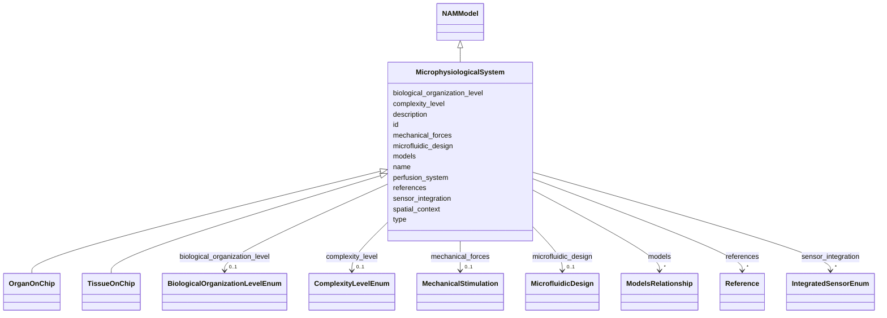

# Class: MicrophysiologicalSystem 


_Organ-/tissue-on-chip systems that integrate microfluidics, biomaterials,  and living cells to replicate tissue-level physiology and dynamics._


* __NOTE__: this is an abstract class and should not be instantiated directly


URI: [namo:MicrophysiologicalSystem](https://w3id.org/monarch-initiative/namo/MicrophysiologicalSystem)





## Inheritance
* [NamedThing](NamedThing.md)
    * [ModelSystem](ModelSystem.md)
        * [NAMModel](NAMModel.md)
            * **MicrophysiologicalSystem**
                * [OrganOnChip](OrganOnChip.md)
                * [TissueOnChip](TissueOnChip.md)


## Slots

| Name | Cardinality and Range | Description | Inheritance |
| ---  | --- | --- | --- |
| [microfluidic_design](microfluidic_design.md) | 0..1 <br/> [MicrofluidicDesign](MicrofluidicDesign.md) | Detailed design specifications of the microfluidic device | direct |
| [mechanical_forces](mechanical_forces.md) | 0..1 <br/> [MechanicalStimulation](MechanicalStimulation.md) | Mechanical forces applied to the model system | direct |
| [perfusion_system](perfusion_system.md) | 0..1 <br/> [String](String.md) | Description of perfusion and flow systems | direct |
| [sensor_integration](sensor_integration.md) | * <br/> [IntegratedSensorEnum](IntegratedSensorEnum.md) | Sensors integrated for real-time monitoring | direct |
| [biological_organization_level](biological_organization_level.md) | 0..1 <br/> [BiologicalOrganizationLevelEnum](BiologicalOrganizationLevelEnum.md) | The level of biological organization represented by the model | [NAMModel](NAMModel.md) |
| [spatial_context](spatial_context.md) | 0..1 <br/> [String](String.md) | Description of spatial organization and context captured by the model | [NAMModel](NAMModel.md) |
| [complexity_level](complexity_level.md) | 0..1 <br/> [ComplexityLevelEnum](ComplexityLevelEnum.md) | Level of biological complexity represented (subcellular, cellular, tissue, or... | [NAMModel](NAMModel.md) |
| [references](references.md) | * <br/> [Reference](Reference.md) | Literature references that describe, validate, or support this model | [NAMModel](NAMModel.md) |
| [models](models.md) | * <br/> [ModelsRelationship](ModelsRelationship.md) |  | [ModelSystem](ModelSystem.md) |
| [id](id.md) | 1 <br/> [Uriorcurie](Uriorcurie.md) | A unique identifier for a thing | [NamedThing](NamedThing.md) |
| [name](name.md) | 0..1 <br/> [String](String.md) | A human-readable name for a thing | [NamedThing](NamedThing.md) |
| [description](description.md) | 0..1 <br/> [String](String.md) | A human-readable description for a thing | [NamedThing](NamedThing.md) |
| [type](type.md) | 0..1 <br/> [String](String.md) |  | [NamedThing](NamedThing.md) |


## Identifier and Mapping Information


### Schema Source


* from schema: https://w3id.org/monarch-initiative/namo


## Mappings

| Mapping Type | Mapped Value |
| ---  | ---  |
| self | namo:MicrophysiologicalSystem |
| native | namo:MicrophysiologicalSystem |


## LinkML Source

<!-- TODO: investigate https://stackoverflow.com/questions/37606292/how-to-create-tabbed-code-blocks-in-mkdocs-or-sphinx -->

### Direct

<details>
```yaml
name: MicrophysiologicalSystem
description: Organ-/tissue-on-chip systems that integrate microfluidics, biomaterials,  and
  living cells to replicate tissue-level physiology and dynamics.
from_schema: https://w3id.org/monarch-initiative/namo
is_a: NAMModel
abstract: true
attributes:
  microfluidic_design:
    name: microfluidic_design
    description: Detailed design specifications of the microfluidic device
    from_schema: https://w3id.org/monarch-initiative/namo
    rank: 1000
    domain_of:
    - MicrophysiologicalSystem
    range: MicrofluidicDesign
    inlined: true
  mechanical_forces:
    name: mechanical_forces
    description: Mechanical forces applied to the model system
    from_schema: https://w3id.org/monarch-initiative/namo
    rank: 1000
    domain_of:
    - MicrophysiologicalSystem
    range: MechanicalStimulation
    inlined: true
  perfusion_system:
    name: perfusion_system
    description: Description of perfusion and flow systems
    from_schema: https://w3id.org/monarch-initiative/namo
    rank: 1000
    domain_of:
    - MicrophysiologicalSystem
  sensor_integration:
    name: sensor_integration
    description: Sensors integrated for real-time monitoring
    from_schema: https://w3id.org/monarch-initiative/namo
    rank: 1000
    domain_of:
    - MicrophysiologicalSystem
    range: IntegratedSensorEnum
    multivalued: true

```
</details>

### Induced

<details>
```yaml
name: MicrophysiologicalSystem
description: Organ-/tissue-on-chip systems that integrate microfluidics, biomaterials,  and
  living cells to replicate tissue-level physiology and dynamics.
from_schema: https://w3id.org/monarch-initiative/namo
is_a: NAMModel
abstract: true
attributes:
  microfluidic_design:
    name: microfluidic_design
    description: Detailed design specifications of the microfluidic device
    from_schema: https://w3id.org/monarch-initiative/namo
    rank: 1000
    alias: microfluidic_design
    owner: MicrophysiologicalSystem
    domain_of:
    - MicrophysiologicalSystem
    range: MicrofluidicDesign
    inlined: true
  mechanical_forces:
    name: mechanical_forces
    description: Mechanical forces applied to the model system
    from_schema: https://w3id.org/monarch-initiative/namo
    rank: 1000
    alias: mechanical_forces
    owner: MicrophysiologicalSystem
    domain_of:
    - MicrophysiologicalSystem
    range: MechanicalStimulation
    inlined: true
  perfusion_system:
    name: perfusion_system
    description: Description of perfusion and flow systems
    from_schema: https://w3id.org/monarch-initiative/namo
    rank: 1000
    alias: perfusion_system
    owner: MicrophysiologicalSystem
    domain_of:
    - MicrophysiologicalSystem
    range: string
  sensor_integration:
    name: sensor_integration
    description: Sensors integrated for real-time monitoring
    from_schema: https://w3id.org/monarch-initiative/namo
    rank: 1000
    alias: sensor_integration
    owner: MicrophysiologicalSystem
    domain_of:
    - MicrophysiologicalSystem
    range: IntegratedSensorEnum
    multivalued: true
  biological_organization_level:
    name: biological_organization_level
    description: The level of biological organization represented by the model
    from_schema: https://w3id.org/monarch-initiative/namo
    rank: 1000
    alias: biological_organization_level
    owner: MicrophysiologicalSystem
    domain_of:
    - NAMModel
    range: BiologicalOrganizationLevelEnum
  spatial_context:
    name: spatial_context
    description: Description of spatial organization and context captured by the model
    from_schema: https://w3id.org/monarch-initiative/namo
    rank: 1000
    alias: spatial_context
    owner: MicrophysiologicalSystem
    domain_of:
    - NAMModel
    range: string
  complexity_level:
    name: complexity_level
    description: Level of biological complexity represented (subcellular, cellular,
      tissue, organ, system)
    from_schema: https://w3id.org/monarch-initiative/namo
    rank: 1000
    alias: complexity_level
    owner: MicrophysiologicalSystem
    domain_of:
    - NAMModel
    range: ComplexityLevelEnum
  references:
    name: references
    description: Literature references that describe, validate, or support this model
    from_schema: https://w3id.org/monarch-initiative/namo
    rank: 1000
    alias: references
    owner: MicrophysiologicalSystem
    domain_of:
    - NAMModel
    range: Reference
    multivalued: true
    inlined: true
    inlined_as_list: true
  models:
    name: models
    from_schema: https://w3id.org/monarch-initiative/namo
    rank: 1000
    alias: models
    owner: MicrophysiologicalSystem
    domain_of:
    - ModelSystem
    range: ModelsRelationship
    multivalued: true
  id:
    name: id
    description: A unique identifier for a thing
    from_schema: https://w3id.org/monarch-initiative/namo
    rank: 1000
    slot_uri: schema:identifier
    identifier: true
    alias: id
    owner: MicrophysiologicalSystem
    domain_of:
    - NamedThing
    - Reference
    range: uriorcurie
    required: true
  name:
    name: name
    description: A human-readable name for a thing
    from_schema: https://w3id.org/monarch-initiative/namo
    rank: 1000
    slot_uri: schema:name
    alias: name
    owner: MicrophysiologicalSystem
    domain_of:
    - NamedThing
    range: string
  description:
    name: description
    description: A human-readable description for a thing
    from_schema: https://w3id.org/monarch-initiative/namo
    rank: 1000
    slot_uri: schema:description
    alias: description
    owner: MicrophysiologicalSystem
    domain_of:
    - NamedThing
    range: string
  type:
    name: type
    from_schema: https://w3id.org/monarch-initiative/namo
    rank: 1000
    designates_type: true
    alias: type
    owner: MicrophysiologicalSystem
    domain_of:
    - NamedThing
    range: string

```
</details>