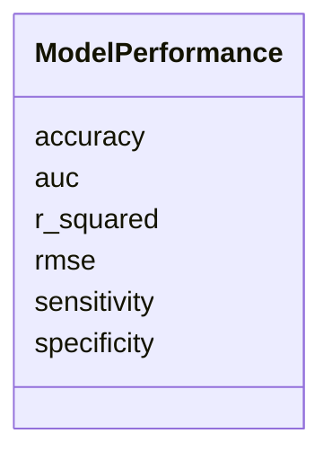

# Class: ModelPerformance 


_Statistical performance metrics for computational models._


URI: [namo:ModelPerformance](https://w3id.org/monarch-initiative/namo/ModelPerformance)





<!-- no inheritance hierarchy -->


## Slots

| Name | Cardinality and Range | Description | Inheritance |
| ---  | --- | --- | --- |
| [accuracy](accuracy.md) | 0..1 <br/> [Float](Float.md) | Overall accuracy of the model (0 | direct |
| [sensitivity](sensitivity.md) | 0..1 <br/> [Float](Float.md) | Sensitivity/recall of the model (0 | direct |
| [specificity](specificity.md) | 0..1 <br/> [Float](Float.md) | Specificity of the model (0 | direct |
| [r_squared](r_squared.md) | 0..1 <br/> [Float](Float.md) | R-squared value for regression models | direct |
| [rmse](rmse.md) | 0..1 <br/> [Float](Float.md) | Root mean square error | direct |
| [auc](auc.md) | 0..1 <br/> [Float](Float.md) | Area under the ROC curve | direct |


## Usages

| used by | used in | type | used |
| ---  | --- | --- | --- |
| [QSARModel](QSARModel.md) | [model_performance](model_performance.md) | range | [ModelPerformance](ModelPerformance.md) |


## Identifier and Mapping Information


### Schema Source


* from schema: https://w3id.org/monarch-initiative/namo


## Mappings

| Mapping Type | Mapped Value |
| ---  | ---  |
| self | namo:ModelPerformance |
| native | namo:ModelPerformance |


## LinkML Source

<!-- TODO: investigate https://stackoverflow.com/questions/37606292/how-to-create-tabbed-code-blocks-in-mkdocs-or-sphinx -->

### Direct

<details>
```yaml
name: ModelPerformance
description: Statistical performance metrics for computational models.
from_schema: https://w3id.org/monarch-initiative/namo
attributes:
  accuracy:
    name: accuracy
    description: Overall accuracy of the model (0.0-1.0)
    from_schema: https://w3id.org/monarch-initiative/namo
    rank: 1000
    domain_of:
    - ModelPerformance
    range: float
  sensitivity:
    name: sensitivity
    description: Sensitivity/recall of the model (0.0-1.0)
    from_schema: https://w3id.org/monarch-initiative/namo
    rank: 1000
    domain_of:
    - ModelPerformance
    range: float
  specificity:
    name: specificity
    description: Specificity of the model (0.0-1.0)
    from_schema: https://w3id.org/monarch-initiative/namo
    rank: 1000
    domain_of:
    - ModelPerformance
    range: float
  r_squared:
    name: r_squared
    description: R-squared value for regression models
    from_schema: https://w3id.org/monarch-initiative/namo
    rank: 1000
    domain_of:
    - ModelPerformance
    range: float
  rmse:
    name: rmse
    description: Root mean square error
    from_schema: https://w3id.org/monarch-initiative/namo
    rank: 1000
    domain_of:
    - ModelPerformance
    range: float
  auc:
    name: auc
    description: Area under the ROC curve
    from_schema: https://w3id.org/monarch-initiative/namo
    rank: 1000
    domain_of:
    - ModelPerformance
    range: float

```
</details>

### Induced

<details>
```yaml
name: ModelPerformance
description: Statistical performance metrics for computational models.
from_schema: https://w3id.org/monarch-initiative/namo
attributes:
  accuracy:
    name: accuracy
    description: Overall accuracy of the model (0.0-1.0)
    from_schema: https://w3id.org/monarch-initiative/namo
    rank: 1000
    alias: accuracy
    owner: ModelPerformance
    domain_of:
    - ModelPerformance
    range: float
  sensitivity:
    name: sensitivity
    description: Sensitivity/recall of the model (0.0-1.0)
    from_schema: https://w3id.org/monarch-initiative/namo
    rank: 1000
    alias: sensitivity
    owner: ModelPerformance
    domain_of:
    - ModelPerformance
    range: float
  specificity:
    name: specificity
    description: Specificity of the model (0.0-1.0)
    from_schema: https://w3id.org/monarch-initiative/namo
    rank: 1000
    alias: specificity
    owner: ModelPerformance
    domain_of:
    - ModelPerformance
    range: float
  r_squared:
    name: r_squared
    description: R-squared value for regression models
    from_schema: https://w3id.org/monarch-initiative/namo
    rank: 1000
    alias: r_squared
    owner: ModelPerformance
    domain_of:
    - ModelPerformance
    range: float
  rmse:
    name: rmse
    description: Root mean square error
    from_schema: https://w3id.org/monarch-initiative/namo
    rank: 1000
    alias: rmse
    owner: ModelPerformance
    domain_of:
    - ModelPerformance
    range: float
  auc:
    name: auc
    description: Area under the ROC curve
    from_schema: https://w3id.org/monarch-initiative/namo
    rank: 1000
    alias: auc
    owner: ModelPerformance
    domain_of:
    - ModelPerformance
    range: float

```
</details>