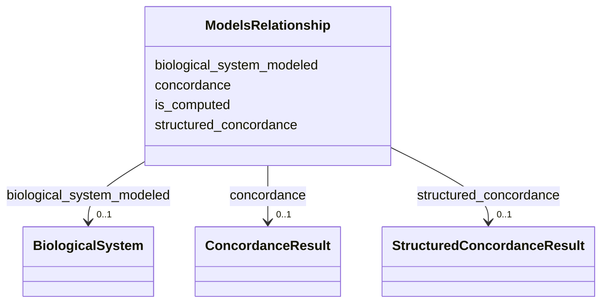

# Class: ModelsRelationship 


URI: [namo:ModelsRelationship](https://w3id.org/monarch-initiative/namo/ModelsRelationship)





<!-- no inheritance hierarchy -->


## Slots

| Name | Cardinality and Range | Description | Inheritance |
| ---  | --- | --- | --- |
| [biological_system_modeled](biological_system_modeled.md) | 0..1 <br/> [BiologicalSystem](BiologicalSystem.md) |  | direct |
| [is_computed](is_computed.md) | 0..1 <br/> [Boolean](Boolean.md) | Indicates whether the model is computed or derived from experimental data | direct |
| [concordance](concordance.md) | 0..1 <br/> [ConcordanceResult](ConcordanceResult.md) | Metrics used to assess the concordance between the model system and the biolo... | direct |
| [structured_concordance](structured_concordance.md) | 0..1 <br/> [StructuredConcordanceResult](StructuredConcordanceResult.md) | Detailed structured assessment of concordance between the model system and th... | direct |


## Usages

| used by | used in | type | used |
| ---  | --- | --- | --- |
| [ModelSystem](ModelSystem.md) | [models](models.md) | range | [ModelsRelationship](ModelsRelationship.md) |
| [AnimalModel](AnimalModel.md) | [models](models.md) | range | [ModelsRelationship](ModelsRelationship.md) |
| [NAMModel](NAMModel.md) | [models](models.md) | range | [ModelsRelationship](ModelsRelationship.md) |
| [CellularSystem](CellularSystem.md) | [models](models.md) | range | [ModelsRelationship](ModelsRelationship.md) |
| [TwoDCellCulture](TwoDCellCulture.md) | [models](models.md) | range | [ModelsRelationship](ModelsRelationship.md) |
| [ThreeDCellCulture](ThreeDCellCulture.md) | [models](models.md) | range | [ModelsRelationship](ModelsRelationship.md) |
| [CoCulture](CoCulture.md) | [models](models.md) | range | [ModelsRelationship](ModelsRelationship.md) |
| [Organoid](Organoid.md) | [models](models.md) | range | [ModelsRelationship](ModelsRelationship.md) |
| [CellLineModel](CellLineModel.md) | [models](models.md) | range | [ModelsRelationship](ModelsRelationship.md) |
| [MicrophysiologicalSystem](MicrophysiologicalSystem.md) | [models](models.md) | range | [ModelsRelationship](ModelsRelationship.md) |
| [OrganOnChip](OrganOnChip.md) | [models](models.md) | range | [ModelsRelationship](ModelsRelationship.md) |
| [TissueOnChip](TissueOnChip.md) | [models](models.md) | range | [ModelsRelationship](ModelsRelationship.md) |
| [InSilicoModel](InSilicoModel.md) | [models](models.md) | range | [ModelsRelationship](ModelsRelationship.md) |
| [QSARModel](QSARModel.md) | [models](models.md) | range | [ModelsRelationship](ModelsRelationship.md) |
| [PBPKModel](PBPKModel.md) | [models](models.md) | range | [ModelsRelationship](ModelsRelationship.md) |
| [DigitalTwin](DigitalTwin.md) | [models](models.md) | range | [ModelsRelationship](ModelsRelationship.md) |
| [MLModel](MLModel.md) | [models](models.md) | range | [ModelsRelationship](ModelsRelationship.md) |
| [MetabolicModel](MetabolicModel.md) | [models](models.md) | range | [ModelsRelationship](ModelsRelationship.md) |


## Identifier and Mapping Information


### Schema Source


* from schema: https://w3id.org/monarch-initiative/namo


## Mappings

| Mapping Type | Mapped Value |
| ---  | ---  |
| self | namo:ModelsRelationship |
| native | namo:ModelsRelationship |


## LinkML Source

<!-- TODO: investigate https://stackoverflow.com/questions/37606292/how-to-create-tabbed-code-blocks-in-mkdocs-or-sphinx -->

### Direct

<details>
```yaml
name: ModelsRelationship
from_schema: https://w3id.org/monarch-initiative/namo
attributes:
  biological_system_modeled:
    name: biological_system_modeled
    from_schema: https://w3id.org/monarch-initiative/namo
    rank: 1000
    domain_of:
    - ModelsRelationship
    range: BiologicalSystem
  is_computed:
    name: is_computed
    description: Indicates whether the model is computed or derived from experimental
      data.
    from_schema: https://w3id.org/monarch-initiative/namo
    rank: 1000
    domain_of:
    - ModelsRelationship
    range: boolean
  concordance:
    name: concordance
    description: Metrics used to assess the concordance between the model system and
      the biological system, such as sensitivity, specificity, and accuracy.
    from_schema: https://w3id.org/monarch-initiative/namo
    rank: 1000
    domain_of:
    - ModelsRelationship
    range: ConcordanceResult
  structured_concordance:
    name: structured_concordance
    description: Detailed structured assessment of concordance between the model system
      and the biological system, with rich metadata and supporting evidence.
    from_schema: https://w3id.org/monarch-initiative/namo
    rank: 1000
    domain_of:
    - ModelsRelationship
    range: StructuredConcordanceResult
    inlined: true

```
</details>

### Induced

<details>
```yaml
name: ModelsRelationship
from_schema: https://w3id.org/monarch-initiative/namo
attributes:
  biological_system_modeled:
    name: biological_system_modeled
    from_schema: https://w3id.org/monarch-initiative/namo
    rank: 1000
    alias: biological_system_modeled
    owner: ModelsRelationship
    domain_of:
    - ModelsRelationship
    range: BiologicalSystem
  is_computed:
    name: is_computed
    description: Indicates whether the model is computed or derived from experimental
      data.
    from_schema: https://w3id.org/monarch-initiative/namo
    rank: 1000
    alias: is_computed
    owner: ModelsRelationship
    domain_of:
    - ModelsRelationship
    range: boolean
  concordance:
    name: concordance
    description: Metrics used to assess the concordance between the model system and
      the biological system, such as sensitivity, specificity, and accuracy.
    from_schema: https://w3id.org/monarch-initiative/namo
    rank: 1000
    alias: concordance
    owner: ModelsRelationship
    domain_of:
    - ModelsRelationship
    range: ConcordanceResult
  structured_concordance:
    name: structured_concordance
    description: Detailed structured assessment of concordance between the model system
      and the biological system, with rich metadata and supporting evidence.
    from_schema: https://w3id.org/monarch-initiative/namo
    rank: 1000
    alias: structured_concordance
    owner: ModelsRelationship
    domain_of:
    - ModelsRelationship
    range: StructuredConcordanceResult
    inlined: true

```
</details>