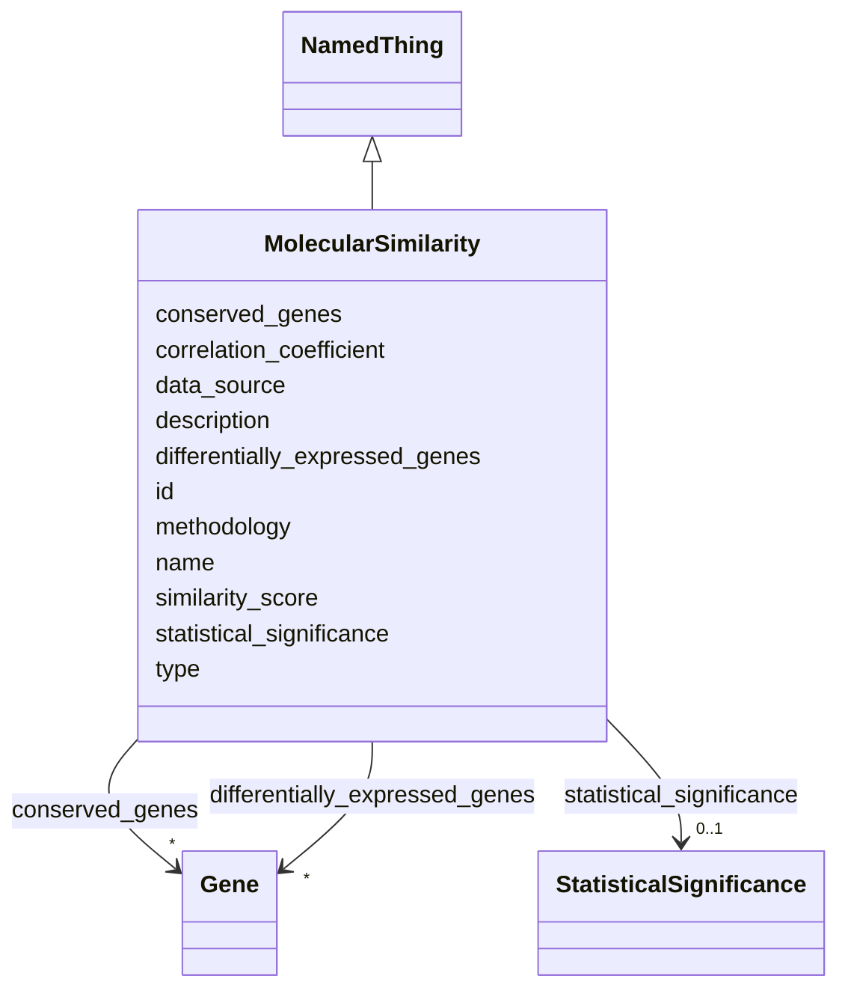

# Class: MolecularSimilarity 


_Detailed assessment of molecular-level concordance between model and biological systems._


URI: [namo:MolecularSimilarity](https://w3id.org/monarch-initiative/namo/MolecularSimilarity)





## Inheritance
* [NamedThing](NamedThing.md)
    * **MolecularSimilarity**


## Slots

| Name | Cardinality and Range | Description | Inheritance |
| ---  | --- | --- | --- |
| [similarity_score](similarity_score.md) | 0..1 <br/> [Float](Float.md) | Quantitative similarity score (0 | direct |
| [correlation_coefficient](correlation_coefficient.md) | 0..1 <br/> [Float](Float.md) | Pearson correlation coefficient for expression profiles | direct |
| [differentially_expressed_genes](differentially_expressed_genes.md) | * <br/> [Gene](Gene.md) | List of genes that are differentially expressed in the model system | direct |
| [conserved_genes](conserved_genes.md) | * <br/> [Gene](Gene.md) | List of genes with conserved expression patterns between model and target | direct |
| [methodology](methodology.md) | 0..1 <br/> [String](String.md) | Description of experimental methods used for molecular comparison | direct |
| [data_source](data_source.md) | 0..1 <br/> [String](String.md) | Source of molecular data (e | direct |
| [statistical_significance](statistical_significance.md) | 0..1 <br/> [StatisticalSignificance](StatisticalSignificance.md) | Statistical measures of significance for the molecular similarity | direct |
| [id](id.md) | 1 <br/> [Uriorcurie](Uriorcurie.md) | A unique identifier for a thing | [NamedThing](NamedThing.md) |
| [name](name.md) | 0..1 <br/> [String](String.md) | A human-readable name for a thing | [NamedThing](NamedThing.md) |
| [description](description.md) | 0..1 <br/> [String](String.md) | A human-readable description for a thing | [NamedThing](NamedThing.md) |
| [type](type.md) | 0..1 <br/> [String](String.md) |  | [NamedThing](NamedThing.md) |


## Usages

| used by | used in | type | used |
| ---  | --- | --- | --- |
| [StructuredConcordanceResult](StructuredConcordanceResult.md) | [molecular_similarity](molecular_similarity.md) | range | [MolecularSimilarity](MolecularSimilarity.md) |


## Identifier and Mapping Information


### Schema Source


* from schema: https://w3id.org/monarch-initiative/namo


## Mappings

| Mapping Type | Mapped Value |
| ---  | ---  |
| self | namo:MolecularSimilarity |
| native | namo:MolecularSimilarity |


## LinkML Source

<!-- TODO: investigate https://stackoverflow.com/questions/37606292/how-to-create-tabbed-code-blocks-in-mkdocs-or-sphinx -->

### Direct

<details>
```yaml
name: MolecularSimilarity
description: Detailed assessment of molecular-level concordance between model and
  biological systems.
from_schema: https://w3id.org/monarch-initiative/namo
is_a: NamedThing
attributes:
  similarity_score:
    name: similarity_score
    description: Quantitative similarity score (0.0-1.0) based on molecular profiles.
    from_schema: https://w3id.org/monarch-initiative/namo
    rank: 1000
    domain_of:
    - MolecularSimilarity
    range: float
  correlation_coefficient:
    name: correlation_coefficient
    description: Pearson correlation coefficient for expression profiles.
    from_schema: https://w3id.org/monarch-initiative/namo
    rank: 1000
    domain_of:
    - MolecularSimilarity
    - DoseResponseSimilarity
    range: float
  differentially_expressed_genes:
    name: differentially_expressed_genes
    description: List of genes that are differentially expressed in the model system.
    from_schema: https://w3id.org/monarch-initiative/namo
    rank: 1000
    domain_of:
    - MolecularSimilarity
    range: Gene
    multivalued: true
    inlined: true
    inlined_as_list: true
  conserved_genes:
    name: conserved_genes
    description: List of genes with conserved expression patterns between model and
      target.
    from_schema: https://w3id.org/monarch-initiative/namo
    rank: 1000
    domain_of:
    - MolecularSimilarity
    range: Gene
    multivalued: true
    inlined: true
    inlined_as_list: true
  methodology:
    name: methodology
    description: Description of experimental methods used for molecular comparison.
    from_schema: https://w3id.org/monarch-initiative/namo
    rank: 1000
    domain_of:
    - MolecularSimilarity
    - FunctionalAssay
  data_source:
    name: data_source
    description: Source of molecular data (e.g., RNA-seq, proteomics, metabolomics).
    from_schema: https://w3id.org/monarch-initiative/namo
    rank: 1000
    domain_of:
    - MolecularSimilarity
  statistical_significance:
    name: statistical_significance
    description: Statistical measures of significance for the molecular similarity.
    from_schema: https://w3id.org/monarch-initiative/namo
    rank: 1000
    domain_of:
    - MolecularSimilarity
    range: StatisticalSignificance
    inlined: true

```
</details>

### Induced

<details>
```yaml
name: MolecularSimilarity
description: Detailed assessment of molecular-level concordance between model and
  biological systems.
from_schema: https://w3id.org/monarch-initiative/namo
is_a: NamedThing
attributes:
  similarity_score:
    name: similarity_score
    description: Quantitative similarity score (0.0-1.0) based on molecular profiles.
    from_schema: https://w3id.org/monarch-initiative/namo
    rank: 1000
    alias: similarity_score
    owner: MolecularSimilarity
    domain_of:
    - MolecularSimilarity
    range: float
  correlation_coefficient:
    name: correlation_coefficient
    description: Pearson correlation coefficient for expression profiles.
    from_schema: https://w3id.org/monarch-initiative/namo
    rank: 1000
    alias: correlation_coefficient
    owner: MolecularSimilarity
    domain_of:
    - MolecularSimilarity
    - DoseResponseSimilarity
    range: float
  differentially_expressed_genes:
    name: differentially_expressed_genes
    description: List of genes that are differentially expressed in the model system.
    from_schema: https://w3id.org/monarch-initiative/namo
    rank: 1000
    alias: differentially_expressed_genes
    owner: MolecularSimilarity
    domain_of:
    - MolecularSimilarity
    range: Gene
    multivalued: true
    inlined: true
    inlined_as_list: true
  conserved_genes:
    name: conserved_genes
    description: List of genes with conserved expression patterns between model and
      target.
    from_schema: https://w3id.org/monarch-initiative/namo
    rank: 1000
    alias: conserved_genes
    owner: MolecularSimilarity
    domain_of:
    - MolecularSimilarity
    range: Gene
    multivalued: true
    inlined: true
    inlined_as_list: true
  methodology:
    name: methodology
    description: Description of experimental methods used for molecular comparison.
    from_schema: https://w3id.org/monarch-initiative/namo
    rank: 1000
    alias: methodology
    owner: MolecularSimilarity
    domain_of:
    - MolecularSimilarity
    - FunctionalAssay
    range: string
  data_source:
    name: data_source
    description: Source of molecular data (e.g., RNA-seq, proteomics, metabolomics).
    from_schema: https://w3id.org/monarch-initiative/namo
    rank: 1000
    alias: data_source
    owner: MolecularSimilarity
    domain_of:
    - MolecularSimilarity
    range: string
  statistical_significance:
    name: statistical_significance
    description: Statistical measures of significance for the molecular similarity.
    from_schema: https://w3id.org/monarch-initiative/namo
    rank: 1000
    alias: statistical_significance
    owner: MolecularSimilarity
    domain_of:
    - MolecularSimilarity
    range: StatisticalSignificance
    inlined: true
  id:
    name: id
    description: A unique identifier for a thing
    from_schema: https://w3id.org/monarch-initiative/namo
    rank: 1000
    slot_uri: schema:identifier
    identifier: true
    alias: id
    owner: MolecularSimilarity
    domain_of:
    - NamedThing
    - Reference
    range: uriorcurie
    required: true
  name:
    name: name
    description: A human-readable name for a thing
    from_schema: https://w3id.org/monarch-initiative/namo
    rank: 1000
    slot_uri: schema:name
    alias: name
    owner: MolecularSimilarity
    domain_of:
    - NamedThing
    range: string
  description:
    name: description
    description: A human-readable description for a thing
    from_schema: https://w3id.org/monarch-initiative/namo
    rank: 1000
    slot_uri: schema:description
    alias: description
    owner: MolecularSimilarity
    domain_of:
    - NamedThing
    range: string
  type:
    name: type
    from_schema: https://w3id.org/monarch-initiative/namo
    rank: 1000
    designates_type: true
    alias: type
    owner: MolecularSimilarity
    domain_of:
    - NamedThing
    range: string

```
</details>