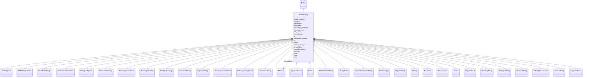

---
search:
  boost: 10.0
---

# Class: NamedThing 


_a databased entity or concept/class_


<div data-search-exclude markdown="1">


URI: [namo:NamedThing](https://w3id.org/monarch-initiative/namo/NamedThing)



```mermaid
 classDiagram
    class NamedThing
    click NamedThing href "../NamedThing/"
      Entity <|-- NamedThing
        click Entity href "../Entity/"
      

      NamedThing <|-- ModelSystem
        click ModelSystem href "../ModelSystem/"
      NamedThing <|-- PBPKCompartment
        click PBPKCompartment href "../PBPKCompartment/"
      NamedThing <|-- MicrofluidicDesign
        click MicrofluidicDesign href "../MicrofluidicDesign/"
      NamedThing <|-- MechanicalStimulation
        click MechanicalStimulation href "../MechanicalStimulation/"
      NamedThing <|-- BiologicalSystem
        click BiologicalSystem href "../BiologicalSystem/"
      NamedThing <|-- MolecularSimilarity
        click MolecularSimilarity href "../MolecularSimilarity/"
      NamedThing <|-- PathwayConcordance
        click PathwayConcordance href "../PathwayConcordance/"
      NamedThing <|-- PhenotypeOverlap
        click PhenotypeOverlap href "../PhenotypeOverlap/"
      NamedThing <|-- CellTypeCoverage
        click CellTypeCoverage href "../CellTypeCoverage/"
      NamedThing <|-- FunctionalParity
        click FunctionalParity href "../FunctionalParity/"
      NamedThing <|-- Reproducibility
        click Reproducibility href "../Reproducibility/"
      NamedThing <|-- GeneExpressionResult
        click GeneExpressionResult href "../GeneExpressionResult/"
      NamedThing <|-- PathwayActivityResult
        click PathwayActivityResult href "../PathwayActivityResult/"
      NamedThing <|-- FunctionalAssay
        click FunctionalAssay href "../FunctionalAssay/"
      NamedThing <|-- Attribute
        click Attribute href "../Attribute/"
      NamedThing <|-- OrganismTaxon
        click OrganismTaxon href "../OrganismTaxon/"
      NamedThing <|-- Event
        click Event href "../Event/"
      NamedThing <|-- AdministrativeEntity
        click AdministrativeEntity href "../AdministrativeEntity/"
      NamedThing <|-- StudyResult
        click StudyResult href "../StudyResult/"
      NamedThing <|-- InformationContentEntity
        click InformationContentEntity href "../InformationContentEntity/"
      NamedThing <|-- EvidenceType
        click EvidenceType href "../EvidenceType/"
      NamedThing <|-- PhysicalEntity
        click PhysicalEntity href "../PhysicalEntity/"
      NamedThing <|-- Activity
        click Activity href "../Activity/"
      NamedThing <|-- Procedure
        click Procedure href "../Procedure/"
      NamedThing <|-- Phenomenon
        click Phenomenon href "../Phenomenon/"
      NamedThing <|-- Device
        click Device href "../Device/"
      NamedThing <|-- DiagnosticAid
        click DiagnosticAid href "../DiagnosticAid/"
      NamedThing <|-- PlanetaryEntity
        click PlanetaryEntity href "../PlanetaryEntity/"
      NamedThing <|-- BiologicalEntity
        click BiologicalEntity href "../BiologicalEntity/"
      NamedThing <|-- ChemicalEntity
        click ChemicalEntity href "../ChemicalEntity/"
      NamedThing <|-- AffinityMeasurement
        click AffinityMeasurement href "../AffinityMeasurement/"
      NamedThing <|-- ClinicalEntity
        click ClinicalEntity href "../ClinicalEntity/"
      NamedThing <|-- ExposureEvent
        click ExposureEvent href "../ExposureEvent/"
      

      NamedThing : broad_synonym
        
      NamedThing : category
        
      NamedThing : deprecated
        
      NamedThing : description
        
      NamedThing : equivalent_identifiers
        
      NamedThing : exact_synonym
        
      NamedThing : full_name
        
      NamedThing : has_attribute
        
          
    
        
        
        NamedThing --> "*" Attribute : has_attribute
        click Attribute href "../Attribute/"
    

        
      NamedThing : id
        
      NamedThing : information_content
        
      NamedThing : iri
        
      NamedThing : name
        
      NamedThing : narrow_synonym
        
      NamedThing : provided_by
        
      NamedThing : related_synonym
        
      NamedThing : synonym
        
      NamedThing : taxon
        
      NamedThing : type
        
      NamedThing : xref
        
      
```


## Inheritance
* [Entity](Entity.md)
    * **NamedThing**
        * [ModelSystem](ModelSystem.md)
        * [PBPKCompartment](PBPKCompartment.md)
        * [MicrofluidicDesign](MicrofluidicDesign.md)
        * [MechanicalStimulation](MechanicalStimulation.md)
        * [BiologicalSystem](BiologicalSystem.md)
        * [MolecularSimilarity](MolecularSimilarity.md)
        * [PathwayConcordance](PathwayConcordance.md)
        * [PhenotypeOverlap](PhenotypeOverlap.md)
        * [CellTypeCoverage](CellTypeCoverage.md)
        * [FunctionalParity](FunctionalParity.md)
        * [Reproducibility](Reproducibility.md)
        * [GeneExpressionResult](GeneExpressionResult.md)
        * [PathwayActivityResult](PathwayActivityResult.md)
        * [FunctionalAssay](FunctionalAssay.md)
        * [Attribute](Attribute.md) [ [OntologyClass](OntologyClass.md)]
        * [OrganismTaxon](OrganismTaxon.md)
        * [Event](Event.md)
        * [AdministrativeEntity](AdministrativeEntity.md)
        * [StudyResult](StudyResult.md)
        * [InformationContentEntity](InformationContentEntity.md)
        * [EvidenceType](EvidenceType.md) [ [OntologyClass](OntologyClass.md)]
        * [PhysicalEntity](PhysicalEntity.md) [ [PhysicalEssence](PhysicalEssence.md)]
        * [Activity](Activity.md) [ [ActivityAndBehavior](ActivityAndBehavior.md)]
        * [Procedure](Procedure.md) [ [ActivityAndBehavior](ActivityAndBehavior.md)]
        * [Phenomenon](Phenomenon.md) [ [Occurrent](Occurrent.md)]
        * [Device](Device.md)
        * [DiagnosticAid](DiagnosticAid.md)
        * [PlanetaryEntity](PlanetaryEntity.md)
        * [BiologicalEntity](BiologicalEntity.md) [ [ThingWithTaxon](ThingWithTaxon.md)]
        * [ChemicalEntity](ChemicalEntity.md) [ [PhysicalEssence](PhysicalEssence.md) [ChemicalOrDrugOrTreatment](ChemicalOrDrugOrTreatment.md) [ChemicalEntityOrGeneOrGeneProduct](ChemicalEntityOrGeneOrGeneProduct.md) [ChemicalEntityOrProteinOrPolypeptide](ChemicalEntityOrProteinOrPolypeptide.md)]
        * [AffinityMeasurement](AffinityMeasurement.md)
        * [ClinicalEntity](ClinicalEntity.md)
        * [ExposureEvent](ExposureEvent.md) [ [OntologyClass](OntologyClass.md)]


## Slots

| Name | Cardinality and Range | Description | Inheritance |
| ---  | --- | --- | --- |
| [provided_by](provided_by.md) | * <br/> [String](String.md) | The value in this node property represents the knowledge provider that create... | direct |
| [xref](xref.md) | * <br/> [Uriorcurie](Uriorcurie.md) | A database cross reference or alternative identifier for a NamedThing or edge... | direct |
| [full_name](full_name.md) | 0..1 <br/> [LabelType](LabelType.md) | a long-form human readable name for a thing | direct |
| [synonym](synonym.md) | * <br/> [LabelType](LabelType.md) | Alternate human-readable names for a thing | direct |
| [exact_synonym](exact_synonym.md) | * <br/> [LabelType](LabelType.md) | An alternate label for an entity that denotes exactly the same meaning as the... | direct |
| [broad_synonym](broad_synonym.md) | * <br/> [LabelType](LabelType.md) | An alternate label for an entity whose meaning is broader (more general) than... | direct |
| [narrow_synonym](narrow_synonym.md) | * <br/> [LabelType](LabelType.md) | An alternate label for an entity whose meaning is narrower (more specific) th... | direct |
| [related_synonym](related_synonym.md) | * <br/> [LabelType](LabelType.md) | An alternate label that is related to the primary label but is neither exactl... | direct |
| [equivalent_identifiers](equivalent_identifiers.md) | * <br/> [Uriorcurie](Uriorcurie.md) | A set of identifiers that are considered equivalent to the primary identifier... | direct |
| [information_content](information_content.md) | 0..1 <br/> [Float](Float.md) | Information content (IC) value for a term, primarily from Automats | direct |
| [taxon](taxon.md) | 0..1 <br/> [Uriorcurie](Uriorcurie.md) | A property that indicates the taxonomic classification of an entity | direct |
| [id](id.md) | 1 <br/> [String](String.md) | A unique identifier for an entity | [Entity](Entity.md) |
| [iri](iri.md) | 0..1 <br/> [IriType](IriType.md) | An IRI for an entity | [Entity](Entity.md) |
| [category](category.md) | 1..* <br/> [Uriorcurie](Uriorcurie.md) | Name of the high level ontology class in which this entity is categorized | [Entity](Entity.md) |
| [type](type.md) | * <br/> [String](String.md) | An rdf:type property asserting that an entity is an instance of a particular ... | [Entity](Entity.md) |
| [name](name.md) | 0..1 <br/> [LabelType](LabelType.md) | A human-readable name for an attribute or entity | [Entity](Entity.md) |
| [description](description.md) | 0..1 <br/> [NarrativeText](NarrativeText.md) | a human-readable description of an entity | [Entity](Entity.md) |
| [has_attribute](has_attribute.md) | * <br/> [Attribute](Attribute.md) | connects any entity to an attribute | [Entity](Entity.md) |
| [deprecated](deprecated.md) | 0..1 <br/> [Boolean](Boolean.md) | A boolean flag indicating that an entity is no longer considered current or v... | [Entity](Entity.md) |


## Usages

| used by | used in | type | used |
| ---  | --- | --- | --- |
| [NAMDataset](NAMDataset.md) | [creation_date](creation_date.md) | domain | [NamedThing](NamedThing.md) |
| [NAMDataset](NAMDataset.md) | [provided_by](provided_by.md) | domain | [NamedThing](NamedThing.md) |
| [NAMDataset](NAMDataset.md) | [xref](xref.md) | domain | [NamedThing](NamedThing.md) |
| [NAMDataset](NAMDataset.md) | [full_name](full_name.md) | domain | [NamedThing](NamedThing.md) |
| [NAMDataset](NAMDataset.md) | [synonym](synonym.md) | domain | [NamedThing](NamedThing.md) |
| [NAMDataset](NAMDataset.md) | [exact_synonym](exact_synonym.md) | domain | [NamedThing](NamedThing.md) |
| [NAMDataset](NAMDataset.md) | [broad_synonym](broad_synonym.md) | domain | [NamedThing](NamedThing.md) |
| [NAMDataset](NAMDataset.md) | [narrow_synonym](narrow_synonym.md) | domain | [NamedThing](NamedThing.md) |
| [NAMDataset](NAMDataset.md) | [related_synonym](related_synonym.md) | domain | [NamedThing](NamedThing.md) |
| [NAMDataset](NAMDataset.md) | [taxon](taxon.md) | domain | [NamedThing](NamedThing.md) |
| [NAMStudy](NAMStudy.md) | [provided_by](provided_by.md) | domain | [NamedThing](NamedThing.md) |
| [NAMStudy](NAMStudy.md) | [xref](xref.md) | domain | [NamedThing](NamedThing.md) |
| [NAMStudy](NAMStudy.md) | [full_name](full_name.md) | domain | [NamedThing](NamedThing.md) |
| [NAMStudy](NAMStudy.md) | [synonym](synonym.md) | domain | [NamedThing](NamedThing.md) |
| [NAMStudy](NAMStudy.md) | [exact_synonym](exact_synonym.md) | domain | [NamedThing](NamedThing.md) |
| [NAMStudy](NAMStudy.md) | [broad_synonym](broad_synonym.md) | domain | [NamedThing](NamedThing.md) |
| [NAMStudy](NAMStudy.md) | [narrow_synonym](narrow_synonym.md) | domain | [NamedThing](NamedThing.md) |
| [NAMStudy](NAMStudy.md) | [related_synonym](related_synonym.md) | domain | [NamedThing](NamedThing.md) |
| [NAMStudy](NAMStudy.md) | [taxon](taxon.md) | domain | [NamedThing](NamedThing.md) |
| [ModelSystem](ModelSystem.md) | [provided_by](provided_by.md) | domain | [NamedThing](NamedThing.md) |
| [ModelSystem](ModelSystem.md) | [xref](xref.md) | domain | [NamedThing](NamedThing.md) |
| [ModelSystem](ModelSystem.md) | [full_name](full_name.md) | domain | [NamedThing](NamedThing.md) |
| [ModelSystem](ModelSystem.md) | [synonym](synonym.md) | domain | [NamedThing](NamedThing.md) |
| [ModelSystem](ModelSystem.md) | [exact_synonym](exact_synonym.md) | domain | [NamedThing](NamedThing.md) |
| [ModelSystem](ModelSystem.md) | [broad_synonym](broad_synonym.md) | domain | [NamedThing](NamedThing.md) |
| [ModelSystem](ModelSystem.md) | [narrow_synonym](narrow_synonym.md) | domain | [NamedThing](NamedThing.md) |
| [ModelSystem](ModelSystem.md) | [related_synonym](related_synonym.md) | domain | [NamedThing](NamedThing.md) |
| [ModelSystem](ModelSystem.md) | [taxon](taxon.md) | domain | [NamedThing](NamedThing.md) |
| [AnimalModel](AnimalModel.md) | [provided_by](provided_by.md) | domain | [NamedThing](NamedThing.md) |
| [AnimalModel](AnimalModel.md) | [xref](xref.md) | domain | [NamedThing](NamedThing.md) |
| [AnimalModel](AnimalModel.md) | [full_name](full_name.md) | domain | [NamedThing](NamedThing.md) |
| [AnimalModel](AnimalModel.md) | [synonym](synonym.md) | domain | [NamedThing](NamedThing.md) |
| [AnimalModel](AnimalModel.md) | [exact_synonym](exact_synonym.md) | domain | [NamedThing](NamedThing.md) |
| [AnimalModel](AnimalModel.md) | [broad_synonym](broad_synonym.md) | domain | [NamedThing](NamedThing.md) |
| [AnimalModel](AnimalModel.md) | [narrow_synonym](narrow_synonym.md) | domain | [NamedThing](NamedThing.md) |
| [AnimalModel](AnimalModel.md) | [related_synonym](related_synonym.md) | domain | [NamedThing](NamedThing.md) |
| [AnimalModel](AnimalModel.md) | [taxon](taxon.md) | domain | [NamedThing](NamedThing.md) |
| [NAMModel](NAMModel.md) | [provided_by](provided_by.md) | domain | [NamedThing](NamedThing.md) |
| [NAMModel](NAMModel.md) | [xref](xref.md) | domain | [NamedThing](NamedThing.md) |
| [NAMModel](NAMModel.md) | [full_name](full_name.md) | domain | [NamedThing](NamedThing.md) |
| [NAMModel](NAMModel.md) | [synonym](synonym.md) | domain | [NamedThing](NamedThing.md) |
| [NAMModel](NAMModel.md) | [exact_synonym](exact_synonym.md) | domain | [NamedThing](NamedThing.md) |
| [NAMModel](NAMModel.md) | [broad_synonym](broad_synonym.md) | domain | [NamedThing](NamedThing.md) |
| [NAMModel](NAMModel.md) | [narrow_synonym](narrow_synonym.md) | domain | [NamedThing](NamedThing.md) |
| [NAMModel](NAMModel.md) | [related_synonym](related_synonym.md) | domain | [NamedThing](NamedThing.md) |
| [NAMModel](NAMModel.md) | [taxon](taxon.md) | domain | [NamedThing](NamedThing.md) |
| [CellularSystem](CellularSystem.md) | [provided_by](provided_by.md) | domain | [NamedThing](NamedThing.md) |
| [CellularSystem](CellularSystem.md) | [xref](xref.md) | domain | [NamedThing](NamedThing.md) |
| [CellularSystem](CellularSystem.md) | [full_name](full_name.md) | domain | [NamedThing](NamedThing.md) |
| [CellularSystem](CellularSystem.md) | [synonym](synonym.md) | domain | [NamedThing](NamedThing.md) |
| [CellularSystem](CellularSystem.md) | [exact_synonym](exact_synonym.md) | domain | [NamedThing](NamedThing.md) |
| [CellularSystem](CellularSystem.md) | [broad_synonym](broad_synonym.md) | domain | [NamedThing](NamedThing.md) |
| [CellularSystem](CellularSystem.md) | [narrow_synonym](narrow_synonym.md) | domain | [NamedThing](NamedThing.md) |
| [CellularSystem](CellularSystem.md) | [related_synonym](related_synonym.md) | domain | [NamedThing](NamedThing.md) |
| [CellularSystem](CellularSystem.md) | [taxon](taxon.md) | domain | [NamedThing](NamedThing.md) |
| [TwoDCellCulture](TwoDCellCulture.md) | [provided_by](provided_by.md) | domain | [NamedThing](NamedThing.md) |
| [TwoDCellCulture](TwoDCellCulture.md) | [xref](xref.md) | domain | [NamedThing](NamedThing.md) |
| [TwoDCellCulture](TwoDCellCulture.md) | [full_name](full_name.md) | domain | [NamedThing](NamedThing.md) |
| [TwoDCellCulture](TwoDCellCulture.md) | [synonym](synonym.md) | domain | [NamedThing](NamedThing.md) |
| [TwoDCellCulture](TwoDCellCulture.md) | [exact_synonym](exact_synonym.md) | domain | [NamedThing](NamedThing.md) |
| [TwoDCellCulture](TwoDCellCulture.md) | [broad_synonym](broad_synonym.md) | domain | [NamedThing](NamedThing.md) |
| [TwoDCellCulture](TwoDCellCulture.md) | [narrow_synonym](narrow_synonym.md) | domain | [NamedThing](NamedThing.md) |
| [TwoDCellCulture](TwoDCellCulture.md) | [related_synonym](related_synonym.md) | domain | [NamedThing](NamedThing.md) |
| [TwoDCellCulture](TwoDCellCulture.md) | [taxon](taxon.md) | domain | [NamedThing](NamedThing.md) |
| [ThreeDCellCulture](ThreeDCellCulture.md) | [provided_by](provided_by.md) | domain | [NamedThing](NamedThing.md) |
| [ThreeDCellCulture](ThreeDCellCulture.md) | [xref](xref.md) | domain | [NamedThing](NamedThing.md) |
| [ThreeDCellCulture](ThreeDCellCulture.md) | [full_name](full_name.md) | domain | [NamedThing](NamedThing.md) |
| [ThreeDCellCulture](ThreeDCellCulture.md) | [synonym](synonym.md) | domain | [NamedThing](NamedThing.md) |
| [ThreeDCellCulture](ThreeDCellCulture.md) | [exact_synonym](exact_synonym.md) | domain | [NamedThing](NamedThing.md) |
| [ThreeDCellCulture](ThreeDCellCulture.md) | [broad_synonym](broad_synonym.md) | domain | [NamedThing](NamedThing.md) |
| [ThreeDCellCulture](ThreeDCellCulture.md) | [narrow_synonym](narrow_synonym.md) | domain | [NamedThing](NamedThing.md) |
| [ThreeDCellCulture](ThreeDCellCulture.md) | [related_synonym](related_synonym.md) | domain | [NamedThing](NamedThing.md) |
| [ThreeDCellCulture](ThreeDCellCulture.md) | [taxon](taxon.md) | domain | [NamedThing](NamedThing.md) |
| [CoCulture](CoCulture.md) | [provided_by](provided_by.md) | domain | [NamedThing](NamedThing.md) |
| [CoCulture](CoCulture.md) | [xref](xref.md) | domain | [NamedThing](NamedThing.md) |
| [CoCulture](CoCulture.md) | [full_name](full_name.md) | domain | [NamedThing](NamedThing.md) |
| [CoCulture](CoCulture.md) | [synonym](synonym.md) | domain | [NamedThing](NamedThing.md) |
| [CoCulture](CoCulture.md) | [exact_synonym](exact_synonym.md) | domain | [NamedThing](NamedThing.md) |
| [CoCulture](CoCulture.md) | [broad_synonym](broad_synonym.md) | domain | [NamedThing](NamedThing.md) |
| [CoCulture](CoCulture.md) | [narrow_synonym](narrow_synonym.md) | domain | [NamedThing](NamedThing.md) |
| [CoCulture](CoCulture.md) | [related_synonym](related_synonym.md) | domain | [NamedThing](NamedThing.md) |
| [CoCulture](CoCulture.md) | [taxon](taxon.md) | domain | [NamedThing](NamedThing.md) |
| [Organoid](Organoid.md) | [provided_by](provided_by.md) | domain | [NamedThing](NamedThing.md) |
| [Organoid](Organoid.md) | [xref](xref.md) | domain | [NamedThing](NamedThing.md) |
| [Organoid](Organoid.md) | [full_name](full_name.md) | domain | [NamedThing](NamedThing.md) |
| [Organoid](Organoid.md) | [synonym](synonym.md) | domain | [NamedThing](NamedThing.md) |
| [Organoid](Organoid.md) | [exact_synonym](exact_synonym.md) | domain | [NamedThing](NamedThing.md) |
| [Organoid](Organoid.md) | [broad_synonym](broad_synonym.md) | domain | [NamedThing](NamedThing.md) |
| [Organoid](Organoid.md) | [narrow_synonym](narrow_synonym.md) | domain | [NamedThing](NamedThing.md) |
| [Organoid](Organoid.md) | [related_synonym](related_synonym.md) | domain | [NamedThing](NamedThing.md) |
| [Organoid](Organoid.md) | [taxon](taxon.md) | domain | [NamedThing](NamedThing.md) |
| [CellLineModel](CellLineModel.md) | [provided_by](provided_by.md) | domain | [NamedThing](NamedThing.md) |
| [CellLineModel](CellLineModel.md) | [xref](xref.md) | domain | [NamedThing](NamedThing.md) |
| [CellLineModel](CellLineModel.md) | [full_name](full_name.md) | domain | [NamedThing](NamedThing.md) |
| [CellLineModel](CellLineModel.md) | [synonym](synonym.md) | domain | [NamedThing](NamedThing.md) |
| [CellLineModel](CellLineModel.md) | [exact_synonym](exact_synonym.md) | domain | [NamedThing](NamedThing.md) |
| [CellLineModel](CellLineModel.md) | [broad_synonym](broad_synonym.md) | domain | [NamedThing](NamedThing.md) |
| [CellLineModel](CellLineModel.md) | [narrow_synonym](narrow_synonym.md) | domain | [NamedThing](NamedThing.md) |
| [CellLineModel](CellLineModel.md) | [related_synonym](related_synonym.md) | domain | [NamedThing](NamedThing.md) |
| [CellLineModel](CellLineModel.md) | [taxon](taxon.md) | domain | [NamedThing](NamedThing.md) |
| [MicrophysiologicalSystem](MicrophysiologicalSystem.md) | [provided_by](provided_by.md) | domain | [NamedThing](NamedThing.md) |
| [MicrophysiologicalSystem](MicrophysiologicalSystem.md) | [xref](xref.md) | domain | [NamedThing](NamedThing.md) |
| [MicrophysiologicalSystem](MicrophysiologicalSystem.md) | [full_name](full_name.md) | domain | [NamedThing](NamedThing.md) |
| [MicrophysiologicalSystem](MicrophysiologicalSystem.md) | [synonym](synonym.md) | domain | [NamedThing](NamedThing.md) |
| [MicrophysiologicalSystem](MicrophysiologicalSystem.md) | [exact_synonym](exact_synonym.md) | domain | [NamedThing](NamedThing.md) |
| [MicrophysiologicalSystem](MicrophysiologicalSystem.md) | [broad_synonym](broad_synonym.md) | domain | [NamedThing](NamedThing.md) |
| [MicrophysiologicalSystem](MicrophysiologicalSystem.md) | [narrow_synonym](narrow_synonym.md) | domain | [NamedThing](NamedThing.md) |
| [MicrophysiologicalSystem](MicrophysiologicalSystem.md) | [related_synonym](related_synonym.md) | domain | [NamedThing](NamedThing.md) |
| [MicrophysiologicalSystem](MicrophysiologicalSystem.md) | [taxon](taxon.md) | domain | [NamedThing](NamedThing.md) |
| [OrganOnChip](OrganOnChip.md) | [provided_by](provided_by.md) | domain | [NamedThing](NamedThing.md) |
| [OrganOnChip](OrganOnChip.md) | [xref](xref.md) | domain | [NamedThing](NamedThing.md) |
| [OrganOnChip](OrganOnChip.md) | [full_name](full_name.md) | domain | [NamedThing](NamedThing.md) |
| [OrganOnChip](OrganOnChip.md) | [synonym](synonym.md) | domain | [NamedThing](NamedThing.md) |
| [OrganOnChip](OrganOnChip.md) | [exact_synonym](exact_synonym.md) | domain | [NamedThing](NamedThing.md) |
| [OrganOnChip](OrganOnChip.md) | [broad_synonym](broad_synonym.md) | domain | [NamedThing](NamedThing.md) |
| [OrganOnChip](OrganOnChip.md) | [narrow_synonym](narrow_synonym.md) | domain | [NamedThing](NamedThing.md) |
| [OrganOnChip](OrganOnChip.md) | [related_synonym](related_synonym.md) | domain | [NamedThing](NamedThing.md) |
| [OrganOnChip](OrganOnChip.md) | [taxon](taxon.md) | domain | [NamedThing](NamedThing.md) |
| [TissueOnChip](TissueOnChip.md) | [provided_by](provided_by.md) | domain | [NamedThing](NamedThing.md) |
| [TissueOnChip](TissueOnChip.md) | [xref](xref.md) | domain | [NamedThing](NamedThing.md) |
| [TissueOnChip](TissueOnChip.md) | [full_name](full_name.md) | domain | [NamedThing](NamedThing.md) |
| [TissueOnChip](TissueOnChip.md) | [synonym](synonym.md) | domain | [NamedThing](NamedThing.md) |
| [TissueOnChip](TissueOnChip.md) | [exact_synonym](exact_synonym.md) | domain | [NamedThing](NamedThing.md) |
| [TissueOnChip](TissueOnChip.md) | [broad_synonym](broad_synonym.md) | domain | [NamedThing](NamedThing.md) |
| [TissueOnChip](TissueOnChip.md) | [narrow_synonym](narrow_synonym.md) | domain | [NamedThing](NamedThing.md) |
| [TissueOnChip](TissueOnChip.md) | [related_synonym](related_synonym.md) | domain | [NamedThing](NamedThing.md) |
| [TissueOnChip](TissueOnChip.md) | [taxon](taxon.md) | domain | [NamedThing](NamedThing.md) |
| [InSilicoModel](InSilicoModel.md) | [provided_by](provided_by.md) | domain | [NamedThing](NamedThing.md) |
| [InSilicoModel](InSilicoModel.md) | [xref](xref.md) | domain | [NamedThing](NamedThing.md) |
| [InSilicoModel](InSilicoModel.md) | [full_name](full_name.md) | domain | [NamedThing](NamedThing.md) |
| [InSilicoModel](InSilicoModel.md) | [synonym](synonym.md) | domain | [NamedThing](NamedThing.md) |
| [InSilicoModel](InSilicoModel.md) | [exact_synonym](exact_synonym.md) | domain | [NamedThing](NamedThing.md) |
| [InSilicoModel](InSilicoModel.md) | [broad_synonym](broad_synonym.md) | domain | [NamedThing](NamedThing.md) |
| [InSilicoModel](InSilicoModel.md) | [narrow_synonym](narrow_synonym.md) | domain | [NamedThing](NamedThing.md) |
| [InSilicoModel](InSilicoModel.md) | [related_synonym](related_synonym.md) | domain | [NamedThing](NamedThing.md) |
| [InSilicoModel](InSilicoModel.md) | [taxon](taxon.md) | domain | [NamedThing](NamedThing.md) |
| [QSARModel](QSARModel.md) | [provided_by](provided_by.md) | domain | [NamedThing](NamedThing.md) |
| [QSARModel](QSARModel.md) | [xref](xref.md) | domain | [NamedThing](NamedThing.md) |
| [QSARModel](QSARModel.md) | [full_name](full_name.md) | domain | [NamedThing](NamedThing.md) |
| [QSARModel](QSARModel.md) | [synonym](synonym.md) | domain | [NamedThing](NamedThing.md) |
| [QSARModel](QSARModel.md) | [exact_synonym](exact_synonym.md) | domain | [NamedThing](NamedThing.md) |
| [QSARModel](QSARModel.md) | [broad_synonym](broad_synonym.md) | domain | [NamedThing](NamedThing.md) |
| [QSARModel](QSARModel.md) | [narrow_synonym](narrow_synonym.md) | domain | [NamedThing](NamedThing.md) |
| [QSARModel](QSARModel.md) | [related_synonym](related_synonym.md) | domain | [NamedThing](NamedThing.md) |
| [QSARModel](QSARModel.md) | [taxon](taxon.md) | domain | [NamedThing](NamedThing.md) |
| [PBPKModel](PBPKModel.md) | [provided_by](provided_by.md) | domain | [NamedThing](NamedThing.md) |
| [PBPKModel](PBPKModel.md) | [xref](xref.md) | domain | [NamedThing](NamedThing.md) |
| [PBPKModel](PBPKModel.md) | [full_name](full_name.md) | domain | [NamedThing](NamedThing.md) |
| [PBPKModel](PBPKModel.md) | [synonym](synonym.md) | domain | [NamedThing](NamedThing.md) |
| [PBPKModel](PBPKModel.md) | [exact_synonym](exact_synonym.md) | domain | [NamedThing](NamedThing.md) |
| [PBPKModel](PBPKModel.md) | [broad_synonym](broad_synonym.md) | domain | [NamedThing](NamedThing.md) |
| [PBPKModel](PBPKModel.md) | [narrow_synonym](narrow_synonym.md) | domain | [NamedThing](NamedThing.md) |
| [PBPKModel](PBPKModel.md) | [related_synonym](related_synonym.md) | domain | [NamedThing](NamedThing.md) |
| [PBPKModel](PBPKModel.md) | [taxon](taxon.md) | domain | [NamedThing](NamedThing.md) |
| [DigitalTwin](DigitalTwin.md) | [provided_by](provided_by.md) | domain | [NamedThing](NamedThing.md) |
| [DigitalTwin](DigitalTwin.md) | [xref](xref.md) | domain | [NamedThing](NamedThing.md) |
| [DigitalTwin](DigitalTwin.md) | [full_name](full_name.md) | domain | [NamedThing](NamedThing.md) |
| [DigitalTwin](DigitalTwin.md) | [synonym](synonym.md) | domain | [NamedThing](NamedThing.md) |
| [DigitalTwin](DigitalTwin.md) | [exact_synonym](exact_synonym.md) | domain | [NamedThing](NamedThing.md) |
| [DigitalTwin](DigitalTwin.md) | [broad_synonym](broad_synonym.md) | domain | [NamedThing](NamedThing.md) |
| [DigitalTwin](DigitalTwin.md) | [narrow_synonym](narrow_synonym.md) | domain | [NamedThing](NamedThing.md) |
| [DigitalTwin](DigitalTwin.md) | [related_synonym](related_synonym.md) | domain | [NamedThing](NamedThing.md) |
| [DigitalTwin](DigitalTwin.md) | [taxon](taxon.md) | domain | [NamedThing](NamedThing.md) |
| [MLModel](MLModel.md) | [provided_by](provided_by.md) | domain | [NamedThing](NamedThing.md) |
| [MLModel](MLModel.md) | [xref](xref.md) | domain | [NamedThing](NamedThing.md) |
| [MLModel](MLModel.md) | [full_name](full_name.md) | domain | [NamedThing](NamedThing.md) |
| [MLModel](MLModel.md) | [synonym](synonym.md) | domain | [NamedThing](NamedThing.md) |
| [MLModel](MLModel.md) | [exact_synonym](exact_synonym.md) | domain | [NamedThing](NamedThing.md) |
| [MLModel](MLModel.md) | [broad_synonym](broad_synonym.md) | domain | [NamedThing](NamedThing.md) |
| [MLModel](MLModel.md) | [narrow_synonym](narrow_synonym.md) | domain | [NamedThing](NamedThing.md) |
| [MLModel](MLModel.md) | [related_synonym](related_synonym.md) | domain | [NamedThing](NamedThing.md) |
| [MLModel](MLModel.md) | [taxon](taxon.md) | domain | [NamedThing](NamedThing.md) |
| [MetabolicModel](MetabolicModel.md) | [provided_by](provided_by.md) | domain | [NamedThing](NamedThing.md) |
| [MetabolicModel](MetabolicModel.md) | [xref](xref.md) | domain | [NamedThing](NamedThing.md) |
| [MetabolicModel](MetabolicModel.md) | [full_name](full_name.md) | domain | [NamedThing](NamedThing.md) |
| [MetabolicModel](MetabolicModel.md) | [synonym](synonym.md) | domain | [NamedThing](NamedThing.md) |
| [MetabolicModel](MetabolicModel.md) | [exact_synonym](exact_synonym.md) | domain | [NamedThing](NamedThing.md) |
| [MetabolicModel](MetabolicModel.md) | [broad_synonym](broad_synonym.md) | domain | [NamedThing](NamedThing.md) |
| [MetabolicModel](MetabolicModel.md) | [narrow_synonym](narrow_synonym.md) | domain | [NamedThing](NamedThing.md) |
| [MetabolicModel](MetabolicModel.md) | [related_synonym](related_synonym.md) | domain | [NamedThing](NamedThing.md) |
| [MetabolicModel](MetabolicModel.md) | [taxon](taxon.md) | domain | [NamedThing](NamedThing.md) |
| [PBPKCompartment](PBPKCompartment.md) | [provided_by](provided_by.md) | domain | [NamedThing](NamedThing.md) |
| [PBPKCompartment](PBPKCompartment.md) | [xref](xref.md) | domain | [NamedThing](NamedThing.md) |
| [PBPKCompartment](PBPKCompartment.md) | [full_name](full_name.md) | domain | [NamedThing](NamedThing.md) |
| [PBPKCompartment](PBPKCompartment.md) | [synonym](synonym.md) | domain | [NamedThing](NamedThing.md) |
| [PBPKCompartment](PBPKCompartment.md) | [exact_synonym](exact_synonym.md) | domain | [NamedThing](NamedThing.md) |
| [PBPKCompartment](PBPKCompartment.md) | [broad_synonym](broad_synonym.md) | domain | [NamedThing](NamedThing.md) |
| [PBPKCompartment](PBPKCompartment.md) | [narrow_synonym](narrow_synonym.md) | domain | [NamedThing](NamedThing.md) |
| [PBPKCompartment](PBPKCompartment.md) | [related_synonym](related_synonym.md) | domain | [NamedThing](NamedThing.md) |
| [PBPKCompartment](PBPKCompartment.md) | [taxon](taxon.md) | domain | [NamedThing](NamedThing.md) |
| [MicrofluidicDesign](MicrofluidicDesign.md) | [provided_by](provided_by.md) | domain | [NamedThing](NamedThing.md) |
| [MicrofluidicDesign](MicrofluidicDesign.md) | [xref](xref.md) | domain | [NamedThing](NamedThing.md) |
| [MicrofluidicDesign](MicrofluidicDesign.md) | [full_name](full_name.md) | domain | [NamedThing](NamedThing.md) |
| [MicrofluidicDesign](MicrofluidicDesign.md) | [synonym](synonym.md) | domain | [NamedThing](NamedThing.md) |
| [MicrofluidicDesign](MicrofluidicDesign.md) | [exact_synonym](exact_synonym.md) | domain | [NamedThing](NamedThing.md) |
| [MicrofluidicDesign](MicrofluidicDesign.md) | [broad_synonym](broad_synonym.md) | domain | [NamedThing](NamedThing.md) |
| [MicrofluidicDesign](MicrofluidicDesign.md) | [narrow_synonym](narrow_synonym.md) | domain | [NamedThing](NamedThing.md) |
| [MicrofluidicDesign](MicrofluidicDesign.md) | [related_synonym](related_synonym.md) | domain | [NamedThing](NamedThing.md) |
| [MicrofluidicDesign](MicrofluidicDesign.md) | [taxon](taxon.md) | domain | [NamedThing](NamedThing.md) |
| [MechanicalStimulation](MechanicalStimulation.md) | [provided_by](provided_by.md) | domain | [NamedThing](NamedThing.md) |
| [MechanicalStimulation](MechanicalStimulation.md) | [xref](xref.md) | domain | [NamedThing](NamedThing.md) |
| [MechanicalStimulation](MechanicalStimulation.md) | [full_name](full_name.md) | domain | [NamedThing](NamedThing.md) |
| [MechanicalStimulation](MechanicalStimulation.md) | [synonym](synonym.md) | domain | [NamedThing](NamedThing.md) |
| [MechanicalStimulation](MechanicalStimulation.md) | [exact_synonym](exact_synonym.md) | domain | [NamedThing](NamedThing.md) |
| [MechanicalStimulation](MechanicalStimulation.md) | [broad_synonym](broad_synonym.md) | domain | [NamedThing](NamedThing.md) |
| [MechanicalStimulation](MechanicalStimulation.md) | [narrow_synonym](narrow_synonym.md) | domain | [NamedThing](NamedThing.md) |
| [MechanicalStimulation](MechanicalStimulation.md) | [related_synonym](related_synonym.md) | domain | [NamedThing](NamedThing.md) |
| [MechanicalStimulation](MechanicalStimulation.md) | [taxon](taxon.md) | domain | [NamedThing](NamedThing.md) |
| [BiologicalSystem](BiologicalSystem.md) | [provided_by](provided_by.md) | domain | [NamedThing](NamedThing.md) |
| [BiologicalSystem](BiologicalSystem.md) | [xref](xref.md) | domain | [NamedThing](NamedThing.md) |
| [BiologicalSystem](BiologicalSystem.md) | [full_name](full_name.md) | domain | [NamedThing](NamedThing.md) |
| [BiologicalSystem](BiologicalSystem.md) | [synonym](synonym.md) | domain | [NamedThing](NamedThing.md) |
| [BiologicalSystem](BiologicalSystem.md) | [exact_synonym](exact_synonym.md) | domain | [NamedThing](NamedThing.md) |
| [BiologicalSystem](BiologicalSystem.md) | [broad_synonym](broad_synonym.md) | domain | [NamedThing](NamedThing.md) |
| [BiologicalSystem](BiologicalSystem.md) | [narrow_synonym](narrow_synonym.md) | domain | [NamedThing](NamedThing.md) |
| [BiologicalSystem](BiologicalSystem.md) | [related_synonym](related_synonym.md) | domain | [NamedThing](NamedThing.md) |
| [BiologicalSystem](BiologicalSystem.md) | [taxon](taxon.md) | domain | [NamedThing](NamedThing.md) |
| [MolecularSimilarity](MolecularSimilarity.md) | [provided_by](provided_by.md) | domain | [NamedThing](NamedThing.md) |
| [MolecularSimilarity](MolecularSimilarity.md) | [xref](xref.md) | domain | [NamedThing](NamedThing.md) |
| [MolecularSimilarity](MolecularSimilarity.md) | [full_name](full_name.md) | domain | [NamedThing](NamedThing.md) |
| [MolecularSimilarity](MolecularSimilarity.md) | [synonym](synonym.md) | domain | [NamedThing](NamedThing.md) |
| [MolecularSimilarity](MolecularSimilarity.md) | [exact_synonym](exact_synonym.md) | domain | [NamedThing](NamedThing.md) |
| [MolecularSimilarity](MolecularSimilarity.md) | [broad_synonym](broad_synonym.md) | domain | [NamedThing](NamedThing.md) |
| [MolecularSimilarity](MolecularSimilarity.md) | [narrow_synonym](narrow_synonym.md) | domain | [NamedThing](NamedThing.md) |
| [MolecularSimilarity](MolecularSimilarity.md) | [related_synonym](related_synonym.md) | domain | [NamedThing](NamedThing.md) |
| [MolecularSimilarity](MolecularSimilarity.md) | [taxon](taxon.md) | domain | [NamedThing](NamedThing.md) |
| [PathwayConcordance](PathwayConcordance.md) | [provided_by](provided_by.md) | domain | [NamedThing](NamedThing.md) |
| [PathwayConcordance](PathwayConcordance.md) | [xref](xref.md) | domain | [NamedThing](NamedThing.md) |
| [PathwayConcordance](PathwayConcordance.md) | [full_name](full_name.md) | domain | [NamedThing](NamedThing.md) |
| [PathwayConcordance](PathwayConcordance.md) | [synonym](synonym.md) | domain | [NamedThing](NamedThing.md) |
| [PathwayConcordance](PathwayConcordance.md) | [exact_synonym](exact_synonym.md) | domain | [NamedThing](NamedThing.md) |
| [PathwayConcordance](PathwayConcordance.md) | [broad_synonym](broad_synonym.md) | domain | [NamedThing](NamedThing.md) |
| [PathwayConcordance](PathwayConcordance.md) | [narrow_synonym](narrow_synonym.md) | domain | [NamedThing](NamedThing.md) |
| [PathwayConcordance](PathwayConcordance.md) | [related_synonym](related_synonym.md) | domain | [NamedThing](NamedThing.md) |
| [PathwayConcordance](PathwayConcordance.md) | [taxon](taxon.md) | domain | [NamedThing](NamedThing.md) |
| [PhenotypeOverlap](PhenotypeOverlap.md) | [provided_by](provided_by.md) | domain | [NamedThing](NamedThing.md) |
| [PhenotypeOverlap](PhenotypeOverlap.md) | [xref](xref.md) | domain | [NamedThing](NamedThing.md) |
| [PhenotypeOverlap](PhenotypeOverlap.md) | [full_name](full_name.md) | domain | [NamedThing](NamedThing.md) |
| [PhenotypeOverlap](PhenotypeOverlap.md) | [synonym](synonym.md) | domain | [NamedThing](NamedThing.md) |
| [PhenotypeOverlap](PhenotypeOverlap.md) | [exact_synonym](exact_synonym.md) | domain | [NamedThing](NamedThing.md) |
| [PhenotypeOverlap](PhenotypeOverlap.md) | [broad_synonym](broad_synonym.md) | domain | [NamedThing](NamedThing.md) |
| [PhenotypeOverlap](PhenotypeOverlap.md) | [narrow_synonym](narrow_synonym.md) | domain | [NamedThing](NamedThing.md) |
| [PhenotypeOverlap](PhenotypeOverlap.md) | [related_synonym](related_synonym.md) | domain | [NamedThing](NamedThing.md) |
| [PhenotypeOverlap](PhenotypeOverlap.md) | [taxon](taxon.md) | domain | [NamedThing](NamedThing.md) |
| [CellTypeCoverage](CellTypeCoverage.md) | [provided_by](provided_by.md) | domain | [NamedThing](NamedThing.md) |
| [CellTypeCoverage](CellTypeCoverage.md) | [xref](xref.md) | domain | [NamedThing](NamedThing.md) |
| [CellTypeCoverage](CellTypeCoverage.md) | [full_name](full_name.md) | domain | [NamedThing](NamedThing.md) |
| [CellTypeCoverage](CellTypeCoverage.md) | [synonym](synonym.md) | domain | [NamedThing](NamedThing.md) |
| [CellTypeCoverage](CellTypeCoverage.md) | [exact_synonym](exact_synonym.md) | domain | [NamedThing](NamedThing.md) |
| [CellTypeCoverage](CellTypeCoverage.md) | [broad_synonym](broad_synonym.md) | domain | [NamedThing](NamedThing.md) |
| [CellTypeCoverage](CellTypeCoverage.md) | [narrow_synonym](narrow_synonym.md) | domain | [NamedThing](NamedThing.md) |
| [CellTypeCoverage](CellTypeCoverage.md) | [related_synonym](related_synonym.md) | domain | [NamedThing](NamedThing.md) |
| [CellTypeCoverage](CellTypeCoverage.md) | [taxon](taxon.md) | domain | [NamedThing](NamedThing.md) |
| [FunctionalParity](FunctionalParity.md) | [provided_by](provided_by.md) | domain | [NamedThing](NamedThing.md) |
| [FunctionalParity](FunctionalParity.md) | [xref](xref.md) | domain | [NamedThing](NamedThing.md) |
| [FunctionalParity](FunctionalParity.md) | [full_name](full_name.md) | domain | [NamedThing](NamedThing.md) |
| [FunctionalParity](FunctionalParity.md) | [synonym](synonym.md) | domain | [NamedThing](NamedThing.md) |
| [FunctionalParity](FunctionalParity.md) | [exact_synonym](exact_synonym.md) | domain | [NamedThing](NamedThing.md) |
| [FunctionalParity](FunctionalParity.md) | [broad_synonym](broad_synonym.md) | domain | [NamedThing](NamedThing.md) |
| [FunctionalParity](FunctionalParity.md) | [narrow_synonym](narrow_synonym.md) | domain | [NamedThing](NamedThing.md) |
| [FunctionalParity](FunctionalParity.md) | [related_synonym](related_synonym.md) | domain | [NamedThing](NamedThing.md) |
| [FunctionalParity](FunctionalParity.md) | [taxon](taxon.md) | domain | [NamedThing](NamedThing.md) |
| [Reproducibility](Reproducibility.md) | [provided_by](provided_by.md) | domain | [NamedThing](NamedThing.md) |
| [Reproducibility](Reproducibility.md) | [xref](xref.md) | domain | [NamedThing](NamedThing.md) |
| [Reproducibility](Reproducibility.md) | [full_name](full_name.md) | domain | [NamedThing](NamedThing.md) |
| [Reproducibility](Reproducibility.md) | [synonym](synonym.md) | domain | [NamedThing](NamedThing.md) |
| [Reproducibility](Reproducibility.md) | [exact_synonym](exact_synonym.md) | domain | [NamedThing](NamedThing.md) |
| [Reproducibility](Reproducibility.md) | [broad_synonym](broad_synonym.md) | domain | [NamedThing](NamedThing.md) |
| [Reproducibility](Reproducibility.md) | [narrow_synonym](narrow_synonym.md) | domain | [NamedThing](NamedThing.md) |
| [Reproducibility](Reproducibility.md) | [related_synonym](related_synonym.md) | domain | [NamedThing](NamedThing.md) |
| [Reproducibility](Reproducibility.md) | [taxon](taxon.md) | domain | [NamedThing](NamedThing.md) |
| [GeneExpressionResult](GeneExpressionResult.md) | [provided_by](provided_by.md) | domain | [NamedThing](NamedThing.md) |
| [GeneExpressionResult](GeneExpressionResult.md) | [xref](xref.md) | domain | [NamedThing](NamedThing.md) |
| [GeneExpressionResult](GeneExpressionResult.md) | [full_name](full_name.md) | domain | [NamedThing](NamedThing.md) |
| [GeneExpressionResult](GeneExpressionResult.md) | [synonym](synonym.md) | domain | [NamedThing](NamedThing.md) |
| [GeneExpressionResult](GeneExpressionResult.md) | [exact_synonym](exact_synonym.md) | domain | [NamedThing](NamedThing.md) |
| [GeneExpressionResult](GeneExpressionResult.md) | [broad_synonym](broad_synonym.md) | domain | [NamedThing](NamedThing.md) |
| [GeneExpressionResult](GeneExpressionResult.md) | [narrow_synonym](narrow_synonym.md) | domain | [NamedThing](NamedThing.md) |
| [GeneExpressionResult](GeneExpressionResult.md) | [related_synonym](related_synonym.md) | domain | [NamedThing](NamedThing.md) |
| [GeneExpressionResult](GeneExpressionResult.md) | [taxon](taxon.md) | domain | [NamedThing](NamedThing.md) |
| [PathwayActivityResult](PathwayActivityResult.md) | [provided_by](provided_by.md) | domain | [NamedThing](NamedThing.md) |
| [PathwayActivityResult](PathwayActivityResult.md) | [xref](xref.md) | domain | [NamedThing](NamedThing.md) |
| [PathwayActivityResult](PathwayActivityResult.md) | [full_name](full_name.md) | domain | [NamedThing](NamedThing.md) |
| [PathwayActivityResult](PathwayActivityResult.md) | [synonym](synonym.md) | domain | [NamedThing](NamedThing.md) |
| [PathwayActivityResult](PathwayActivityResult.md) | [exact_synonym](exact_synonym.md) | domain | [NamedThing](NamedThing.md) |
| [PathwayActivityResult](PathwayActivityResult.md) | [broad_synonym](broad_synonym.md) | domain | [NamedThing](NamedThing.md) |
| [PathwayActivityResult](PathwayActivityResult.md) | [narrow_synonym](narrow_synonym.md) | domain | [NamedThing](NamedThing.md) |
| [PathwayActivityResult](PathwayActivityResult.md) | [related_synonym](related_synonym.md) | domain | [NamedThing](NamedThing.md) |
| [PathwayActivityResult](PathwayActivityResult.md) | [taxon](taxon.md) | domain | [NamedThing](NamedThing.md) |
| [FunctionalAssay](FunctionalAssay.md) | [provided_by](provided_by.md) | domain | [NamedThing](NamedThing.md) |
| [FunctionalAssay](FunctionalAssay.md) | [xref](xref.md) | domain | [NamedThing](NamedThing.md) |
| [FunctionalAssay](FunctionalAssay.md) | [full_name](full_name.md) | domain | [NamedThing](NamedThing.md) |
| [FunctionalAssay](FunctionalAssay.md) | [synonym](synonym.md) | domain | [NamedThing](NamedThing.md) |
| [FunctionalAssay](FunctionalAssay.md) | [exact_synonym](exact_synonym.md) | domain | [NamedThing](NamedThing.md) |
| [FunctionalAssay](FunctionalAssay.md) | [broad_synonym](broad_synonym.md) | domain | [NamedThing](NamedThing.md) |
| [FunctionalAssay](FunctionalAssay.md) | [narrow_synonym](narrow_synonym.md) | domain | [NamedThing](NamedThing.md) |
| [FunctionalAssay](FunctionalAssay.md) | [related_synonym](related_synonym.md) | domain | [NamedThing](NamedThing.md) |
| [FunctionalAssay](FunctionalAssay.md) | [taxon](taxon.md) | domain | [NamedThing](NamedThing.md) |
| [PredicateMapping](PredicateMapping.md) | [exact_match](exact_match.md) | domain | [NamedThing](NamedThing.md) |
| [PredicateMapping](PredicateMapping.md) | [exact_match](exact_match.md) | range | [NamedThing](NamedThing.md) |
| [PredicateMapping](PredicateMapping.md) | [narrow_match](narrow_match.md) | domain | [NamedThing](NamedThing.md) |
| [PredicateMapping](PredicateMapping.md) | [narrow_match](narrow_match.md) | range | [NamedThing](NamedThing.md) |
| [PredicateMapping](PredicateMapping.md) | [broad_match](broad_match.md) | domain | [NamedThing](NamedThing.md) |
| [PredicateMapping](PredicateMapping.md) | [broad_match](broad_match.md) | range | [NamedThing](NamedThing.md) |
| [OntologyClass](OntologyClass.md) | [subsets](subsets.md) | domain | [NamedThing](NamedThing.md) |
| [Attribute](Attribute.md) | [has_qualitative_value](has_qualitative_value.md) | range | [NamedThing](NamedThing.md) |
| [Attribute](Attribute.md) | [subsets](subsets.md) | domain | [NamedThing](NamedThing.md) |
| [Attribute](Attribute.md) | [provided_by](provided_by.md) | domain | [NamedThing](NamedThing.md) |
| [Attribute](Attribute.md) | [xref](xref.md) | domain | [NamedThing](NamedThing.md) |
| [Attribute](Attribute.md) | [full_name](full_name.md) | domain | [NamedThing](NamedThing.md) |
| [Attribute](Attribute.md) | [synonym](synonym.md) | domain | [NamedThing](NamedThing.md) |
| [Attribute](Attribute.md) | [exact_synonym](exact_synonym.md) | domain | [NamedThing](NamedThing.md) |
| [Attribute](Attribute.md) | [broad_synonym](broad_synonym.md) | domain | [NamedThing](NamedThing.md) |
| [Attribute](Attribute.md) | [narrow_synonym](narrow_synonym.md) | domain | [NamedThing](NamedThing.md) |
| [Attribute](Attribute.md) | [related_synonym](related_synonym.md) | domain | [NamedThing](NamedThing.md) |
| [Attribute](Attribute.md) | [taxon](taxon.md) | domain | [NamedThing](NamedThing.md) |
| [ChemicalRole](ChemicalRole.md) | [has_qualitative_value](has_qualitative_value.md) | range | [NamedThing](NamedThing.md) |
| [ChemicalRole](ChemicalRole.md) | [subsets](subsets.md) | domain | [NamedThing](NamedThing.md) |
| [ChemicalRole](ChemicalRole.md) | [provided_by](provided_by.md) | domain | [NamedThing](NamedThing.md) |
| [ChemicalRole](ChemicalRole.md) | [xref](xref.md) | domain | [NamedThing](NamedThing.md) |
| [ChemicalRole](ChemicalRole.md) | [full_name](full_name.md) | domain | [NamedThing](NamedThing.md) |
| [ChemicalRole](ChemicalRole.md) | [synonym](synonym.md) | domain | [NamedThing](NamedThing.md) |
| [ChemicalRole](ChemicalRole.md) | [exact_synonym](exact_synonym.md) | domain | [NamedThing](NamedThing.md) |
| [ChemicalRole](ChemicalRole.md) | [broad_synonym](broad_synonym.md) | domain | [NamedThing](NamedThing.md) |
| [ChemicalRole](ChemicalRole.md) | [narrow_synonym](narrow_synonym.md) | domain | [NamedThing](NamedThing.md) |
| [ChemicalRole](ChemicalRole.md) | [related_synonym](related_synonym.md) | domain | [NamedThing](NamedThing.md) |
| [ChemicalRole](ChemicalRole.md) | [taxon](taxon.md) | domain | [NamedThing](NamedThing.md) |
| [BiologicalSex](BiologicalSex.md) | [has_qualitative_value](has_qualitative_value.md) | range | [NamedThing](NamedThing.md) |
| [BiologicalSex](BiologicalSex.md) | [subsets](subsets.md) | domain | [NamedThing](NamedThing.md) |
| [BiologicalSex](BiologicalSex.md) | [provided_by](provided_by.md) | domain | [NamedThing](NamedThing.md) |
| [BiologicalSex](BiologicalSex.md) | [xref](xref.md) | domain | [NamedThing](NamedThing.md) |
| [BiologicalSex](BiologicalSex.md) | [full_name](full_name.md) | domain | [NamedThing](NamedThing.md) |
| [BiologicalSex](BiologicalSex.md) | [synonym](synonym.md) | domain | [NamedThing](NamedThing.md) |
| [BiologicalSex](BiologicalSex.md) | [exact_synonym](exact_synonym.md) | domain | [NamedThing](NamedThing.md) |
| [BiologicalSex](BiologicalSex.md) | [broad_synonym](broad_synonym.md) | domain | [NamedThing](NamedThing.md) |
| [BiologicalSex](BiologicalSex.md) | [narrow_synonym](narrow_synonym.md) | domain | [NamedThing](NamedThing.md) |
| [BiologicalSex](BiologicalSex.md) | [related_synonym](related_synonym.md) | domain | [NamedThing](NamedThing.md) |
| [BiologicalSex](BiologicalSex.md) | [taxon](taxon.md) | domain | [NamedThing](NamedThing.md) |
| [PhenotypicSex](PhenotypicSex.md) | [has_qualitative_value](has_qualitative_value.md) | range | [NamedThing](NamedThing.md) |
| [PhenotypicSex](PhenotypicSex.md) | [subsets](subsets.md) | domain | [NamedThing](NamedThing.md) |
| [PhenotypicSex](PhenotypicSex.md) | [provided_by](provided_by.md) | domain | [NamedThing](NamedThing.md) |
| [PhenotypicSex](PhenotypicSex.md) | [xref](xref.md) | domain | [NamedThing](NamedThing.md) |
| [PhenotypicSex](PhenotypicSex.md) | [full_name](full_name.md) | domain | [NamedThing](NamedThing.md) |
| [PhenotypicSex](PhenotypicSex.md) | [synonym](synonym.md) | domain | [NamedThing](NamedThing.md) |
| [PhenotypicSex](PhenotypicSex.md) | [exact_synonym](exact_synonym.md) | domain | [NamedThing](NamedThing.md) |
| [PhenotypicSex](PhenotypicSex.md) | [broad_synonym](broad_synonym.md) | domain | [NamedThing](NamedThing.md) |
| [PhenotypicSex](PhenotypicSex.md) | [narrow_synonym](narrow_synonym.md) | domain | [NamedThing](NamedThing.md) |
| [PhenotypicSex](PhenotypicSex.md) | [related_synonym](related_synonym.md) | domain | [NamedThing](NamedThing.md) |
| [PhenotypicSex](PhenotypicSex.md) | [taxon](taxon.md) | domain | [NamedThing](NamedThing.md) |
| [GenotypicSex](GenotypicSex.md) | [has_qualitative_value](has_qualitative_value.md) | range | [NamedThing](NamedThing.md) |
| [GenotypicSex](GenotypicSex.md) | [subsets](subsets.md) | domain | [NamedThing](NamedThing.md) |
| [GenotypicSex](GenotypicSex.md) | [provided_by](provided_by.md) | domain | [NamedThing](NamedThing.md) |
| [GenotypicSex](GenotypicSex.md) | [xref](xref.md) | domain | [NamedThing](NamedThing.md) |
| [GenotypicSex](GenotypicSex.md) | [full_name](full_name.md) | domain | [NamedThing](NamedThing.md) |
| [GenotypicSex](GenotypicSex.md) | [synonym](synonym.md) | domain | [NamedThing](NamedThing.md) |
| [GenotypicSex](GenotypicSex.md) | [exact_synonym](exact_synonym.md) | domain | [NamedThing](NamedThing.md) |
| [GenotypicSex](GenotypicSex.md) | [broad_synonym](broad_synonym.md) | domain | [NamedThing](NamedThing.md) |
| [GenotypicSex](GenotypicSex.md) | [narrow_synonym](narrow_synonym.md) | domain | [NamedThing](NamedThing.md) |
| [GenotypicSex](GenotypicSex.md) | [related_synonym](related_synonym.md) | domain | [NamedThing](NamedThing.md) |
| [GenotypicSex](GenotypicSex.md) | [taxon](taxon.md) | domain | [NamedThing](NamedThing.md) |
| [SeverityValue](SeverityValue.md) | [has_qualitative_value](has_qualitative_value.md) | range | [NamedThing](NamedThing.md) |
| [SeverityValue](SeverityValue.md) | [subsets](subsets.md) | domain | [NamedThing](NamedThing.md) |
| [SeverityValue](SeverityValue.md) | [provided_by](provided_by.md) | domain | [NamedThing](NamedThing.md) |
| [SeverityValue](SeverityValue.md) | [xref](xref.md) | domain | [NamedThing](NamedThing.md) |
| [SeverityValue](SeverityValue.md) | [full_name](full_name.md) | domain | [NamedThing](NamedThing.md) |
| [SeverityValue](SeverityValue.md) | [synonym](synonym.md) | domain | [NamedThing](NamedThing.md) |
| [SeverityValue](SeverityValue.md) | [exact_synonym](exact_synonym.md) | domain | [NamedThing](NamedThing.md) |
| [SeverityValue](SeverityValue.md) | [broad_synonym](broad_synonym.md) | domain | [NamedThing](NamedThing.md) |
| [SeverityValue](SeverityValue.md) | [narrow_synonym](narrow_synonym.md) | domain | [NamedThing](NamedThing.md) |
| [SeverityValue](SeverityValue.md) | [related_synonym](related_synonym.md) | domain | [NamedThing](NamedThing.md) |
| [SeverityValue](SeverityValue.md) | [taxon](taxon.md) | domain | [NamedThing](NamedThing.md) |
| [FrequencyQuantifier](FrequencyQuantifier.md) | [has_count](has_count.md) | domain | [NamedThing](NamedThing.md) |
| [FrequencyQuantifier](FrequencyQuantifier.md) | [has_total](has_total.md) | domain | [NamedThing](NamedThing.md) |
| [FrequencyQuantifier](FrequencyQuantifier.md) | [has_quotient](has_quotient.md) | domain | [NamedThing](NamedThing.md) |
| [FrequencyQuantifier](FrequencyQuantifier.md) | [has_percentage](has_percentage.md) | domain | [NamedThing](NamedThing.md) |
| [NamedThing](NamedThing.md) | [provided_by](provided_by.md) | domain | [NamedThing](NamedThing.md) |
| [NamedThing](NamedThing.md) | [xref](xref.md) | domain | [NamedThing](NamedThing.md) |
| [NamedThing](NamedThing.md) | [full_name](full_name.md) | domain | [NamedThing](NamedThing.md) |
| [NamedThing](NamedThing.md) | [synonym](synonym.md) | domain | [NamedThing](NamedThing.md) |
| [NamedThing](NamedThing.md) | [exact_synonym](exact_synonym.md) | domain | [NamedThing](NamedThing.md) |
| [NamedThing](NamedThing.md) | [broad_synonym](broad_synonym.md) | domain | [NamedThing](NamedThing.md) |
| [NamedThing](NamedThing.md) | [narrow_synonym](narrow_synonym.md) | domain | [NamedThing](NamedThing.md) |
| [NamedThing](NamedThing.md) | [related_synonym](related_synonym.md) | domain | [NamedThing](NamedThing.md) |
| [NamedThing](NamedThing.md) | [taxon](taxon.md) | domain | [NamedThing](NamedThing.md) |
| [RelationshipType](RelationshipType.md) | [subsets](subsets.md) | domain | [NamedThing](NamedThing.md) |
| [TaxonomicRank](TaxonomicRank.md) | [subsets](subsets.md) | domain | [NamedThing](NamedThing.md) |
| [OrganismTaxon](OrganismTaxon.md) | [has_taxonomic_rank](has_taxonomic_rank.md) | domain | [NamedThing](NamedThing.md) |
| [OrganismTaxon](OrganismTaxon.md) | [provided_by](provided_by.md) | domain | [NamedThing](NamedThing.md) |
| [OrganismTaxon](OrganismTaxon.md) | [xref](xref.md) | domain | [NamedThing](NamedThing.md) |
| [OrganismTaxon](OrganismTaxon.md) | [full_name](full_name.md) | domain | [NamedThing](NamedThing.md) |
| [OrganismTaxon](OrganismTaxon.md) | [synonym](synonym.md) | domain | [NamedThing](NamedThing.md) |
| [OrganismTaxon](OrganismTaxon.md) | [exact_synonym](exact_synonym.md) | domain | [NamedThing](NamedThing.md) |
| [OrganismTaxon](OrganismTaxon.md) | [broad_synonym](broad_synonym.md) | domain | [NamedThing](NamedThing.md) |
| [OrganismTaxon](OrganismTaxon.md) | [narrow_synonym](narrow_synonym.md) | domain | [NamedThing](NamedThing.md) |
| [OrganismTaxon](OrganismTaxon.md) | [related_synonym](related_synonym.md) | domain | [NamedThing](NamedThing.md) |
| [OrganismTaxon](OrganismTaxon.md) | [taxon](taxon.md) | domain | [NamedThing](NamedThing.md) |
| [Event](Event.md) | [provided_by](provided_by.md) | domain | [NamedThing](NamedThing.md) |
| [Event](Event.md) | [xref](xref.md) | domain | [NamedThing](NamedThing.md) |
| [Event](Event.md) | [full_name](full_name.md) | domain | [NamedThing](NamedThing.md) |
| [Event](Event.md) | [synonym](synonym.md) | domain | [NamedThing](NamedThing.md) |
| [Event](Event.md) | [exact_synonym](exact_synonym.md) | domain | [NamedThing](NamedThing.md) |
| [Event](Event.md) | [broad_synonym](broad_synonym.md) | domain | [NamedThing](NamedThing.md) |
| [Event](Event.md) | [narrow_synonym](narrow_synonym.md) | domain | [NamedThing](NamedThing.md) |
| [Event](Event.md) | [related_synonym](related_synonym.md) | domain | [NamedThing](NamedThing.md) |
| [Event](Event.md) | [taxon](taxon.md) | domain | [NamedThing](NamedThing.md) |
| [AdministrativeEntity](AdministrativeEntity.md) | [provided_by](provided_by.md) | domain | [NamedThing](NamedThing.md) |
| [AdministrativeEntity](AdministrativeEntity.md) | [xref](xref.md) | domain | [NamedThing](NamedThing.md) |
| [AdministrativeEntity](AdministrativeEntity.md) | [full_name](full_name.md) | domain | [NamedThing](NamedThing.md) |
| [AdministrativeEntity](AdministrativeEntity.md) | [synonym](synonym.md) | domain | [NamedThing](NamedThing.md) |
| [AdministrativeEntity](AdministrativeEntity.md) | [exact_synonym](exact_synonym.md) | domain | [NamedThing](NamedThing.md) |
| [AdministrativeEntity](AdministrativeEntity.md) | [broad_synonym](broad_synonym.md) | domain | [NamedThing](NamedThing.md) |
| [AdministrativeEntity](AdministrativeEntity.md) | [narrow_synonym](narrow_synonym.md) | domain | [NamedThing](NamedThing.md) |
| [AdministrativeEntity](AdministrativeEntity.md) | [related_synonym](related_synonym.md) | domain | [NamedThing](NamedThing.md) |
| [AdministrativeEntity](AdministrativeEntity.md) | [taxon](taxon.md) | domain | [NamedThing](NamedThing.md) |
| [StudyResult](StudyResult.md) | [provided_by](provided_by.md) | domain | [NamedThing](NamedThing.md) |
| [StudyResult](StudyResult.md) | [xref](xref.md) | domain | [NamedThing](NamedThing.md) |
| [StudyResult](StudyResult.md) | [full_name](full_name.md) | domain | [NamedThing](NamedThing.md) |
| [StudyResult](StudyResult.md) | [synonym](synonym.md) | domain | [NamedThing](NamedThing.md) |
| [StudyResult](StudyResult.md) | [exact_synonym](exact_synonym.md) | domain | [NamedThing](NamedThing.md) |
| [StudyResult](StudyResult.md) | [broad_synonym](broad_synonym.md) | domain | [NamedThing](NamedThing.md) |
| [StudyResult](StudyResult.md) | [narrow_synonym](narrow_synonym.md) | domain | [NamedThing](NamedThing.md) |
| [StudyResult](StudyResult.md) | [related_synonym](related_synonym.md) | domain | [NamedThing](NamedThing.md) |
| [StudyResult](StudyResult.md) | [taxon](taxon.md) | domain | [NamedThing](NamedThing.md) |
| [ConceptCountAnalysisResult](ConceptCountAnalysisResult.md) | [provided_by](provided_by.md) | domain | [NamedThing](NamedThing.md) |
| [ConceptCountAnalysisResult](ConceptCountAnalysisResult.md) | [xref](xref.md) | domain | [NamedThing](NamedThing.md) |
| [ConceptCountAnalysisResult](ConceptCountAnalysisResult.md) | [full_name](full_name.md) | domain | [NamedThing](NamedThing.md) |
| [ConceptCountAnalysisResult](ConceptCountAnalysisResult.md) | [synonym](synonym.md) | domain | [NamedThing](NamedThing.md) |
| [ConceptCountAnalysisResult](ConceptCountAnalysisResult.md) | [exact_synonym](exact_synonym.md) | domain | [NamedThing](NamedThing.md) |
| [ConceptCountAnalysisResult](ConceptCountAnalysisResult.md) | [broad_synonym](broad_synonym.md) | domain | [NamedThing](NamedThing.md) |
| [ConceptCountAnalysisResult](ConceptCountAnalysisResult.md) | [narrow_synonym](narrow_synonym.md) | domain | [NamedThing](NamedThing.md) |
| [ConceptCountAnalysisResult](ConceptCountAnalysisResult.md) | [related_synonym](related_synonym.md) | domain | [NamedThing](NamedThing.md) |
| [ConceptCountAnalysisResult](ConceptCountAnalysisResult.md) | [taxon](taxon.md) | domain | [NamedThing](NamedThing.md) |
| [ObservedExpectedFrequencyAnalysisResult](ObservedExpectedFrequencyAnalysisResult.md) | [provided_by](provided_by.md) | domain | [NamedThing](NamedThing.md) |
| [ObservedExpectedFrequencyAnalysisResult](ObservedExpectedFrequencyAnalysisResult.md) | [xref](xref.md) | domain | [NamedThing](NamedThing.md) |
| [ObservedExpectedFrequencyAnalysisResult](ObservedExpectedFrequencyAnalysisResult.md) | [full_name](full_name.md) | domain | [NamedThing](NamedThing.md) |
| [ObservedExpectedFrequencyAnalysisResult](ObservedExpectedFrequencyAnalysisResult.md) | [synonym](synonym.md) | domain | [NamedThing](NamedThing.md) |
| [ObservedExpectedFrequencyAnalysisResult](ObservedExpectedFrequencyAnalysisResult.md) | [exact_synonym](exact_synonym.md) | domain | [NamedThing](NamedThing.md) |
| [ObservedExpectedFrequencyAnalysisResult](ObservedExpectedFrequencyAnalysisResult.md) | [broad_synonym](broad_synonym.md) | domain | [NamedThing](NamedThing.md) |
| [ObservedExpectedFrequencyAnalysisResult](ObservedExpectedFrequencyAnalysisResult.md) | [narrow_synonym](narrow_synonym.md) | domain | [NamedThing](NamedThing.md) |
| [ObservedExpectedFrequencyAnalysisResult](ObservedExpectedFrequencyAnalysisResult.md) | [related_synonym](related_synonym.md) | domain | [NamedThing](NamedThing.md) |
| [ObservedExpectedFrequencyAnalysisResult](ObservedExpectedFrequencyAnalysisResult.md) | [taxon](taxon.md) | domain | [NamedThing](NamedThing.md) |
| [RelativeFrequencyAnalysisResult](RelativeFrequencyAnalysisResult.md) | [provided_by](provided_by.md) | domain | [NamedThing](NamedThing.md) |
| [RelativeFrequencyAnalysisResult](RelativeFrequencyAnalysisResult.md) | [xref](xref.md) | domain | [NamedThing](NamedThing.md) |
| [RelativeFrequencyAnalysisResult](RelativeFrequencyAnalysisResult.md) | [full_name](full_name.md) | domain | [NamedThing](NamedThing.md) |
| [RelativeFrequencyAnalysisResult](RelativeFrequencyAnalysisResult.md) | [synonym](synonym.md) | domain | [NamedThing](NamedThing.md) |
| [RelativeFrequencyAnalysisResult](RelativeFrequencyAnalysisResult.md) | [exact_synonym](exact_synonym.md) | domain | [NamedThing](NamedThing.md) |
| [RelativeFrequencyAnalysisResult](RelativeFrequencyAnalysisResult.md) | [broad_synonym](broad_synonym.md) | domain | [NamedThing](NamedThing.md) |
| [RelativeFrequencyAnalysisResult](RelativeFrequencyAnalysisResult.md) | [narrow_synonym](narrow_synonym.md) | domain | [NamedThing](NamedThing.md) |
| [RelativeFrequencyAnalysisResult](RelativeFrequencyAnalysisResult.md) | [related_synonym](related_synonym.md) | domain | [NamedThing](NamedThing.md) |
| [RelativeFrequencyAnalysisResult](RelativeFrequencyAnalysisResult.md) | [taxon](taxon.md) | domain | [NamedThing](NamedThing.md) |
| [ChiSquaredAnalysisResult](ChiSquaredAnalysisResult.md) | [provided_by](provided_by.md) | domain | [NamedThing](NamedThing.md) |
| [ChiSquaredAnalysisResult](ChiSquaredAnalysisResult.md) | [xref](xref.md) | domain | [NamedThing](NamedThing.md) |
| [ChiSquaredAnalysisResult](ChiSquaredAnalysisResult.md) | [full_name](full_name.md) | domain | [NamedThing](NamedThing.md) |
| [ChiSquaredAnalysisResult](ChiSquaredAnalysisResult.md) | [synonym](synonym.md) | domain | [NamedThing](NamedThing.md) |
| [ChiSquaredAnalysisResult](ChiSquaredAnalysisResult.md) | [exact_synonym](exact_synonym.md) | domain | [NamedThing](NamedThing.md) |
| [ChiSquaredAnalysisResult](ChiSquaredAnalysisResult.md) | [broad_synonym](broad_synonym.md) | domain | [NamedThing](NamedThing.md) |
| [ChiSquaredAnalysisResult](ChiSquaredAnalysisResult.md) | [narrow_synonym](narrow_synonym.md) | domain | [NamedThing](NamedThing.md) |
| [ChiSquaredAnalysisResult](ChiSquaredAnalysisResult.md) | [related_synonym](related_synonym.md) | domain | [NamedThing](NamedThing.md) |
| [ChiSquaredAnalysisResult](ChiSquaredAnalysisResult.md) | [taxon](taxon.md) | domain | [NamedThing](NamedThing.md) |
| [LogOddsAnalysisResult](LogOddsAnalysisResult.md) | [provided_by](provided_by.md) | domain | [NamedThing](NamedThing.md) |
| [LogOddsAnalysisResult](LogOddsAnalysisResult.md) | [xref](xref.md) | domain | [NamedThing](NamedThing.md) |
| [LogOddsAnalysisResult](LogOddsAnalysisResult.md) | [full_name](full_name.md) | domain | [NamedThing](NamedThing.md) |
| [LogOddsAnalysisResult](LogOddsAnalysisResult.md) | [synonym](synonym.md) | domain | [NamedThing](NamedThing.md) |
| [LogOddsAnalysisResult](LogOddsAnalysisResult.md) | [exact_synonym](exact_synonym.md) | domain | [NamedThing](NamedThing.md) |
| [LogOddsAnalysisResult](LogOddsAnalysisResult.md) | [broad_synonym](broad_synonym.md) | domain | [NamedThing](NamedThing.md) |
| [LogOddsAnalysisResult](LogOddsAnalysisResult.md) | [narrow_synonym](narrow_synonym.md) | domain | [NamedThing](NamedThing.md) |
| [LogOddsAnalysisResult](LogOddsAnalysisResult.md) | [related_synonym](related_synonym.md) | domain | [NamedThing](NamedThing.md) |
| [LogOddsAnalysisResult](LogOddsAnalysisResult.md) | [taxon](taxon.md) | domain | [NamedThing](NamedThing.md) |
| [TextMiningStudyResult](TextMiningStudyResult.md) | [provided_by](provided_by.md) | domain | [NamedThing](NamedThing.md) |
| [TextMiningStudyResult](TextMiningStudyResult.md) | [xref](xref.md) | domain | [NamedThing](NamedThing.md) |
| [TextMiningStudyResult](TextMiningStudyResult.md) | [full_name](full_name.md) | domain | [NamedThing](NamedThing.md) |
| [TextMiningStudyResult](TextMiningStudyResult.md) | [synonym](synonym.md) | domain | [NamedThing](NamedThing.md) |
| [TextMiningStudyResult](TextMiningStudyResult.md) | [exact_synonym](exact_synonym.md) | domain | [NamedThing](NamedThing.md) |
| [TextMiningStudyResult](TextMiningStudyResult.md) | [broad_synonym](broad_synonym.md) | domain | [NamedThing](NamedThing.md) |
| [TextMiningStudyResult](TextMiningStudyResult.md) | [narrow_synonym](narrow_synonym.md) | domain | [NamedThing](NamedThing.md) |
| [TextMiningStudyResult](TextMiningStudyResult.md) | [related_synonym](related_synonym.md) | domain | [NamedThing](NamedThing.md) |
| [TextMiningStudyResult](TextMiningStudyResult.md) | [taxon](taxon.md) | domain | [NamedThing](NamedThing.md) |
| [IceesStudyResult](IceesStudyResult.md) | [provided_by](provided_by.md) | domain | [NamedThing](NamedThing.md) |
| [IceesStudyResult](IceesStudyResult.md) | [xref](xref.md) | domain | [NamedThing](NamedThing.md) |
| [IceesStudyResult](IceesStudyResult.md) | [full_name](full_name.md) | domain | [NamedThing](NamedThing.md) |
| [IceesStudyResult](IceesStudyResult.md) | [synonym](synonym.md) | domain | [NamedThing](NamedThing.md) |
| [IceesStudyResult](IceesStudyResult.md) | [exact_synonym](exact_synonym.md) | domain | [NamedThing](NamedThing.md) |
| [IceesStudyResult](IceesStudyResult.md) | [broad_synonym](broad_synonym.md) | domain | [NamedThing](NamedThing.md) |
| [IceesStudyResult](IceesStudyResult.md) | [narrow_synonym](narrow_synonym.md) | domain | [NamedThing](NamedThing.md) |
| [IceesStudyResult](IceesStudyResult.md) | [related_synonym](related_synonym.md) | domain | [NamedThing](NamedThing.md) |
| [IceesStudyResult](IceesStudyResult.md) | [taxon](taxon.md) | domain | [NamedThing](NamedThing.md) |
| [Study](Study.md) | [provided_by](provided_by.md) | domain | [NamedThing](NamedThing.md) |
| [Study](Study.md) | [xref](xref.md) | domain | [NamedThing](NamedThing.md) |
| [Study](Study.md) | [full_name](full_name.md) | domain | [NamedThing](NamedThing.md) |
| [Study](Study.md) | [synonym](synonym.md) | domain | [NamedThing](NamedThing.md) |
| [Study](Study.md) | [exact_synonym](exact_synonym.md) | domain | [NamedThing](NamedThing.md) |
| [Study](Study.md) | [broad_synonym](broad_synonym.md) | domain | [NamedThing](NamedThing.md) |
| [Study](Study.md) | [narrow_synonym](narrow_synonym.md) | domain | [NamedThing](NamedThing.md) |
| [Study](Study.md) | [related_synonym](related_synonym.md) | domain | [NamedThing](NamedThing.md) |
| [Study](Study.md) | [taxon](taxon.md) | domain | [NamedThing](NamedThing.md) |
| [StudyVariable](StudyVariable.md) | [creation_date](creation_date.md) | domain | [NamedThing](NamedThing.md) |
| [StudyVariable](StudyVariable.md) | [provided_by](provided_by.md) | domain | [NamedThing](NamedThing.md) |
| [StudyVariable](StudyVariable.md) | [xref](xref.md) | domain | [NamedThing](NamedThing.md) |
| [StudyVariable](StudyVariable.md) | [full_name](full_name.md) | domain | [NamedThing](NamedThing.md) |
| [StudyVariable](StudyVariable.md) | [synonym](synonym.md) | domain | [NamedThing](NamedThing.md) |
| [StudyVariable](StudyVariable.md) | [exact_synonym](exact_synonym.md) | domain | [NamedThing](NamedThing.md) |
| [StudyVariable](StudyVariable.md) | [broad_synonym](broad_synonym.md) | domain | [NamedThing](NamedThing.md) |
| [StudyVariable](StudyVariable.md) | [narrow_synonym](narrow_synonym.md) | domain | [NamedThing](NamedThing.md) |
| [StudyVariable](StudyVariable.md) | [related_synonym](related_synonym.md) | domain | [NamedThing](NamedThing.md) |
| [StudyVariable](StudyVariable.md) | [taxon](taxon.md) | domain | [NamedThing](NamedThing.md) |
| [CommonDataElement](CommonDataElement.md) | [creation_date](creation_date.md) | domain | [NamedThing](NamedThing.md) |
| [CommonDataElement](CommonDataElement.md) | [provided_by](provided_by.md) | domain | [NamedThing](NamedThing.md) |
| [CommonDataElement](CommonDataElement.md) | [xref](xref.md) | domain | [NamedThing](NamedThing.md) |
| [CommonDataElement](CommonDataElement.md) | [full_name](full_name.md) | domain | [NamedThing](NamedThing.md) |
| [CommonDataElement](CommonDataElement.md) | [synonym](synonym.md) | domain | [NamedThing](NamedThing.md) |
| [CommonDataElement](CommonDataElement.md) | [exact_synonym](exact_synonym.md) | domain | [NamedThing](NamedThing.md) |
| [CommonDataElement](CommonDataElement.md) | [broad_synonym](broad_synonym.md) | domain | [NamedThing](NamedThing.md) |
| [CommonDataElement](CommonDataElement.md) | [narrow_synonym](narrow_synonym.md) | domain | [NamedThing](NamedThing.md) |
| [CommonDataElement](CommonDataElement.md) | [related_synonym](related_synonym.md) | domain | [NamedThing](NamedThing.md) |
| [CommonDataElement](CommonDataElement.md) | [taxon](taxon.md) | domain | [NamedThing](NamedThing.md) |
| [Agent](Agent.md) | [address](address.md) | domain | [NamedThing](NamedThing.md) |
| [Agent](Agent.md) | [provided_by](provided_by.md) | domain | [NamedThing](NamedThing.md) |
| [Agent](Agent.md) | [xref](xref.md) | domain | [NamedThing](NamedThing.md) |
| [Agent](Agent.md) | [full_name](full_name.md) | domain | [NamedThing](NamedThing.md) |
| [Agent](Agent.md) | [synonym](synonym.md) | domain | [NamedThing](NamedThing.md) |
| [Agent](Agent.md) | [exact_synonym](exact_synonym.md) | domain | [NamedThing](NamedThing.md) |
| [Agent](Agent.md) | [broad_synonym](broad_synonym.md) | domain | [NamedThing](NamedThing.md) |
| [Agent](Agent.md) | [narrow_synonym](narrow_synonym.md) | domain | [NamedThing](NamedThing.md) |
| [Agent](Agent.md) | [related_synonym](related_synonym.md) | domain | [NamedThing](NamedThing.md) |
| [Agent](Agent.md) | [taxon](taxon.md) | domain | [NamedThing](NamedThing.md) |
| [InformationContentEntity](InformationContentEntity.md) | [creation_date](creation_date.md) | domain | [NamedThing](NamedThing.md) |
| [InformationContentEntity](InformationContentEntity.md) | [provided_by](provided_by.md) | domain | [NamedThing](NamedThing.md) |
| [InformationContentEntity](InformationContentEntity.md) | [xref](xref.md) | domain | [NamedThing](NamedThing.md) |
| [InformationContentEntity](InformationContentEntity.md) | [full_name](full_name.md) | domain | [NamedThing](NamedThing.md) |
| [InformationContentEntity](InformationContentEntity.md) | [synonym](synonym.md) | domain | [NamedThing](NamedThing.md) |
| [InformationContentEntity](InformationContentEntity.md) | [exact_synonym](exact_synonym.md) | domain | [NamedThing](NamedThing.md) |
| [InformationContentEntity](InformationContentEntity.md) | [broad_synonym](broad_synonym.md) | domain | [NamedThing](NamedThing.md) |
| [InformationContentEntity](InformationContentEntity.md) | [narrow_synonym](narrow_synonym.md) | domain | [NamedThing](NamedThing.md) |
| [InformationContentEntity](InformationContentEntity.md) | [related_synonym](related_synonym.md) | domain | [NamedThing](NamedThing.md) |
| [InformationContentEntity](InformationContentEntity.md) | [taxon](taxon.md) | domain | [NamedThing](NamedThing.md) |
| [Dataset](Dataset.md) | [creation_date](creation_date.md) | domain | [NamedThing](NamedThing.md) |
| [Dataset](Dataset.md) | [provided_by](provided_by.md) | domain | [NamedThing](NamedThing.md) |
| [Dataset](Dataset.md) | [xref](xref.md) | domain | [NamedThing](NamedThing.md) |
| [Dataset](Dataset.md) | [full_name](full_name.md) | domain | [NamedThing](NamedThing.md) |
| [Dataset](Dataset.md) | [synonym](synonym.md) | domain | [NamedThing](NamedThing.md) |
| [Dataset](Dataset.md) | [exact_synonym](exact_synonym.md) | domain | [NamedThing](NamedThing.md) |
| [Dataset](Dataset.md) | [broad_synonym](broad_synonym.md) | domain | [NamedThing](NamedThing.md) |
| [Dataset](Dataset.md) | [narrow_synonym](narrow_synonym.md) | domain | [NamedThing](NamedThing.md) |
| [Dataset](Dataset.md) | [related_synonym](related_synonym.md) | domain | [NamedThing](NamedThing.md) |
| [Dataset](Dataset.md) | [taxon](taxon.md) | domain | [NamedThing](NamedThing.md) |
| [DatasetDistribution](DatasetDistribution.md) | [creation_date](creation_date.md) | domain | [NamedThing](NamedThing.md) |
| [DatasetDistribution](DatasetDistribution.md) | [provided_by](provided_by.md) | domain | [NamedThing](NamedThing.md) |
| [DatasetDistribution](DatasetDistribution.md) | [xref](xref.md) | domain | [NamedThing](NamedThing.md) |
| [DatasetDistribution](DatasetDistribution.md) | [full_name](full_name.md) | domain | [NamedThing](NamedThing.md) |
| [DatasetDistribution](DatasetDistribution.md) | [synonym](synonym.md) | domain | [NamedThing](NamedThing.md) |
| [DatasetDistribution](DatasetDistribution.md) | [exact_synonym](exact_synonym.md) | domain | [NamedThing](NamedThing.md) |
| [DatasetDistribution](DatasetDistribution.md) | [broad_synonym](broad_synonym.md) | domain | [NamedThing](NamedThing.md) |
| [DatasetDistribution](DatasetDistribution.md) | [narrow_synonym](narrow_synonym.md) | domain | [NamedThing](NamedThing.md) |
| [DatasetDistribution](DatasetDistribution.md) | [related_synonym](related_synonym.md) | domain | [NamedThing](NamedThing.md) |
| [DatasetDistribution](DatasetDistribution.md) | [taxon](taxon.md) | domain | [NamedThing](NamedThing.md) |
| [DatasetVersion](DatasetVersion.md) | [creation_date](creation_date.md) | domain | [NamedThing](NamedThing.md) |
| [DatasetVersion](DatasetVersion.md) | [provided_by](provided_by.md) | domain | [NamedThing](NamedThing.md) |
| [DatasetVersion](DatasetVersion.md) | [xref](xref.md) | domain | [NamedThing](NamedThing.md) |
| [DatasetVersion](DatasetVersion.md) | [full_name](full_name.md) | domain | [NamedThing](NamedThing.md) |
| [DatasetVersion](DatasetVersion.md) | [synonym](synonym.md) | domain | [NamedThing](NamedThing.md) |
| [DatasetVersion](DatasetVersion.md) | [exact_synonym](exact_synonym.md) | domain | [NamedThing](NamedThing.md) |
| [DatasetVersion](DatasetVersion.md) | [broad_synonym](broad_synonym.md) | domain | [NamedThing](NamedThing.md) |
| [DatasetVersion](DatasetVersion.md) | [narrow_synonym](narrow_synonym.md) | domain | [NamedThing](NamedThing.md) |
| [DatasetVersion](DatasetVersion.md) | [related_synonym](related_synonym.md) | domain | [NamedThing](NamedThing.md) |
| [DatasetVersion](DatasetVersion.md) | [taxon](taxon.md) | domain | [NamedThing](NamedThing.md) |
| [DatasetSummary](DatasetSummary.md) | [creation_date](creation_date.md) | domain | [NamedThing](NamedThing.md) |
| [DatasetSummary](DatasetSummary.md) | [provided_by](provided_by.md) | domain | [NamedThing](NamedThing.md) |
| [DatasetSummary](DatasetSummary.md) | [xref](xref.md) | domain | [NamedThing](NamedThing.md) |
| [DatasetSummary](DatasetSummary.md) | [full_name](full_name.md) | domain | [NamedThing](NamedThing.md) |
| [DatasetSummary](DatasetSummary.md) | [synonym](synonym.md) | domain | [NamedThing](NamedThing.md) |
| [DatasetSummary](DatasetSummary.md) | [exact_synonym](exact_synonym.md) | domain | [NamedThing](NamedThing.md) |
| [DatasetSummary](DatasetSummary.md) | [broad_synonym](broad_synonym.md) | domain | [NamedThing](NamedThing.md) |
| [DatasetSummary](DatasetSummary.md) | [narrow_synonym](narrow_synonym.md) | domain | [NamedThing](NamedThing.md) |
| [DatasetSummary](DatasetSummary.md) | [related_synonym](related_synonym.md) | domain | [NamedThing](NamedThing.md) |
| [DatasetSummary](DatasetSummary.md) | [taxon](taxon.md) | domain | [NamedThing](NamedThing.md) |
| [ConfidenceLevel](ConfidenceLevel.md) | [creation_date](creation_date.md) | domain | [NamedThing](NamedThing.md) |
| [ConfidenceLevel](ConfidenceLevel.md) | [provided_by](provided_by.md) | domain | [NamedThing](NamedThing.md) |
| [ConfidenceLevel](ConfidenceLevel.md) | [xref](xref.md) | domain | [NamedThing](NamedThing.md) |
| [ConfidenceLevel](ConfidenceLevel.md) | [full_name](full_name.md) | domain | [NamedThing](NamedThing.md) |
| [ConfidenceLevel](ConfidenceLevel.md) | [synonym](synonym.md) | domain | [NamedThing](NamedThing.md) |
| [ConfidenceLevel](ConfidenceLevel.md) | [exact_synonym](exact_synonym.md) | domain | [NamedThing](NamedThing.md) |
| [ConfidenceLevel](ConfidenceLevel.md) | [broad_synonym](broad_synonym.md) | domain | [NamedThing](NamedThing.md) |
| [ConfidenceLevel](ConfidenceLevel.md) | [narrow_synonym](narrow_synonym.md) | domain | [NamedThing](NamedThing.md) |
| [ConfidenceLevel](ConfidenceLevel.md) | [related_synonym](related_synonym.md) | domain | [NamedThing](NamedThing.md) |
| [ConfidenceLevel](ConfidenceLevel.md) | [taxon](taxon.md) | domain | [NamedThing](NamedThing.md) |
| [EvidenceType](EvidenceType.md) | [subsets](subsets.md) | domain | [NamedThing](NamedThing.md) |
| [EvidenceType](EvidenceType.md) | [provided_by](provided_by.md) | domain | [NamedThing](NamedThing.md) |
| [EvidenceType](EvidenceType.md) | [xref](xref.md) | domain | [NamedThing](NamedThing.md) |
| [EvidenceType](EvidenceType.md) | [full_name](full_name.md) | domain | [NamedThing](NamedThing.md) |
| [EvidenceType](EvidenceType.md) | [synonym](synonym.md) | domain | [NamedThing](NamedThing.md) |
| [EvidenceType](EvidenceType.md) | [exact_synonym](exact_synonym.md) | domain | [NamedThing](NamedThing.md) |
| [EvidenceType](EvidenceType.md) | [broad_synonym](broad_synonym.md) | domain | [NamedThing](NamedThing.md) |
| [EvidenceType](EvidenceType.md) | [narrow_synonym](narrow_synonym.md) | domain | [NamedThing](NamedThing.md) |
| [EvidenceType](EvidenceType.md) | [related_synonym](related_synonym.md) | domain | [NamedThing](NamedThing.md) |
| [EvidenceType](EvidenceType.md) | [taxon](taxon.md) | domain | [NamedThing](NamedThing.md) |
| [Evidence](Evidence.md) | [creation_date](creation_date.md) | domain | [NamedThing](NamedThing.md) |
| [Evidence](Evidence.md) | [provided_by](provided_by.md) | domain | [NamedThing](NamedThing.md) |
| [Evidence](Evidence.md) | [xref](xref.md) | domain | [NamedThing](NamedThing.md) |
| [Evidence](Evidence.md) | [full_name](full_name.md) | domain | [NamedThing](NamedThing.md) |
| [Evidence](Evidence.md) | [synonym](synonym.md) | domain | [NamedThing](NamedThing.md) |
| [Evidence](Evidence.md) | [exact_synonym](exact_synonym.md) | domain | [NamedThing](NamedThing.md) |
| [Evidence](Evidence.md) | [broad_synonym](broad_synonym.md) | domain | [NamedThing](NamedThing.md) |
| [Evidence](Evidence.md) | [narrow_synonym](narrow_synonym.md) | domain | [NamedThing](NamedThing.md) |
| [Evidence](Evidence.md) | [related_synonym](related_synonym.md) | domain | [NamedThing](NamedThing.md) |
| [Evidence](Evidence.md) | [taxon](taxon.md) | domain | [NamedThing](NamedThing.md) |
| [Publication](Publication.md) | [xref](xref.md) | domain | [NamedThing](NamedThing.md) |
| [Publication](Publication.md) | [creation_date](creation_date.md) | domain | [NamedThing](NamedThing.md) |
| [Publication](Publication.md) | [provided_by](provided_by.md) | domain | [NamedThing](NamedThing.md) |
| [Publication](Publication.md) | [full_name](full_name.md) | domain | [NamedThing](NamedThing.md) |
| [Publication](Publication.md) | [synonym](synonym.md) | domain | [NamedThing](NamedThing.md) |
| [Publication](Publication.md) | [exact_synonym](exact_synonym.md) | domain | [NamedThing](NamedThing.md) |
| [Publication](Publication.md) | [broad_synonym](broad_synonym.md) | domain | [NamedThing](NamedThing.md) |
| [Publication](Publication.md) | [narrow_synonym](narrow_synonym.md) | domain | [NamedThing](NamedThing.md) |
| [Publication](Publication.md) | [related_synonym](related_synonym.md) | domain | [NamedThing](NamedThing.md) |
| [Publication](Publication.md) | [taxon](taxon.md) | domain | [NamedThing](NamedThing.md) |
| [Book](Book.md) | [xref](xref.md) | domain | [NamedThing](NamedThing.md) |
| [Book](Book.md) | [creation_date](creation_date.md) | domain | [NamedThing](NamedThing.md) |
| [Book](Book.md) | [provided_by](provided_by.md) | domain | [NamedThing](NamedThing.md) |
| [Book](Book.md) | [full_name](full_name.md) | domain | [NamedThing](NamedThing.md) |
| [Book](Book.md) | [synonym](synonym.md) | domain | [NamedThing](NamedThing.md) |
| [Book](Book.md) | [exact_synonym](exact_synonym.md) | domain | [NamedThing](NamedThing.md) |
| [Book](Book.md) | [broad_synonym](broad_synonym.md) | domain | [NamedThing](NamedThing.md) |
| [Book](Book.md) | [narrow_synonym](narrow_synonym.md) | domain | [NamedThing](NamedThing.md) |
| [Book](Book.md) | [related_synonym](related_synonym.md) | domain | [NamedThing](NamedThing.md) |
| [Book](Book.md) | [taxon](taxon.md) | domain | [NamedThing](NamedThing.md) |
| [BookChapter](BookChapter.md) | [xref](xref.md) | domain | [NamedThing](NamedThing.md) |
| [BookChapter](BookChapter.md) | [creation_date](creation_date.md) | domain | [NamedThing](NamedThing.md) |
| [BookChapter](BookChapter.md) | [provided_by](provided_by.md) | domain | [NamedThing](NamedThing.md) |
| [BookChapter](BookChapter.md) | [full_name](full_name.md) | domain | [NamedThing](NamedThing.md) |
| [BookChapter](BookChapter.md) | [synonym](synonym.md) | domain | [NamedThing](NamedThing.md) |
| [BookChapter](BookChapter.md) | [exact_synonym](exact_synonym.md) | domain | [NamedThing](NamedThing.md) |
| [BookChapter](BookChapter.md) | [broad_synonym](broad_synonym.md) | domain | [NamedThing](NamedThing.md) |
| [BookChapter](BookChapter.md) | [narrow_synonym](narrow_synonym.md) | domain | [NamedThing](NamedThing.md) |
| [BookChapter](BookChapter.md) | [related_synonym](related_synonym.md) | domain | [NamedThing](NamedThing.md) |
| [BookChapter](BookChapter.md) | [taxon](taxon.md) | domain | [NamedThing](NamedThing.md) |
| [Serial](Serial.md) | [xref](xref.md) | domain | [NamedThing](NamedThing.md) |
| [Serial](Serial.md) | [creation_date](creation_date.md) | domain | [NamedThing](NamedThing.md) |
| [Serial](Serial.md) | [provided_by](provided_by.md) | domain | [NamedThing](NamedThing.md) |
| [Serial](Serial.md) | [full_name](full_name.md) | domain | [NamedThing](NamedThing.md) |
| [Serial](Serial.md) | [synonym](synonym.md) | domain | [NamedThing](NamedThing.md) |
| [Serial](Serial.md) | [exact_synonym](exact_synonym.md) | domain | [NamedThing](NamedThing.md) |
| [Serial](Serial.md) | [broad_synonym](broad_synonym.md) | domain | [NamedThing](NamedThing.md) |
| [Serial](Serial.md) | [narrow_synonym](narrow_synonym.md) | domain | [NamedThing](NamedThing.md) |
| [Serial](Serial.md) | [related_synonym](related_synonym.md) | domain | [NamedThing](NamedThing.md) |
| [Serial](Serial.md) | [taxon](taxon.md) | domain | [NamedThing](NamedThing.md) |
| [Article](Article.md) | [xref](xref.md) | domain | [NamedThing](NamedThing.md) |
| [Article](Article.md) | [creation_date](creation_date.md) | domain | [NamedThing](NamedThing.md) |
| [Article](Article.md) | [provided_by](provided_by.md) | domain | [NamedThing](NamedThing.md) |
| [Article](Article.md) | [full_name](full_name.md) | domain | [NamedThing](NamedThing.md) |
| [Article](Article.md) | [synonym](synonym.md) | domain | [NamedThing](NamedThing.md) |
| [Article](Article.md) | [exact_synonym](exact_synonym.md) | domain | [NamedThing](NamedThing.md) |
| [Article](Article.md) | [broad_synonym](broad_synonym.md) | domain | [NamedThing](NamedThing.md) |
| [Article](Article.md) | [narrow_synonym](narrow_synonym.md) | domain | [NamedThing](NamedThing.md) |
| [Article](Article.md) | [related_synonym](related_synonym.md) | domain | [NamedThing](NamedThing.md) |
| [Article](Article.md) | [taxon](taxon.md) | domain | [NamedThing](NamedThing.md) |
| [JournalArticle](JournalArticle.md) | [xref](xref.md) | domain | [NamedThing](NamedThing.md) |
| [JournalArticle](JournalArticle.md) | [creation_date](creation_date.md) | domain | [NamedThing](NamedThing.md) |
| [JournalArticle](JournalArticle.md) | [provided_by](provided_by.md) | domain | [NamedThing](NamedThing.md) |
| [JournalArticle](JournalArticle.md) | [full_name](full_name.md) | domain | [NamedThing](NamedThing.md) |
| [JournalArticle](JournalArticle.md) | [synonym](synonym.md) | domain | [NamedThing](NamedThing.md) |
| [JournalArticle](JournalArticle.md) | [exact_synonym](exact_synonym.md) | domain | [NamedThing](NamedThing.md) |
| [JournalArticle](JournalArticle.md) | [broad_synonym](broad_synonym.md) | domain | [NamedThing](NamedThing.md) |
| [JournalArticle](JournalArticle.md) | [narrow_synonym](narrow_synonym.md) | domain | [NamedThing](NamedThing.md) |
| [JournalArticle](JournalArticle.md) | [related_synonym](related_synonym.md) | domain | [NamedThing](NamedThing.md) |
| [JournalArticle](JournalArticle.md) | [taxon](taxon.md) | domain | [NamedThing](NamedThing.md) |
| [Patent](Patent.md) | [xref](xref.md) | domain | [NamedThing](NamedThing.md) |
| [Patent](Patent.md) | [creation_date](creation_date.md) | domain | [NamedThing](NamedThing.md) |
| [Patent](Patent.md) | [provided_by](provided_by.md) | domain | [NamedThing](NamedThing.md) |
| [Patent](Patent.md) | [full_name](full_name.md) | domain | [NamedThing](NamedThing.md) |
| [Patent](Patent.md) | [synonym](synonym.md) | domain | [NamedThing](NamedThing.md) |
| [Patent](Patent.md) | [exact_synonym](exact_synonym.md) | domain | [NamedThing](NamedThing.md) |
| [Patent](Patent.md) | [broad_synonym](broad_synonym.md) | domain | [NamedThing](NamedThing.md) |
| [Patent](Patent.md) | [narrow_synonym](narrow_synonym.md) | domain | [NamedThing](NamedThing.md) |
| [Patent](Patent.md) | [related_synonym](related_synonym.md) | domain | [NamedThing](NamedThing.md) |
| [Patent](Patent.md) | [taxon](taxon.md) | domain | [NamedThing](NamedThing.md) |
| [WebPage](WebPage.md) | [xref](xref.md) | domain | [NamedThing](NamedThing.md) |
| [WebPage](WebPage.md) | [creation_date](creation_date.md) | domain | [NamedThing](NamedThing.md) |
| [WebPage](WebPage.md) | [provided_by](provided_by.md) | domain | [NamedThing](NamedThing.md) |
| [WebPage](WebPage.md) | [full_name](full_name.md) | domain | [NamedThing](NamedThing.md) |
| [WebPage](WebPage.md) | [synonym](synonym.md) | domain | [NamedThing](NamedThing.md) |
| [WebPage](WebPage.md) | [exact_synonym](exact_synonym.md) | domain | [NamedThing](NamedThing.md) |
| [WebPage](WebPage.md) | [broad_synonym](broad_synonym.md) | domain | [NamedThing](NamedThing.md) |
| [WebPage](WebPage.md) | [narrow_synonym](narrow_synonym.md) | domain | [NamedThing](NamedThing.md) |
| [WebPage](WebPage.md) | [related_synonym](related_synonym.md) | domain | [NamedThing](NamedThing.md) |
| [WebPage](WebPage.md) | [taxon](taxon.md) | domain | [NamedThing](NamedThing.md) |
| [PreprintPublication](PreprintPublication.md) | [xref](xref.md) | domain | [NamedThing](NamedThing.md) |
| [PreprintPublication](PreprintPublication.md) | [creation_date](creation_date.md) | domain | [NamedThing](NamedThing.md) |
| [PreprintPublication](PreprintPublication.md) | [provided_by](provided_by.md) | domain | [NamedThing](NamedThing.md) |
| [PreprintPublication](PreprintPublication.md) | [full_name](full_name.md) | domain | [NamedThing](NamedThing.md) |
| [PreprintPublication](PreprintPublication.md) | [synonym](synonym.md) | domain | [NamedThing](NamedThing.md) |
| [PreprintPublication](PreprintPublication.md) | [exact_synonym](exact_synonym.md) | domain | [NamedThing](NamedThing.md) |
| [PreprintPublication](PreprintPublication.md) | [broad_synonym](broad_synonym.md) | domain | [NamedThing](NamedThing.md) |
| [PreprintPublication](PreprintPublication.md) | [narrow_synonym](narrow_synonym.md) | domain | [NamedThing](NamedThing.md) |
| [PreprintPublication](PreprintPublication.md) | [related_synonym](related_synonym.md) | domain | [NamedThing](NamedThing.md) |
| [PreprintPublication](PreprintPublication.md) | [taxon](taxon.md) | domain | [NamedThing](NamedThing.md) |
| [DrugLabel](DrugLabel.md) | [xref](xref.md) | domain | [NamedThing](NamedThing.md) |
| [DrugLabel](DrugLabel.md) | [creation_date](creation_date.md) | domain | [NamedThing](NamedThing.md) |
| [DrugLabel](DrugLabel.md) | [provided_by](provided_by.md) | domain | [NamedThing](NamedThing.md) |
| [DrugLabel](DrugLabel.md) | [full_name](full_name.md) | domain | [NamedThing](NamedThing.md) |
| [DrugLabel](DrugLabel.md) | [synonym](synonym.md) | domain | [NamedThing](NamedThing.md) |
| [DrugLabel](DrugLabel.md) | [exact_synonym](exact_synonym.md) | domain | [NamedThing](NamedThing.md) |
| [DrugLabel](DrugLabel.md) | [broad_synonym](broad_synonym.md) | domain | [NamedThing](NamedThing.md) |
| [DrugLabel](DrugLabel.md) | [narrow_synonym](narrow_synonym.md) | domain | [NamedThing](NamedThing.md) |
| [DrugLabel](DrugLabel.md) | [related_synonym](related_synonym.md) | domain | [NamedThing](NamedThing.md) |
| [DrugLabel](DrugLabel.md) | [taxon](taxon.md) | domain | [NamedThing](NamedThing.md) |
| [RetrievalSource](RetrievalSource.md) | [xref](xref.md) | domain | [NamedThing](NamedThing.md) |
| [RetrievalSource](RetrievalSource.md) | [creation_date](creation_date.md) | domain | [NamedThing](NamedThing.md) |
| [RetrievalSource](RetrievalSource.md) | [provided_by](provided_by.md) | domain | [NamedThing](NamedThing.md) |
| [RetrievalSource](RetrievalSource.md) | [full_name](full_name.md) | domain | [NamedThing](NamedThing.md) |
| [RetrievalSource](RetrievalSource.md) | [synonym](synonym.md) | domain | [NamedThing](NamedThing.md) |
| [RetrievalSource](RetrievalSource.md) | [exact_synonym](exact_synonym.md) | domain | [NamedThing](NamedThing.md) |
| [RetrievalSource](RetrievalSource.md) | [broad_synonym](broad_synonym.md) | domain | [NamedThing](NamedThing.md) |
| [RetrievalSource](RetrievalSource.md) | [narrow_synonym](narrow_synonym.md) | domain | [NamedThing](NamedThing.md) |
| [RetrievalSource](RetrievalSource.md) | [related_synonym](related_synonym.md) | domain | [NamedThing](NamedThing.md) |
| [RetrievalSource](RetrievalSource.md) | [taxon](taxon.md) | domain | [NamedThing](NamedThing.md) |
| [PhysicalEntity](PhysicalEntity.md) | [provided_by](provided_by.md) | domain | [NamedThing](NamedThing.md) |
| [PhysicalEntity](PhysicalEntity.md) | [xref](xref.md) | domain | [NamedThing](NamedThing.md) |
| [PhysicalEntity](PhysicalEntity.md) | [full_name](full_name.md) | domain | [NamedThing](NamedThing.md) |
| [PhysicalEntity](PhysicalEntity.md) | [synonym](synonym.md) | domain | [NamedThing](NamedThing.md) |
| [PhysicalEntity](PhysicalEntity.md) | [exact_synonym](exact_synonym.md) | domain | [NamedThing](NamedThing.md) |
| [PhysicalEntity](PhysicalEntity.md) | [broad_synonym](broad_synonym.md) | domain | [NamedThing](NamedThing.md) |
| [PhysicalEntity](PhysicalEntity.md) | [narrow_synonym](narrow_synonym.md) | domain | [NamedThing](NamedThing.md) |
| [PhysicalEntity](PhysicalEntity.md) | [related_synonym](related_synonym.md) | domain | [NamedThing](NamedThing.md) |
| [PhysicalEntity](PhysicalEntity.md) | [taxon](taxon.md) | domain | [NamedThing](NamedThing.md) |
| [Activity](Activity.md) | [provided_by](provided_by.md) | domain | [NamedThing](NamedThing.md) |
| [Activity](Activity.md) | [xref](xref.md) | domain | [NamedThing](NamedThing.md) |
| [Activity](Activity.md) | [full_name](full_name.md) | domain | [NamedThing](NamedThing.md) |
| [Activity](Activity.md) | [synonym](synonym.md) | domain | [NamedThing](NamedThing.md) |
| [Activity](Activity.md) | [exact_synonym](exact_synonym.md) | domain | [NamedThing](NamedThing.md) |
| [Activity](Activity.md) | [broad_synonym](broad_synonym.md) | domain | [NamedThing](NamedThing.md) |
| [Activity](Activity.md) | [narrow_synonym](narrow_synonym.md) | domain | [NamedThing](NamedThing.md) |
| [Activity](Activity.md) | [related_synonym](related_synonym.md) | domain | [NamedThing](NamedThing.md) |
| [Activity](Activity.md) | [taxon](taxon.md) | domain | [NamedThing](NamedThing.md) |
| [Procedure](Procedure.md) | [provided_by](provided_by.md) | domain | [NamedThing](NamedThing.md) |
| [Procedure](Procedure.md) | [xref](xref.md) | domain | [NamedThing](NamedThing.md) |
| [Procedure](Procedure.md) | [full_name](full_name.md) | domain | [NamedThing](NamedThing.md) |
| [Procedure](Procedure.md) | [synonym](synonym.md) | domain | [NamedThing](NamedThing.md) |
| [Procedure](Procedure.md) | [exact_synonym](exact_synonym.md) | domain | [NamedThing](NamedThing.md) |
| [Procedure](Procedure.md) | [broad_synonym](broad_synonym.md) | domain | [NamedThing](NamedThing.md) |
| [Procedure](Procedure.md) | [narrow_synonym](narrow_synonym.md) | domain | [NamedThing](NamedThing.md) |
| [Procedure](Procedure.md) | [related_synonym](related_synonym.md) | domain | [NamedThing](NamedThing.md) |
| [Procedure](Procedure.md) | [taxon](taxon.md) | domain | [NamedThing](NamedThing.md) |
| [Phenomenon](Phenomenon.md) | [provided_by](provided_by.md) | domain | [NamedThing](NamedThing.md) |
| [Phenomenon](Phenomenon.md) | [xref](xref.md) | domain | [NamedThing](NamedThing.md) |
| [Phenomenon](Phenomenon.md) | [full_name](full_name.md) | domain | [NamedThing](NamedThing.md) |
| [Phenomenon](Phenomenon.md) | [synonym](synonym.md) | domain | [NamedThing](NamedThing.md) |
| [Phenomenon](Phenomenon.md) | [exact_synonym](exact_synonym.md) | domain | [NamedThing](NamedThing.md) |
| [Phenomenon](Phenomenon.md) | [broad_synonym](broad_synonym.md) | domain | [NamedThing](NamedThing.md) |
| [Phenomenon](Phenomenon.md) | [narrow_synonym](narrow_synonym.md) | domain | [NamedThing](NamedThing.md) |
| [Phenomenon](Phenomenon.md) | [related_synonym](related_synonym.md) | domain | [NamedThing](NamedThing.md) |
| [Phenomenon](Phenomenon.md) | [taxon](taxon.md) | domain | [NamedThing](NamedThing.md) |
| [Device](Device.md) | [provided_by](provided_by.md) | domain | [NamedThing](NamedThing.md) |
| [Device](Device.md) | [xref](xref.md) | domain | [NamedThing](NamedThing.md) |
| [Device](Device.md) | [full_name](full_name.md) | domain | [NamedThing](NamedThing.md) |
| [Device](Device.md) | [synonym](synonym.md) | domain | [NamedThing](NamedThing.md) |
| [Device](Device.md) | [exact_synonym](exact_synonym.md) | domain | [NamedThing](NamedThing.md) |
| [Device](Device.md) | [broad_synonym](broad_synonym.md) | domain | [NamedThing](NamedThing.md) |
| [Device](Device.md) | [narrow_synonym](narrow_synonym.md) | domain | [NamedThing](NamedThing.md) |
| [Device](Device.md) | [related_synonym](related_synonym.md) | domain | [NamedThing](NamedThing.md) |
| [Device](Device.md) | [taxon](taxon.md) | domain | [NamedThing](NamedThing.md) |
| [DiagnosticAid](DiagnosticAid.md) | [provided_by](provided_by.md) | domain | [NamedThing](NamedThing.md) |
| [DiagnosticAid](DiagnosticAid.md) | [xref](xref.md) | domain | [NamedThing](NamedThing.md) |
| [DiagnosticAid](DiagnosticAid.md) | [full_name](full_name.md) | domain | [NamedThing](NamedThing.md) |
| [DiagnosticAid](DiagnosticAid.md) | [synonym](synonym.md) | domain | [NamedThing](NamedThing.md) |
| [DiagnosticAid](DiagnosticAid.md) | [exact_synonym](exact_synonym.md) | domain | [NamedThing](NamedThing.md) |
| [DiagnosticAid](DiagnosticAid.md) | [broad_synonym](broad_synonym.md) | domain | [NamedThing](NamedThing.md) |
| [DiagnosticAid](DiagnosticAid.md) | [narrow_synonym](narrow_synonym.md) | domain | [NamedThing](NamedThing.md) |
| [DiagnosticAid](DiagnosticAid.md) | [related_synonym](related_synonym.md) | domain | [NamedThing](NamedThing.md) |
| [DiagnosticAid](DiagnosticAid.md) | [taxon](taxon.md) | domain | [NamedThing](NamedThing.md) |
| [StudyPopulation](StudyPopulation.md) | [provided_by](provided_by.md) | domain | [NamedThing](NamedThing.md) |
| [StudyPopulation](StudyPopulation.md) | [xref](xref.md) | domain | [NamedThing](NamedThing.md) |
| [StudyPopulation](StudyPopulation.md) | [full_name](full_name.md) | domain | [NamedThing](NamedThing.md) |
| [StudyPopulation](StudyPopulation.md) | [synonym](synonym.md) | domain | [NamedThing](NamedThing.md) |
| [StudyPopulation](StudyPopulation.md) | [exact_synonym](exact_synonym.md) | domain | [NamedThing](NamedThing.md) |
| [StudyPopulation](StudyPopulation.md) | [broad_synonym](broad_synonym.md) | domain | [NamedThing](NamedThing.md) |
| [StudyPopulation](StudyPopulation.md) | [narrow_synonym](narrow_synonym.md) | domain | [NamedThing](NamedThing.md) |
| [StudyPopulation](StudyPopulation.md) | [related_synonym](related_synonym.md) | domain | [NamedThing](NamedThing.md) |
| [StudyPopulation](StudyPopulation.md) | [taxon](taxon.md) | domain | [NamedThing](NamedThing.md) |
| [MaterialSample](MaterialSample.md) | [provided_by](provided_by.md) | domain | [NamedThing](NamedThing.md) |
| [MaterialSample](MaterialSample.md) | [xref](xref.md) | domain | [NamedThing](NamedThing.md) |
| [MaterialSample](MaterialSample.md) | [full_name](full_name.md) | domain | [NamedThing](NamedThing.md) |
| [MaterialSample](MaterialSample.md) | [synonym](synonym.md) | domain | [NamedThing](NamedThing.md) |
| [MaterialSample](MaterialSample.md) | [exact_synonym](exact_synonym.md) | domain | [NamedThing](NamedThing.md) |
| [MaterialSample](MaterialSample.md) | [broad_synonym](broad_synonym.md) | domain | [NamedThing](NamedThing.md) |
| [MaterialSample](MaterialSample.md) | [narrow_synonym](narrow_synonym.md) | domain | [NamedThing](NamedThing.md) |
| [MaterialSample](MaterialSample.md) | [related_synonym](related_synonym.md) | domain | [NamedThing](NamedThing.md) |
| [MaterialSample](MaterialSample.md) | [taxon](taxon.md) | domain | [NamedThing](NamedThing.md) |
| [PlanetaryEntity](PlanetaryEntity.md) | [provided_by](provided_by.md) | domain | [NamedThing](NamedThing.md) |
| [PlanetaryEntity](PlanetaryEntity.md) | [xref](xref.md) | domain | [NamedThing](NamedThing.md) |
| [PlanetaryEntity](PlanetaryEntity.md) | [full_name](full_name.md) | domain | [NamedThing](NamedThing.md) |
| [PlanetaryEntity](PlanetaryEntity.md) | [synonym](synonym.md) | domain | [NamedThing](NamedThing.md) |
| [PlanetaryEntity](PlanetaryEntity.md) | [exact_synonym](exact_synonym.md) | domain | [NamedThing](NamedThing.md) |
| [PlanetaryEntity](PlanetaryEntity.md) | [broad_synonym](broad_synonym.md) | domain | [NamedThing](NamedThing.md) |
| [PlanetaryEntity](PlanetaryEntity.md) | [narrow_synonym](narrow_synonym.md) | domain | [NamedThing](NamedThing.md) |
| [PlanetaryEntity](PlanetaryEntity.md) | [related_synonym](related_synonym.md) | domain | [NamedThing](NamedThing.md) |
| [PlanetaryEntity](PlanetaryEntity.md) | [taxon](taxon.md) | domain | [NamedThing](NamedThing.md) |
| [EnvironmentalProcess](EnvironmentalProcess.md) | [provided_by](provided_by.md) | domain | [NamedThing](NamedThing.md) |
| [EnvironmentalProcess](EnvironmentalProcess.md) | [xref](xref.md) | domain | [NamedThing](NamedThing.md) |
| [EnvironmentalProcess](EnvironmentalProcess.md) | [full_name](full_name.md) | domain | [NamedThing](NamedThing.md) |
| [EnvironmentalProcess](EnvironmentalProcess.md) | [synonym](synonym.md) | domain | [NamedThing](NamedThing.md) |
| [EnvironmentalProcess](EnvironmentalProcess.md) | [exact_synonym](exact_synonym.md) | domain | [NamedThing](NamedThing.md) |
| [EnvironmentalProcess](EnvironmentalProcess.md) | [broad_synonym](broad_synonym.md) | domain | [NamedThing](NamedThing.md) |
| [EnvironmentalProcess](EnvironmentalProcess.md) | [narrow_synonym](narrow_synonym.md) | domain | [NamedThing](NamedThing.md) |
| [EnvironmentalProcess](EnvironmentalProcess.md) | [related_synonym](related_synonym.md) | domain | [NamedThing](NamedThing.md) |
| [EnvironmentalProcess](EnvironmentalProcess.md) | [taxon](taxon.md) | domain | [NamedThing](NamedThing.md) |
| [EnvironmentalFeature](EnvironmentalFeature.md) | [provided_by](provided_by.md) | domain | [NamedThing](NamedThing.md) |
| [EnvironmentalFeature](EnvironmentalFeature.md) | [xref](xref.md) | domain | [NamedThing](NamedThing.md) |
| [EnvironmentalFeature](EnvironmentalFeature.md) | [full_name](full_name.md) | domain | [NamedThing](NamedThing.md) |
| [EnvironmentalFeature](EnvironmentalFeature.md) | [synonym](synonym.md) | domain | [NamedThing](NamedThing.md) |
| [EnvironmentalFeature](EnvironmentalFeature.md) | [exact_synonym](exact_synonym.md) | domain | [NamedThing](NamedThing.md) |
| [EnvironmentalFeature](EnvironmentalFeature.md) | [broad_synonym](broad_synonym.md) | domain | [NamedThing](NamedThing.md) |
| [EnvironmentalFeature](EnvironmentalFeature.md) | [narrow_synonym](narrow_synonym.md) | domain | [NamedThing](NamedThing.md) |
| [EnvironmentalFeature](EnvironmentalFeature.md) | [related_synonym](related_synonym.md) | domain | [NamedThing](NamedThing.md) |
| [EnvironmentalFeature](EnvironmentalFeature.md) | [taxon](taxon.md) | domain | [NamedThing](NamedThing.md) |
| [GeographicLocation](GeographicLocation.md) | [latitude](latitude.md) | domain | [NamedThing](NamedThing.md) |
| [GeographicLocation](GeographicLocation.md) | [longitude](longitude.md) | domain | [NamedThing](NamedThing.md) |
| [GeographicLocation](GeographicLocation.md) | [provided_by](provided_by.md) | domain | [NamedThing](NamedThing.md) |
| [GeographicLocation](GeographicLocation.md) | [xref](xref.md) | domain | [NamedThing](NamedThing.md) |
| [GeographicLocation](GeographicLocation.md) | [full_name](full_name.md) | domain | [NamedThing](NamedThing.md) |
| [GeographicLocation](GeographicLocation.md) | [synonym](synonym.md) | domain | [NamedThing](NamedThing.md) |
| [GeographicLocation](GeographicLocation.md) | [exact_synonym](exact_synonym.md) | domain | [NamedThing](NamedThing.md) |
| [GeographicLocation](GeographicLocation.md) | [broad_synonym](broad_synonym.md) | domain | [NamedThing](NamedThing.md) |
| [GeographicLocation](GeographicLocation.md) | [narrow_synonym](narrow_synonym.md) | domain | [NamedThing](NamedThing.md) |
| [GeographicLocation](GeographicLocation.md) | [related_synonym](related_synonym.md) | domain | [NamedThing](NamedThing.md) |
| [GeographicLocation](GeographicLocation.md) | [taxon](taxon.md) | domain | [NamedThing](NamedThing.md) |
| [GeographicLocationAtTime](GeographicLocationAtTime.md) | [latitude](latitude.md) | domain | [NamedThing](NamedThing.md) |
| [GeographicLocationAtTime](GeographicLocationAtTime.md) | [longitude](longitude.md) | domain | [NamedThing](NamedThing.md) |
| [GeographicLocationAtTime](GeographicLocationAtTime.md) | [provided_by](provided_by.md) | domain | [NamedThing](NamedThing.md) |
| [GeographicLocationAtTime](GeographicLocationAtTime.md) | [xref](xref.md) | domain | [NamedThing](NamedThing.md) |
| [GeographicLocationAtTime](GeographicLocationAtTime.md) | [full_name](full_name.md) | domain | [NamedThing](NamedThing.md) |
| [GeographicLocationAtTime](GeographicLocationAtTime.md) | [synonym](synonym.md) | domain | [NamedThing](NamedThing.md) |
| [GeographicLocationAtTime](GeographicLocationAtTime.md) | [exact_synonym](exact_synonym.md) | domain | [NamedThing](NamedThing.md) |
| [GeographicLocationAtTime](GeographicLocationAtTime.md) | [broad_synonym](broad_synonym.md) | domain | [NamedThing](NamedThing.md) |
| [GeographicLocationAtTime](GeographicLocationAtTime.md) | [narrow_synonym](narrow_synonym.md) | domain | [NamedThing](NamedThing.md) |
| [GeographicLocationAtTime](GeographicLocationAtTime.md) | [related_synonym](related_synonym.md) | domain | [NamedThing](NamedThing.md) |
| [GeographicLocationAtTime](GeographicLocationAtTime.md) | [taxon](taxon.md) | domain | [NamedThing](NamedThing.md) |
| [BiologicalEntity](BiologicalEntity.md) | [provided_by](provided_by.md) | domain | [NamedThing](NamedThing.md) |
| [BiologicalEntity](BiologicalEntity.md) | [xref](xref.md) | domain | [NamedThing](NamedThing.md) |
| [BiologicalEntity](BiologicalEntity.md) | [full_name](full_name.md) | domain | [NamedThing](NamedThing.md) |
| [BiologicalEntity](BiologicalEntity.md) | [synonym](synonym.md) | domain | [NamedThing](NamedThing.md) |
| [BiologicalEntity](BiologicalEntity.md) | [exact_synonym](exact_synonym.md) | domain | [NamedThing](NamedThing.md) |
| [BiologicalEntity](BiologicalEntity.md) | [broad_synonym](broad_synonym.md) | domain | [NamedThing](NamedThing.md) |
| [BiologicalEntity](BiologicalEntity.md) | [narrow_synonym](narrow_synonym.md) | domain | [NamedThing](NamedThing.md) |
| [BiologicalEntity](BiologicalEntity.md) | [related_synonym](related_synonym.md) | domain | [NamedThing](NamedThing.md) |
| [BiologicalEntity](BiologicalEntity.md) | [taxon](taxon.md) | domain | [NamedThing](NamedThing.md) |
| [GenomicEntity](GenomicEntity.md) | [has_biological_sequence](has_biological_sequence.md) | domain | [NamedThing](NamedThing.md) |
| [EpigenomicEntity](EpigenomicEntity.md) | [has_biological_sequence](has_biological_sequence.md) | domain | [NamedThing](NamedThing.md) |
| [MolecularEntity](MolecularEntity.md) | [subsets](subsets.md) | domain | [NamedThing](NamedThing.md) |
| [MolecularEntity](MolecularEntity.md) | [available_from](available_from.md) | domain | [NamedThing](NamedThing.md) |
| [MolecularEntity](MolecularEntity.md) | [max_tolerated_dose](max_tolerated_dose.md) | domain | [NamedThing](NamedThing.md) |
| [MolecularEntity](MolecularEntity.md) | [is_toxic](is_toxic.md) | domain | [NamedThing](NamedThing.md) |
| [MolecularEntity](MolecularEntity.md) | [provided_by](provided_by.md) | domain | [NamedThing](NamedThing.md) |
| [MolecularEntity](MolecularEntity.md) | [xref](xref.md) | domain | [NamedThing](NamedThing.md) |
| [MolecularEntity](MolecularEntity.md) | [full_name](full_name.md) | domain | [NamedThing](NamedThing.md) |
| [MolecularEntity](MolecularEntity.md) | [synonym](synonym.md) | domain | [NamedThing](NamedThing.md) |
| [MolecularEntity](MolecularEntity.md) | [exact_synonym](exact_synonym.md) | domain | [NamedThing](NamedThing.md) |
| [MolecularEntity](MolecularEntity.md) | [broad_synonym](broad_synonym.md) | domain | [NamedThing](NamedThing.md) |
| [MolecularEntity](MolecularEntity.md) | [narrow_synonym](narrow_synonym.md) | domain | [NamedThing](NamedThing.md) |
| [MolecularEntity](MolecularEntity.md) | [related_synonym](related_synonym.md) | domain | [NamedThing](NamedThing.md) |
| [MolecularEntity](MolecularEntity.md) | [taxon](taxon.md) | domain | [NamedThing](NamedThing.md) |
| [ChemicalEntity](ChemicalEntity.md) | [available_from](available_from.md) | domain | [NamedThing](NamedThing.md) |
| [ChemicalEntity](ChemicalEntity.md) | [max_tolerated_dose](max_tolerated_dose.md) | domain | [NamedThing](NamedThing.md) |
| [ChemicalEntity](ChemicalEntity.md) | [is_toxic](is_toxic.md) | domain | [NamedThing](NamedThing.md) |
| [ChemicalEntity](ChemicalEntity.md) | [provided_by](provided_by.md) | domain | [NamedThing](NamedThing.md) |
| [ChemicalEntity](ChemicalEntity.md) | [xref](xref.md) | domain | [NamedThing](NamedThing.md) |
| [ChemicalEntity](ChemicalEntity.md) | [full_name](full_name.md) | domain | [NamedThing](NamedThing.md) |
| [ChemicalEntity](ChemicalEntity.md) | [synonym](synonym.md) | domain | [NamedThing](NamedThing.md) |
| [ChemicalEntity](ChemicalEntity.md) | [exact_synonym](exact_synonym.md) | domain | [NamedThing](NamedThing.md) |
| [ChemicalEntity](ChemicalEntity.md) | [broad_synonym](broad_synonym.md) | domain | [NamedThing](NamedThing.md) |
| [ChemicalEntity](ChemicalEntity.md) | [narrow_synonym](narrow_synonym.md) | domain | [NamedThing](NamedThing.md) |
| [ChemicalEntity](ChemicalEntity.md) | [related_synonym](related_synonym.md) | domain | [NamedThing](NamedThing.md) |
| [ChemicalEntity](ChemicalEntity.md) | [taxon](taxon.md) | domain | [NamedThing](NamedThing.md) |
| [AffinityMeasurement](AffinityMeasurement.md) | [affinity_parameter](affinity_parameter.md) | domain | [NamedThing](NamedThing.md) |
| [AffinityMeasurement](AffinityMeasurement.md) | [affinity](affinity.md) | domain | [NamedThing](NamedThing.md) |
| [AffinityMeasurement](AffinityMeasurement.md) | [provided_by](provided_by.md) | domain | [NamedThing](NamedThing.md) |
| [AffinityMeasurement](AffinityMeasurement.md) | [xref](xref.md) | domain | [NamedThing](NamedThing.md) |
| [AffinityMeasurement](AffinityMeasurement.md) | [full_name](full_name.md) | domain | [NamedThing](NamedThing.md) |
| [AffinityMeasurement](AffinityMeasurement.md) | [synonym](synonym.md) | domain | [NamedThing](NamedThing.md) |
| [AffinityMeasurement](AffinityMeasurement.md) | [exact_synonym](exact_synonym.md) | domain | [NamedThing](NamedThing.md) |
| [AffinityMeasurement](AffinityMeasurement.md) | [broad_synonym](broad_synonym.md) | domain | [NamedThing](NamedThing.md) |
| [AffinityMeasurement](AffinityMeasurement.md) | [narrow_synonym](narrow_synonym.md) | domain | [NamedThing](NamedThing.md) |
| [AffinityMeasurement](AffinityMeasurement.md) | [related_synonym](related_synonym.md) | domain | [NamedThing](NamedThing.md) |
| [AffinityMeasurement](AffinityMeasurement.md) | [taxon](taxon.md) | domain | [NamedThing](NamedThing.md) |
| [SmallMolecule](SmallMolecule.md) | [subsets](subsets.md) | domain | [NamedThing](NamedThing.md) |
| [SmallMolecule](SmallMolecule.md) | [available_from](available_from.md) | domain | [NamedThing](NamedThing.md) |
| [SmallMolecule](SmallMolecule.md) | [max_tolerated_dose](max_tolerated_dose.md) | domain | [NamedThing](NamedThing.md) |
| [SmallMolecule](SmallMolecule.md) | [is_toxic](is_toxic.md) | domain | [NamedThing](NamedThing.md) |
| [SmallMolecule](SmallMolecule.md) | [provided_by](provided_by.md) | domain | [NamedThing](NamedThing.md) |
| [SmallMolecule](SmallMolecule.md) | [xref](xref.md) | domain | [NamedThing](NamedThing.md) |
| [SmallMolecule](SmallMolecule.md) | [full_name](full_name.md) | domain | [NamedThing](NamedThing.md) |
| [SmallMolecule](SmallMolecule.md) | [synonym](synonym.md) | domain | [NamedThing](NamedThing.md) |
| [SmallMolecule](SmallMolecule.md) | [exact_synonym](exact_synonym.md) | domain | [NamedThing](NamedThing.md) |
| [SmallMolecule](SmallMolecule.md) | [broad_synonym](broad_synonym.md) | domain | [NamedThing](NamedThing.md) |
| [SmallMolecule](SmallMolecule.md) | [narrow_synonym](narrow_synonym.md) | domain | [NamedThing](NamedThing.md) |
| [SmallMolecule](SmallMolecule.md) | [related_synonym](related_synonym.md) | domain | [NamedThing](NamedThing.md) |
| [SmallMolecule](SmallMolecule.md) | [taxon](taxon.md) | domain | [NamedThing](NamedThing.md) |
| [ChemicalMixture](ChemicalMixture.md) | [subsets](subsets.md) | domain | [NamedThing](NamedThing.md) |
| [ChemicalMixture](ChemicalMixture.md) | [available_from](available_from.md) | domain | [NamedThing](NamedThing.md) |
| [ChemicalMixture](ChemicalMixture.md) | [max_tolerated_dose](max_tolerated_dose.md) | domain | [NamedThing](NamedThing.md) |
| [ChemicalMixture](ChemicalMixture.md) | [is_toxic](is_toxic.md) | domain | [NamedThing](NamedThing.md) |
| [ChemicalMixture](ChemicalMixture.md) | [provided_by](provided_by.md) | domain | [NamedThing](NamedThing.md) |
| [ChemicalMixture](ChemicalMixture.md) | [xref](xref.md) | domain | [NamedThing](NamedThing.md) |
| [ChemicalMixture](ChemicalMixture.md) | [full_name](full_name.md) | domain | [NamedThing](NamedThing.md) |
| [ChemicalMixture](ChemicalMixture.md) | [synonym](synonym.md) | domain | [NamedThing](NamedThing.md) |
| [ChemicalMixture](ChemicalMixture.md) | [exact_synonym](exact_synonym.md) | domain | [NamedThing](NamedThing.md) |
| [ChemicalMixture](ChemicalMixture.md) | [broad_synonym](broad_synonym.md) | domain | [NamedThing](NamedThing.md) |
| [ChemicalMixture](ChemicalMixture.md) | [narrow_synonym](narrow_synonym.md) | domain | [NamedThing](NamedThing.md) |
| [ChemicalMixture](ChemicalMixture.md) | [related_synonym](related_synonym.md) | domain | [NamedThing](NamedThing.md) |
| [ChemicalMixture](ChemicalMixture.md) | [taxon](taxon.md) | domain | [NamedThing](NamedThing.md) |
| [NucleicAcidEntity](NucleicAcidEntity.md) | [has_biological_sequence](has_biological_sequence.md) | domain | [NamedThing](NamedThing.md) |
| [NucleicAcidEntity](NucleicAcidEntity.md) | [subsets](subsets.md) | domain | [NamedThing](NamedThing.md) |
| [NucleicAcidEntity](NucleicAcidEntity.md) | [available_from](available_from.md) | domain | [NamedThing](NamedThing.md) |
| [NucleicAcidEntity](NucleicAcidEntity.md) | [max_tolerated_dose](max_tolerated_dose.md) | domain | [NamedThing](NamedThing.md) |
| [NucleicAcidEntity](NucleicAcidEntity.md) | [is_toxic](is_toxic.md) | domain | [NamedThing](NamedThing.md) |
| [NucleicAcidEntity](NucleicAcidEntity.md) | [provided_by](provided_by.md) | domain | [NamedThing](NamedThing.md) |
| [NucleicAcidEntity](NucleicAcidEntity.md) | [xref](xref.md) | domain | [NamedThing](NamedThing.md) |
| [NucleicAcidEntity](NucleicAcidEntity.md) | [full_name](full_name.md) | domain | [NamedThing](NamedThing.md) |
| [NucleicAcidEntity](NucleicAcidEntity.md) | [synonym](synonym.md) | domain | [NamedThing](NamedThing.md) |
| [NucleicAcidEntity](NucleicAcidEntity.md) | [exact_synonym](exact_synonym.md) | domain | [NamedThing](NamedThing.md) |
| [NucleicAcidEntity](NucleicAcidEntity.md) | [broad_synonym](broad_synonym.md) | domain | [NamedThing](NamedThing.md) |
| [NucleicAcidEntity](NucleicAcidEntity.md) | [narrow_synonym](narrow_synonym.md) | domain | [NamedThing](NamedThing.md) |
| [NucleicAcidEntity](NucleicAcidEntity.md) | [related_synonym](related_synonym.md) | domain | [NamedThing](NamedThing.md) |
| [NucleicAcidEntity](NucleicAcidEntity.md) | [taxon](taxon.md) | domain | [NamedThing](NamedThing.md) |
| [RegulatoryRegion](RegulatoryRegion.md) | [has_biological_sequence](has_biological_sequence.md) | domain | [NamedThing](NamedThing.md) |
| [RegulatoryRegion](RegulatoryRegion.md) | [subsets](subsets.md) | domain | [NamedThing](NamedThing.md) |
| [RegulatoryRegion](RegulatoryRegion.md) | [provided_by](provided_by.md) | domain | [NamedThing](NamedThing.md) |
| [RegulatoryRegion](RegulatoryRegion.md) | [xref](xref.md) | domain | [NamedThing](NamedThing.md) |
| [RegulatoryRegion](RegulatoryRegion.md) | [full_name](full_name.md) | domain | [NamedThing](NamedThing.md) |
| [RegulatoryRegion](RegulatoryRegion.md) | [synonym](synonym.md) | domain | [NamedThing](NamedThing.md) |
| [RegulatoryRegion](RegulatoryRegion.md) | [exact_synonym](exact_synonym.md) | domain | [NamedThing](NamedThing.md) |
| [RegulatoryRegion](RegulatoryRegion.md) | [broad_synonym](broad_synonym.md) | domain | [NamedThing](NamedThing.md) |
| [RegulatoryRegion](RegulatoryRegion.md) | [narrow_synonym](narrow_synonym.md) | domain | [NamedThing](NamedThing.md) |
| [RegulatoryRegion](RegulatoryRegion.md) | [related_synonym](related_synonym.md) | domain | [NamedThing](NamedThing.md) |
| [RegulatoryRegion](RegulatoryRegion.md) | [taxon](taxon.md) | domain | [NamedThing](NamedThing.md) |
| [AccessibleDnaRegion](AccessibleDnaRegion.md) | [has_biological_sequence](has_biological_sequence.md) | domain | [NamedThing](NamedThing.md) |
| [AccessibleDnaRegion](AccessibleDnaRegion.md) | [subsets](subsets.md) | domain | [NamedThing](NamedThing.md) |
| [AccessibleDnaRegion](AccessibleDnaRegion.md) | [provided_by](provided_by.md) | domain | [NamedThing](NamedThing.md) |
| [AccessibleDnaRegion](AccessibleDnaRegion.md) | [xref](xref.md) | domain | [NamedThing](NamedThing.md) |
| [AccessibleDnaRegion](AccessibleDnaRegion.md) | [full_name](full_name.md) | domain | [NamedThing](NamedThing.md) |
| [AccessibleDnaRegion](AccessibleDnaRegion.md) | [synonym](synonym.md) | domain | [NamedThing](NamedThing.md) |
| [AccessibleDnaRegion](AccessibleDnaRegion.md) | [exact_synonym](exact_synonym.md) | domain | [NamedThing](NamedThing.md) |
| [AccessibleDnaRegion](AccessibleDnaRegion.md) | [broad_synonym](broad_synonym.md) | domain | [NamedThing](NamedThing.md) |
| [AccessibleDnaRegion](AccessibleDnaRegion.md) | [narrow_synonym](narrow_synonym.md) | domain | [NamedThing](NamedThing.md) |
| [AccessibleDnaRegion](AccessibleDnaRegion.md) | [related_synonym](related_synonym.md) | domain | [NamedThing](NamedThing.md) |
| [AccessibleDnaRegion](AccessibleDnaRegion.md) | [taxon](taxon.md) | domain | [NamedThing](NamedThing.md) |
| [TranscriptionFactorBindingSite](TranscriptionFactorBindingSite.md) | [has_biological_sequence](has_biological_sequence.md) | domain | [NamedThing](NamedThing.md) |
| [TranscriptionFactorBindingSite](TranscriptionFactorBindingSite.md) | [subsets](subsets.md) | domain | [NamedThing](NamedThing.md) |
| [TranscriptionFactorBindingSite](TranscriptionFactorBindingSite.md) | [provided_by](provided_by.md) | domain | [NamedThing](NamedThing.md) |
| [TranscriptionFactorBindingSite](TranscriptionFactorBindingSite.md) | [xref](xref.md) | domain | [NamedThing](NamedThing.md) |
| [TranscriptionFactorBindingSite](TranscriptionFactorBindingSite.md) | [full_name](full_name.md) | domain | [NamedThing](NamedThing.md) |
| [TranscriptionFactorBindingSite](TranscriptionFactorBindingSite.md) | [synonym](synonym.md) | domain | [NamedThing](NamedThing.md) |
| [TranscriptionFactorBindingSite](TranscriptionFactorBindingSite.md) | [exact_synonym](exact_synonym.md) | domain | [NamedThing](NamedThing.md) |
| [TranscriptionFactorBindingSite](TranscriptionFactorBindingSite.md) | [broad_synonym](broad_synonym.md) | domain | [NamedThing](NamedThing.md) |
| [TranscriptionFactorBindingSite](TranscriptionFactorBindingSite.md) | [narrow_synonym](narrow_synonym.md) | domain | [NamedThing](NamedThing.md) |
| [TranscriptionFactorBindingSite](TranscriptionFactorBindingSite.md) | [related_synonym](related_synonym.md) | domain | [NamedThing](NamedThing.md) |
| [TranscriptionFactorBindingSite](TranscriptionFactorBindingSite.md) | [taxon](taxon.md) | domain | [NamedThing](NamedThing.md) |
| [MolecularMixture](MolecularMixture.md) | [subsets](subsets.md) | domain | [NamedThing](NamedThing.md) |
| [MolecularMixture](MolecularMixture.md) | [available_from](available_from.md) | domain | [NamedThing](NamedThing.md) |
| [MolecularMixture](MolecularMixture.md) | [max_tolerated_dose](max_tolerated_dose.md) | domain | [NamedThing](NamedThing.md) |
| [MolecularMixture](MolecularMixture.md) | [is_toxic](is_toxic.md) | domain | [NamedThing](NamedThing.md) |
| [MolecularMixture](MolecularMixture.md) | [provided_by](provided_by.md) | domain | [NamedThing](NamedThing.md) |
| [MolecularMixture](MolecularMixture.md) | [xref](xref.md) | domain | [NamedThing](NamedThing.md) |
| [MolecularMixture](MolecularMixture.md) | [full_name](full_name.md) | domain | [NamedThing](NamedThing.md) |
| [MolecularMixture](MolecularMixture.md) | [synonym](synonym.md) | domain | [NamedThing](NamedThing.md) |
| [MolecularMixture](MolecularMixture.md) | [exact_synonym](exact_synonym.md) | domain | [NamedThing](NamedThing.md) |
| [MolecularMixture](MolecularMixture.md) | [broad_synonym](broad_synonym.md) | domain | [NamedThing](NamedThing.md) |
| [MolecularMixture](MolecularMixture.md) | [narrow_synonym](narrow_synonym.md) | domain | [NamedThing](NamedThing.md) |
| [MolecularMixture](MolecularMixture.md) | [related_synonym](related_synonym.md) | domain | [NamedThing](NamedThing.md) |
| [MolecularMixture](MolecularMixture.md) | [taxon](taxon.md) | domain | [NamedThing](NamedThing.md) |
| [ComplexMolecularMixture](ComplexMolecularMixture.md) | [subsets](subsets.md) | domain | [NamedThing](NamedThing.md) |
| [ComplexMolecularMixture](ComplexMolecularMixture.md) | [available_from](available_from.md) | domain | [NamedThing](NamedThing.md) |
| [ComplexMolecularMixture](ComplexMolecularMixture.md) | [max_tolerated_dose](max_tolerated_dose.md) | domain | [NamedThing](NamedThing.md) |
| [ComplexMolecularMixture](ComplexMolecularMixture.md) | [is_toxic](is_toxic.md) | domain | [NamedThing](NamedThing.md) |
| [ComplexMolecularMixture](ComplexMolecularMixture.md) | [provided_by](provided_by.md) | domain | [NamedThing](NamedThing.md) |
| [ComplexMolecularMixture](ComplexMolecularMixture.md) | [xref](xref.md) | domain | [NamedThing](NamedThing.md) |
| [ComplexMolecularMixture](ComplexMolecularMixture.md) | [full_name](full_name.md) | domain | [NamedThing](NamedThing.md) |
| [ComplexMolecularMixture](ComplexMolecularMixture.md) | [synonym](synonym.md) | domain | [NamedThing](NamedThing.md) |
| [ComplexMolecularMixture](ComplexMolecularMixture.md) | [exact_synonym](exact_synonym.md) | domain | [NamedThing](NamedThing.md) |
| [ComplexMolecularMixture](ComplexMolecularMixture.md) | [broad_synonym](broad_synonym.md) | domain | [NamedThing](NamedThing.md) |
| [ComplexMolecularMixture](ComplexMolecularMixture.md) | [narrow_synonym](narrow_synonym.md) | domain | [NamedThing](NamedThing.md) |
| [ComplexMolecularMixture](ComplexMolecularMixture.md) | [related_synonym](related_synonym.md) | domain | [NamedThing](NamedThing.md) |
| [ComplexMolecularMixture](ComplexMolecularMixture.md) | [taxon](taxon.md) | domain | [NamedThing](NamedThing.md) |
| [BiologicalProcessOrActivity](BiologicalProcessOrActivity.md) | [has_input](has_input.md) | range | [NamedThing](NamedThing.md) |
| [BiologicalProcessOrActivity](BiologicalProcessOrActivity.md) | [has_output](has_output.md) | range | [NamedThing](NamedThing.md) |
| [BiologicalProcessOrActivity](BiologicalProcessOrActivity.md) | [subsets](subsets.md) | domain | [NamedThing](NamedThing.md) |
| [BiologicalProcessOrActivity](BiologicalProcessOrActivity.md) | [provided_by](provided_by.md) | domain | [NamedThing](NamedThing.md) |
| [BiologicalProcessOrActivity](BiologicalProcessOrActivity.md) | [xref](xref.md) | domain | [NamedThing](NamedThing.md) |
| [BiologicalProcessOrActivity](BiologicalProcessOrActivity.md) | [full_name](full_name.md) | domain | [NamedThing](NamedThing.md) |
| [BiologicalProcessOrActivity](BiologicalProcessOrActivity.md) | [synonym](synonym.md) | domain | [NamedThing](NamedThing.md) |
| [BiologicalProcessOrActivity](BiologicalProcessOrActivity.md) | [exact_synonym](exact_synonym.md) | domain | [NamedThing](NamedThing.md) |
| [BiologicalProcessOrActivity](BiologicalProcessOrActivity.md) | [broad_synonym](broad_synonym.md) | domain | [NamedThing](NamedThing.md) |
| [BiologicalProcessOrActivity](BiologicalProcessOrActivity.md) | [narrow_synonym](narrow_synonym.md) | domain | [NamedThing](NamedThing.md) |
| [BiologicalProcessOrActivity](BiologicalProcessOrActivity.md) | [related_synonym](related_synonym.md) | domain | [NamedThing](NamedThing.md) |
| [BiologicalProcessOrActivity](BiologicalProcessOrActivity.md) | [taxon](taxon.md) | domain | [NamedThing](NamedThing.md) |
| [MolecularActivity](MolecularActivity.md) | [subsets](subsets.md) | domain | [NamedThing](NamedThing.md) |
| [MolecularActivity](MolecularActivity.md) | [provided_by](provided_by.md) | domain | [NamedThing](NamedThing.md) |
| [MolecularActivity](MolecularActivity.md) | [xref](xref.md) | domain | [NamedThing](NamedThing.md) |
| [MolecularActivity](MolecularActivity.md) | [full_name](full_name.md) | domain | [NamedThing](NamedThing.md) |
| [MolecularActivity](MolecularActivity.md) | [synonym](synonym.md) | domain | [NamedThing](NamedThing.md) |
| [MolecularActivity](MolecularActivity.md) | [exact_synonym](exact_synonym.md) | domain | [NamedThing](NamedThing.md) |
| [MolecularActivity](MolecularActivity.md) | [broad_synonym](broad_synonym.md) | domain | [NamedThing](NamedThing.md) |
| [MolecularActivity](MolecularActivity.md) | [narrow_synonym](narrow_synonym.md) | domain | [NamedThing](NamedThing.md) |
| [MolecularActivity](MolecularActivity.md) | [related_synonym](related_synonym.md) | domain | [NamedThing](NamedThing.md) |
| [MolecularActivity](MolecularActivity.md) | [taxon](taxon.md) | domain | [NamedThing](NamedThing.md) |
| [BiologicalProcess](BiologicalProcess.md) | [subsets](subsets.md) | domain | [NamedThing](NamedThing.md) |
| [BiologicalProcess](BiologicalProcess.md) | [has_input](has_input.md) | range | [NamedThing](NamedThing.md) |
| [BiologicalProcess](BiologicalProcess.md) | [has_output](has_output.md) | range | [NamedThing](NamedThing.md) |
| [BiologicalProcess](BiologicalProcess.md) | [provided_by](provided_by.md) | domain | [NamedThing](NamedThing.md) |
| [BiologicalProcess](BiologicalProcess.md) | [xref](xref.md) | domain | [NamedThing](NamedThing.md) |
| [BiologicalProcess](BiologicalProcess.md) | [full_name](full_name.md) | domain | [NamedThing](NamedThing.md) |
| [BiologicalProcess](BiologicalProcess.md) | [synonym](synonym.md) | domain | [NamedThing](NamedThing.md) |
| [BiologicalProcess](BiologicalProcess.md) | [exact_synonym](exact_synonym.md) | domain | [NamedThing](NamedThing.md) |
| [BiologicalProcess](BiologicalProcess.md) | [broad_synonym](broad_synonym.md) | domain | [NamedThing](NamedThing.md) |
| [BiologicalProcess](BiologicalProcess.md) | [narrow_synonym](narrow_synonym.md) | domain | [NamedThing](NamedThing.md) |
| [BiologicalProcess](BiologicalProcess.md) | [related_synonym](related_synonym.md) | domain | [NamedThing](NamedThing.md) |
| [BiologicalProcess](BiologicalProcess.md) | [taxon](taxon.md) | domain | [NamedThing](NamedThing.md) |
| [Pathway](Pathway.md) | [subsets](subsets.md) | domain | [NamedThing](NamedThing.md) |
| [Pathway](Pathway.md) | [has_input](has_input.md) | range | [NamedThing](NamedThing.md) |
| [Pathway](Pathway.md) | [has_output](has_output.md) | range | [NamedThing](NamedThing.md) |
| [Pathway](Pathway.md) | [provided_by](provided_by.md) | domain | [NamedThing](NamedThing.md) |
| [Pathway](Pathway.md) | [xref](xref.md) | domain | [NamedThing](NamedThing.md) |
| [Pathway](Pathway.md) | [full_name](full_name.md) | domain | [NamedThing](NamedThing.md) |
| [Pathway](Pathway.md) | [synonym](synonym.md) | domain | [NamedThing](NamedThing.md) |
| [Pathway](Pathway.md) | [exact_synonym](exact_synonym.md) | domain | [NamedThing](NamedThing.md) |
| [Pathway](Pathway.md) | [broad_synonym](broad_synonym.md) | domain | [NamedThing](NamedThing.md) |
| [Pathway](Pathway.md) | [narrow_synonym](narrow_synonym.md) | domain | [NamedThing](NamedThing.md) |
| [Pathway](Pathway.md) | [related_synonym](related_synonym.md) | domain | [NamedThing](NamedThing.md) |
| [Pathway](Pathway.md) | [taxon](taxon.md) | domain | [NamedThing](NamedThing.md) |
| [PhysiologicalProcess](PhysiologicalProcess.md) | [subsets](subsets.md) | domain | [NamedThing](NamedThing.md) |
| [PhysiologicalProcess](PhysiologicalProcess.md) | [has_input](has_input.md) | range | [NamedThing](NamedThing.md) |
| [PhysiologicalProcess](PhysiologicalProcess.md) | [has_output](has_output.md) | range | [NamedThing](NamedThing.md) |
| [PhysiologicalProcess](PhysiologicalProcess.md) | [provided_by](provided_by.md) | domain | [NamedThing](NamedThing.md) |
| [PhysiologicalProcess](PhysiologicalProcess.md) | [xref](xref.md) | domain | [NamedThing](NamedThing.md) |
| [PhysiologicalProcess](PhysiologicalProcess.md) | [full_name](full_name.md) | domain | [NamedThing](NamedThing.md) |
| [PhysiologicalProcess](PhysiologicalProcess.md) | [synonym](synonym.md) | domain | [NamedThing](NamedThing.md) |
| [PhysiologicalProcess](PhysiologicalProcess.md) | [exact_synonym](exact_synonym.md) | domain | [NamedThing](NamedThing.md) |
| [PhysiologicalProcess](PhysiologicalProcess.md) | [broad_synonym](broad_synonym.md) | domain | [NamedThing](NamedThing.md) |
| [PhysiologicalProcess](PhysiologicalProcess.md) | [narrow_synonym](narrow_synonym.md) | domain | [NamedThing](NamedThing.md) |
| [PhysiologicalProcess](PhysiologicalProcess.md) | [related_synonym](related_synonym.md) | domain | [NamedThing](NamedThing.md) |
| [PhysiologicalProcess](PhysiologicalProcess.md) | [taxon](taxon.md) | domain | [NamedThing](NamedThing.md) |
| [Behavior](Behavior.md) | [subsets](subsets.md) | domain | [NamedThing](NamedThing.md) |
| [Behavior](Behavior.md) | [has_input](has_input.md) | range | [NamedThing](NamedThing.md) |
| [Behavior](Behavior.md) | [has_output](has_output.md) | range | [NamedThing](NamedThing.md) |
| [Behavior](Behavior.md) | [provided_by](provided_by.md) | domain | [NamedThing](NamedThing.md) |
| [Behavior](Behavior.md) | [xref](xref.md) | domain | [NamedThing](NamedThing.md) |
| [Behavior](Behavior.md) | [full_name](full_name.md) | domain | [NamedThing](NamedThing.md) |
| [Behavior](Behavior.md) | [synonym](synonym.md) | domain | [NamedThing](NamedThing.md) |
| [Behavior](Behavior.md) | [exact_synonym](exact_synonym.md) | domain | [NamedThing](NamedThing.md) |
| [Behavior](Behavior.md) | [broad_synonym](broad_synonym.md) | domain | [NamedThing](NamedThing.md) |
| [Behavior](Behavior.md) | [narrow_synonym](narrow_synonym.md) | domain | [NamedThing](NamedThing.md) |
| [Behavior](Behavior.md) | [related_synonym](related_synonym.md) | domain | [NamedThing](NamedThing.md) |
| [Behavior](Behavior.md) | [taxon](taxon.md) | domain | [NamedThing](NamedThing.md) |
| [ProcessedMaterial](ProcessedMaterial.md) | [subsets](subsets.md) | domain | [NamedThing](NamedThing.md) |
| [ProcessedMaterial](ProcessedMaterial.md) | [available_from](available_from.md) | domain | [NamedThing](NamedThing.md) |
| [ProcessedMaterial](ProcessedMaterial.md) | [max_tolerated_dose](max_tolerated_dose.md) | domain | [NamedThing](NamedThing.md) |
| [ProcessedMaterial](ProcessedMaterial.md) | [is_toxic](is_toxic.md) | domain | [NamedThing](NamedThing.md) |
| [ProcessedMaterial](ProcessedMaterial.md) | [provided_by](provided_by.md) | domain | [NamedThing](NamedThing.md) |
| [ProcessedMaterial](ProcessedMaterial.md) | [xref](xref.md) | domain | [NamedThing](NamedThing.md) |
| [ProcessedMaterial](ProcessedMaterial.md) | [full_name](full_name.md) | domain | [NamedThing](NamedThing.md) |
| [ProcessedMaterial](ProcessedMaterial.md) | [synonym](synonym.md) | domain | [NamedThing](NamedThing.md) |
| [ProcessedMaterial](ProcessedMaterial.md) | [exact_synonym](exact_synonym.md) | domain | [NamedThing](NamedThing.md) |
| [ProcessedMaterial](ProcessedMaterial.md) | [broad_synonym](broad_synonym.md) | domain | [NamedThing](NamedThing.md) |
| [ProcessedMaterial](ProcessedMaterial.md) | [narrow_synonym](narrow_synonym.md) | domain | [NamedThing](NamedThing.md) |
| [ProcessedMaterial](ProcessedMaterial.md) | [related_synonym](related_synonym.md) | domain | [NamedThing](NamedThing.md) |
| [ProcessedMaterial](ProcessedMaterial.md) | [taxon](taxon.md) | domain | [NamedThing](NamedThing.md) |
| [Drug](Drug.md) | [subsets](subsets.md) | domain | [NamedThing](NamedThing.md) |
| [Drug](Drug.md) | [available_from](available_from.md) | domain | [NamedThing](NamedThing.md) |
| [Drug](Drug.md) | [max_tolerated_dose](max_tolerated_dose.md) | domain | [NamedThing](NamedThing.md) |
| [Drug](Drug.md) | [is_toxic](is_toxic.md) | domain | [NamedThing](NamedThing.md) |
| [Drug](Drug.md) | [provided_by](provided_by.md) | domain | [NamedThing](NamedThing.md) |
| [Drug](Drug.md) | [xref](xref.md) | domain | [NamedThing](NamedThing.md) |
| [Drug](Drug.md) | [full_name](full_name.md) | domain | [NamedThing](NamedThing.md) |
| [Drug](Drug.md) | [synonym](synonym.md) | domain | [NamedThing](NamedThing.md) |
| [Drug](Drug.md) | [exact_synonym](exact_synonym.md) | domain | [NamedThing](NamedThing.md) |
| [Drug](Drug.md) | [broad_synonym](broad_synonym.md) | domain | [NamedThing](NamedThing.md) |
| [Drug](Drug.md) | [narrow_synonym](narrow_synonym.md) | domain | [NamedThing](NamedThing.md) |
| [Drug](Drug.md) | [related_synonym](related_synonym.md) | domain | [NamedThing](NamedThing.md) |
| [Drug](Drug.md) | [taxon](taxon.md) | domain | [NamedThing](NamedThing.md) |
| [EnvironmentalFoodContaminant](EnvironmentalFoodContaminant.md) | [available_from](available_from.md) | domain | [NamedThing](NamedThing.md) |
| [EnvironmentalFoodContaminant](EnvironmentalFoodContaminant.md) | [max_tolerated_dose](max_tolerated_dose.md) | domain | [NamedThing](NamedThing.md) |
| [EnvironmentalFoodContaminant](EnvironmentalFoodContaminant.md) | [is_toxic](is_toxic.md) | domain | [NamedThing](NamedThing.md) |
| [EnvironmentalFoodContaminant](EnvironmentalFoodContaminant.md) | [provided_by](provided_by.md) | domain | [NamedThing](NamedThing.md) |
| [EnvironmentalFoodContaminant](EnvironmentalFoodContaminant.md) | [xref](xref.md) | domain | [NamedThing](NamedThing.md) |
| [EnvironmentalFoodContaminant](EnvironmentalFoodContaminant.md) | [full_name](full_name.md) | domain | [NamedThing](NamedThing.md) |
| [EnvironmentalFoodContaminant](EnvironmentalFoodContaminant.md) | [synonym](synonym.md) | domain | [NamedThing](NamedThing.md) |
| [EnvironmentalFoodContaminant](EnvironmentalFoodContaminant.md) | [exact_synonym](exact_synonym.md) | domain | [NamedThing](NamedThing.md) |
| [EnvironmentalFoodContaminant](EnvironmentalFoodContaminant.md) | [broad_synonym](broad_synonym.md) | domain | [NamedThing](NamedThing.md) |
| [EnvironmentalFoodContaminant](EnvironmentalFoodContaminant.md) | [narrow_synonym](narrow_synonym.md) | domain | [NamedThing](NamedThing.md) |
| [EnvironmentalFoodContaminant](EnvironmentalFoodContaminant.md) | [related_synonym](related_synonym.md) | domain | [NamedThing](NamedThing.md) |
| [EnvironmentalFoodContaminant](EnvironmentalFoodContaminant.md) | [taxon](taxon.md) | domain | [NamedThing](NamedThing.md) |
| [FoodAdditive](FoodAdditive.md) | [available_from](available_from.md) | domain | [NamedThing](NamedThing.md) |
| [FoodAdditive](FoodAdditive.md) | [max_tolerated_dose](max_tolerated_dose.md) | domain | [NamedThing](NamedThing.md) |
| [FoodAdditive](FoodAdditive.md) | [is_toxic](is_toxic.md) | domain | [NamedThing](NamedThing.md) |
| [FoodAdditive](FoodAdditive.md) | [provided_by](provided_by.md) | domain | [NamedThing](NamedThing.md) |
| [FoodAdditive](FoodAdditive.md) | [xref](xref.md) | domain | [NamedThing](NamedThing.md) |
| [FoodAdditive](FoodAdditive.md) | [full_name](full_name.md) | domain | [NamedThing](NamedThing.md) |
| [FoodAdditive](FoodAdditive.md) | [synonym](synonym.md) | domain | [NamedThing](NamedThing.md) |
| [FoodAdditive](FoodAdditive.md) | [exact_synonym](exact_synonym.md) | domain | [NamedThing](NamedThing.md) |
| [FoodAdditive](FoodAdditive.md) | [broad_synonym](broad_synonym.md) | domain | [NamedThing](NamedThing.md) |
| [FoodAdditive](FoodAdditive.md) | [narrow_synonym](narrow_synonym.md) | domain | [NamedThing](NamedThing.md) |
| [FoodAdditive](FoodAdditive.md) | [related_synonym](related_synonym.md) | domain | [NamedThing](NamedThing.md) |
| [FoodAdditive](FoodAdditive.md) | [taxon](taxon.md) | domain | [NamedThing](NamedThing.md) |
| [Food](Food.md) | [subsets](subsets.md) | domain | [NamedThing](NamedThing.md) |
| [Food](Food.md) | [available_from](available_from.md) | domain | [NamedThing](NamedThing.md) |
| [Food](Food.md) | [max_tolerated_dose](max_tolerated_dose.md) | domain | [NamedThing](NamedThing.md) |
| [Food](Food.md) | [is_toxic](is_toxic.md) | domain | [NamedThing](NamedThing.md) |
| [Food](Food.md) | [provided_by](provided_by.md) | domain | [NamedThing](NamedThing.md) |
| [Food](Food.md) | [xref](xref.md) | domain | [NamedThing](NamedThing.md) |
| [Food](Food.md) | [full_name](full_name.md) | domain | [NamedThing](NamedThing.md) |
| [Food](Food.md) | [synonym](synonym.md) | domain | [NamedThing](NamedThing.md) |
| [Food](Food.md) | [exact_synonym](exact_synonym.md) | domain | [NamedThing](NamedThing.md) |
| [Food](Food.md) | [broad_synonym](broad_synonym.md) | domain | [NamedThing](NamedThing.md) |
| [Food](Food.md) | [narrow_synonym](narrow_synonym.md) | domain | [NamedThing](NamedThing.md) |
| [Food](Food.md) | [related_synonym](related_synonym.md) | domain | [NamedThing](NamedThing.md) |
| [Food](Food.md) | [taxon](taxon.md) | domain | [NamedThing](NamedThing.md) |
| [OrganismAttribute](OrganismAttribute.md) | [has_qualitative_value](has_qualitative_value.md) | range | [NamedThing](NamedThing.md) |
| [OrganismAttribute](OrganismAttribute.md) | [subsets](subsets.md) | domain | [NamedThing](NamedThing.md) |
| [OrganismAttribute](OrganismAttribute.md) | [provided_by](provided_by.md) | domain | [NamedThing](NamedThing.md) |
| [OrganismAttribute](OrganismAttribute.md) | [xref](xref.md) | domain | [NamedThing](NamedThing.md) |
| [OrganismAttribute](OrganismAttribute.md) | [full_name](full_name.md) | domain | [NamedThing](NamedThing.md) |
| [OrganismAttribute](OrganismAttribute.md) | [synonym](synonym.md) | domain | [NamedThing](NamedThing.md) |
| [OrganismAttribute](OrganismAttribute.md) | [exact_synonym](exact_synonym.md) | domain | [NamedThing](NamedThing.md) |
| [OrganismAttribute](OrganismAttribute.md) | [broad_synonym](broad_synonym.md) | domain | [NamedThing](NamedThing.md) |
| [OrganismAttribute](OrganismAttribute.md) | [narrow_synonym](narrow_synonym.md) | domain | [NamedThing](NamedThing.md) |
| [OrganismAttribute](OrganismAttribute.md) | [related_synonym](related_synonym.md) | domain | [NamedThing](NamedThing.md) |
| [OrganismAttribute](OrganismAttribute.md) | [taxon](taxon.md) | domain | [NamedThing](NamedThing.md) |
| [PhenotypicQuality](PhenotypicQuality.md) | [has_qualitative_value](has_qualitative_value.md) | range | [NamedThing](NamedThing.md) |
| [PhenotypicQuality](PhenotypicQuality.md) | [subsets](subsets.md) | domain | [NamedThing](NamedThing.md) |
| [PhenotypicQuality](PhenotypicQuality.md) | [provided_by](provided_by.md) | domain | [NamedThing](NamedThing.md) |
| [PhenotypicQuality](PhenotypicQuality.md) | [xref](xref.md) | domain | [NamedThing](NamedThing.md) |
| [PhenotypicQuality](PhenotypicQuality.md) | [full_name](full_name.md) | domain | [NamedThing](NamedThing.md) |
| [PhenotypicQuality](PhenotypicQuality.md) | [synonym](synonym.md) | domain | [NamedThing](NamedThing.md) |
| [PhenotypicQuality](PhenotypicQuality.md) | [exact_synonym](exact_synonym.md) | domain | [NamedThing](NamedThing.md) |
| [PhenotypicQuality](PhenotypicQuality.md) | [broad_synonym](broad_synonym.md) | domain | [NamedThing](NamedThing.md) |
| [PhenotypicQuality](PhenotypicQuality.md) | [narrow_synonym](narrow_synonym.md) | domain | [NamedThing](NamedThing.md) |
| [PhenotypicQuality](PhenotypicQuality.md) | [related_synonym](related_synonym.md) | domain | [NamedThing](NamedThing.md) |
| [PhenotypicQuality](PhenotypicQuality.md) | [taxon](taxon.md) | domain | [NamedThing](NamedThing.md) |
| [GeneticInheritance](GeneticInheritance.md) | [provided_by](provided_by.md) | domain | [NamedThing](NamedThing.md) |
| [GeneticInheritance](GeneticInheritance.md) | [xref](xref.md) | domain | [NamedThing](NamedThing.md) |
| [GeneticInheritance](GeneticInheritance.md) | [full_name](full_name.md) | domain | [NamedThing](NamedThing.md) |
| [GeneticInheritance](GeneticInheritance.md) | [synonym](synonym.md) | domain | [NamedThing](NamedThing.md) |
| [GeneticInheritance](GeneticInheritance.md) | [exact_synonym](exact_synonym.md) | domain | [NamedThing](NamedThing.md) |
| [GeneticInheritance](GeneticInheritance.md) | [broad_synonym](broad_synonym.md) | domain | [NamedThing](NamedThing.md) |
| [GeneticInheritance](GeneticInheritance.md) | [narrow_synonym](narrow_synonym.md) | domain | [NamedThing](NamedThing.md) |
| [GeneticInheritance](GeneticInheritance.md) | [related_synonym](related_synonym.md) | domain | [NamedThing](NamedThing.md) |
| [GeneticInheritance](GeneticInheritance.md) | [taxon](taxon.md) | domain | [NamedThing](NamedThing.md) |
| [OrganismalEntity](OrganismalEntity.md) | [provided_by](provided_by.md) | domain | [NamedThing](NamedThing.md) |
| [OrganismalEntity](OrganismalEntity.md) | [xref](xref.md) | domain | [NamedThing](NamedThing.md) |
| [OrganismalEntity](OrganismalEntity.md) | [full_name](full_name.md) | domain | [NamedThing](NamedThing.md) |
| [OrganismalEntity](OrganismalEntity.md) | [synonym](synonym.md) | domain | [NamedThing](NamedThing.md) |
| [OrganismalEntity](OrganismalEntity.md) | [exact_synonym](exact_synonym.md) | domain | [NamedThing](NamedThing.md) |
| [OrganismalEntity](OrganismalEntity.md) | [broad_synonym](broad_synonym.md) | domain | [NamedThing](NamedThing.md) |
| [OrganismalEntity](OrganismalEntity.md) | [narrow_synonym](narrow_synonym.md) | domain | [NamedThing](NamedThing.md) |
| [OrganismalEntity](OrganismalEntity.md) | [related_synonym](related_synonym.md) | domain | [NamedThing](NamedThing.md) |
| [OrganismalEntity](OrganismalEntity.md) | [taxon](taxon.md) | domain | [NamedThing](NamedThing.md) |
| [Bacterium](Bacterium.md) | [provided_by](provided_by.md) | domain | [NamedThing](NamedThing.md) |
| [Bacterium](Bacterium.md) | [xref](xref.md) | domain | [NamedThing](NamedThing.md) |
| [Bacterium](Bacterium.md) | [full_name](full_name.md) | domain | [NamedThing](NamedThing.md) |
| [Bacterium](Bacterium.md) | [synonym](synonym.md) | domain | [NamedThing](NamedThing.md) |
| [Bacterium](Bacterium.md) | [exact_synonym](exact_synonym.md) | domain | [NamedThing](NamedThing.md) |
| [Bacterium](Bacterium.md) | [broad_synonym](broad_synonym.md) | domain | [NamedThing](NamedThing.md) |
| [Bacterium](Bacterium.md) | [narrow_synonym](narrow_synonym.md) | domain | [NamedThing](NamedThing.md) |
| [Bacterium](Bacterium.md) | [related_synonym](related_synonym.md) | domain | [NamedThing](NamedThing.md) |
| [Bacterium](Bacterium.md) | [taxon](taxon.md) | domain | [NamedThing](NamedThing.md) |
| [Virus](Virus.md) | [provided_by](provided_by.md) | domain | [NamedThing](NamedThing.md) |
| [Virus](Virus.md) | [xref](xref.md) | domain | [NamedThing](NamedThing.md) |
| [Virus](Virus.md) | [full_name](full_name.md) | domain | [NamedThing](NamedThing.md) |
| [Virus](Virus.md) | [synonym](synonym.md) | domain | [NamedThing](NamedThing.md) |
| [Virus](Virus.md) | [exact_synonym](exact_synonym.md) | domain | [NamedThing](NamedThing.md) |
| [Virus](Virus.md) | [broad_synonym](broad_synonym.md) | domain | [NamedThing](NamedThing.md) |
| [Virus](Virus.md) | [narrow_synonym](narrow_synonym.md) | domain | [NamedThing](NamedThing.md) |
| [Virus](Virus.md) | [related_synonym](related_synonym.md) | domain | [NamedThing](NamedThing.md) |
| [Virus](Virus.md) | [taxon](taxon.md) | domain | [NamedThing](NamedThing.md) |
| [CellularOrganism](CellularOrganism.md) | [provided_by](provided_by.md) | domain | [NamedThing](NamedThing.md) |
| [CellularOrganism](CellularOrganism.md) | [xref](xref.md) | domain | [NamedThing](NamedThing.md) |
| [CellularOrganism](CellularOrganism.md) | [full_name](full_name.md) | domain | [NamedThing](NamedThing.md) |
| [CellularOrganism](CellularOrganism.md) | [synonym](synonym.md) | domain | [NamedThing](NamedThing.md) |
| [CellularOrganism](CellularOrganism.md) | [exact_synonym](exact_synonym.md) | domain | [NamedThing](NamedThing.md) |
| [CellularOrganism](CellularOrganism.md) | [broad_synonym](broad_synonym.md) | domain | [NamedThing](NamedThing.md) |
| [CellularOrganism](CellularOrganism.md) | [narrow_synonym](narrow_synonym.md) | domain | [NamedThing](NamedThing.md) |
| [CellularOrganism](CellularOrganism.md) | [related_synonym](related_synonym.md) | domain | [NamedThing](NamedThing.md) |
| [CellularOrganism](CellularOrganism.md) | [taxon](taxon.md) | domain | [NamedThing](NamedThing.md) |
| [Mammal](Mammal.md) | [provided_by](provided_by.md) | domain | [NamedThing](NamedThing.md) |
| [Mammal](Mammal.md) | [xref](xref.md) | domain | [NamedThing](NamedThing.md) |
| [Mammal](Mammal.md) | [full_name](full_name.md) | domain | [NamedThing](NamedThing.md) |
| [Mammal](Mammal.md) | [synonym](synonym.md) | domain | [NamedThing](NamedThing.md) |
| [Mammal](Mammal.md) | [exact_synonym](exact_synonym.md) | domain | [NamedThing](NamedThing.md) |
| [Mammal](Mammal.md) | [broad_synonym](broad_synonym.md) | domain | [NamedThing](NamedThing.md) |
| [Mammal](Mammal.md) | [narrow_synonym](narrow_synonym.md) | domain | [NamedThing](NamedThing.md) |
| [Mammal](Mammal.md) | [related_synonym](related_synonym.md) | domain | [NamedThing](NamedThing.md) |
| [Mammal](Mammal.md) | [taxon](taxon.md) | domain | [NamedThing](NamedThing.md) |
| [Human](Human.md) | [provided_by](provided_by.md) | domain | [NamedThing](NamedThing.md) |
| [Human](Human.md) | [xref](xref.md) | domain | [NamedThing](NamedThing.md) |
| [Human](Human.md) | [full_name](full_name.md) | domain | [NamedThing](NamedThing.md) |
| [Human](Human.md) | [synonym](synonym.md) | domain | [NamedThing](NamedThing.md) |
| [Human](Human.md) | [exact_synonym](exact_synonym.md) | domain | [NamedThing](NamedThing.md) |
| [Human](Human.md) | [broad_synonym](broad_synonym.md) | domain | [NamedThing](NamedThing.md) |
| [Human](Human.md) | [narrow_synonym](narrow_synonym.md) | domain | [NamedThing](NamedThing.md) |
| [Human](Human.md) | [related_synonym](related_synonym.md) | domain | [NamedThing](NamedThing.md) |
| [Human](Human.md) | [taxon](taxon.md) | domain | [NamedThing](NamedThing.md) |
| [Plant](Plant.md) | [provided_by](provided_by.md) | domain | [NamedThing](NamedThing.md) |
| [Plant](Plant.md) | [xref](xref.md) | domain | [NamedThing](NamedThing.md) |
| [Plant](Plant.md) | [full_name](full_name.md) | domain | [NamedThing](NamedThing.md) |
| [Plant](Plant.md) | [synonym](synonym.md) | domain | [NamedThing](NamedThing.md) |
| [Plant](Plant.md) | [exact_synonym](exact_synonym.md) | domain | [NamedThing](NamedThing.md) |
| [Plant](Plant.md) | [broad_synonym](broad_synonym.md) | domain | [NamedThing](NamedThing.md) |
| [Plant](Plant.md) | [narrow_synonym](narrow_synonym.md) | domain | [NamedThing](NamedThing.md) |
| [Plant](Plant.md) | [related_synonym](related_synonym.md) | domain | [NamedThing](NamedThing.md) |
| [Plant](Plant.md) | [taxon](taxon.md) | domain | [NamedThing](NamedThing.md) |
| [Invertebrate](Invertebrate.md) | [provided_by](provided_by.md) | domain | [NamedThing](NamedThing.md) |
| [Invertebrate](Invertebrate.md) | [xref](xref.md) | domain | [NamedThing](NamedThing.md) |
| [Invertebrate](Invertebrate.md) | [full_name](full_name.md) | domain | [NamedThing](NamedThing.md) |
| [Invertebrate](Invertebrate.md) | [synonym](synonym.md) | domain | [NamedThing](NamedThing.md) |
| [Invertebrate](Invertebrate.md) | [exact_synonym](exact_synonym.md) | domain | [NamedThing](NamedThing.md) |
| [Invertebrate](Invertebrate.md) | [broad_synonym](broad_synonym.md) | domain | [NamedThing](NamedThing.md) |
| [Invertebrate](Invertebrate.md) | [narrow_synonym](narrow_synonym.md) | domain | [NamedThing](NamedThing.md) |
| [Invertebrate](Invertebrate.md) | [related_synonym](related_synonym.md) | domain | [NamedThing](NamedThing.md) |
| [Invertebrate](Invertebrate.md) | [taxon](taxon.md) | domain | [NamedThing](NamedThing.md) |
| [Vertebrate](Vertebrate.md) | [provided_by](provided_by.md) | domain | [NamedThing](NamedThing.md) |
| [Vertebrate](Vertebrate.md) | [xref](xref.md) | domain | [NamedThing](NamedThing.md) |
| [Vertebrate](Vertebrate.md) | [full_name](full_name.md) | domain | [NamedThing](NamedThing.md) |
| [Vertebrate](Vertebrate.md) | [synonym](synonym.md) | domain | [NamedThing](NamedThing.md) |
| [Vertebrate](Vertebrate.md) | [exact_synonym](exact_synonym.md) | domain | [NamedThing](NamedThing.md) |
| [Vertebrate](Vertebrate.md) | [broad_synonym](broad_synonym.md) | domain | [NamedThing](NamedThing.md) |
| [Vertebrate](Vertebrate.md) | [narrow_synonym](narrow_synonym.md) | domain | [NamedThing](NamedThing.md) |
| [Vertebrate](Vertebrate.md) | [related_synonym](related_synonym.md) | domain | [NamedThing](NamedThing.md) |
| [Vertebrate](Vertebrate.md) | [taxon](taxon.md) | domain | [NamedThing](NamedThing.md) |
| [Fungus](Fungus.md) | [provided_by](provided_by.md) | domain | [NamedThing](NamedThing.md) |
| [Fungus](Fungus.md) | [xref](xref.md) | domain | [NamedThing](NamedThing.md) |
| [Fungus](Fungus.md) | [full_name](full_name.md) | domain | [NamedThing](NamedThing.md) |
| [Fungus](Fungus.md) | [synonym](synonym.md) | domain | [NamedThing](NamedThing.md) |
| [Fungus](Fungus.md) | [exact_synonym](exact_synonym.md) | domain | [NamedThing](NamedThing.md) |
| [Fungus](Fungus.md) | [broad_synonym](broad_synonym.md) | domain | [NamedThing](NamedThing.md) |
| [Fungus](Fungus.md) | [narrow_synonym](narrow_synonym.md) | domain | [NamedThing](NamedThing.md) |
| [Fungus](Fungus.md) | [related_synonym](related_synonym.md) | domain | [NamedThing](NamedThing.md) |
| [Fungus](Fungus.md) | [taxon](taxon.md) | domain | [NamedThing](NamedThing.md) |
| [LifeStage](LifeStage.md) | [subsets](subsets.md) | domain | [NamedThing](NamedThing.md) |
| [LifeStage](LifeStage.md) | [provided_by](provided_by.md) | domain | [NamedThing](NamedThing.md) |
| [LifeStage](LifeStage.md) | [xref](xref.md) | domain | [NamedThing](NamedThing.md) |
| [LifeStage](LifeStage.md) | [full_name](full_name.md) | domain | [NamedThing](NamedThing.md) |
| [LifeStage](LifeStage.md) | [synonym](synonym.md) | domain | [NamedThing](NamedThing.md) |
| [LifeStage](LifeStage.md) | [exact_synonym](exact_synonym.md) | domain | [NamedThing](NamedThing.md) |
| [LifeStage](LifeStage.md) | [broad_synonym](broad_synonym.md) | domain | [NamedThing](NamedThing.md) |
| [LifeStage](LifeStage.md) | [narrow_synonym](narrow_synonym.md) | domain | [NamedThing](NamedThing.md) |
| [LifeStage](LifeStage.md) | [related_synonym](related_synonym.md) | domain | [NamedThing](NamedThing.md) |
| [LifeStage](LifeStage.md) | [taxon](taxon.md) | domain | [NamedThing](NamedThing.md) |
| [IndividualOrganism](IndividualOrganism.md) | [provided_by](provided_by.md) | domain | [NamedThing](NamedThing.md) |
| [IndividualOrganism](IndividualOrganism.md) | [xref](xref.md) | domain | [NamedThing](NamedThing.md) |
| [IndividualOrganism](IndividualOrganism.md) | [full_name](full_name.md) | domain | [NamedThing](NamedThing.md) |
| [IndividualOrganism](IndividualOrganism.md) | [synonym](synonym.md) | domain | [NamedThing](NamedThing.md) |
| [IndividualOrganism](IndividualOrganism.md) | [exact_synonym](exact_synonym.md) | domain | [NamedThing](NamedThing.md) |
| [IndividualOrganism](IndividualOrganism.md) | [broad_synonym](broad_synonym.md) | domain | [NamedThing](NamedThing.md) |
| [IndividualOrganism](IndividualOrganism.md) | [narrow_synonym](narrow_synonym.md) | domain | [NamedThing](NamedThing.md) |
| [IndividualOrganism](IndividualOrganism.md) | [related_synonym](related_synonym.md) | domain | [NamedThing](NamedThing.md) |
| [IndividualOrganism](IndividualOrganism.md) | [taxon](taxon.md) | domain | [NamedThing](NamedThing.md) |
| [PopulationOfIndividualOrganisms](PopulationOfIndividualOrganisms.md) | [provided_by](provided_by.md) | domain | [NamedThing](NamedThing.md) |
| [PopulationOfIndividualOrganisms](PopulationOfIndividualOrganisms.md) | [xref](xref.md) | domain | [NamedThing](NamedThing.md) |
| [PopulationOfIndividualOrganisms](PopulationOfIndividualOrganisms.md) | [full_name](full_name.md) | domain | [NamedThing](NamedThing.md) |
| [PopulationOfIndividualOrganisms](PopulationOfIndividualOrganisms.md) | [synonym](synonym.md) | domain | [NamedThing](NamedThing.md) |
| [PopulationOfIndividualOrganisms](PopulationOfIndividualOrganisms.md) | [exact_synonym](exact_synonym.md) | domain | [NamedThing](NamedThing.md) |
| [PopulationOfIndividualOrganisms](PopulationOfIndividualOrganisms.md) | [broad_synonym](broad_synonym.md) | domain | [NamedThing](NamedThing.md) |
| [PopulationOfIndividualOrganisms](PopulationOfIndividualOrganisms.md) | [narrow_synonym](narrow_synonym.md) | domain | [NamedThing](NamedThing.md) |
| [PopulationOfIndividualOrganisms](PopulationOfIndividualOrganisms.md) | [related_synonym](related_synonym.md) | domain | [NamedThing](NamedThing.md) |
| [PopulationOfIndividualOrganisms](PopulationOfIndividualOrganisms.md) | [taxon](taxon.md) | domain | [NamedThing](NamedThing.md) |
| [DiseaseOrPhenotypicFeature](DiseaseOrPhenotypicFeature.md) | [subsets](subsets.md) | domain | [NamedThing](NamedThing.md) |
| [DiseaseOrPhenotypicFeature](DiseaseOrPhenotypicFeature.md) | [provided_by](provided_by.md) | domain | [NamedThing](NamedThing.md) |
| [DiseaseOrPhenotypicFeature](DiseaseOrPhenotypicFeature.md) | [xref](xref.md) | domain | [NamedThing](NamedThing.md) |
| [DiseaseOrPhenotypicFeature](DiseaseOrPhenotypicFeature.md) | [full_name](full_name.md) | domain | [NamedThing](NamedThing.md) |
| [DiseaseOrPhenotypicFeature](DiseaseOrPhenotypicFeature.md) | [synonym](synonym.md) | domain | [NamedThing](NamedThing.md) |
| [DiseaseOrPhenotypicFeature](DiseaseOrPhenotypicFeature.md) | [exact_synonym](exact_synonym.md) | domain | [NamedThing](NamedThing.md) |
| [DiseaseOrPhenotypicFeature](DiseaseOrPhenotypicFeature.md) | [broad_synonym](broad_synonym.md) | domain | [NamedThing](NamedThing.md) |
| [DiseaseOrPhenotypicFeature](DiseaseOrPhenotypicFeature.md) | [narrow_synonym](narrow_synonym.md) | domain | [NamedThing](NamedThing.md) |
| [DiseaseOrPhenotypicFeature](DiseaseOrPhenotypicFeature.md) | [related_synonym](related_synonym.md) | domain | [NamedThing](NamedThing.md) |
| [DiseaseOrPhenotypicFeature](DiseaseOrPhenotypicFeature.md) | [taxon](taxon.md) | domain | [NamedThing](NamedThing.md) |
| [Disease](Disease.md) | [subsets](subsets.md) | domain | [NamedThing](NamedThing.md) |
| [Disease](Disease.md) | [provided_by](provided_by.md) | domain | [NamedThing](NamedThing.md) |
| [Disease](Disease.md) | [xref](xref.md) | domain | [NamedThing](NamedThing.md) |
| [Disease](Disease.md) | [full_name](full_name.md) | domain | [NamedThing](NamedThing.md) |
| [Disease](Disease.md) | [synonym](synonym.md) | domain | [NamedThing](NamedThing.md) |
| [Disease](Disease.md) | [exact_synonym](exact_synonym.md) | domain | [NamedThing](NamedThing.md) |
| [Disease](Disease.md) | [broad_synonym](broad_synonym.md) | domain | [NamedThing](NamedThing.md) |
| [Disease](Disease.md) | [narrow_synonym](narrow_synonym.md) | domain | [NamedThing](NamedThing.md) |
| [Disease](Disease.md) | [related_synonym](related_synonym.md) | domain | [NamedThing](NamedThing.md) |
| [Disease](Disease.md) | [taxon](taxon.md) | domain | [NamedThing](NamedThing.md) |
| [PhenotypicFeature](PhenotypicFeature.md) | [subsets](subsets.md) | domain | [NamedThing](NamedThing.md) |
| [PhenotypicFeature](PhenotypicFeature.md) | [provided_by](provided_by.md) | domain | [NamedThing](NamedThing.md) |
| [PhenotypicFeature](PhenotypicFeature.md) | [xref](xref.md) | domain | [NamedThing](NamedThing.md) |
| [PhenotypicFeature](PhenotypicFeature.md) | [full_name](full_name.md) | domain | [NamedThing](NamedThing.md) |
| [PhenotypicFeature](PhenotypicFeature.md) | [synonym](synonym.md) | domain | [NamedThing](NamedThing.md) |
| [PhenotypicFeature](PhenotypicFeature.md) | [exact_synonym](exact_synonym.md) | domain | [NamedThing](NamedThing.md) |
| [PhenotypicFeature](PhenotypicFeature.md) | [broad_synonym](broad_synonym.md) | domain | [NamedThing](NamedThing.md) |
| [PhenotypicFeature](PhenotypicFeature.md) | [narrow_synonym](narrow_synonym.md) | domain | [NamedThing](NamedThing.md) |
| [PhenotypicFeature](PhenotypicFeature.md) | [related_synonym](related_synonym.md) | domain | [NamedThing](NamedThing.md) |
| [PhenotypicFeature](PhenotypicFeature.md) | [taxon](taxon.md) | domain | [NamedThing](NamedThing.md) |
| [BehavioralFeature](BehavioralFeature.md) | [subsets](subsets.md) | domain | [NamedThing](NamedThing.md) |
| [BehavioralFeature](BehavioralFeature.md) | [provided_by](provided_by.md) | domain | [NamedThing](NamedThing.md) |
| [BehavioralFeature](BehavioralFeature.md) | [xref](xref.md) | domain | [NamedThing](NamedThing.md) |
| [BehavioralFeature](BehavioralFeature.md) | [full_name](full_name.md) | domain | [NamedThing](NamedThing.md) |
| [BehavioralFeature](BehavioralFeature.md) | [synonym](synonym.md) | domain | [NamedThing](NamedThing.md) |
| [BehavioralFeature](BehavioralFeature.md) | [exact_synonym](exact_synonym.md) | domain | [NamedThing](NamedThing.md) |
| [BehavioralFeature](BehavioralFeature.md) | [broad_synonym](broad_synonym.md) | domain | [NamedThing](NamedThing.md) |
| [BehavioralFeature](BehavioralFeature.md) | [narrow_synonym](narrow_synonym.md) | domain | [NamedThing](NamedThing.md) |
| [BehavioralFeature](BehavioralFeature.md) | [related_synonym](related_synonym.md) | domain | [NamedThing](NamedThing.md) |
| [BehavioralFeature](BehavioralFeature.md) | [taxon](taxon.md) | domain | [NamedThing](NamedThing.md) |
| [AnatomicalEntity](AnatomicalEntity.md) | [subsets](subsets.md) | domain | [NamedThing](NamedThing.md) |
| [AnatomicalEntity](AnatomicalEntity.md) | [provided_by](provided_by.md) | domain | [NamedThing](NamedThing.md) |
| [AnatomicalEntity](AnatomicalEntity.md) | [xref](xref.md) | domain | [NamedThing](NamedThing.md) |
| [AnatomicalEntity](AnatomicalEntity.md) | [full_name](full_name.md) | domain | [NamedThing](NamedThing.md) |
| [AnatomicalEntity](AnatomicalEntity.md) | [synonym](synonym.md) | domain | [NamedThing](NamedThing.md) |
| [AnatomicalEntity](AnatomicalEntity.md) | [exact_synonym](exact_synonym.md) | domain | [NamedThing](NamedThing.md) |
| [AnatomicalEntity](AnatomicalEntity.md) | [broad_synonym](broad_synonym.md) | domain | [NamedThing](NamedThing.md) |
| [AnatomicalEntity](AnatomicalEntity.md) | [narrow_synonym](narrow_synonym.md) | domain | [NamedThing](NamedThing.md) |
| [AnatomicalEntity](AnatomicalEntity.md) | [related_synonym](related_synonym.md) | domain | [NamedThing](NamedThing.md) |
| [AnatomicalEntity](AnatomicalEntity.md) | [taxon](taxon.md) | domain | [NamedThing](NamedThing.md) |
| [CellularComponent](CellularComponent.md) | [subsets](subsets.md) | domain | [NamedThing](NamedThing.md) |
| [CellularComponent](CellularComponent.md) | [provided_by](provided_by.md) | domain | [NamedThing](NamedThing.md) |
| [CellularComponent](CellularComponent.md) | [xref](xref.md) | domain | [NamedThing](NamedThing.md) |
| [CellularComponent](CellularComponent.md) | [full_name](full_name.md) | domain | [NamedThing](NamedThing.md) |
| [CellularComponent](CellularComponent.md) | [synonym](synonym.md) | domain | [NamedThing](NamedThing.md) |
| [CellularComponent](CellularComponent.md) | [exact_synonym](exact_synonym.md) | domain | [NamedThing](NamedThing.md) |
| [CellularComponent](CellularComponent.md) | [broad_synonym](broad_synonym.md) | domain | [NamedThing](NamedThing.md) |
| [CellularComponent](CellularComponent.md) | [narrow_synonym](narrow_synonym.md) | domain | [NamedThing](NamedThing.md) |
| [CellularComponent](CellularComponent.md) | [related_synonym](related_synonym.md) | domain | [NamedThing](NamedThing.md) |
| [CellularComponent](CellularComponent.md) | [taxon](taxon.md) | domain | [NamedThing](NamedThing.md) |
| [Cell](Cell.md) | [subsets](subsets.md) | domain | [NamedThing](NamedThing.md) |
| [Cell](Cell.md) | [provided_by](provided_by.md) | domain | [NamedThing](NamedThing.md) |
| [Cell](Cell.md) | [xref](xref.md) | domain | [NamedThing](NamedThing.md) |
| [Cell](Cell.md) | [full_name](full_name.md) | domain | [NamedThing](NamedThing.md) |
| [Cell](Cell.md) | [synonym](synonym.md) | domain | [NamedThing](NamedThing.md) |
| [Cell](Cell.md) | [exact_synonym](exact_synonym.md) | domain | [NamedThing](NamedThing.md) |
| [Cell](Cell.md) | [broad_synonym](broad_synonym.md) | domain | [NamedThing](NamedThing.md) |
| [Cell](Cell.md) | [narrow_synonym](narrow_synonym.md) | domain | [NamedThing](NamedThing.md) |
| [Cell](Cell.md) | [related_synonym](related_synonym.md) | domain | [NamedThing](NamedThing.md) |
| [Cell](Cell.md) | [taxon](taxon.md) | domain | [NamedThing](NamedThing.md) |
| [CellLine](CellLine.md) | [provided_by](provided_by.md) | domain | [NamedThing](NamedThing.md) |
| [CellLine](CellLine.md) | [xref](xref.md) | domain | [NamedThing](NamedThing.md) |
| [CellLine](CellLine.md) | [full_name](full_name.md) | domain | [NamedThing](NamedThing.md) |
| [CellLine](CellLine.md) | [synonym](synonym.md) | domain | [NamedThing](NamedThing.md) |
| [CellLine](CellLine.md) | [exact_synonym](exact_synonym.md) | domain | [NamedThing](NamedThing.md) |
| [CellLine](CellLine.md) | [broad_synonym](broad_synonym.md) | domain | [NamedThing](NamedThing.md) |
| [CellLine](CellLine.md) | [narrow_synonym](narrow_synonym.md) | domain | [NamedThing](NamedThing.md) |
| [CellLine](CellLine.md) | [related_synonym](related_synonym.md) | domain | [NamedThing](NamedThing.md) |
| [CellLine](CellLine.md) | [taxon](taxon.md) | domain | [NamedThing](NamedThing.md) |
| [GrossAnatomicalStructure](GrossAnatomicalStructure.md) | [subsets](subsets.md) | domain | [NamedThing](NamedThing.md) |
| [GrossAnatomicalStructure](GrossAnatomicalStructure.md) | [provided_by](provided_by.md) | domain | [NamedThing](NamedThing.md) |
| [GrossAnatomicalStructure](GrossAnatomicalStructure.md) | [xref](xref.md) | domain | [NamedThing](NamedThing.md) |
| [GrossAnatomicalStructure](GrossAnatomicalStructure.md) | [full_name](full_name.md) | domain | [NamedThing](NamedThing.md) |
| [GrossAnatomicalStructure](GrossAnatomicalStructure.md) | [synonym](synonym.md) | domain | [NamedThing](NamedThing.md) |
| [GrossAnatomicalStructure](GrossAnatomicalStructure.md) | [exact_synonym](exact_synonym.md) | domain | [NamedThing](NamedThing.md) |
| [GrossAnatomicalStructure](GrossAnatomicalStructure.md) | [broad_synonym](broad_synonym.md) | domain | [NamedThing](NamedThing.md) |
| [GrossAnatomicalStructure](GrossAnatomicalStructure.md) | [narrow_synonym](narrow_synonym.md) | domain | [NamedThing](NamedThing.md) |
| [GrossAnatomicalStructure](GrossAnatomicalStructure.md) | [related_synonym](related_synonym.md) | domain | [NamedThing](NamedThing.md) |
| [GrossAnatomicalStructure](GrossAnatomicalStructure.md) | [taxon](taxon.md) | domain | [NamedThing](NamedThing.md) |
| [Gene](Gene.md) | [symbol](symbol.md) | domain | [NamedThing](NamedThing.md) |
| [Gene](Gene.md) | [xref](xref.md) | domain | [NamedThing](NamedThing.md) |
| [Gene](Gene.md) | [has_biological_sequence](has_biological_sequence.md) | domain | [NamedThing](NamedThing.md) |
| [Gene](Gene.md) | [subsets](subsets.md) | domain | [NamedThing](NamedThing.md) |
| [Gene](Gene.md) | [provided_by](provided_by.md) | domain | [NamedThing](NamedThing.md) |
| [Gene](Gene.md) | [full_name](full_name.md) | domain | [NamedThing](NamedThing.md) |
| [Gene](Gene.md) | [synonym](synonym.md) | domain | [NamedThing](NamedThing.md) |
| [Gene](Gene.md) | [exact_synonym](exact_synonym.md) | domain | [NamedThing](NamedThing.md) |
| [Gene](Gene.md) | [broad_synonym](broad_synonym.md) | domain | [NamedThing](NamedThing.md) |
| [Gene](Gene.md) | [narrow_synonym](narrow_synonym.md) | domain | [NamedThing](NamedThing.md) |
| [Gene](Gene.md) | [related_synonym](related_synonym.md) | domain | [NamedThing](NamedThing.md) |
| [Gene](Gene.md) | [taxon](taxon.md) | domain | [NamedThing](NamedThing.md) |
| [GeneProductMixin](GeneProductMixin.md) | [synonym](synonym.md) | domain | [NamedThing](NamedThing.md) |
| [GeneProductMixin](GeneProductMixin.md) | [xref](xref.md) | domain | [NamedThing](NamedThing.md) |
| [GeneProductIsoformMixin](GeneProductIsoformMixin.md) | [synonym](synonym.md) | domain | [NamedThing](NamedThing.md) |
| [GeneProductIsoformMixin](GeneProductIsoformMixin.md) | [xref](xref.md) | domain | [NamedThing](NamedThing.md) |
| [MacromolecularComplex](MacromolecularComplex.md) | [provided_by](provided_by.md) | domain | [NamedThing](NamedThing.md) |
| [MacromolecularComplex](MacromolecularComplex.md) | [xref](xref.md) | domain | [NamedThing](NamedThing.md) |
| [MacromolecularComplex](MacromolecularComplex.md) | [full_name](full_name.md) | domain | [NamedThing](NamedThing.md) |
| [MacromolecularComplex](MacromolecularComplex.md) | [synonym](synonym.md) | domain | [NamedThing](NamedThing.md) |
| [MacromolecularComplex](MacromolecularComplex.md) | [exact_synonym](exact_synonym.md) | domain | [NamedThing](NamedThing.md) |
| [MacromolecularComplex](MacromolecularComplex.md) | [broad_synonym](broad_synonym.md) | domain | [NamedThing](NamedThing.md) |
| [MacromolecularComplex](MacromolecularComplex.md) | [narrow_synonym](narrow_synonym.md) | domain | [NamedThing](NamedThing.md) |
| [MacromolecularComplex](MacromolecularComplex.md) | [related_synonym](related_synonym.md) | domain | [NamedThing](NamedThing.md) |
| [MacromolecularComplex](MacromolecularComplex.md) | [taxon](taxon.md) | domain | [NamedThing](NamedThing.md) |
| [NucleosomeModification](NucleosomeModification.md) | [has_biological_sequence](has_biological_sequence.md) | domain | [NamedThing](NamedThing.md) |
| [NucleosomeModification](NucleosomeModification.md) | [provided_by](provided_by.md) | domain | [NamedThing](NamedThing.md) |
| [NucleosomeModification](NucleosomeModification.md) | [xref](xref.md) | domain | [NamedThing](NamedThing.md) |
| [NucleosomeModification](NucleosomeModification.md) | [full_name](full_name.md) | domain | [NamedThing](NamedThing.md) |
| [NucleosomeModification](NucleosomeModification.md) | [synonym](synonym.md) | domain | [NamedThing](NamedThing.md) |
| [NucleosomeModification](NucleosomeModification.md) | [exact_synonym](exact_synonym.md) | domain | [NamedThing](NamedThing.md) |
| [NucleosomeModification](NucleosomeModification.md) | [broad_synonym](broad_synonym.md) | domain | [NamedThing](NamedThing.md) |
| [NucleosomeModification](NucleosomeModification.md) | [narrow_synonym](narrow_synonym.md) | domain | [NamedThing](NamedThing.md) |
| [NucleosomeModification](NucleosomeModification.md) | [related_synonym](related_synonym.md) | domain | [NamedThing](NamedThing.md) |
| [NucleosomeModification](NucleosomeModification.md) | [taxon](taxon.md) | domain | [NamedThing](NamedThing.md) |
| [Genome](Genome.md) | [has_biological_sequence](has_biological_sequence.md) | domain | [NamedThing](NamedThing.md) |
| [Genome](Genome.md) | [subsets](subsets.md) | domain | [NamedThing](NamedThing.md) |
| [Genome](Genome.md) | [provided_by](provided_by.md) | domain | [NamedThing](NamedThing.md) |
| [Genome](Genome.md) | [xref](xref.md) | domain | [NamedThing](NamedThing.md) |
| [Genome](Genome.md) | [full_name](full_name.md) | domain | [NamedThing](NamedThing.md) |
| [Genome](Genome.md) | [synonym](synonym.md) | domain | [NamedThing](NamedThing.md) |
| [Genome](Genome.md) | [exact_synonym](exact_synonym.md) | domain | [NamedThing](NamedThing.md) |
| [Genome](Genome.md) | [broad_synonym](broad_synonym.md) | domain | [NamedThing](NamedThing.md) |
| [Genome](Genome.md) | [narrow_synonym](narrow_synonym.md) | domain | [NamedThing](NamedThing.md) |
| [Genome](Genome.md) | [related_synonym](related_synonym.md) | domain | [NamedThing](NamedThing.md) |
| [Genome](Genome.md) | [taxon](taxon.md) | domain | [NamedThing](NamedThing.md) |
| [Exon](Exon.md) | [provided_by](provided_by.md) | domain | [NamedThing](NamedThing.md) |
| [Exon](Exon.md) | [xref](xref.md) | domain | [NamedThing](NamedThing.md) |
| [Exon](Exon.md) | [full_name](full_name.md) | domain | [NamedThing](NamedThing.md) |
| [Exon](Exon.md) | [synonym](synonym.md) | domain | [NamedThing](NamedThing.md) |
| [Exon](Exon.md) | [exact_synonym](exact_synonym.md) | domain | [NamedThing](NamedThing.md) |
| [Exon](Exon.md) | [broad_synonym](broad_synonym.md) | domain | [NamedThing](NamedThing.md) |
| [Exon](Exon.md) | [narrow_synonym](narrow_synonym.md) | domain | [NamedThing](NamedThing.md) |
| [Exon](Exon.md) | [related_synonym](related_synonym.md) | domain | [NamedThing](NamedThing.md) |
| [Exon](Exon.md) | [taxon](taxon.md) | domain | [NamedThing](NamedThing.md) |
| [Transcript](Transcript.md) | [provided_by](provided_by.md) | domain | [NamedThing](NamedThing.md) |
| [Transcript](Transcript.md) | [xref](xref.md) | domain | [NamedThing](NamedThing.md) |
| [Transcript](Transcript.md) | [full_name](full_name.md) | domain | [NamedThing](NamedThing.md) |
| [Transcript](Transcript.md) | [synonym](synonym.md) | domain | [NamedThing](NamedThing.md) |
| [Transcript](Transcript.md) | [exact_synonym](exact_synonym.md) | domain | [NamedThing](NamedThing.md) |
| [Transcript](Transcript.md) | [broad_synonym](broad_synonym.md) | domain | [NamedThing](NamedThing.md) |
| [Transcript](Transcript.md) | [narrow_synonym](narrow_synonym.md) | domain | [NamedThing](NamedThing.md) |
| [Transcript](Transcript.md) | [related_synonym](related_synonym.md) | domain | [NamedThing](NamedThing.md) |
| [Transcript](Transcript.md) | [taxon](taxon.md) | domain | [NamedThing](NamedThing.md) |
| [CodingSequence](CodingSequence.md) | [has_biological_sequence](has_biological_sequence.md) | domain | [NamedThing](NamedThing.md) |
| [CodingSequence](CodingSequence.md) | [provided_by](provided_by.md) | domain | [NamedThing](NamedThing.md) |
| [CodingSequence](CodingSequence.md) | [xref](xref.md) | domain | [NamedThing](NamedThing.md) |
| [CodingSequence](CodingSequence.md) | [full_name](full_name.md) | domain | [NamedThing](NamedThing.md) |
| [CodingSequence](CodingSequence.md) | [synonym](synonym.md) | domain | [NamedThing](NamedThing.md) |
| [CodingSequence](CodingSequence.md) | [exact_synonym](exact_synonym.md) | domain | [NamedThing](NamedThing.md) |
| [CodingSequence](CodingSequence.md) | [broad_synonym](broad_synonym.md) | domain | [NamedThing](NamedThing.md) |
| [CodingSequence](CodingSequence.md) | [narrow_synonym](narrow_synonym.md) | domain | [NamedThing](NamedThing.md) |
| [CodingSequence](CodingSequence.md) | [related_synonym](related_synonym.md) | domain | [NamedThing](NamedThing.md) |
| [CodingSequence](CodingSequence.md) | [taxon](taxon.md) | domain | [NamedThing](NamedThing.md) |
| [Polypeptide](Polypeptide.md) | [provided_by](provided_by.md) | domain | [NamedThing](NamedThing.md) |
| [Polypeptide](Polypeptide.md) | [xref](xref.md) | domain | [NamedThing](NamedThing.md) |
| [Polypeptide](Polypeptide.md) | [full_name](full_name.md) | domain | [NamedThing](NamedThing.md) |
| [Polypeptide](Polypeptide.md) | [synonym](synonym.md) | domain | [NamedThing](NamedThing.md) |
| [Polypeptide](Polypeptide.md) | [exact_synonym](exact_synonym.md) | domain | [NamedThing](NamedThing.md) |
| [Polypeptide](Polypeptide.md) | [broad_synonym](broad_synonym.md) | domain | [NamedThing](NamedThing.md) |
| [Polypeptide](Polypeptide.md) | [narrow_synonym](narrow_synonym.md) | domain | [NamedThing](NamedThing.md) |
| [Polypeptide](Polypeptide.md) | [related_synonym](related_synonym.md) | domain | [NamedThing](NamedThing.md) |
| [Polypeptide](Polypeptide.md) | [taxon](taxon.md) | domain | [NamedThing](NamedThing.md) |
| [Protein](Protein.md) | [synonym](synonym.md) | domain | [NamedThing](NamedThing.md) |
| [Protein](Protein.md) | [xref](xref.md) | domain | [NamedThing](NamedThing.md) |
| [Protein](Protein.md) | [provided_by](provided_by.md) | domain | [NamedThing](NamedThing.md) |
| [Protein](Protein.md) | [full_name](full_name.md) | domain | [NamedThing](NamedThing.md) |
| [Protein](Protein.md) | [exact_synonym](exact_synonym.md) | domain | [NamedThing](NamedThing.md) |
| [Protein](Protein.md) | [broad_synonym](broad_synonym.md) | domain | [NamedThing](NamedThing.md) |
| [Protein](Protein.md) | [narrow_synonym](narrow_synonym.md) | domain | [NamedThing](NamedThing.md) |
| [Protein](Protein.md) | [related_synonym](related_synonym.md) | domain | [NamedThing](NamedThing.md) |
| [Protein](Protein.md) | [taxon](taxon.md) | domain | [NamedThing](NamedThing.md) |
| [ProteinIsoform](ProteinIsoform.md) | [synonym](synonym.md) | domain | [NamedThing](NamedThing.md) |
| [ProteinIsoform](ProteinIsoform.md) | [xref](xref.md) | domain | [NamedThing](NamedThing.md) |
| [ProteinIsoform](ProteinIsoform.md) | [provided_by](provided_by.md) | domain | [NamedThing](NamedThing.md) |
| [ProteinIsoform](ProteinIsoform.md) | [full_name](full_name.md) | domain | [NamedThing](NamedThing.md) |
| [ProteinIsoform](ProteinIsoform.md) | [exact_synonym](exact_synonym.md) | domain | [NamedThing](NamedThing.md) |
| [ProteinIsoform](ProteinIsoform.md) | [broad_synonym](broad_synonym.md) | domain | [NamedThing](NamedThing.md) |
| [ProteinIsoform](ProteinIsoform.md) | [narrow_synonym](narrow_synonym.md) | domain | [NamedThing](NamedThing.md) |
| [ProteinIsoform](ProteinIsoform.md) | [related_synonym](related_synonym.md) | domain | [NamedThing](NamedThing.md) |
| [ProteinIsoform](ProteinIsoform.md) | [taxon](taxon.md) | domain | [NamedThing](NamedThing.md) |
| [ProteinDomain](ProteinDomain.md) | [has_gene_or_gene_product](has_gene_or_gene_product.md) | domain | [NamedThing](NamedThing.md) |
| [ProteinDomain](ProteinDomain.md) | [provided_by](provided_by.md) | domain | [NamedThing](NamedThing.md) |
| [ProteinDomain](ProteinDomain.md) | [xref](xref.md) | domain | [NamedThing](NamedThing.md) |
| [ProteinDomain](ProteinDomain.md) | [full_name](full_name.md) | domain | [NamedThing](NamedThing.md) |
| [ProteinDomain](ProteinDomain.md) | [synonym](synonym.md) | domain | [NamedThing](NamedThing.md) |
| [ProteinDomain](ProteinDomain.md) | [exact_synonym](exact_synonym.md) | domain | [NamedThing](NamedThing.md) |
| [ProteinDomain](ProteinDomain.md) | [broad_synonym](broad_synonym.md) | domain | [NamedThing](NamedThing.md) |
| [ProteinDomain](ProteinDomain.md) | [narrow_synonym](narrow_synonym.md) | domain | [NamedThing](NamedThing.md) |
| [ProteinDomain](ProteinDomain.md) | [related_synonym](related_synonym.md) | domain | [NamedThing](NamedThing.md) |
| [ProteinDomain](ProteinDomain.md) | [taxon](taxon.md) | domain | [NamedThing](NamedThing.md) |
| [PosttranslationalModification](PosttranslationalModification.md) | [provided_by](provided_by.md) | domain | [NamedThing](NamedThing.md) |
| [PosttranslationalModification](PosttranslationalModification.md) | [xref](xref.md) | domain | [NamedThing](NamedThing.md) |
| [PosttranslationalModification](PosttranslationalModification.md) | [full_name](full_name.md) | domain | [NamedThing](NamedThing.md) |
| [PosttranslationalModification](PosttranslationalModification.md) | [synonym](synonym.md) | domain | [NamedThing](NamedThing.md) |
| [PosttranslationalModification](PosttranslationalModification.md) | [exact_synonym](exact_synonym.md) | domain | [NamedThing](NamedThing.md) |
| [PosttranslationalModification](PosttranslationalModification.md) | [broad_synonym](broad_synonym.md) | domain | [NamedThing](NamedThing.md) |
| [PosttranslationalModification](PosttranslationalModification.md) | [narrow_synonym](narrow_synonym.md) | domain | [NamedThing](NamedThing.md) |
| [PosttranslationalModification](PosttranslationalModification.md) | [related_synonym](related_synonym.md) | domain | [NamedThing](NamedThing.md) |
| [PosttranslationalModification](PosttranslationalModification.md) | [taxon](taxon.md) | domain | [NamedThing](NamedThing.md) |
| [ProteinFamily](ProteinFamily.md) | [has_gene_or_gene_product](has_gene_or_gene_product.md) | domain | [NamedThing](NamedThing.md) |
| [ProteinFamily](ProteinFamily.md) | [provided_by](provided_by.md) | domain | [NamedThing](NamedThing.md) |
| [ProteinFamily](ProteinFamily.md) | [xref](xref.md) | domain | [NamedThing](NamedThing.md) |
| [ProteinFamily](ProteinFamily.md) | [full_name](full_name.md) | domain | [NamedThing](NamedThing.md) |
| [ProteinFamily](ProteinFamily.md) | [synonym](synonym.md) | domain | [NamedThing](NamedThing.md) |
| [ProteinFamily](ProteinFamily.md) | [exact_synonym](exact_synonym.md) | domain | [NamedThing](NamedThing.md) |
| [ProteinFamily](ProteinFamily.md) | [broad_synonym](broad_synonym.md) | domain | [NamedThing](NamedThing.md) |
| [ProteinFamily](ProteinFamily.md) | [narrow_synonym](narrow_synonym.md) | domain | [NamedThing](NamedThing.md) |
| [ProteinFamily](ProteinFamily.md) | [related_synonym](related_synonym.md) | domain | [NamedThing](NamedThing.md) |
| [ProteinFamily](ProteinFamily.md) | [taxon](taxon.md) | domain | [NamedThing](NamedThing.md) |
| [NucleicAcidSequenceMotif](NucleicAcidSequenceMotif.md) | [provided_by](provided_by.md) | domain | [NamedThing](NamedThing.md) |
| [NucleicAcidSequenceMotif](NucleicAcidSequenceMotif.md) | [xref](xref.md) | domain | [NamedThing](NamedThing.md) |
| [NucleicAcidSequenceMotif](NucleicAcidSequenceMotif.md) | [full_name](full_name.md) | domain | [NamedThing](NamedThing.md) |
| [NucleicAcidSequenceMotif](NucleicAcidSequenceMotif.md) | [synonym](synonym.md) | domain | [NamedThing](NamedThing.md) |
| [NucleicAcidSequenceMotif](NucleicAcidSequenceMotif.md) | [exact_synonym](exact_synonym.md) | domain | [NamedThing](NamedThing.md) |
| [NucleicAcidSequenceMotif](NucleicAcidSequenceMotif.md) | [broad_synonym](broad_synonym.md) | domain | [NamedThing](NamedThing.md) |
| [NucleicAcidSequenceMotif](NucleicAcidSequenceMotif.md) | [narrow_synonym](narrow_synonym.md) | domain | [NamedThing](NamedThing.md) |
| [NucleicAcidSequenceMotif](NucleicAcidSequenceMotif.md) | [related_synonym](related_synonym.md) | domain | [NamedThing](NamedThing.md) |
| [NucleicAcidSequenceMotif](NucleicAcidSequenceMotif.md) | [taxon](taxon.md) | domain | [NamedThing](NamedThing.md) |
| [RNAProduct](RNAProduct.md) | [synonym](synonym.md) | domain | [NamedThing](NamedThing.md) |
| [RNAProduct](RNAProduct.md) | [xref](xref.md) | domain | [NamedThing](NamedThing.md) |
| [RNAProduct](RNAProduct.md) | [provided_by](provided_by.md) | domain | [NamedThing](NamedThing.md) |
| [RNAProduct](RNAProduct.md) | [full_name](full_name.md) | domain | [NamedThing](NamedThing.md) |
| [RNAProduct](RNAProduct.md) | [exact_synonym](exact_synonym.md) | domain | [NamedThing](NamedThing.md) |
| [RNAProduct](RNAProduct.md) | [broad_synonym](broad_synonym.md) | domain | [NamedThing](NamedThing.md) |
| [RNAProduct](RNAProduct.md) | [narrow_synonym](narrow_synonym.md) | domain | [NamedThing](NamedThing.md) |
| [RNAProduct](RNAProduct.md) | [related_synonym](related_synonym.md) | domain | [NamedThing](NamedThing.md) |
| [RNAProduct](RNAProduct.md) | [taxon](taxon.md) | domain | [NamedThing](NamedThing.md) |
| [RNAProductIsoform](RNAProductIsoform.md) | [synonym](synonym.md) | domain | [NamedThing](NamedThing.md) |
| [RNAProductIsoform](RNAProductIsoform.md) | [xref](xref.md) | domain | [NamedThing](NamedThing.md) |
| [RNAProductIsoform](RNAProductIsoform.md) | [provided_by](provided_by.md) | domain | [NamedThing](NamedThing.md) |
| [RNAProductIsoform](RNAProductIsoform.md) | [full_name](full_name.md) | domain | [NamedThing](NamedThing.md) |
| [RNAProductIsoform](RNAProductIsoform.md) | [exact_synonym](exact_synonym.md) | domain | [NamedThing](NamedThing.md) |
| [RNAProductIsoform](RNAProductIsoform.md) | [broad_synonym](broad_synonym.md) | domain | [NamedThing](NamedThing.md) |
| [RNAProductIsoform](RNAProductIsoform.md) | [narrow_synonym](narrow_synonym.md) | domain | [NamedThing](NamedThing.md) |
| [RNAProductIsoform](RNAProductIsoform.md) | [related_synonym](related_synonym.md) | domain | [NamedThing](NamedThing.md) |
| [RNAProductIsoform](RNAProductIsoform.md) | [taxon](taxon.md) | domain | [NamedThing](NamedThing.md) |
| [NoncodingRNAProduct](NoncodingRNAProduct.md) | [synonym](synonym.md) | domain | [NamedThing](NamedThing.md) |
| [NoncodingRNAProduct](NoncodingRNAProduct.md) | [xref](xref.md) | domain | [NamedThing](NamedThing.md) |
| [NoncodingRNAProduct](NoncodingRNAProduct.md) | [provided_by](provided_by.md) | domain | [NamedThing](NamedThing.md) |
| [NoncodingRNAProduct](NoncodingRNAProduct.md) | [full_name](full_name.md) | domain | [NamedThing](NamedThing.md) |
| [NoncodingRNAProduct](NoncodingRNAProduct.md) | [exact_synonym](exact_synonym.md) | domain | [NamedThing](NamedThing.md) |
| [NoncodingRNAProduct](NoncodingRNAProduct.md) | [broad_synonym](broad_synonym.md) | domain | [NamedThing](NamedThing.md) |
| [NoncodingRNAProduct](NoncodingRNAProduct.md) | [narrow_synonym](narrow_synonym.md) | domain | [NamedThing](NamedThing.md) |
| [NoncodingRNAProduct](NoncodingRNAProduct.md) | [related_synonym](related_synonym.md) | domain | [NamedThing](NamedThing.md) |
| [NoncodingRNAProduct](NoncodingRNAProduct.md) | [taxon](taxon.md) | domain | [NamedThing](NamedThing.md) |
| [MicroRNA](MicroRNA.md) | [synonym](synonym.md) | domain | [NamedThing](NamedThing.md) |
| [MicroRNA](MicroRNA.md) | [xref](xref.md) | domain | [NamedThing](NamedThing.md) |
| [MicroRNA](MicroRNA.md) | [provided_by](provided_by.md) | domain | [NamedThing](NamedThing.md) |
| [MicroRNA](MicroRNA.md) | [full_name](full_name.md) | domain | [NamedThing](NamedThing.md) |
| [MicroRNA](MicroRNA.md) | [exact_synonym](exact_synonym.md) | domain | [NamedThing](NamedThing.md) |
| [MicroRNA](MicroRNA.md) | [broad_synonym](broad_synonym.md) | domain | [NamedThing](NamedThing.md) |
| [MicroRNA](MicroRNA.md) | [narrow_synonym](narrow_synonym.md) | domain | [NamedThing](NamedThing.md) |
| [MicroRNA](MicroRNA.md) | [related_synonym](related_synonym.md) | domain | [NamedThing](NamedThing.md) |
| [MicroRNA](MicroRNA.md) | [taxon](taxon.md) | domain | [NamedThing](NamedThing.md) |
| [SiRNA](SiRNA.md) | [synonym](synonym.md) | domain | [NamedThing](NamedThing.md) |
| [SiRNA](SiRNA.md) | [xref](xref.md) | domain | [NamedThing](NamedThing.md) |
| [SiRNA](SiRNA.md) | [provided_by](provided_by.md) | domain | [NamedThing](NamedThing.md) |
| [SiRNA](SiRNA.md) | [full_name](full_name.md) | domain | [NamedThing](NamedThing.md) |
| [SiRNA](SiRNA.md) | [exact_synonym](exact_synonym.md) | domain | [NamedThing](NamedThing.md) |
| [SiRNA](SiRNA.md) | [broad_synonym](broad_synonym.md) | domain | [NamedThing](NamedThing.md) |
| [SiRNA](SiRNA.md) | [narrow_synonym](narrow_synonym.md) | domain | [NamedThing](NamedThing.md) |
| [SiRNA](SiRNA.md) | [related_synonym](related_synonym.md) | domain | [NamedThing](NamedThing.md) |
| [SiRNA](SiRNA.md) | [taxon](taxon.md) | domain | [NamedThing](NamedThing.md) |
| [GeneGroupingMixin](GeneGroupingMixin.md) | [has_gene_or_gene_product](has_gene_or_gene_product.md) | domain | [NamedThing](NamedThing.md) |
| [GeneFamily](GeneFamily.md) | [has_gene_or_gene_product](has_gene_or_gene_product.md) | domain | [NamedThing](NamedThing.md) |
| [GeneFamily](GeneFamily.md) | [provided_by](provided_by.md) | domain | [NamedThing](NamedThing.md) |
| [GeneFamily](GeneFamily.md) | [xref](xref.md) | domain | [NamedThing](NamedThing.md) |
| [GeneFamily](GeneFamily.md) | [full_name](full_name.md) | domain | [NamedThing](NamedThing.md) |
| [GeneFamily](GeneFamily.md) | [synonym](synonym.md) | domain | [NamedThing](NamedThing.md) |
| [GeneFamily](GeneFamily.md) | [exact_synonym](exact_synonym.md) | domain | [NamedThing](NamedThing.md) |
| [GeneFamily](GeneFamily.md) | [broad_synonym](broad_synonym.md) | domain | [NamedThing](NamedThing.md) |
| [GeneFamily](GeneFamily.md) | [narrow_synonym](narrow_synonym.md) | domain | [NamedThing](NamedThing.md) |
| [GeneFamily](GeneFamily.md) | [related_synonym](related_synonym.md) | domain | [NamedThing](NamedThing.md) |
| [GeneFamily](GeneFamily.md) | [taxon](taxon.md) | domain | [NamedThing](NamedThing.md) |
| [Zygosity](Zygosity.md) | [has_qualitative_value](has_qualitative_value.md) | range | [NamedThing](NamedThing.md) |
| [Zygosity](Zygosity.md) | [subsets](subsets.md) | domain | [NamedThing](NamedThing.md) |
| [Zygosity](Zygosity.md) | [provided_by](provided_by.md) | domain | [NamedThing](NamedThing.md) |
| [Zygosity](Zygosity.md) | [xref](xref.md) | domain | [NamedThing](NamedThing.md) |
| [Zygosity](Zygosity.md) | [full_name](full_name.md) | domain | [NamedThing](NamedThing.md) |
| [Zygosity](Zygosity.md) | [synonym](synonym.md) | domain | [NamedThing](NamedThing.md) |
| [Zygosity](Zygosity.md) | [exact_synonym](exact_synonym.md) | domain | [NamedThing](NamedThing.md) |
| [Zygosity](Zygosity.md) | [broad_synonym](broad_synonym.md) | domain | [NamedThing](NamedThing.md) |
| [Zygosity](Zygosity.md) | [narrow_synonym](narrow_synonym.md) | domain | [NamedThing](NamedThing.md) |
| [Zygosity](Zygosity.md) | [related_synonym](related_synonym.md) | domain | [NamedThing](NamedThing.md) |
| [Zygosity](Zygosity.md) | [taxon](taxon.md) | domain | [NamedThing](NamedThing.md) |
| [Genotype](Genotype.md) | [has_biological_sequence](has_biological_sequence.md) | domain | [NamedThing](NamedThing.md) |
| [Genotype](Genotype.md) | [subsets](subsets.md) | domain | [NamedThing](NamedThing.md) |
| [Genotype](Genotype.md) | [provided_by](provided_by.md) | domain | [NamedThing](NamedThing.md) |
| [Genotype](Genotype.md) | [xref](xref.md) | domain | [NamedThing](NamedThing.md) |
| [Genotype](Genotype.md) | [full_name](full_name.md) | domain | [NamedThing](NamedThing.md) |
| [Genotype](Genotype.md) | [synonym](synonym.md) | domain | [NamedThing](NamedThing.md) |
| [Genotype](Genotype.md) | [exact_synonym](exact_synonym.md) | domain | [NamedThing](NamedThing.md) |
| [Genotype](Genotype.md) | [broad_synonym](broad_synonym.md) | domain | [NamedThing](NamedThing.md) |
| [Genotype](Genotype.md) | [narrow_synonym](narrow_synonym.md) | domain | [NamedThing](NamedThing.md) |
| [Genotype](Genotype.md) | [related_synonym](related_synonym.md) | domain | [NamedThing](NamedThing.md) |
| [Genotype](Genotype.md) | [taxon](taxon.md) | domain | [NamedThing](NamedThing.md) |
| [Haplotype](Haplotype.md) | [has_biological_sequence](has_biological_sequence.md) | domain | [NamedThing](NamedThing.md) |
| [Haplotype](Haplotype.md) | [subsets](subsets.md) | domain | [NamedThing](NamedThing.md) |
| [Haplotype](Haplotype.md) | [provided_by](provided_by.md) | domain | [NamedThing](NamedThing.md) |
| [Haplotype](Haplotype.md) | [xref](xref.md) | domain | [NamedThing](NamedThing.md) |
| [Haplotype](Haplotype.md) | [full_name](full_name.md) | domain | [NamedThing](NamedThing.md) |
| [Haplotype](Haplotype.md) | [synonym](synonym.md) | domain | [NamedThing](NamedThing.md) |
| [Haplotype](Haplotype.md) | [exact_synonym](exact_synonym.md) | domain | [NamedThing](NamedThing.md) |
| [Haplotype](Haplotype.md) | [broad_synonym](broad_synonym.md) | domain | [NamedThing](NamedThing.md) |
| [Haplotype](Haplotype.md) | [narrow_synonym](narrow_synonym.md) | domain | [NamedThing](NamedThing.md) |
| [Haplotype](Haplotype.md) | [related_synonym](related_synonym.md) | domain | [NamedThing](NamedThing.md) |
| [Haplotype](Haplotype.md) | [taxon](taxon.md) | domain | [NamedThing](NamedThing.md) |
| [SequenceVariant](SequenceVariant.md) | [has_gene](has_gene.md) | domain | [NamedThing](NamedThing.md) |
| [SequenceVariant](SequenceVariant.md) | [has_biological_sequence](has_biological_sequence.md) | domain | [NamedThing](NamedThing.md) |
| [SequenceVariant](SequenceVariant.md) | [subsets](subsets.md) | domain | [NamedThing](NamedThing.md) |
| [SequenceVariant](SequenceVariant.md) | [provided_by](provided_by.md) | domain | [NamedThing](NamedThing.md) |
| [SequenceVariant](SequenceVariant.md) | [xref](xref.md) | domain | [NamedThing](NamedThing.md) |
| [SequenceVariant](SequenceVariant.md) | [full_name](full_name.md) | domain | [NamedThing](NamedThing.md) |
| [SequenceVariant](SequenceVariant.md) | [synonym](synonym.md) | domain | [NamedThing](NamedThing.md) |
| [SequenceVariant](SequenceVariant.md) | [exact_synonym](exact_synonym.md) | domain | [NamedThing](NamedThing.md) |
| [SequenceVariant](SequenceVariant.md) | [broad_synonym](broad_synonym.md) | domain | [NamedThing](NamedThing.md) |
| [SequenceVariant](SequenceVariant.md) | [narrow_synonym](narrow_synonym.md) | domain | [NamedThing](NamedThing.md) |
| [SequenceVariant](SequenceVariant.md) | [related_synonym](related_synonym.md) | domain | [NamedThing](NamedThing.md) |
| [SequenceVariant](SequenceVariant.md) | [taxon](taxon.md) | domain | [NamedThing](NamedThing.md) |
| [Snv](Snv.md) | [has_gene](has_gene.md) | domain | [NamedThing](NamedThing.md) |
| [Snv](Snv.md) | [has_biological_sequence](has_biological_sequence.md) | domain | [NamedThing](NamedThing.md) |
| [Snv](Snv.md) | [subsets](subsets.md) | domain | [NamedThing](NamedThing.md) |
| [Snv](Snv.md) | [provided_by](provided_by.md) | domain | [NamedThing](NamedThing.md) |
| [Snv](Snv.md) | [xref](xref.md) | domain | [NamedThing](NamedThing.md) |
| [Snv](Snv.md) | [full_name](full_name.md) | domain | [NamedThing](NamedThing.md) |
| [Snv](Snv.md) | [synonym](synonym.md) | domain | [NamedThing](NamedThing.md) |
| [Snv](Snv.md) | [exact_synonym](exact_synonym.md) | domain | [NamedThing](NamedThing.md) |
| [Snv](Snv.md) | [broad_synonym](broad_synonym.md) | domain | [NamedThing](NamedThing.md) |
| [Snv](Snv.md) | [narrow_synonym](narrow_synonym.md) | domain | [NamedThing](NamedThing.md) |
| [Snv](Snv.md) | [related_synonym](related_synonym.md) | domain | [NamedThing](NamedThing.md) |
| [Snv](Snv.md) | [taxon](taxon.md) | domain | [NamedThing](NamedThing.md) |
| [ReagentTargetedGene](ReagentTargetedGene.md) | [has_biological_sequence](has_biological_sequence.md) | domain | [NamedThing](NamedThing.md) |
| [ReagentTargetedGene](ReagentTargetedGene.md) | [subsets](subsets.md) | domain | [NamedThing](NamedThing.md) |
| [ReagentTargetedGene](ReagentTargetedGene.md) | [provided_by](provided_by.md) | domain | [NamedThing](NamedThing.md) |
| [ReagentTargetedGene](ReagentTargetedGene.md) | [xref](xref.md) | domain | [NamedThing](NamedThing.md) |
| [ReagentTargetedGene](ReagentTargetedGene.md) | [full_name](full_name.md) | domain | [NamedThing](NamedThing.md) |
| [ReagentTargetedGene](ReagentTargetedGene.md) | [synonym](synonym.md) | domain | [NamedThing](NamedThing.md) |
| [ReagentTargetedGene](ReagentTargetedGene.md) | [exact_synonym](exact_synonym.md) | domain | [NamedThing](NamedThing.md) |
| [ReagentTargetedGene](ReagentTargetedGene.md) | [broad_synonym](broad_synonym.md) | domain | [NamedThing](NamedThing.md) |
| [ReagentTargetedGene](ReagentTargetedGene.md) | [narrow_synonym](narrow_synonym.md) | domain | [NamedThing](NamedThing.md) |
| [ReagentTargetedGene](ReagentTargetedGene.md) | [related_synonym](related_synonym.md) | domain | [NamedThing](NamedThing.md) |
| [ReagentTargetedGene](ReagentTargetedGene.md) | [taxon](taxon.md) | domain | [NamedThing](NamedThing.md) |
| [ClinicalAttribute](ClinicalAttribute.md) | [has_qualitative_value](has_qualitative_value.md) | range | [NamedThing](NamedThing.md) |
| [ClinicalAttribute](ClinicalAttribute.md) | [subsets](subsets.md) | domain | [NamedThing](NamedThing.md) |
| [ClinicalAttribute](ClinicalAttribute.md) | [provided_by](provided_by.md) | domain | [NamedThing](NamedThing.md) |
| [ClinicalAttribute](ClinicalAttribute.md) | [xref](xref.md) | domain | [NamedThing](NamedThing.md) |
| [ClinicalAttribute](ClinicalAttribute.md) | [full_name](full_name.md) | domain | [NamedThing](NamedThing.md) |
| [ClinicalAttribute](ClinicalAttribute.md) | [synonym](synonym.md) | domain | [NamedThing](NamedThing.md) |
| [ClinicalAttribute](ClinicalAttribute.md) | [exact_synonym](exact_synonym.md) | domain | [NamedThing](NamedThing.md) |
| [ClinicalAttribute](ClinicalAttribute.md) | [broad_synonym](broad_synonym.md) | domain | [NamedThing](NamedThing.md) |
| [ClinicalAttribute](ClinicalAttribute.md) | [narrow_synonym](narrow_synonym.md) | domain | [NamedThing](NamedThing.md) |
| [ClinicalAttribute](ClinicalAttribute.md) | [related_synonym](related_synonym.md) | domain | [NamedThing](NamedThing.md) |
| [ClinicalAttribute](ClinicalAttribute.md) | [taxon](taxon.md) | domain | [NamedThing](NamedThing.md) |
| [ClinicalMeasurement](ClinicalMeasurement.md) | [has_qualitative_value](has_qualitative_value.md) | range | [NamedThing](NamedThing.md) |
| [ClinicalMeasurement](ClinicalMeasurement.md) | [subsets](subsets.md) | domain | [NamedThing](NamedThing.md) |
| [ClinicalMeasurement](ClinicalMeasurement.md) | [provided_by](provided_by.md) | domain | [NamedThing](NamedThing.md) |
| [ClinicalMeasurement](ClinicalMeasurement.md) | [xref](xref.md) | domain | [NamedThing](NamedThing.md) |
| [ClinicalMeasurement](ClinicalMeasurement.md) | [full_name](full_name.md) | domain | [NamedThing](NamedThing.md) |
| [ClinicalMeasurement](ClinicalMeasurement.md) | [synonym](synonym.md) | domain | [NamedThing](NamedThing.md) |
| [ClinicalMeasurement](ClinicalMeasurement.md) | [exact_synonym](exact_synonym.md) | domain | [NamedThing](NamedThing.md) |
| [ClinicalMeasurement](ClinicalMeasurement.md) | [broad_synonym](broad_synonym.md) | domain | [NamedThing](NamedThing.md) |
| [ClinicalMeasurement](ClinicalMeasurement.md) | [narrow_synonym](narrow_synonym.md) | domain | [NamedThing](NamedThing.md) |
| [ClinicalMeasurement](ClinicalMeasurement.md) | [related_synonym](related_synonym.md) | domain | [NamedThing](NamedThing.md) |
| [ClinicalMeasurement](ClinicalMeasurement.md) | [taxon](taxon.md) | domain | [NamedThing](NamedThing.md) |
| [ClinicalModifier](ClinicalModifier.md) | [has_qualitative_value](has_qualitative_value.md) | range | [NamedThing](NamedThing.md) |
| [ClinicalModifier](ClinicalModifier.md) | [subsets](subsets.md) | domain | [NamedThing](NamedThing.md) |
| [ClinicalModifier](ClinicalModifier.md) | [provided_by](provided_by.md) | domain | [NamedThing](NamedThing.md) |
| [ClinicalModifier](ClinicalModifier.md) | [xref](xref.md) | domain | [NamedThing](NamedThing.md) |
| [ClinicalModifier](ClinicalModifier.md) | [full_name](full_name.md) | domain | [NamedThing](NamedThing.md) |
| [ClinicalModifier](ClinicalModifier.md) | [synonym](synonym.md) | domain | [NamedThing](NamedThing.md) |
| [ClinicalModifier](ClinicalModifier.md) | [exact_synonym](exact_synonym.md) | domain | [NamedThing](NamedThing.md) |
| [ClinicalModifier](ClinicalModifier.md) | [broad_synonym](broad_synonym.md) | domain | [NamedThing](NamedThing.md) |
| [ClinicalModifier](ClinicalModifier.md) | [narrow_synonym](narrow_synonym.md) | domain | [NamedThing](NamedThing.md) |
| [ClinicalModifier](ClinicalModifier.md) | [related_synonym](related_synonym.md) | domain | [NamedThing](NamedThing.md) |
| [ClinicalModifier](ClinicalModifier.md) | [taxon](taxon.md) | domain | [NamedThing](NamedThing.md) |
| [ClinicalCourse](ClinicalCourse.md) | [has_qualitative_value](has_qualitative_value.md) | range | [NamedThing](NamedThing.md) |
| [ClinicalCourse](ClinicalCourse.md) | [subsets](subsets.md) | domain | [NamedThing](NamedThing.md) |
| [ClinicalCourse](ClinicalCourse.md) | [provided_by](provided_by.md) | domain | [NamedThing](NamedThing.md) |
| [ClinicalCourse](ClinicalCourse.md) | [xref](xref.md) | domain | [NamedThing](NamedThing.md) |
| [ClinicalCourse](ClinicalCourse.md) | [full_name](full_name.md) | domain | [NamedThing](NamedThing.md) |
| [ClinicalCourse](ClinicalCourse.md) | [synonym](synonym.md) | domain | [NamedThing](NamedThing.md) |
| [ClinicalCourse](ClinicalCourse.md) | [exact_synonym](exact_synonym.md) | domain | [NamedThing](NamedThing.md) |
| [ClinicalCourse](ClinicalCourse.md) | [broad_synonym](broad_synonym.md) | domain | [NamedThing](NamedThing.md) |
| [ClinicalCourse](ClinicalCourse.md) | [narrow_synonym](narrow_synonym.md) | domain | [NamedThing](NamedThing.md) |
| [ClinicalCourse](ClinicalCourse.md) | [related_synonym](related_synonym.md) | domain | [NamedThing](NamedThing.md) |
| [ClinicalCourse](ClinicalCourse.md) | [taxon](taxon.md) | domain | [NamedThing](NamedThing.md) |
| [Onset](Onset.md) | [has_qualitative_value](has_qualitative_value.md) | range | [NamedThing](NamedThing.md) |
| [Onset](Onset.md) | [subsets](subsets.md) | domain | [NamedThing](NamedThing.md) |
| [Onset](Onset.md) | [provided_by](provided_by.md) | domain | [NamedThing](NamedThing.md) |
| [Onset](Onset.md) | [xref](xref.md) | domain | [NamedThing](NamedThing.md) |
| [Onset](Onset.md) | [full_name](full_name.md) | domain | [NamedThing](NamedThing.md) |
| [Onset](Onset.md) | [synonym](synonym.md) | domain | [NamedThing](NamedThing.md) |
| [Onset](Onset.md) | [exact_synonym](exact_synonym.md) | domain | [NamedThing](NamedThing.md) |
| [Onset](Onset.md) | [broad_synonym](broad_synonym.md) | domain | [NamedThing](NamedThing.md) |
| [Onset](Onset.md) | [narrow_synonym](narrow_synonym.md) | domain | [NamedThing](NamedThing.md) |
| [Onset](Onset.md) | [related_synonym](related_synonym.md) | domain | [NamedThing](NamedThing.md) |
| [Onset](Onset.md) | [taxon](taxon.md) | domain | [NamedThing](NamedThing.md) |
| [ClinicalEntity](ClinicalEntity.md) | [provided_by](provided_by.md) | domain | [NamedThing](NamedThing.md) |
| [ClinicalEntity](ClinicalEntity.md) | [xref](xref.md) | domain | [NamedThing](NamedThing.md) |
| [ClinicalEntity](ClinicalEntity.md) | [full_name](full_name.md) | domain | [NamedThing](NamedThing.md) |
| [ClinicalEntity](ClinicalEntity.md) | [synonym](synonym.md) | domain | [NamedThing](NamedThing.md) |
| [ClinicalEntity](ClinicalEntity.md) | [exact_synonym](exact_synonym.md) | domain | [NamedThing](NamedThing.md) |
| [ClinicalEntity](ClinicalEntity.md) | [broad_synonym](broad_synonym.md) | domain | [NamedThing](NamedThing.md) |
| [ClinicalEntity](ClinicalEntity.md) | [narrow_synonym](narrow_synonym.md) | domain | [NamedThing](NamedThing.md) |
| [ClinicalEntity](ClinicalEntity.md) | [related_synonym](related_synonym.md) | domain | [NamedThing](NamedThing.md) |
| [ClinicalEntity](ClinicalEntity.md) | [taxon](taxon.md) | domain | [NamedThing](NamedThing.md) |
| [ClinicalTrial](ClinicalTrial.md) | [clinical_trial_phase](clinical_trial_phase.md) | domain | [NamedThing](NamedThing.md) |
| [ClinicalTrial](ClinicalTrial.md) | [creation_date](creation_date.md) | domain | [NamedThing](NamedThing.md) |
| [ClinicalTrial](ClinicalTrial.md) | [provided_by](provided_by.md) | domain | [NamedThing](NamedThing.md) |
| [ClinicalTrial](ClinicalTrial.md) | [xref](xref.md) | domain | [NamedThing](NamedThing.md) |
| [ClinicalTrial](ClinicalTrial.md) | [full_name](full_name.md) | domain | [NamedThing](NamedThing.md) |
| [ClinicalTrial](ClinicalTrial.md) | [synonym](synonym.md) | domain | [NamedThing](NamedThing.md) |
| [ClinicalTrial](ClinicalTrial.md) | [exact_synonym](exact_synonym.md) | domain | [NamedThing](NamedThing.md) |
| [ClinicalTrial](ClinicalTrial.md) | [broad_synonym](broad_synonym.md) | domain | [NamedThing](NamedThing.md) |
| [ClinicalTrial](ClinicalTrial.md) | [narrow_synonym](narrow_synonym.md) | domain | [NamedThing](NamedThing.md) |
| [ClinicalTrial](ClinicalTrial.md) | [related_synonym](related_synonym.md) | domain | [NamedThing](NamedThing.md) |
| [ClinicalTrial](ClinicalTrial.md) | [taxon](taxon.md) | domain | [NamedThing](NamedThing.md) |
| [ClinicalIntervention](ClinicalIntervention.md) | [provided_by](provided_by.md) | domain | [NamedThing](NamedThing.md) |
| [ClinicalIntervention](ClinicalIntervention.md) | [xref](xref.md) | domain | [NamedThing](NamedThing.md) |
| [ClinicalIntervention](ClinicalIntervention.md) | [full_name](full_name.md) | domain | [NamedThing](NamedThing.md) |
| [ClinicalIntervention](ClinicalIntervention.md) | [synonym](synonym.md) | domain | [NamedThing](NamedThing.md) |
| [ClinicalIntervention](ClinicalIntervention.md) | [exact_synonym](exact_synonym.md) | domain | [NamedThing](NamedThing.md) |
| [ClinicalIntervention](ClinicalIntervention.md) | [broad_synonym](broad_synonym.md) | domain | [NamedThing](NamedThing.md) |
| [ClinicalIntervention](ClinicalIntervention.md) | [narrow_synonym](narrow_synonym.md) | domain | [NamedThing](NamedThing.md) |
| [ClinicalIntervention](ClinicalIntervention.md) | [related_synonym](related_synonym.md) | domain | [NamedThing](NamedThing.md) |
| [ClinicalIntervention](ClinicalIntervention.md) | [taxon](taxon.md) | domain | [NamedThing](NamedThing.md) |
| [ClinicalFinding](ClinicalFinding.md) | [subsets](subsets.md) | domain | [NamedThing](NamedThing.md) |
| [ClinicalFinding](ClinicalFinding.md) | [provided_by](provided_by.md) | domain | [NamedThing](NamedThing.md) |
| [ClinicalFinding](ClinicalFinding.md) | [xref](xref.md) | domain | [NamedThing](NamedThing.md) |
| [ClinicalFinding](ClinicalFinding.md) | [full_name](full_name.md) | domain | [NamedThing](NamedThing.md) |
| [ClinicalFinding](ClinicalFinding.md) | [synonym](synonym.md) | domain | [NamedThing](NamedThing.md) |
| [ClinicalFinding](ClinicalFinding.md) | [exact_synonym](exact_synonym.md) | domain | [NamedThing](NamedThing.md) |
| [ClinicalFinding](ClinicalFinding.md) | [broad_synonym](broad_synonym.md) | domain | [NamedThing](NamedThing.md) |
| [ClinicalFinding](ClinicalFinding.md) | [narrow_synonym](narrow_synonym.md) | domain | [NamedThing](NamedThing.md) |
| [ClinicalFinding](ClinicalFinding.md) | [related_synonym](related_synonym.md) | domain | [NamedThing](NamedThing.md) |
| [ClinicalFinding](ClinicalFinding.md) | [taxon](taxon.md) | domain | [NamedThing](NamedThing.md) |
| [Hospitalization](Hospitalization.md) | [provided_by](provided_by.md) | domain | [NamedThing](NamedThing.md) |
| [Hospitalization](Hospitalization.md) | [xref](xref.md) | domain | [NamedThing](NamedThing.md) |
| [Hospitalization](Hospitalization.md) | [full_name](full_name.md) | domain | [NamedThing](NamedThing.md) |
| [Hospitalization](Hospitalization.md) | [synonym](synonym.md) | domain | [NamedThing](NamedThing.md) |
| [Hospitalization](Hospitalization.md) | [exact_synonym](exact_synonym.md) | domain | [NamedThing](NamedThing.md) |
| [Hospitalization](Hospitalization.md) | [broad_synonym](broad_synonym.md) | domain | [NamedThing](NamedThing.md) |
| [Hospitalization](Hospitalization.md) | [narrow_synonym](narrow_synonym.md) | domain | [NamedThing](NamedThing.md) |
| [Hospitalization](Hospitalization.md) | [related_synonym](related_synonym.md) | domain | [NamedThing](NamedThing.md) |
| [Hospitalization](Hospitalization.md) | [taxon](taxon.md) | domain | [NamedThing](NamedThing.md) |
| [SocioeconomicAttribute](SocioeconomicAttribute.md) | [has_qualitative_value](has_qualitative_value.md) | range | [NamedThing](NamedThing.md) |
| [SocioeconomicAttribute](SocioeconomicAttribute.md) | [subsets](subsets.md) | domain | [NamedThing](NamedThing.md) |
| [SocioeconomicAttribute](SocioeconomicAttribute.md) | [provided_by](provided_by.md) | domain | [NamedThing](NamedThing.md) |
| [SocioeconomicAttribute](SocioeconomicAttribute.md) | [xref](xref.md) | domain | [NamedThing](NamedThing.md) |
| [SocioeconomicAttribute](SocioeconomicAttribute.md) | [full_name](full_name.md) | domain | [NamedThing](NamedThing.md) |
| [SocioeconomicAttribute](SocioeconomicAttribute.md) | [synonym](synonym.md) | domain | [NamedThing](NamedThing.md) |
| [SocioeconomicAttribute](SocioeconomicAttribute.md) | [exact_synonym](exact_synonym.md) | domain | [NamedThing](NamedThing.md) |
| [SocioeconomicAttribute](SocioeconomicAttribute.md) | [broad_synonym](broad_synonym.md) | domain | [NamedThing](NamedThing.md) |
| [SocioeconomicAttribute](SocioeconomicAttribute.md) | [narrow_synonym](narrow_synonym.md) | domain | [NamedThing](NamedThing.md) |
| [SocioeconomicAttribute](SocioeconomicAttribute.md) | [related_synonym](related_synonym.md) | domain | [NamedThing](NamedThing.md) |
| [SocioeconomicAttribute](SocioeconomicAttribute.md) | [taxon](taxon.md) | domain | [NamedThing](NamedThing.md) |
| [Case](Case.md) | [provided_by](provided_by.md) | domain | [NamedThing](NamedThing.md) |
| [Case](Case.md) | [xref](xref.md) | domain | [NamedThing](NamedThing.md) |
| [Case](Case.md) | [full_name](full_name.md) | domain | [NamedThing](NamedThing.md) |
| [Case](Case.md) | [synonym](synonym.md) | domain | [NamedThing](NamedThing.md) |
| [Case](Case.md) | [exact_synonym](exact_synonym.md) | domain | [NamedThing](NamedThing.md) |
| [Case](Case.md) | [broad_synonym](broad_synonym.md) | domain | [NamedThing](NamedThing.md) |
| [Case](Case.md) | [narrow_synonym](narrow_synonym.md) | domain | [NamedThing](NamedThing.md) |
| [Case](Case.md) | [related_synonym](related_synonym.md) | domain | [NamedThing](NamedThing.md) |
| [Case](Case.md) | [taxon](taxon.md) | domain | [NamedThing](NamedThing.md) |
| [Cohort](Cohort.md) | [provided_by](provided_by.md) | domain | [NamedThing](NamedThing.md) |
| [Cohort](Cohort.md) | [xref](xref.md) | domain | [NamedThing](NamedThing.md) |
| [Cohort](Cohort.md) | [full_name](full_name.md) | domain | [NamedThing](NamedThing.md) |
| [Cohort](Cohort.md) | [synonym](synonym.md) | domain | [NamedThing](NamedThing.md) |
| [Cohort](Cohort.md) | [exact_synonym](exact_synonym.md) | domain | [NamedThing](NamedThing.md) |
| [Cohort](Cohort.md) | [broad_synonym](broad_synonym.md) | domain | [NamedThing](NamedThing.md) |
| [Cohort](Cohort.md) | [narrow_synonym](narrow_synonym.md) | domain | [NamedThing](NamedThing.md) |
| [Cohort](Cohort.md) | [related_synonym](related_synonym.md) | domain | [NamedThing](NamedThing.md) |
| [Cohort](Cohort.md) | [taxon](taxon.md) | domain | [NamedThing](NamedThing.md) |
| [ExposureEvent](ExposureEvent.md) | [subsets](subsets.md) | domain | [NamedThing](NamedThing.md) |
| [ExposureEvent](ExposureEvent.md) | [provided_by](provided_by.md) | domain | [NamedThing](NamedThing.md) |
| [ExposureEvent](ExposureEvent.md) | [xref](xref.md) | domain | [NamedThing](NamedThing.md) |
| [ExposureEvent](ExposureEvent.md) | [full_name](full_name.md) | domain | [NamedThing](NamedThing.md) |
| [ExposureEvent](ExposureEvent.md) | [synonym](synonym.md) | domain | [NamedThing](NamedThing.md) |
| [ExposureEvent](ExposureEvent.md) | [exact_synonym](exact_synonym.md) | domain | [NamedThing](NamedThing.md) |
| [ExposureEvent](ExposureEvent.md) | [broad_synonym](broad_synonym.md) | domain | [NamedThing](NamedThing.md) |
| [ExposureEvent](ExposureEvent.md) | [narrow_synonym](narrow_synonym.md) | domain | [NamedThing](NamedThing.md) |
| [ExposureEvent](ExposureEvent.md) | [related_synonym](related_synonym.md) | domain | [NamedThing](NamedThing.md) |
| [ExposureEvent](ExposureEvent.md) | [taxon](taxon.md) | domain | [NamedThing](NamedThing.md) |
| [GenomicBackgroundExposure](GenomicBackgroundExposure.md) | [has_gene_or_gene_product](has_gene_or_gene_product.md) | domain | [NamedThing](NamedThing.md) |
| [GenomicBackgroundExposure](GenomicBackgroundExposure.md) | [has_biological_sequence](has_biological_sequence.md) | domain | [NamedThing](NamedThing.md) |
| [GenomicBackgroundExposure](GenomicBackgroundExposure.md) | [subsets](subsets.md) | domain | [NamedThing](NamedThing.md) |
| [GenomicBackgroundExposure](GenomicBackgroundExposure.md) | [provided_by](provided_by.md) | domain | [NamedThing](NamedThing.md) |
| [GenomicBackgroundExposure](GenomicBackgroundExposure.md) | [xref](xref.md) | domain | [NamedThing](NamedThing.md) |
| [GenomicBackgroundExposure](GenomicBackgroundExposure.md) | [full_name](full_name.md) | domain | [NamedThing](NamedThing.md) |
| [GenomicBackgroundExposure](GenomicBackgroundExposure.md) | [synonym](synonym.md) | domain | [NamedThing](NamedThing.md) |
| [GenomicBackgroundExposure](GenomicBackgroundExposure.md) | [exact_synonym](exact_synonym.md) | domain | [NamedThing](NamedThing.md) |
| [GenomicBackgroundExposure](GenomicBackgroundExposure.md) | [broad_synonym](broad_synonym.md) | domain | [NamedThing](NamedThing.md) |
| [GenomicBackgroundExposure](GenomicBackgroundExposure.md) | [narrow_synonym](narrow_synonym.md) | domain | [NamedThing](NamedThing.md) |
| [GenomicBackgroundExposure](GenomicBackgroundExposure.md) | [related_synonym](related_synonym.md) | domain | [NamedThing](NamedThing.md) |
| [GenomicBackgroundExposure](GenomicBackgroundExposure.md) | [taxon](taxon.md) | domain | [NamedThing](NamedThing.md) |
| [PathologicalProcess](PathologicalProcess.md) | [subsets](subsets.md) | domain | [NamedThing](NamedThing.md) |
| [PathologicalProcess](PathologicalProcess.md) | [has_input](has_input.md) | range | [NamedThing](NamedThing.md) |
| [PathologicalProcess](PathologicalProcess.md) | [has_output](has_output.md) | range | [NamedThing](NamedThing.md) |
| [PathologicalProcess](PathologicalProcess.md) | [provided_by](provided_by.md) | domain | [NamedThing](NamedThing.md) |
| [PathologicalProcess](PathologicalProcess.md) | [xref](xref.md) | domain | [NamedThing](NamedThing.md) |
| [PathologicalProcess](PathologicalProcess.md) | [full_name](full_name.md) | domain | [NamedThing](NamedThing.md) |
| [PathologicalProcess](PathologicalProcess.md) | [synonym](synonym.md) | domain | [NamedThing](NamedThing.md) |
| [PathologicalProcess](PathologicalProcess.md) | [exact_synonym](exact_synonym.md) | domain | [NamedThing](NamedThing.md) |
| [PathologicalProcess](PathologicalProcess.md) | [broad_synonym](broad_synonym.md) | domain | [NamedThing](NamedThing.md) |
| [PathologicalProcess](PathologicalProcess.md) | [narrow_synonym](narrow_synonym.md) | domain | [NamedThing](NamedThing.md) |
| [PathologicalProcess](PathologicalProcess.md) | [related_synonym](related_synonym.md) | domain | [NamedThing](NamedThing.md) |
| [PathologicalProcess](PathologicalProcess.md) | [taxon](taxon.md) | domain | [NamedThing](NamedThing.md) |
| [PathologicalProcessExposure](PathologicalProcessExposure.md) | [subsets](subsets.md) | domain | [NamedThing](NamedThing.md) |
| [PathologicalProcessExposure](PathologicalProcessExposure.md) | [provided_by](provided_by.md) | domain | [NamedThing](NamedThing.md) |
| [PathologicalProcessExposure](PathologicalProcessExposure.md) | [xref](xref.md) | domain | [NamedThing](NamedThing.md) |
| [PathologicalProcessExposure](PathologicalProcessExposure.md) | [full_name](full_name.md) | domain | [NamedThing](NamedThing.md) |
| [PathologicalProcessExposure](PathologicalProcessExposure.md) | [synonym](synonym.md) | domain | [NamedThing](NamedThing.md) |
| [PathologicalProcessExposure](PathologicalProcessExposure.md) | [exact_synonym](exact_synonym.md) | domain | [NamedThing](NamedThing.md) |
| [PathologicalProcessExposure](PathologicalProcessExposure.md) | [broad_synonym](broad_synonym.md) | domain | [NamedThing](NamedThing.md) |
| [PathologicalProcessExposure](PathologicalProcessExposure.md) | [narrow_synonym](narrow_synonym.md) | domain | [NamedThing](NamedThing.md) |
| [PathologicalProcessExposure](PathologicalProcessExposure.md) | [related_synonym](related_synonym.md) | domain | [NamedThing](NamedThing.md) |
| [PathologicalProcessExposure](PathologicalProcessExposure.md) | [taxon](taxon.md) | domain | [NamedThing](NamedThing.md) |
| [PathologicalAnatomicalStructure](PathologicalAnatomicalStructure.md) | [subsets](subsets.md) | domain | [NamedThing](NamedThing.md) |
| [PathologicalAnatomicalStructure](PathologicalAnatomicalStructure.md) | [provided_by](provided_by.md) | domain | [NamedThing](NamedThing.md) |
| [PathologicalAnatomicalStructure](PathologicalAnatomicalStructure.md) | [xref](xref.md) | domain | [NamedThing](NamedThing.md) |
| [PathologicalAnatomicalStructure](PathologicalAnatomicalStructure.md) | [full_name](full_name.md) | domain | [NamedThing](NamedThing.md) |
| [PathologicalAnatomicalStructure](PathologicalAnatomicalStructure.md) | [synonym](synonym.md) | domain | [NamedThing](NamedThing.md) |
| [PathologicalAnatomicalStructure](PathologicalAnatomicalStructure.md) | [exact_synonym](exact_synonym.md) | domain | [NamedThing](NamedThing.md) |
| [PathologicalAnatomicalStructure](PathologicalAnatomicalStructure.md) | [broad_synonym](broad_synonym.md) | domain | [NamedThing](NamedThing.md) |
| [PathologicalAnatomicalStructure](PathologicalAnatomicalStructure.md) | [narrow_synonym](narrow_synonym.md) | domain | [NamedThing](NamedThing.md) |
| [PathologicalAnatomicalStructure](PathologicalAnatomicalStructure.md) | [related_synonym](related_synonym.md) | domain | [NamedThing](NamedThing.md) |
| [PathologicalAnatomicalStructure](PathologicalAnatomicalStructure.md) | [taxon](taxon.md) | domain | [NamedThing](NamedThing.md) |
| [PathologicalAnatomicalExposure](PathologicalAnatomicalExposure.md) | [subsets](subsets.md) | domain | [NamedThing](NamedThing.md) |
| [PathologicalAnatomicalExposure](PathologicalAnatomicalExposure.md) | [provided_by](provided_by.md) | domain | [NamedThing](NamedThing.md) |
| [PathologicalAnatomicalExposure](PathologicalAnatomicalExposure.md) | [xref](xref.md) | domain | [NamedThing](NamedThing.md) |
| [PathologicalAnatomicalExposure](PathologicalAnatomicalExposure.md) | [full_name](full_name.md) | domain | [NamedThing](NamedThing.md) |
| [PathologicalAnatomicalExposure](PathologicalAnatomicalExposure.md) | [synonym](synonym.md) | domain | [NamedThing](NamedThing.md) |
| [PathologicalAnatomicalExposure](PathologicalAnatomicalExposure.md) | [exact_synonym](exact_synonym.md) | domain | [NamedThing](NamedThing.md) |
| [PathologicalAnatomicalExposure](PathologicalAnatomicalExposure.md) | [broad_synonym](broad_synonym.md) | domain | [NamedThing](NamedThing.md) |
| [PathologicalAnatomicalExposure](PathologicalAnatomicalExposure.md) | [narrow_synonym](narrow_synonym.md) | domain | [NamedThing](NamedThing.md) |
| [PathologicalAnatomicalExposure](PathologicalAnatomicalExposure.md) | [related_synonym](related_synonym.md) | domain | [NamedThing](NamedThing.md) |
| [PathologicalAnatomicalExposure](PathologicalAnatomicalExposure.md) | [taxon](taxon.md) | domain | [NamedThing](NamedThing.md) |
| [DiseaseOrPhenotypicFeatureExposure](DiseaseOrPhenotypicFeatureExposure.md) | [subsets](subsets.md) | domain | [NamedThing](NamedThing.md) |
| [DiseaseOrPhenotypicFeatureExposure](DiseaseOrPhenotypicFeatureExposure.md) | [provided_by](provided_by.md) | domain | [NamedThing](NamedThing.md) |
| [DiseaseOrPhenotypicFeatureExposure](DiseaseOrPhenotypicFeatureExposure.md) | [xref](xref.md) | domain | [NamedThing](NamedThing.md) |
| [DiseaseOrPhenotypicFeatureExposure](DiseaseOrPhenotypicFeatureExposure.md) | [full_name](full_name.md) | domain | [NamedThing](NamedThing.md) |
| [DiseaseOrPhenotypicFeatureExposure](DiseaseOrPhenotypicFeatureExposure.md) | [synonym](synonym.md) | domain | [NamedThing](NamedThing.md) |
| [DiseaseOrPhenotypicFeatureExposure](DiseaseOrPhenotypicFeatureExposure.md) | [exact_synonym](exact_synonym.md) | domain | [NamedThing](NamedThing.md) |
| [DiseaseOrPhenotypicFeatureExposure](DiseaseOrPhenotypicFeatureExposure.md) | [broad_synonym](broad_synonym.md) | domain | [NamedThing](NamedThing.md) |
| [DiseaseOrPhenotypicFeatureExposure](DiseaseOrPhenotypicFeatureExposure.md) | [narrow_synonym](narrow_synonym.md) | domain | [NamedThing](NamedThing.md) |
| [DiseaseOrPhenotypicFeatureExposure](DiseaseOrPhenotypicFeatureExposure.md) | [related_synonym](related_synonym.md) | domain | [NamedThing](NamedThing.md) |
| [DiseaseOrPhenotypicFeatureExposure](DiseaseOrPhenotypicFeatureExposure.md) | [taxon](taxon.md) | domain | [NamedThing](NamedThing.md) |
| [ChemicalExposure](ChemicalExposure.md) | [subsets](subsets.md) | domain | [NamedThing](NamedThing.md) |
| [ChemicalExposure](ChemicalExposure.md) | [provided_by](provided_by.md) | domain | [NamedThing](NamedThing.md) |
| [ChemicalExposure](ChemicalExposure.md) | [xref](xref.md) | domain | [NamedThing](NamedThing.md) |
| [ChemicalExposure](ChemicalExposure.md) | [full_name](full_name.md) | domain | [NamedThing](NamedThing.md) |
| [ChemicalExposure](ChemicalExposure.md) | [synonym](synonym.md) | domain | [NamedThing](NamedThing.md) |
| [ChemicalExposure](ChemicalExposure.md) | [exact_synonym](exact_synonym.md) | domain | [NamedThing](NamedThing.md) |
| [ChemicalExposure](ChemicalExposure.md) | [broad_synonym](broad_synonym.md) | domain | [NamedThing](NamedThing.md) |
| [ChemicalExposure](ChemicalExposure.md) | [narrow_synonym](narrow_synonym.md) | domain | [NamedThing](NamedThing.md) |
| [ChemicalExposure](ChemicalExposure.md) | [related_synonym](related_synonym.md) | domain | [NamedThing](NamedThing.md) |
| [ChemicalExposure](ChemicalExposure.md) | [taxon](taxon.md) | domain | [NamedThing](NamedThing.md) |
| [ComplexChemicalExposure](ComplexChemicalExposure.md) | [subsets](subsets.md) | domain | [NamedThing](NamedThing.md) |
| [ComplexChemicalExposure](ComplexChemicalExposure.md) | [provided_by](provided_by.md) | domain | [NamedThing](NamedThing.md) |
| [ComplexChemicalExposure](ComplexChemicalExposure.md) | [xref](xref.md) | domain | [NamedThing](NamedThing.md) |
| [ComplexChemicalExposure](ComplexChemicalExposure.md) | [full_name](full_name.md) | domain | [NamedThing](NamedThing.md) |
| [ComplexChemicalExposure](ComplexChemicalExposure.md) | [synonym](synonym.md) | domain | [NamedThing](NamedThing.md) |
| [ComplexChemicalExposure](ComplexChemicalExposure.md) | [exact_synonym](exact_synonym.md) | domain | [NamedThing](NamedThing.md) |
| [ComplexChemicalExposure](ComplexChemicalExposure.md) | [broad_synonym](broad_synonym.md) | domain | [NamedThing](NamedThing.md) |
| [ComplexChemicalExposure](ComplexChemicalExposure.md) | [narrow_synonym](narrow_synonym.md) | domain | [NamedThing](NamedThing.md) |
| [ComplexChemicalExposure](ComplexChemicalExposure.md) | [related_synonym](related_synonym.md) | domain | [NamedThing](NamedThing.md) |
| [ComplexChemicalExposure](ComplexChemicalExposure.md) | [taxon](taxon.md) | domain | [NamedThing](NamedThing.md) |
| [DrugExposure](DrugExposure.md) | [subsets](subsets.md) | domain | [NamedThing](NamedThing.md) |
| [DrugExposure](DrugExposure.md) | [provided_by](provided_by.md) | domain | [NamedThing](NamedThing.md) |
| [DrugExposure](DrugExposure.md) | [xref](xref.md) | domain | [NamedThing](NamedThing.md) |
| [DrugExposure](DrugExposure.md) | [full_name](full_name.md) | domain | [NamedThing](NamedThing.md) |
| [DrugExposure](DrugExposure.md) | [synonym](synonym.md) | domain | [NamedThing](NamedThing.md) |
| [DrugExposure](DrugExposure.md) | [exact_synonym](exact_synonym.md) | domain | [NamedThing](NamedThing.md) |
| [DrugExposure](DrugExposure.md) | [broad_synonym](broad_synonym.md) | domain | [NamedThing](NamedThing.md) |
| [DrugExposure](DrugExposure.md) | [narrow_synonym](narrow_synonym.md) | domain | [NamedThing](NamedThing.md) |
| [DrugExposure](DrugExposure.md) | [related_synonym](related_synonym.md) | domain | [NamedThing](NamedThing.md) |
| [DrugExposure](DrugExposure.md) | [taxon](taxon.md) | domain | [NamedThing](NamedThing.md) |
| [DrugToGeneInteractionExposure](DrugToGeneInteractionExposure.md) | [has_gene_or_gene_product](has_gene_or_gene_product.md) | domain | [NamedThing](NamedThing.md) |
| [DrugToGeneInteractionExposure](DrugToGeneInteractionExposure.md) | [subsets](subsets.md) | domain | [NamedThing](NamedThing.md) |
| [DrugToGeneInteractionExposure](DrugToGeneInteractionExposure.md) | [provided_by](provided_by.md) | domain | [NamedThing](NamedThing.md) |
| [DrugToGeneInteractionExposure](DrugToGeneInteractionExposure.md) | [xref](xref.md) | domain | [NamedThing](NamedThing.md) |
| [DrugToGeneInteractionExposure](DrugToGeneInteractionExposure.md) | [full_name](full_name.md) | domain | [NamedThing](NamedThing.md) |
| [DrugToGeneInteractionExposure](DrugToGeneInteractionExposure.md) | [synonym](synonym.md) | domain | [NamedThing](NamedThing.md) |
| [DrugToGeneInteractionExposure](DrugToGeneInteractionExposure.md) | [exact_synonym](exact_synonym.md) | domain | [NamedThing](NamedThing.md) |
| [DrugToGeneInteractionExposure](DrugToGeneInteractionExposure.md) | [broad_synonym](broad_synonym.md) | domain | [NamedThing](NamedThing.md) |
| [DrugToGeneInteractionExposure](DrugToGeneInteractionExposure.md) | [narrow_synonym](narrow_synonym.md) | domain | [NamedThing](NamedThing.md) |
| [DrugToGeneInteractionExposure](DrugToGeneInteractionExposure.md) | [related_synonym](related_synonym.md) | domain | [NamedThing](NamedThing.md) |
| [DrugToGeneInteractionExposure](DrugToGeneInteractionExposure.md) | [taxon](taxon.md) | domain | [NamedThing](NamedThing.md) |
| [Treatment](Treatment.md) | [has_drug](has_drug.md) | domain | [NamedThing](NamedThing.md) |
| [Treatment](Treatment.md) | [has_device](has_device.md) | domain | [NamedThing](NamedThing.md) |
| [Treatment](Treatment.md) | [has_procedure](has_procedure.md) | domain | [NamedThing](NamedThing.md) |
| [Treatment](Treatment.md) | [subsets](subsets.md) | domain | [NamedThing](NamedThing.md) |
| [Treatment](Treatment.md) | [provided_by](provided_by.md) | domain | [NamedThing](NamedThing.md) |
| [Treatment](Treatment.md) | [xref](xref.md) | domain | [NamedThing](NamedThing.md) |
| [Treatment](Treatment.md) | [full_name](full_name.md) | domain | [NamedThing](NamedThing.md) |
| [Treatment](Treatment.md) | [synonym](synonym.md) | domain | [NamedThing](NamedThing.md) |
| [Treatment](Treatment.md) | [exact_synonym](exact_synonym.md) | domain | [NamedThing](NamedThing.md) |
| [Treatment](Treatment.md) | [broad_synonym](broad_synonym.md) | domain | [NamedThing](NamedThing.md) |
| [Treatment](Treatment.md) | [narrow_synonym](narrow_synonym.md) | domain | [NamedThing](NamedThing.md) |
| [Treatment](Treatment.md) | [related_synonym](related_synonym.md) | domain | [NamedThing](NamedThing.md) |
| [Treatment](Treatment.md) | [taxon](taxon.md) | domain | [NamedThing](NamedThing.md) |
| [BioticExposure](BioticExposure.md) | [subsets](subsets.md) | domain | [NamedThing](NamedThing.md) |
| [BioticExposure](BioticExposure.md) | [provided_by](provided_by.md) | domain | [NamedThing](NamedThing.md) |
| [BioticExposure](BioticExposure.md) | [xref](xref.md) | domain | [NamedThing](NamedThing.md) |
| [BioticExposure](BioticExposure.md) | [full_name](full_name.md) | domain | [NamedThing](NamedThing.md) |
| [BioticExposure](BioticExposure.md) | [synonym](synonym.md) | domain | [NamedThing](NamedThing.md) |
| [BioticExposure](BioticExposure.md) | [exact_synonym](exact_synonym.md) | domain | [NamedThing](NamedThing.md) |
| [BioticExposure](BioticExposure.md) | [broad_synonym](broad_synonym.md) | domain | [NamedThing](NamedThing.md) |
| [BioticExposure](BioticExposure.md) | [narrow_synonym](narrow_synonym.md) | domain | [NamedThing](NamedThing.md) |
| [BioticExposure](BioticExposure.md) | [related_synonym](related_synonym.md) | domain | [NamedThing](NamedThing.md) |
| [BioticExposure](BioticExposure.md) | [taxon](taxon.md) | domain | [NamedThing](NamedThing.md) |
| [GeographicExposure](GeographicExposure.md) | [subsets](subsets.md) | domain | [NamedThing](NamedThing.md) |
| [GeographicExposure](GeographicExposure.md) | [provided_by](provided_by.md) | domain | [NamedThing](NamedThing.md) |
| [GeographicExposure](GeographicExposure.md) | [xref](xref.md) | domain | [NamedThing](NamedThing.md) |
| [GeographicExposure](GeographicExposure.md) | [full_name](full_name.md) | domain | [NamedThing](NamedThing.md) |
| [GeographicExposure](GeographicExposure.md) | [synonym](synonym.md) | domain | [NamedThing](NamedThing.md) |
| [GeographicExposure](GeographicExposure.md) | [exact_synonym](exact_synonym.md) | domain | [NamedThing](NamedThing.md) |
| [GeographicExposure](GeographicExposure.md) | [broad_synonym](broad_synonym.md) | domain | [NamedThing](NamedThing.md) |
| [GeographicExposure](GeographicExposure.md) | [narrow_synonym](narrow_synonym.md) | domain | [NamedThing](NamedThing.md) |
| [GeographicExposure](GeographicExposure.md) | [related_synonym](related_synonym.md) | domain | [NamedThing](NamedThing.md) |
| [GeographicExposure](GeographicExposure.md) | [taxon](taxon.md) | domain | [NamedThing](NamedThing.md) |
| [EnvironmentalExposure](EnvironmentalExposure.md) | [subsets](subsets.md) | domain | [NamedThing](NamedThing.md) |
| [EnvironmentalExposure](EnvironmentalExposure.md) | [provided_by](provided_by.md) | domain | [NamedThing](NamedThing.md) |
| [EnvironmentalExposure](EnvironmentalExposure.md) | [xref](xref.md) | domain | [NamedThing](NamedThing.md) |
| [EnvironmentalExposure](EnvironmentalExposure.md) | [full_name](full_name.md) | domain | [NamedThing](NamedThing.md) |
| [EnvironmentalExposure](EnvironmentalExposure.md) | [synonym](synonym.md) | domain | [NamedThing](NamedThing.md) |
| [EnvironmentalExposure](EnvironmentalExposure.md) | [exact_synonym](exact_synonym.md) | domain | [NamedThing](NamedThing.md) |
| [EnvironmentalExposure](EnvironmentalExposure.md) | [broad_synonym](broad_synonym.md) | domain | [NamedThing](NamedThing.md) |
| [EnvironmentalExposure](EnvironmentalExposure.md) | [narrow_synonym](narrow_synonym.md) | domain | [NamedThing](NamedThing.md) |
| [EnvironmentalExposure](EnvironmentalExposure.md) | [related_synonym](related_synonym.md) | domain | [NamedThing](NamedThing.md) |
| [EnvironmentalExposure](EnvironmentalExposure.md) | [taxon](taxon.md) | domain | [NamedThing](NamedThing.md) |
| [BehavioralExposure](BehavioralExposure.md) | [subsets](subsets.md) | domain | [NamedThing](NamedThing.md) |
| [BehavioralExposure](BehavioralExposure.md) | [provided_by](provided_by.md) | domain | [NamedThing](NamedThing.md) |
| [BehavioralExposure](BehavioralExposure.md) | [xref](xref.md) | domain | [NamedThing](NamedThing.md) |
| [BehavioralExposure](BehavioralExposure.md) | [full_name](full_name.md) | domain | [NamedThing](NamedThing.md) |
| [BehavioralExposure](BehavioralExposure.md) | [synonym](synonym.md) | domain | [NamedThing](NamedThing.md) |
| [BehavioralExposure](BehavioralExposure.md) | [exact_synonym](exact_synonym.md) | domain | [NamedThing](NamedThing.md) |
| [BehavioralExposure](BehavioralExposure.md) | [broad_synonym](broad_synonym.md) | domain | [NamedThing](NamedThing.md) |
| [BehavioralExposure](BehavioralExposure.md) | [narrow_synonym](narrow_synonym.md) | domain | [NamedThing](NamedThing.md) |
| [BehavioralExposure](BehavioralExposure.md) | [related_synonym](related_synonym.md) | domain | [NamedThing](NamedThing.md) |
| [BehavioralExposure](BehavioralExposure.md) | [taxon](taxon.md) | domain | [NamedThing](NamedThing.md) |
| [SocioeconomicExposure](SocioeconomicExposure.md) | [subsets](subsets.md) | domain | [NamedThing](NamedThing.md) |
| [SocioeconomicExposure](SocioeconomicExposure.md) | [provided_by](provided_by.md) | domain | [NamedThing](NamedThing.md) |
| [SocioeconomicExposure](SocioeconomicExposure.md) | [xref](xref.md) | domain | [NamedThing](NamedThing.md) |
| [SocioeconomicExposure](SocioeconomicExposure.md) | [full_name](full_name.md) | domain | [NamedThing](NamedThing.md) |
| [SocioeconomicExposure](SocioeconomicExposure.md) | [synonym](synonym.md) | domain | [NamedThing](NamedThing.md) |
| [SocioeconomicExposure](SocioeconomicExposure.md) | [exact_synonym](exact_synonym.md) | domain | [NamedThing](NamedThing.md) |
| [SocioeconomicExposure](SocioeconomicExposure.md) | [broad_synonym](broad_synonym.md) | domain | [NamedThing](NamedThing.md) |
| [SocioeconomicExposure](SocioeconomicExposure.md) | [narrow_synonym](narrow_synonym.md) | domain | [NamedThing](NamedThing.md) |
| [SocioeconomicExposure](SocioeconomicExposure.md) | [related_synonym](related_synonym.md) | domain | [NamedThing](NamedThing.md) |
| [SocioeconomicExposure](SocioeconomicExposure.md) | [taxon](taxon.md) | domain | [NamedThing](NamedThing.md) |
| [Association](Association.md) | [subject](subject.md) | range | [NamedThing](NamedThing.md) |
| [Association](Association.md) | [object](object.md) | range | [NamedThing](NamedThing.md) |
| [Association](Association.md) | [update_date](update_date.md) | domain | [NamedThing](NamedThing.md) |
| [Association](Association.md) | [elevate_to_prediction](elevate_to_prediction.md) | domain | [NamedThing](NamedThing.md) |
| [DiseaseAssociatedWithResponseToChemicalEntityAssociation](DiseaseAssociatedWithResponseToChemicalEntityAssociation.md) | [update_date](update_date.md) | domain | [NamedThing](NamedThing.md) |
| [DiseaseAssociatedWithResponseToChemicalEntityAssociation](DiseaseAssociatedWithResponseToChemicalEntityAssociation.md) | [elevate_to_prediction](elevate_to_prediction.md) | domain | [NamedThing](NamedThing.md) |
| [ChemicalEntityAssessesNamedThingAssociation](ChemicalEntityAssessesNamedThingAssociation.md) | [object](object.md) | range | [NamedThing](NamedThing.md) |
| [ChemicalEntityAssessesNamedThingAssociation](ChemicalEntityAssessesNamedThingAssociation.md) | [update_date](update_date.md) | domain | [NamedThing](NamedThing.md) |
| [ChemicalEntityAssessesNamedThingAssociation](ChemicalEntityAssessesNamedThingAssociation.md) | [elevate_to_prediction](elevate_to_prediction.md) | domain | [NamedThing](NamedThing.md) |
| [ContributorAssociation](ContributorAssociation.md) | [update_date](update_date.md) | domain | [NamedThing](NamedThing.md) |
| [ContributorAssociation](ContributorAssociation.md) | [elevate_to_prediction](elevate_to_prediction.md) | domain | [NamedThing](NamedThing.md) |
| [GenotypeToGenotypePartAssociation](GenotypeToGenotypePartAssociation.md) | [update_date](update_date.md) | domain | [NamedThing](NamedThing.md) |
| [GenotypeToGenotypePartAssociation](GenotypeToGenotypePartAssociation.md) | [elevate_to_prediction](elevate_to_prediction.md) | domain | [NamedThing](NamedThing.md) |
| [GenotypeToGeneAssociation](GenotypeToGeneAssociation.md) | [update_date](update_date.md) | domain | [NamedThing](NamedThing.md) |
| [GenotypeToGeneAssociation](GenotypeToGeneAssociation.md) | [elevate_to_prediction](elevate_to_prediction.md) | domain | [NamedThing](NamedThing.md) |
| [GenotypeToVariantAssociation](GenotypeToVariantAssociation.md) | [update_date](update_date.md) | domain | [NamedThing](NamedThing.md) |
| [GenotypeToVariantAssociation](GenotypeToVariantAssociation.md) | [elevate_to_prediction](elevate_to_prediction.md) | domain | [NamedThing](NamedThing.md) |
| [GeneToGeneAssociation](GeneToGeneAssociation.md) | [update_date](update_date.md) | domain | [NamedThing](NamedThing.md) |
| [GeneToGeneAssociation](GeneToGeneAssociation.md) | [elevate_to_prediction](elevate_to_prediction.md) | domain | [NamedThing](NamedThing.md) |
| [GeneToGeneHomologyAssociation](GeneToGeneHomologyAssociation.md) | [update_date](update_date.md) | domain | [NamedThing](NamedThing.md) |
| [GeneToGeneHomologyAssociation](GeneToGeneHomologyAssociation.md) | [elevate_to_prediction](elevate_to_prediction.md) | domain | [NamedThing](NamedThing.md) |
| [GeneToGeneFamilyAssociation](GeneToGeneFamilyAssociation.md) | [update_date](update_date.md) | domain | [NamedThing](NamedThing.md) |
| [GeneToGeneFamilyAssociation](GeneToGeneFamilyAssociation.md) | [elevate_to_prediction](elevate_to_prediction.md) | domain | [NamedThing](NamedThing.md) |
| [GeneFamilyToGeneOrGeneProductOrGeneFamilyAssociation](GeneFamilyToGeneOrGeneProductOrGeneFamilyAssociation.md) | [update_date](update_date.md) | domain | [NamedThing](NamedThing.md) |
| [GeneFamilyToGeneOrGeneProductOrGeneFamilyAssociation](GeneFamilyToGeneOrGeneProductOrGeneFamilyAssociation.md) | [elevate_to_prediction](elevate_to_prediction.md) | domain | [NamedThing](NamedThing.md) |
| [GeneOrGeneProductOrGeneFamilyToBiologicalProcessOrActivityAssociation](GeneOrGeneProductOrGeneFamilyToBiologicalProcessOrActivityAssociation.md) | [update_date](update_date.md) | domain | [NamedThing](NamedThing.md) |
| [GeneOrGeneProductOrGeneFamilyToBiologicalProcessOrActivityAssociation](GeneOrGeneProductOrGeneFamilyToBiologicalProcessOrActivityAssociation.md) | [elevate_to_prediction](elevate_to_prediction.md) | domain | [NamedThing](NamedThing.md) |
| [BiologicalProcessOrActivityToGeneOrGeneProductOrGeneFamilyAssociation](BiologicalProcessOrActivityToGeneOrGeneProductOrGeneFamilyAssociation.md) | [update_date](update_date.md) | domain | [NamedThing](NamedThing.md) |
| [BiologicalProcessOrActivityToGeneOrGeneProductOrGeneFamilyAssociation](BiologicalProcessOrActivityToGeneOrGeneProductOrGeneFamilyAssociation.md) | [elevate_to_prediction](elevate_to_prediction.md) | domain | [NamedThing](NamedThing.md) |
| [BiologicalProcessOrActivityToBiologicalProcessOrActivityAssociation](BiologicalProcessOrActivityToBiologicalProcessOrActivityAssociation.md) | [update_date](update_date.md) | domain | [NamedThing](NamedThing.md) |
| [BiologicalProcessOrActivityToBiologicalProcessOrActivityAssociation](BiologicalProcessOrActivityToBiologicalProcessOrActivityAssociation.md) | [elevate_to_prediction](elevate_to_prediction.md) | domain | [NamedThing](NamedThing.md) |
| [GeneToGeneCoexpressionAssociation](GeneToGeneCoexpressionAssociation.md) | [update_date](update_date.md) | domain | [NamedThing](NamedThing.md) |
| [GeneToGeneCoexpressionAssociation](GeneToGeneCoexpressionAssociation.md) | [elevate_to_prediction](elevate_to_prediction.md) | domain | [NamedThing](NamedThing.md) |
| [PairwiseGeneToGeneInteraction](PairwiseGeneToGeneInteraction.md) | [update_date](update_date.md) | domain | [NamedThing](NamedThing.md) |
| [PairwiseGeneToGeneInteraction](PairwiseGeneToGeneInteraction.md) | [elevate_to_prediction](elevate_to_prediction.md) | domain | [NamedThing](NamedThing.md) |
| [PairwiseMolecularInteraction](PairwiseMolecularInteraction.md) | [update_date](update_date.md) | domain | [NamedThing](NamedThing.md) |
| [PairwiseMolecularInteraction](PairwiseMolecularInteraction.md) | [elevate_to_prediction](elevate_to_prediction.md) | domain | [NamedThing](NamedThing.md) |
| [CellLineToEntityAssociationMixin](CellLineToEntityAssociationMixin.md) | [object](object.md) | range | [NamedThing](NamedThing.md) |
| [CellLineToDiseaseOrPhenotypicFeatureAssociation](CellLineToDiseaseOrPhenotypicFeatureAssociation.md) | [update_date](update_date.md) | domain | [NamedThing](NamedThing.md) |
| [CellLineToDiseaseOrPhenotypicFeatureAssociation](CellLineToDiseaseOrPhenotypicFeatureAssociation.md) | [elevate_to_prediction](elevate_to_prediction.md) | domain | [NamedThing](NamedThing.md) |
| [ChemicalEntityToEntityAssociationMixin](ChemicalEntityToEntityAssociationMixin.md) | [object](object.md) | range | [NamedThing](NamedThing.md) |
| [DrugToEntityAssociationMixin](DrugToEntityAssociationMixin.md) | [object](object.md) | range | [NamedThing](NamedThing.md) |
| [ChemicalToEntityAssociationMixin](ChemicalToEntityAssociationMixin.md) | [object](object.md) | range | [NamedThing](NamedThing.md) |
| [CaseToEntityAssociationMixin](CaseToEntityAssociationMixin.md) | [object](object.md) | range | [NamedThing](NamedThing.md) |
| [ChemicalEntityToChemicalEntityAssociation](ChemicalEntityToChemicalEntityAssociation.md) | [subject](subject.md) | range | [NamedThing](NamedThing.md) |
| [ChemicalEntityToChemicalEntityAssociation](ChemicalEntityToChemicalEntityAssociation.md) | [update_date](update_date.md) | domain | [NamedThing](NamedThing.md) |
| [ChemicalEntityToChemicalEntityAssociation](ChemicalEntityToChemicalEntityAssociation.md) | [elevate_to_prediction](elevate_to_prediction.md) | domain | [NamedThing](NamedThing.md) |
| [ReactionToParticipantAssociation](ReactionToParticipantAssociation.md) | [update_date](update_date.md) | domain | [NamedThing](NamedThing.md) |
| [ReactionToParticipantAssociation](ReactionToParticipantAssociation.md) | [elevate_to_prediction](elevate_to_prediction.md) | domain | [NamedThing](NamedThing.md) |
| [ReactionToCatalystAssociation](ReactionToCatalystAssociation.md) | [update_date](update_date.md) | domain | [NamedThing](NamedThing.md) |
| [ReactionToCatalystAssociation](ReactionToCatalystAssociation.md) | [elevate_to_prediction](elevate_to_prediction.md) | domain | [NamedThing](NamedThing.md) |
| [ChemicalEntityToChemicalDerivationAssociation](ChemicalEntityToChemicalDerivationAssociation.md) | [update_date](update_date.md) | domain | [NamedThing](NamedThing.md) |
| [ChemicalEntityToChemicalDerivationAssociation](ChemicalEntityToChemicalDerivationAssociation.md) | [elevate_to_prediction](elevate_to_prediction.md) | domain | [NamedThing](NamedThing.md) |
| [ChemicalEntityToDiseaseOrPhenotypicFeatureAssociation](ChemicalEntityToDiseaseOrPhenotypicFeatureAssociation.md) | [subject](subject.md) | range | [NamedThing](NamedThing.md) |
| [ChemicalEntityToDiseaseOrPhenotypicFeatureAssociation](ChemicalEntityToDiseaseOrPhenotypicFeatureAssociation.md) | [update_date](update_date.md) | domain | [NamedThing](NamedThing.md) |
| [ChemicalEntityToDiseaseOrPhenotypicFeatureAssociation](ChemicalEntityToDiseaseOrPhenotypicFeatureAssociation.md) | [elevate_to_prediction](elevate_to_prediction.md) | domain | [NamedThing](NamedThing.md) |
| [ChemicalOrDrugOrTreatmentToDiseaseOrPhenotypicFeatureAssociation](ChemicalOrDrugOrTreatmentToDiseaseOrPhenotypicFeatureAssociation.md) | [subject](subject.md) | range | [NamedThing](NamedThing.md) |
| [ChemicalOrDrugOrTreatmentToDiseaseOrPhenotypicFeatureAssociation](ChemicalOrDrugOrTreatmentToDiseaseOrPhenotypicFeatureAssociation.md) | [update_date](update_date.md) | domain | [NamedThing](NamedThing.md) |
| [ChemicalOrDrugOrTreatmentToDiseaseOrPhenotypicFeatureAssociation](ChemicalOrDrugOrTreatmentToDiseaseOrPhenotypicFeatureAssociation.md) | [elevate_to_prediction](elevate_to_prediction.md) | domain | [NamedThing](NamedThing.md) |
| [ChemicalOrDrugOrTreatmentAdverseEventAssociation](ChemicalOrDrugOrTreatmentAdverseEventAssociation.md) | [subject](subject.md) | range | [NamedThing](NamedThing.md) |
| [ChemicalOrDrugOrTreatmentAdverseEventAssociation](ChemicalOrDrugOrTreatmentAdverseEventAssociation.md) | [update_date](update_date.md) | domain | [NamedThing](NamedThing.md) |
| [ChemicalOrDrugOrTreatmentAdverseEventAssociation](ChemicalOrDrugOrTreatmentAdverseEventAssociation.md) | [elevate_to_prediction](elevate_to_prediction.md) | domain | [NamedThing](NamedThing.md) |
| [ChemicalOrDrugOrTreatmentSideEffectAssociation](ChemicalOrDrugOrTreatmentSideEffectAssociation.md) | [subject](subject.md) | range | [NamedThing](NamedThing.md) |
| [ChemicalOrDrugOrTreatmentSideEffectAssociation](ChemicalOrDrugOrTreatmentSideEffectAssociation.md) | [update_date](update_date.md) | domain | [NamedThing](NamedThing.md) |
| [ChemicalOrDrugOrTreatmentSideEffectAssociation](ChemicalOrDrugOrTreatmentSideEffectAssociation.md) | [elevate_to_prediction](elevate_to_prediction.md) | domain | [NamedThing](NamedThing.md) |
| [GeneToPathwayAssociation](GeneToPathwayAssociation.md) | [update_date](update_date.md) | domain | [NamedThing](NamedThing.md) |
| [GeneToPathwayAssociation](GeneToPathwayAssociation.md) | [elevate_to_prediction](elevate_to_prediction.md) | domain | [NamedThing](NamedThing.md) |
| [MolecularActivityToPathwayAssociation](MolecularActivityToPathwayAssociation.md) | [update_date](update_date.md) | domain | [NamedThing](NamedThing.md) |
| [MolecularActivityToPathwayAssociation](MolecularActivityToPathwayAssociation.md) | [elevate_to_prediction](elevate_to_prediction.md) | domain | [NamedThing](NamedThing.md) |
| [ChemicalEntityToPathwayAssociation](ChemicalEntityToPathwayAssociation.md) | [update_date](update_date.md) | domain | [NamedThing](NamedThing.md) |
| [ChemicalEntityToPathwayAssociation](ChemicalEntityToPathwayAssociation.md) | [elevate_to_prediction](elevate_to_prediction.md) | domain | [NamedThing](NamedThing.md) |
| [ChemicalEntityToBiologicalProcessAssociation](ChemicalEntityToBiologicalProcessAssociation.md) | [update_date](update_date.md) | domain | [NamedThing](NamedThing.md) |
| [ChemicalEntityToBiologicalProcessAssociation](ChemicalEntityToBiologicalProcessAssociation.md) | [elevate_to_prediction](elevate_to_prediction.md) | domain | [NamedThing](NamedThing.md) |
| [NamedThingAssociatedWithLikelihoodOfNamedThingAssociation](NamedThingAssociatedWithLikelihoodOfNamedThingAssociation.md) | [subject](subject.md) | range | [NamedThing](NamedThing.md) |
| [NamedThingAssociatedWithLikelihoodOfNamedThingAssociation](NamedThingAssociatedWithLikelihoodOfNamedThingAssociation.md) | [object](object.md) | range | [NamedThing](NamedThing.md) |
| [NamedThingAssociatedWithLikelihoodOfNamedThingAssociation](NamedThingAssociatedWithLikelihoodOfNamedThingAssociation.md) | [update_date](update_date.md) | domain | [NamedThing](NamedThing.md) |
| [NamedThingAssociatedWithLikelihoodOfNamedThingAssociation](NamedThingAssociatedWithLikelihoodOfNamedThingAssociation.md) | [elevate_to_prediction](elevate_to_prediction.md) | domain | [NamedThing](NamedThing.md) |
| [ChemicalGeneInteractionAssociation](ChemicalGeneInteractionAssociation.md) | [update_date](update_date.md) | domain | [NamedThing](NamedThing.md) |
| [ChemicalGeneInteractionAssociation](ChemicalGeneInteractionAssociation.md) | [elevate_to_prediction](elevate_to_prediction.md) | domain | [NamedThing](NamedThing.md) |
| [MacromolecularMachineHasSubstrateAssociation](MacromolecularMachineHasSubstrateAssociation.md) | [update_date](update_date.md) | domain | [NamedThing](NamedThing.md) |
| [MacromolecularMachineHasSubstrateAssociation](MacromolecularMachineHasSubstrateAssociation.md) | [elevate_to_prediction](elevate_to_prediction.md) | domain | [NamedThing](NamedThing.md) |
| [GeneRegulatesGeneAssociation](GeneRegulatesGeneAssociation.md) | [update_date](update_date.md) | domain | [NamedThing](NamedThing.md) |
| [GeneRegulatesGeneAssociation](GeneRegulatesGeneAssociation.md) | [elevate_to_prediction](elevate_to_prediction.md) | domain | [NamedThing](NamedThing.md) |
| [ProcessRegulatesProcessAssociation](ProcessRegulatesProcessAssociation.md) | [update_date](update_date.md) | domain | [NamedThing](NamedThing.md) |
| [ProcessRegulatesProcessAssociation](ProcessRegulatesProcessAssociation.md) | [elevate_to_prediction](elevate_to_prediction.md) | domain | [NamedThing](NamedThing.md) |
| [ChemicalAffectsBiologicalEntityAssociation](ChemicalAffectsBiologicalEntityAssociation.md) | [update_date](update_date.md) | domain | [NamedThing](NamedThing.md) |
| [ChemicalAffectsBiologicalEntityAssociation](ChemicalAffectsBiologicalEntityAssociation.md) | [elevate_to_prediction](elevate_to_prediction.md) | domain | [NamedThing](NamedThing.md) |
| [ChemicalAffectsGeneAssociation](ChemicalAffectsGeneAssociation.md) | [update_date](update_date.md) | domain | [NamedThing](NamedThing.md) |
| [ChemicalAffectsGeneAssociation](ChemicalAffectsGeneAssociation.md) | [elevate_to_prediction](elevate_to_prediction.md) | domain | [NamedThing](NamedThing.md) |
| [ChemicalGeneSensitivityAssociation](ChemicalGeneSensitivityAssociation.md) | [update_date](update_date.md) | domain | [NamedThing](NamedThing.md) |
| [ChemicalGeneSensitivityAssociation](ChemicalGeneSensitivityAssociation.md) | [elevate_to_prediction](elevate_to_prediction.md) | domain | [NamedThing](NamedThing.md) |
| [GeneAffectsChemicalAssociation](GeneAffectsChemicalAssociation.md) | [update_date](update_date.md) | domain | [NamedThing](NamedThing.md) |
| [GeneAffectsChemicalAssociation](GeneAffectsChemicalAssociation.md) | [elevate_to_prediction](elevate_to_prediction.md) | domain | [NamedThing](NamedThing.md) |
| [DrugToGeneAssociation](DrugToGeneAssociation.md) | [update_date](update_date.md) | domain | [NamedThing](NamedThing.md) |
| [DrugToGeneAssociation](DrugToGeneAssociation.md) | [elevate_to_prediction](elevate_to_prediction.md) | domain | [NamedThing](NamedThing.md) |
| [MaterialSampleToEntityAssociationMixin](MaterialSampleToEntityAssociationMixin.md) | [object](object.md) | range | [NamedThing](NamedThing.md) |
| [MaterialSampleDerivationAssociation](MaterialSampleDerivationAssociation.md) | [object](object.md) | range | [NamedThing](NamedThing.md) |
| [MaterialSampleDerivationAssociation](MaterialSampleDerivationAssociation.md) | [update_date](update_date.md) | domain | [NamedThing](NamedThing.md) |
| [MaterialSampleDerivationAssociation](MaterialSampleDerivationAssociation.md) | [elevate_to_prediction](elevate_to_prediction.md) | domain | [NamedThing](NamedThing.md) |
| [MaterialSampleToDiseaseOrPhenotypicFeatureAssociation](MaterialSampleToDiseaseOrPhenotypicFeatureAssociation.md) | [update_date](update_date.md) | domain | [NamedThing](NamedThing.md) |
| [MaterialSampleToDiseaseOrPhenotypicFeatureAssociation](MaterialSampleToDiseaseOrPhenotypicFeatureAssociation.md) | [elevate_to_prediction](elevate_to_prediction.md) | domain | [NamedThing](NamedThing.md) |
| [DiseaseToEntityAssociationMixin](DiseaseToEntityAssociationMixin.md) | [object](object.md) | range | [NamedThing](NamedThing.md) |
| [EntityToExposureEventAssociationMixin](EntityToExposureEventAssociationMixin.md) | [subject](subject.md) | range | [NamedThing](NamedThing.md) |
| [DiseaseToExposureEventAssociation](DiseaseToExposureEventAssociation.md) | [update_date](update_date.md) | domain | [NamedThing](NamedThing.md) |
| [DiseaseToExposureEventAssociation](DiseaseToExposureEventAssociation.md) | [elevate_to_prediction](elevate_to_prediction.md) | domain | [NamedThing](NamedThing.md) |
| [EntityToOutcomeAssociationMixin](EntityToOutcomeAssociationMixin.md) | [subject](subject.md) | range | [NamedThing](NamedThing.md) |
| [ExposureEventToOutcomeAssociation](ExposureEventToOutcomeAssociation.md) | [subject](subject.md) | range | [NamedThing](NamedThing.md) |
| [ExposureEventToOutcomeAssociation](ExposureEventToOutcomeAssociation.md) | [update_date](update_date.md) | domain | [NamedThing](NamedThing.md) |
| [ExposureEventToOutcomeAssociation](ExposureEventToOutcomeAssociation.md) | [elevate_to_prediction](elevate_to_prediction.md) | domain | [NamedThing](NamedThing.md) |
| [FrequencyQualifierMixin](FrequencyQualifierMixin.md) | [subject](subject.md) | range | [NamedThing](NamedThing.md) |
| [FrequencyQualifierMixin](FrequencyQualifierMixin.md) | [object](object.md) | range | [NamedThing](NamedThing.md) |
| [EntityToFeatureOrDiseaseQualifiersMixin](EntityToFeatureOrDiseaseQualifiersMixin.md) | [subject](subject.md) | range | [NamedThing](NamedThing.md) |
| [EntityToFeatureOrDiseaseQualifiersMixin](EntityToFeatureOrDiseaseQualifiersMixin.md) | [object](object.md) | range | [NamedThing](NamedThing.md) |
| [EntityToFeatureOrVariantQualifiersMixin](EntityToFeatureOrVariantQualifiersMixin.md) | [subject](subject.md) | range | [NamedThing](NamedThing.md) |
| [EntityToFeatureOrVariantQualifiersMixin](EntityToFeatureOrVariantQualifiersMixin.md) | [object](object.md) | range | [NamedThing](NamedThing.md) |
| [EntityToFeatureOrGeneQualifiersMixin](EntityToFeatureOrGeneQualifiersMixin.md) | [subject](subject.md) | range | [NamedThing](NamedThing.md) |
| [EntityToFeatureOrGeneQualifiersMixin](EntityToFeatureOrGeneQualifiersMixin.md) | [object](object.md) | range | [NamedThing](NamedThing.md) |
| [FeatureOrDiseaseQualifiersToEntityMixin](FeatureOrDiseaseQualifiersToEntityMixin.md) | [subject](subject.md) | range | [NamedThing](NamedThing.md) |
| [FeatureOrDiseaseQualifiersToEntityMixin](FeatureOrDiseaseQualifiersToEntityMixin.md) | [object](object.md) | range | [NamedThing](NamedThing.md) |
| [EntityToPhenotypicFeatureAssociationMixin](EntityToPhenotypicFeatureAssociationMixin.md) | [subject](subject.md) | range | [NamedThing](NamedThing.md) |
| [EntityToPhenotypicFeatureAssociationMixin](EntityToPhenotypicFeatureAssociationMixin.md) | [has_count](has_count.md) | domain | [NamedThing](NamedThing.md) |
| [EntityToPhenotypicFeatureAssociationMixin](EntityToPhenotypicFeatureAssociationMixin.md) | [has_total](has_total.md) | domain | [NamedThing](NamedThing.md) |
| [EntityToPhenotypicFeatureAssociationMixin](EntityToPhenotypicFeatureAssociationMixin.md) | [has_quotient](has_quotient.md) | domain | [NamedThing](NamedThing.md) |
| [EntityToPhenotypicFeatureAssociationMixin](EntityToPhenotypicFeatureAssociationMixin.md) | [has_percentage](has_percentage.md) | domain | [NamedThing](NamedThing.md) |
| [PhenotypicFeatureToEntityAssociationMixin](PhenotypicFeatureToEntityAssociationMixin.md) | [has_count](has_count.md) | domain | [NamedThing](NamedThing.md) |
| [PhenotypicFeatureToEntityAssociationMixin](PhenotypicFeatureToEntityAssociationMixin.md) | [has_total](has_total.md) | domain | [NamedThing](NamedThing.md) |
| [PhenotypicFeatureToEntityAssociationMixin](PhenotypicFeatureToEntityAssociationMixin.md) | [has_quotient](has_quotient.md) | domain | [NamedThing](NamedThing.md) |
| [PhenotypicFeatureToEntityAssociationMixin](PhenotypicFeatureToEntityAssociationMixin.md) | [has_percentage](has_percentage.md) | domain | [NamedThing](NamedThing.md) |
| [PhenotypicFeatureToEntityAssociationMixin](PhenotypicFeatureToEntityAssociationMixin.md) | [object](object.md) | range | [NamedThing](NamedThing.md) |
| [PhenotypicFeatureToPhenotypicFeatureAssociation](PhenotypicFeatureToPhenotypicFeatureAssociation.md) | [update_date](update_date.md) | domain | [NamedThing](NamedThing.md) |
| [PhenotypicFeatureToPhenotypicFeatureAssociation](PhenotypicFeatureToPhenotypicFeatureAssociation.md) | [elevate_to_prediction](elevate_to_prediction.md) | domain | [NamedThing](NamedThing.md) |
| [PhenotypicFeatureToPhenotypicFeatureAssociation](PhenotypicFeatureToPhenotypicFeatureAssociation.md) | [has_count](has_count.md) | domain | [NamedThing](NamedThing.md) |
| [PhenotypicFeatureToPhenotypicFeatureAssociation](PhenotypicFeatureToPhenotypicFeatureAssociation.md) | [has_total](has_total.md) | domain | [NamedThing](NamedThing.md) |
| [PhenotypicFeatureToPhenotypicFeatureAssociation](PhenotypicFeatureToPhenotypicFeatureAssociation.md) | [has_quotient](has_quotient.md) | domain | [NamedThing](NamedThing.md) |
| [PhenotypicFeatureToPhenotypicFeatureAssociation](PhenotypicFeatureToPhenotypicFeatureAssociation.md) | [has_percentage](has_percentage.md) | domain | [NamedThing](NamedThing.md) |
| [InformationContentEntityToNamedThingAssociation](InformationContentEntityToNamedThingAssociation.md) | [subject](subject.md) | range | [NamedThing](NamedThing.md) |
| [InformationContentEntityToNamedThingAssociation](InformationContentEntityToNamedThingAssociation.md) | [object](object.md) | range | [NamedThing](NamedThing.md) |
| [InformationContentEntityToNamedThingAssociation](InformationContentEntityToNamedThingAssociation.md) | [update_date](update_date.md) | domain | [NamedThing](NamedThing.md) |
| [InformationContentEntityToNamedThingAssociation](InformationContentEntityToNamedThingAssociation.md) | [elevate_to_prediction](elevate_to_prediction.md) | domain | [NamedThing](NamedThing.md) |
| [EntityToDiseaseAssociationMixin](EntityToDiseaseAssociationMixin.md) | [subject](subject.md) | range | [NamedThing](NamedThing.md) |
| [DiseaseOrPhenotypicFeatureToEntityAssociationMixin](DiseaseOrPhenotypicFeatureToEntityAssociationMixin.md) | [object](object.md) | range | [NamedThing](NamedThing.md) |
| [DiseaseOrPhenotypicFeatureToLocationAssociation](DiseaseOrPhenotypicFeatureToLocationAssociation.md) | [update_date](update_date.md) | domain | [NamedThing](NamedThing.md) |
| [DiseaseOrPhenotypicFeatureToLocationAssociation](DiseaseOrPhenotypicFeatureToLocationAssociation.md) | [elevate_to_prediction](elevate_to_prediction.md) | domain | [NamedThing](NamedThing.md) |
| [DiseaseOrPhenotypicFeatureToGeneticInheritanceAssociation](DiseaseOrPhenotypicFeatureToGeneticInheritanceAssociation.md) | [update_date](update_date.md) | domain | [NamedThing](NamedThing.md) |
| [DiseaseOrPhenotypicFeatureToGeneticInheritanceAssociation](DiseaseOrPhenotypicFeatureToGeneticInheritanceAssociation.md) | [elevate_to_prediction](elevate_to_prediction.md) | domain | [NamedThing](NamedThing.md) |
| [EntityToDiseaseOrPhenotypicFeatureAssociationMixin](EntityToDiseaseOrPhenotypicFeatureAssociationMixin.md) | [subject](subject.md) | range | [NamedThing](NamedThing.md) |
| [GenotypeToEntityAssociationMixin](GenotypeToEntityAssociationMixin.md) | [object](object.md) | range | [NamedThing](NamedThing.md) |
| [GenotypeToPhenotypicFeatureAssociation](GenotypeToPhenotypicFeatureAssociation.md) | [update_date](update_date.md) | domain | [NamedThing](NamedThing.md) |
| [GenotypeToPhenotypicFeatureAssociation](GenotypeToPhenotypicFeatureAssociation.md) | [elevate_to_prediction](elevate_to_prediction.md) | domain | [NamedThing](NamedThing.md) |
| [GenotypeToPhenotypicFeatureAssociation](GenotypeToPhenotypicFeatureAssociation.md) | [has_count](has_count.md) | domain | [NamedThing](NamedThing.md) |
| [GenotypeToPhenotypicFeatureAssociation](GenotypeToPhenotypicFeatureAssociation.md) | [has_total](has_total.md) | domain | [NamedThing](NamedThing.md) |
| [GenotypeToPhenotypicFeatureAssociation](GenotypeToPhenotypicFeatureAssociation.md) | [has_quotient](has_quotient.md) | domain | [NamedThing](NamedThing.md) |
| [GenotypeToPhenotypicFeatureAssociation](GenotypeToPhenotypicFeatureAssociation.md) | [has_percentage](has_percentage.md) | domain | [NamedThing](NamedThing.md) |
| [ExposureEventToPhenotypicFeatureAssociation](ExposureEventToPhenotypicFeatureAssociation.md) | [update_date](update_date.md) | domain | [NamedThing](NamedThing.md) |
| [ExposureEventToPhenotypicFeatureAssociation](ExposureEventToPhenotypicFeatureAssociation.md) | [elevate_to_prediction](elevate_to_prediction.md) | domain | [NamedThing](NamedThing.md) |
| [ExposureEventToPhenotypicFeatureAssociation](ExposureEventToPhenotypicFeatureAssociation.md) | [has_count](has_count.md) | domain | [NamedThing](NamedThing.md) |
| [ExposureEventToPhenotypicFeatureAssociation](ExposureEventToPhenotypicFeatureAssociation.md) | [has_total](has_total.md) | domain | [NamedThing](NamedThing.md) |
| [ExposureEventToPhenotypicFeatureAssociation](ExposureEventToPhenotypicFeatureAssociation.md) | [has_quotient](has_quotient.md) | domain | [NamedThing](NamedThing.md) |
| [ExposureEventToPhenotypicFeatureAssociation](ExposureEventToPhenotypicFeatureAssociation.md) | [has_percentage](has_percentage.md) | domain | [NamedThing](NamedThing.md) |
| [DiseaseToPhenotypicFeatureAssociation](DiseaseToPhenotypicFeatureAssociation.md) | [has_count](has_count.md) | domain | [NamedThing](NamedThing.md) |
| [DiseaseToPhenotypicFeatureAssociation](DiseaseToPhenotypicFeatureAssociation.md) | [has_total](has_total.md) | domain | [NamedThing](NamedThing.md) |
| [DiseaseToPhenotypicFeatureAssociation](DiseaseToPhenotypicFeatureAssociation.md) | [has_quotient](has_quotient.md) | domain | [NamedThing](NamedThing.md) |
| [DiseaseToPhenotypicFeatureAssociation](DiseaseToPhenotypicFeatureAssociation.md) | [has_percentage](has_percentage.md) | domain | [NamedThing](NamedThing.md) |
| [DiseaseToPhenotypicFeatureAssociation](DiseaseToPhenotypicFeatureAssociation.md) | [update_date](update_date.md) | domain | [NamedThing](NamedThing.md) |
| [DiseaseToPhenotypicFeatureAssociation](DiseaseToPhenotypicFeatureAssociation.md) | [elevate_to_prediction](elevate_to_prediction.md) | domain | [NamedThing](NamedThing.md) |
| [DiseaseToDiseaseAssociation](DiseaseToDiseaseAssociation.md) | [update_date](update_date.md) | domain | [NamedThing](NamedThing.md) |
| [DiseaseToDiseaseAssociation](DiseaseToDiseaseAssociation.md) | [elevate_to_prediction](elevate_to_prediction.md) | domain | [NamedThing](NamedThing.md) |
| [CaseToPhenotypicFeatureAssociation](CaseToPhenotypicFeatureAssociation.md) | [update_date](update_date.md) | domain | [NamedThing](NamedThing.md) |
| [CaseToPhenotypicFeatureAssociation](CaseToPhenotypicFeatureAssociation.md) | [elevate_to_prediction](elevate_to_prediction.md) | domain | [NamedThing](NamedThing.md) |
| [CaseToPhenotypicFeatureAssociation](CaseToPhenotypicFeatureAssociation.md) | [has_count](has_count.md) | domain | [NamedThing](NamedThing.md) |
| [CaseToPhenotypicFeatureAssociation](CaseToPhenotypicFeatureAssociation.md) | [has_total](has_total.md) | domain | [NamedThing](NamedThing.md) |
| [CaseToPhenotypicFeatureAssociation](CaseToPhenotypicFeatureAssociation.md) | [has_quotient](has_quotient.md) | domain | [NamedThing](NamedThing.md) |
| [CaseToPhenotypicFeatureAssociation](CaseToPhenotypicFeatureAssociation.md) | [has_percentage](has_percentage.md) | domain | [NamedThing](NamedThing.md) |
| [CaseToDiseaseAssociation](CaseToDiseaseAssociation.md) | [update_date](update_date.md) | domain | [NamedThing](NamedThing.md) |
| [CaseToDiseaseAssociation](CaseToDiseaseAssociation.md) | [elevate_to_prediction](elevate_to_prediction.md) | domain | [NamedThing](NamedThing.md) |
| [CaseToVariantAssociation](CaseToVariantAssociation.md) | [update_date](update_date.md) | domain | [NamedThing](NamedThing.md) |
| [CaseToVariantAssociation](CaseToVariantAssociation.md) | [elevate_to_prediction](elevate_to_prediction.md) | domain | [NamedThing](NamedThing.md) |
| [CaseToGeneAssociation](CaseToGeneAssociation.md) | [update_date](update_date.md) | domain | [NamedThing](NamedThing.md) |
| [CaseToGeneAssociation](CaseToGeneAssociation.md) | [elevate_to_prediction](elevate_to_prediction.md) | domain | [NamedThing](NamedThing.md) |
| [BehaviorToBehavioralFeatureAssociation](BehaviorToBehavioralFeatureAssociation.md) | [update_date](update_date.md) | domain | [NamedThing](NamedThing.md) |
| [BehaviorToBehavioralFeatureAssociation](BehaviorToBehavioralFeatureAssociation.md) | [elevate_to_prediction](elevate_to_prediction.md) | domain | [NamedThing](NamedThing.md) |
| [BehaviorToBehavioralFeatureAssociation](BehaviorToBehavioralFeatureAssociation.md) | [has_count](has_count.md) | domain | [NamedThing](NamedThing.md) |
| [BehaviorToBehavioralFeatureAssociation](BehaviorToBehavioralFeatureAssociation.md) | [has_total](has_total.md) | domain | [NamedThing](NamedThing.md) |
| [BehaviorToBehavioralFeatureAssociation](BehaviorToBehavioralFeatureAssociation.md) | [has_quotient](has_quotient.md) | domain | [NamedThing](NamedThing.md) |
| [BehaviorToBehavioralFeatureAssociation](BehaviorToBehavioralFeatureAssociation.md) | [has_percentage](has_percentage.md) | domain | [NamedThing](NamedThing.md) |
| [GeneToEntityAssociationMixin](GeneToEntityAssociationMixin.md) | [object](object.md) | range | [NamedThing](NamedThing.md) |
| [VariantToEntityAssociationMixin](VariantToEntityAssociationMixin.md) | [object](object.md) | range | [NamedThing](NamedThing.md) |
| [GeneToPhenotypicFeatureAssociation](GeneToPhenotypicFeatureAssociation.md) | [update_date](update_date.md) | domain | [NamedThing](NamedThing.md) |
| [GeneToPhenotypicFeatureAssociation](GeneToPhenotypicFeatureAssociation.md) | [elevate_to_prediction](elevate_to_prediction.md) | domain | [NamedThing](NamedThing.md) |
| [GeneToPhenotypicFeatureAssociation](GeneToPhenotypicFeatureAssociation.md) | [has_count](has_count.md) | domain | [NamedThing](NamedThing.md) |
| [GeneToPhenotypicFeatureAssociation](GeneToPhenotypicFeatureAssociation.md) | [has_total](has_total.md) | domain | [NamedThing](NamedThing.md) |
| [GeneToPhenotypicFeatureAssociation](GeneToPhenotypicFeatureAssociation.md) | [has_quotient](has_quotient.md) | domain | [NamedThing](NamedThing.md) |
| [GeneToPhenotypicFeatureAssociation](GeneToPhenotypicFeatureAssociation.md) | [has_percentage](has_percentage.md) | domain | [NamedThing](NamedThing.md) |
| [GeneToDiseaseAssociation](GeneToDiseaseAssociation.md) | [update_date](update_date.md) | domain | [NamedThing](NamedThing.md) |
| [GeneToDiseaseAssociation](GeneToDiseaseAssociation.md) | [elevate_to_prediction](elevate_to_prediction.md) | domain | [NamedThing](NamedThing.md) |
| [CausalGeneToDiseaseAssociation](CausalGeneToDiseaseAssociation.md) | [update_date](update_date.md) | domain | [NamedThing](NamedThing.md) |
| [CausalGeneToDiseaseAssociation](CausalGeneToDiseaseAssociation.md) | [elevate_to_prediction](elevate_to_prediction.md) | domain | [NamedThing](NamedThing.md) |
| [CorrelatedGeneToDiseaseAssociation](CorrelatedGeneToDiseaseAssociation.md) | [update_date](update_date.md) | domain | [NamedThing](NamedThing.md) |
| [CorrelatedGeneToDiseaseAssociation](CorrelatedGeneToDiseaseAssociation.md) | [elevate_to_prediction](elevate_to_prediction.md) | domain | [NamedThing](NamedThing.md) |
| [DruggableGeneToDiseaseAssociation](DruggableGeneToDiseaseAssociation.md) | [update_date](update_date.md) | domain | [NamedThing](NamedThing.md) |
| [DruggableGeneToDiseaseAssociation](DruggableGeneToDiseaseAssociation.md) | [elevate_to_prediction](elevate_to_prediction.md) | domain | [NamedThing](NamedThing.md) |
| [PhenotypicFeatureToDiseaseAssociation](PhenotypicFeatureToDiseaseAssociation.md) | [update_date](update_date.md) | domain | [NamedThing](NamedThing.md) |
| [PhenotypicFeatureToDiseaseAssociation](PhenotypicFeatureToDiseaseAssociation.md) | [elevate_to_prediction](elevate_to_prediction.md) | domain | [NamedThing](NamedThing.md) |
| [PhenotypicFeatureToDiseaseAssociation](PhenotypicFeatureToDiseaseAssociation.md) | [has_count](has_count.md) | domain | [NamedThing](NamedThing.md) |
| [PhenotypicFeatureToDiseaseAssociation](PhenotypicFeatureToDiseaseAssociation.md) | [has_total](has_total.md) | domain | [NamedThing](NamedThing.md) |
| [PhenotypicFeatureToDiseaseAssociation](PhenotypicFeatureToDiseaseAssociation.md) | [has_quotient](has_quotient.md) | domain | [NamedThing](NamedThing.md) |
| [PhenotypicFeatureToDiseaseAssociation](PhenotypicFeatureToDiseaseAssociation.md) | [has_percentage](has_percentage.md) | domain | [NamedThing](NamedThing.md) |
| [VariantToGeneAssociation](VariantToGeneAssociation.md) | [update_date](update_date.md) | domain | [NamedThing](NamedThing.md) |
| [VariantToGeneAssociation](VariantToGeneAssociation.md) | [elevate_to_prediction](elevate_to_prediction.md) | domain | [NamedThing](NamedThing.md) |
| [VariantToGeneExpressionAssociation](VariantToGeneExpressionAssociation.md) | [update_date](update_date.md) | domain | [NamedThing](NamedThing.md) |
| [VariantToGeneExpressionAssociation](VariantToGeneExpressionAssociation.md) | [elevate_to_prediction](elevate_to_prediction.md) | domain | [NamedThing](NamedThing.md) |
| [VariantToPopulationAssociation](VariantToPopulationAssociation.md) | [has_count](has_count.md) | domain | [NamedThing](NamedThing.md) |
| [VariantToPopulationAssociation](VariantToPopulationAssociation.md) | [has_total](has_total.md) | domain | [NamedThing](NamedThing.md) |
| [VariantToPopulationAssociation](VariantToPopulationAssociation.md) | [has_quotient](has_quotient.md) | domain | [NamedThing](NamedThing.md) |
| [VariantToPopulationAssociation](VariantToPopulationAssociation.md) | [has_percentage](has_percentage.md) | domain | [NamedThing](NamedThing.md) |
| [VariantToPopulationAssociation](VariantToPopulationAssociation.md) | [update_date](update_date.md) | domain | [NamedThing](NamedThing.md) |
| [VariantToPopulationAssociation](VariantToPopulationAssociation.md) | [elevate_to_prediction](elevate_to_prediction.md) | domain | [NamedThing](NamedThing.md) |
| [PopulationToPopulationAssociation](PopulationToPopulationAssociation.md) | [update_date](update_date.md) | domain | [NamedThing](NamedThing.md) |
| [PopulationToPopulationAssociation](PopulationToPopulationAssociation.md) | [elevate_to_prediction](elevate_to_prediction.md) | domain | [NamedThing](NamedThing.md) |
| [VariantToPhenotypicFeatureAssociation](VariantToPhenotypicFeatureAssociation.md) | [update_date](update_date.md) | domain | [NamedThing](NamedThing.md) |
| [VariantToPhenotypicFeatureAssociation](VariantToPhenotypicFeatureAssociation.md) | [elevate_to_prediction](elevate_to_prediction.md) | domain | [NamedThing](NamedThing.md) |
| [VariantToPhenotypicFeatureAssociation](VariantToPhenotypicFeatureAssociation.md) | [has_count](has_count.md) | domain | [NamedThing](NamedThing.md) |
| [VariantToPhenotypicFeatureAssociation](VariantToPhenotypicFeatureAssociation.md) | [has_total](has_total.md) | domain | [NamedThing](NamedThing.md) |
| [VariantToPhenotypicFeatureAssociation](VariantToPhenotypicFeatureAssociation.md) | [has_quotient](has_quotient.md) | domain | [NamedThing](NamedThing.md) |
| [VariantToPhenotypicFeatureAssociation](VariantToPhenotypicFeatureAssociation.md) | [has_percentage](has_percentage.md) | domain | [NamedThing](NamedThing.md) |
| [VariantToDiseaseAssociation](VariantToDiseaseAssociation.md) | [update_date](update_date.md) | domain | [NamedThing](NamedThing.md) |
| [VariantToDiseaseAssociation](VariantToDiseaseAssociation.md) | [elevate_to_prediction](elevate_to_prediction.md) | domain | [NamedThing](NamedThing.md) |
| [GenotypeToDiseaseAssociation](GenotypeToDiseaseAssociation.md) | [update_date](update_date.md) | domain | [NamedThing](NamedThing.md) |
| [GenotypeToDiseaseAssociation](GenotypeToDiseaseAssociation.md) | [elevate_to_prediction](elevate_to_prediction.md) | domain | [NamedThing](NamedThing.md) |
| [ModelToDiseaseAssociationMixin](ModelToDiseaseAssociationMixin.md) | [subject](subject.md) | range | [NamedThing](NamedThing.md) |
| [ModelToDiseaseAssociationMixin](ModelToDiseaseAssociationMixin.md) | [object](object.md) | range | [NamedThing](NamedThing.md) |
| [GeneAsAModelOfDiseaseAssociation](GeneAsAModelOfDiseaseAssociation.md) | [update_date](update_date.md) | domain | [NamedThing](NamedThing.md) |
| [GeneAsAModelOfDiseaseAssociation](GeneAsAModelOfDiseaseAssociation.md) | [elevate_to_prediction](elevate_to_prediction.md) | domain | [NamedThing](NamedThing.md) |
| [VariantAsAModelOfDiseaseAssociation](VariantAsAModelOfDiseaseAssociation.md) | [update_date](update_date.md) | domain | [NamedThing](NamedThing.md) |
| [VariantAsAModelOfDiseaseAssociation](VariantAsAModelOfDiseaseAssociation.md) | [elevate_to_prediction](elevate_to_prediction.md) | domain | [NamedThing](NamedThing.md) |
| [GenotypeAsAModelOfDiseaseAssociation](GenotypeAsAModelOfDiseaseAssociation.md) | [update_date](update_date.md) | domain | [NamedThing](NamedThing.md) |
| [GenotypeAsAModelOfDiseaseAssociation](GenotypeAsAModelOfDiseaseAssociation.md) | [elevate_to_prediction](elevate_to_prediction.md) | domain | [NamedThing](NamedThing.md) |
| [CellLineAsAModelOfDiseaseAssociation](CellLineAsAModelOfDiseaseAssociation.md) | [update_date](update_date.md) | domain | [NamedThing](NamedThing.md) |
| [CellLineAsAModelOfDiseaseAssociation](CellLineAsAModelOfDiseaseAssociation.md) | [elevate_to_prediction](elevate_to_prediction.md) | domain | [NamedThing](NamedThing.md) |
| [OrganismalEntityAsAModelOfDiseaseAssociation](OrganismalEntityAsAModelOfDiseaseAssociation.md) | [update_date](update_date.md) | domain | [NamedThing](NamedThing.md) |
| [OrganismalEntityAsAModelOfDiseaseAssociation](OrganismalEntityAsAModelOfDiseaseAssociation.md) | [elevate_to_prediction](elevate_to_prediction.md) | domain | [NamedThing](NamedThing.md) |
| [OrganismToOrganismAssociation](OrganismToOrganismAssociation.md) | [update_date](update_date.md) | domain | [NamedThing](NamedThing.md) |
| [OrganismToOrganismAssociation](OrganismToOrganismAssociation.md) | [elevate_to_prediction](elevate_to_prediction.md) | domain | [NamedThing](NamedThing.md) |
| [TaxonToTaxonAssociation](TaxonToTaxonAssociation.md) | [update_date](update_date.md) | domain | [NamedThing](NamedThing.md) |
| [TaxonToTaxonAssociation](TaxonToTaxonAssociation.md) | [elevate_to_prediction](elevate_to_prediction.md) | domain | [NamedThing](NamedThing.md) |
| [GeneHasVariantThatContributesToDiseaseAssociation](GeneHasVariantThatContributesToDiseaseAssociation.md) | [update_date](update_date.md) | domain | [NamedThing](NamedThing.md) |
| [GeneHasVariantThatContributesToDiseaseAssociation](GeneHasVariantThatContributesToDiseaseAssociation.md) | [elevate_to_prediction](elevate_to_prediction.md) | domain | [NamedThing](NamedThing.md) |
| [GeneToExpressionSiteAssociation](GeneToExpressionSiteAssociation.md) | [update_date](update_date.md) | domain | [NamedThing](NamedThing.md) |
| [GeneToExpressionSiteAssociation](GeneToExpressionSiteAssociation.md) | [elevate_to_prediction](elevate_to_prediction.md) | domain | [NamedThing](NamedThing.md) |
| [SequenceVariantModulatesTreatmentAssociation](SequenceVariantModulatesTreatmentAssociation.md) | [update_date](update_date.md) | domain | [NamedThing](NamedThing.md) |
| [SequenceVariantModulatesTreatmentAssociation](SequenceVariantModulatesTreatmentAssociation.md) | [elevate_to_prediction](elevate_to_prediction.md) | domain | [NamedThing](NamedThing.md) |
| [FunctionalAssociation](FunctionalAssociation.md) | [update_date](update_date.md) | domain | [NamedThing](NamedThing.md) |
| [FunctionalAssociation](FunctionalAssociation.md) | [elevate_to_prediction](elevate_to_prediction.md) | domain | [NamedThing](NamedThing.md) |
| [MacromolecularMachineToEntityAssociationMixin](MacromolecularMachineToEntityAssociationMixin.md) | [subject](subject.md) | range | [NamedThing](NamedThing.md) |
| [MacromolecularMachineToEntityAssociationMixin](MacromolecularMachineToEntityAssociationMixin.md) | [object](object.md) | range | [NamedThing](NamedThing.md) |
| [MacromolecularMachineToMolecularActivityAssociation](MacromolecularMachineToMolecularActivityAssociation.md) | [update_date](update_date.md) | domain | [NamedThing](NamedThing.md) |
| [MacromolecularMachineToMolecularActivityAssociation](MacromolecularMachineToMolecularActivityAssociation.md) | [elevate_to_prediction](elevate_to_prediction.md) | domain | [NamedThing](NamedThing.md) |
| [MacromolecularMachineToBiologicalProcessAssociation](MacromolecularMachineToBiologicalProcessAssociation.md) | [update_date](update_date.md) | domain | [NamedThing](NamedThing.md) |
| [MacromolecularMachineToBiologicalProcessAssociation](MacromolecularMachineToBiologicalProcessAssociation.md) | [elevate_to_prediction](elevate_to_prediction.md) | domain | [NamedThing](NamedThing.md) |
| [MacromolecularMachineToCellularComponentAssociation](MacromolecularMachineToCellularComponentAssociation.md) | [update_date](update_date.md) | domain | [NamedThing](NamedThing.md) |
| [MacromolecularMachineToCellularComponentAssociation](MacromolecularMachineToCellularComponentAssociation.md) | [elevate_to_prediction](elevate_to_prediction.md) | domain | [NamedThing](NamedThing.md) |
| [MolecularActivityToChemicalEntityAssociation](MolecularActivityToChemicalEntityAssociation.md) | [update_date](update_date.md) | domain | [NamedThing](NamedThing.md) |
| [MolecularActivityToChemicalEntityAssociation](MolecularActivityToChemicalEntityAssociation.md) | [elevate_to_prediction](elevate_to_prediction.md) | domain | [NamedThing](NamedThing.md) |
| [MolecularActivityToMolecularActivityAssociation](MolecularActivityToMolecularActivityAssociation.md) | [update_date](update_date.md) | domain | [NamedThing](NamedThing.md) |
| [MolecularActivityToMolecularActivityAssociation](MolecularActivityToMolecularActivityAssociation.md) | [elevate_to_prediction](elevate_to_prediction.md) | domain | [NamedThing](NamedThing.md) |
| [GeneToGoTermAssociation](GeneToGoTermAssociation.md) | [update_date](update_date.md) | domain | [NamedThing](NamedThing.md) |
| [GeneToGoTermAssociation](GeneToGoTermAssociation.md) | [elevate_to_prediction](elevate_to_prediction.md) | domain | [NamedThing](NamedThing.md) |
| [EntityToDiseaseAssociation](EntityToDiseaseAssociation.md) | [number_of_cases](number_of_cases.md) | domain | [NamedThing](NamedThing.md) |
| [EntityToDiseaseAssociation](EntityToDiseaseAssociation.md) | [subject](subject.md) | range | [NamedThing](NamedThing.md) |
| [EntityToDiseaseAssociation](EntityToDiseaseAssociation.md) | [object](object.md) | range | [NamedThing](NamedThing.md) |
| [EntityToDiseaseAssociation](EntityToDiseaseAssociation.md) | [update_date](update_date.md) | domain | [NamedThing](NamedThing.md) |
| [EntityToDiseaseAssociation](EntityToDiseaseAssociation.md) | [elevate_to_prediction](elevate_to_prediction.md) | domain | [NamedThing](NamedThing.md) |
| [EntityToPhenotypicFeatureAssociation](EntityToPhenotypicFeatureAssociation.md) | [number_of_cases](number_of_cases.md) | domain | [NamedThing](NamedThing.md) |
| [EntityToPhenotypicFeatureAssociation](EntityToPhenotypicFeatureAssociation.md) | [subject](subject.md) | range | [NamedThing](NamedThing.md) |
| [EntityToPhenotypicFeatureAssociation](EntityToPhenotypicFeatureAssociation.md) | [object](object.md) | range | [NamedThing](NamedThing.md) |
| [EntityToPhenotypicFeatureAssociation](EntityToPhenotypicFeatureAssociation.md) | [update_date](update_date.md) | domain | [NamedThing](NamedThing.md) |
| [EntityToPhenotypicFeatureAssociation](EntityToPhenotypicFeatureAssociation.md) | [elevate_to_prediction](elevate_to_prediction.md) | domain | [NamedThing](NamedThing.md) |
| [SequenceAssociation](SequenceAssociation.md) | [subject](subject.md) | range | [NamedThing](NamedThing.md) |
| [SequenceAssociation](SequenceAssociation.md) | [object](object.md) | range | [NamedThing](NamedThing.md) |
| [SequenceAssociation](SequenceAssociation.md) | [update_date](update_date.md) | domain | [NamedThing](NamedThing.md) |
| [SequenceAssociation](SequenceAssociation.md) | [elevate_to_prediction](elevate_to_prediction.md) | domain | [NamedThing](NamedThing.md) |
| [GenomicSequenceLocalization](GenomicSequenceLocalization.md) | [update_date](update_date.md) | domain | [NamedThing](NamedThing.md) |
| [GenomicSequenceLocalization](GenomicSequenceLocalization.md) | [elevate_to_prediction](elevate_to_prediction.md) | domain | [NamedThing](NamedThing.md) |
| [SequenceFeatureRelationship](SequenceFeatureRelationship.md) | [update_date](update_date.md) | domain | [NamedThing](NamedThing.md) |
| [SequenceFeatureRelationship](SequenceFeatureRelationship.md) | [elevate_to_prediction](elevate_to_prediction.md) | domain | [NamedThing](NamedThing.md) |
| [TranscriptToGeneRelationship](TranscriptToGeneRelationship.md) | [update_date](update_date.md) | domain | [NamedThing](NamedThing.md) |
| [TranscriptToGeneRelationship](TranscriptToGeneRelationship.md) | [elevate_to_prediction](elevate_to_prediction.md) | domain | [NamedThing](NamedThing.md) |
| [GeneToGeneProductRelationship](GeneToGeneProductRelationship.md) | [update_date](update_date.md) | domain | [NamedThing](NamedThing.md) |
| [GeneToGeneProductRelationship](GeneToGeneProductRelationship.md) | [elevate_to_prediction](elevate_to_prediction.md) | domain | [NamedThing](NamedThing.md) |
| [ExonToTranscriptRelationship](ExonToTranscriptRelationship.md) | [update_date](update_date.md) | domain | [NamedThing](NamedThing.md) |
| [ExonToTranscriptRelationship](ExonToTranscriptRelationship.md) | [elevate_to_prediction](elevate_to_prediction.md) | domain | [NamedThing](NamedThing.md) |
| [ChemicalEntityOrGeneOrGeneProductRegulatesGeneAssociation](ChemicalEntityOrGeneOrGeneProductRegulatesGeneAssociation.md) | [update_date](update_date.md) | domain | [NamedThing](NamedThing.md) |
| [ChemicalEntityOrGeneOrGeneProductRegulatesGeneAssociation](ChemicalEntityOrGeneOrGeneProductRegulatesGeneAssociation.md) | [elevate_to_prediction](elevate_to_prediction.md) | domain | [NamedThing](NamedThing.md) |
| [AnatomicalEntityToAnatomicalEntityAssociation](AnatomicalEntityToAnatomicalEntityAssociation.md) | [update_date](update_date.md) | domain | [NamedThing](NamedThing.md) |
| [AnatomicalEntityToAnatomicalEntityAssociation](AnatomicalEntityToAnatomicalEntityAssociation.md) | [elevate_to_prediction](elevate_to_prediction.md) | domain | [NamedThing](NamedThing.md) |
| [AnatomicalEntityHasPartAnatomicalEntityAssociation](AnatomicalEntityHasPartAnatomicalEntityAssociation.md) | [update_date](update_date.md) | domain | [NamedThing](NamedThing.md) |
| [AnatomicalEntityHasPartAnatomicalEntityAssociation](AnatomicalEntityHasPartAnatomicalEntityAssociation.md) | [elevate_to_prediction](elevate_to_prediction.md) | domain | [NamedThing](NamedThing.md) |
| [AnatomicalEntityPartOfAnatomicalEntityAssociation](AnatomicalEntityPartOfAnatomicalEntityAssociation.md) | [update_date](update_date.md) | domain | [NamedThing](NamedThing.md) |
| [AnatomicalEntityPartOfAnatomicalEntityAssociation](AnatomicalEntityPartOfAnatomicalEntityAssociation.md) | [elevate_to_prediction](elevate_to_prediction.md) | domain | [NamedThing](NamedThing.md) |
| [AnatomicalEntityToAnatomicalEntityOntogenicAssociation](AnatomicalEntityToAnatomicalEntityOntogenicAssociation.md) | [update_date](update_date.md) | domain | [NamedThing](NamedThing.md) |
| [AnatomicalEntityToAnatomicalEntityOntogenicAssociation](AnatomicalEntityToAnatomicalEntityOntogenicAssociation.md) | [elevate_to_prediction](elevate_to_prediction.md) | domain | [NamedThing](NamedThing.md) |
| [GeneOrGeneProductOrGeneFamilyToAnatomicalEntityAssociation](GeneOrGeneProductOrGeneFamilyToAnatomicalEntityAssociation.md) | [update_date](update_date.md) | domain | [NamedThing](NamedThing.md) |
| [GeneOrGeneProductOrGeneFamilyToAnatomicalEntityAssociation](GeneOrGeneProductOrGeneFamilyToAnatomicalEntityAssociation.md) | [elevate_to_prediction](elevate_to_prediction.md) | domain | [NamedThing](NamedThing.md) |
| [BiologicalProcessOrActivityToAnatomicalEntityAssociation](BiologicalProcessOrActivityToAnatomicalEntityAssociation.md) | [update_date](update_date.md) | domain | [NamedThing](NamedThing.md) |
| [BiologicalProcessOrActivityToAnatomicalEntityAssociation](BiologicalProcessOrActivityToAnatomicalEntityAssociation.md) | [elevate_to_prediction](elevate_to_prediction.md) | domain | [NamedThing](NamedThing.md) |
| [OrganismTaxonToEntityAssociation](OrganismTaxonToEntityAssociation.md) | [object](object.md) | range | [NamedThing](NamedThing.md) |
| [OrganismTaxonToOrganismTaxonAssociation](OrganismTaxonToOrganismTaxonAssociation.md) | [update_date](update_date.md) | domain | [NamedThing](NamedThing.md) |
| [OrganismTaxonToOrganismTaxonAssociation](OrganismTaxonToOrganismTaxonAssociation.md) | [elevate_to_prediction](elevate_to_prediction.md) | domain | [NamedThing](NamedThing.md) |
| [OrganismTaxonToOrganismTaxonSpecialization](OrganismTaxonToOrganismTaxonSpecialization.md) | [update_date](update_date.md) | domain | [NamedThing](NamedThing.md) |
| [OrganismTaxonToOrganismTaxonSpecialization](OrganismTaxonToOrganismTaxonSpecialization.md) | [elevate_to_prediction](elevate_to_prediction.md) | domain | [NamedThing](NamedThing.md) |
| [OrganismTaxonToOrganismTaxonInteraction](OrganismTaxonToOrganismTaxonInteraction.md) | [update_date](update_date.md) | domain | [NamedThing](NamedThing.md) |
| [OrganismTaxonToOrganismTaxonInteraction](OrganismTaxonToOrganismTaxonInteraction.md) | [elevate_to_prediction](elevate_to_prediction.md) | domain | [NamedThing](NamedThing.md) |
| [OrganismTaxonToEnvironmentAssociation](OrganismTaxonToEnvironmentAssociation.md) | [object](object.md) | range | [NamedThing](NamedThing.md) |
| [OrganismTaxonToEnvironmentAssociation](OrganismTaxonToEnvironmentAssociation.md) | [update_date](update_date.md) | domain | [NamedThing](NamedThing.md) |
| [OrganismTaxonToEnvironmentAssociation](OrganismTaxonToEnvironmentAssociation.md) | [elevate_to_prediction](elevate_to_prediction.md) | domain | [NamedThing](NamedThing.md) |


## Identifier and Mapping Information


### Schema Source


* from schema: https://w3id.org/monarch-initiative/namo


## Mappings

| Mapping Type | Mapped Value |
| ---  | ---  |
| self | namo:NamedThing |
| native | namo:NamedThing |
| exact | BFO:0000001, WIKIDATA:Q35120, UMLSSG:OBJC, STY:T071, dcid:Thing |


## LinkML Source

<!-- TODO: investigate https://stackoverflow.com/questions/37606292/how-to-create-tabbed-code-blocks-in-mkdocs-or-sphinx -->

### Direct

<details>
```yaml
name: named thing
description: a databased entity or concept/class
from_schema: https://w3id.org/monarch-initiative/namo
exact_mappings:
- BFO:0000001
- WIKIDATA:Q35120
- UMLSSG:OBJC
- STY:T071
- dcid:Thing
is_a: entity
slots:
- provided by
- xref
- full name
- synonym
- exact synonym
- broad synonym
- narrow synonym
- related synonym
- equivalent identifiers
- information content
- taxon
slot_usage:
  category:
    name: category
    required: true

```
</details>

### Induced

<details>
```yaml
name: named thing
description: a databased entity or concept/class
from_schema: https://w3id.org/monarch-initiative/namo
exact_mappings:
- BFO:0000001
- WIKIDATA:Q35120
- UMLSSG:OBJC
- STY:T071
- dcid:Thing
is_a: entity
slot_usage:
  category:
    name: category
    required: true
attributes:
  provided by:
    name: provided by
    description: The value in this node property represents the knowledge provider
      that created or assembled the node and all of its attributes.  Used internally
      to represent how a particular node made its way into a knowledge provider or
      graph.
    from_schema: https://w3id.org/monarch-initiative/namo
    rank: 1000
    is_a: node property
    domain: named thing
    alias: provided_by
    owner: named thing
    domain_of:
    - named thing
    range: string
    multivalued: true
  xref:
    name: xref
    description: A database cross reference or alternative identifier for a NamedThing
      or edge between two NamedThings.  This property should point to a database record
      or webpage that supports the existence of the edge, or gives more detail about
      the edge. This property can be used on a node or edge to provide multiple URIs
      or CURIE cross references.
    in_subset:
    - translator_minimal
    from_schema: https://w3id.org/monarch-initiative/namo
    aliases:
    - dbxref
    - Dbxref
    - DbXref
    - record_url
    - source_record_urls
    narrow_mappings:
    - gff3:Dbxref
    - gpi:DB_Xrefs
    rank: 1000
    domain: named thing
    owner: named thing
    domain_of:
    - named thing
    - publication
    - retrieval source
    - gene
    - gene product mixin
    range: uriorcurie
    multivalued: true
  full name:
    name: full name
    description: a long-form human readable name for a thing
    from_schema: https://w3id.org/monarch-initiative/namo
    rank: 1000
    is_a: node property
    domain: named thing
    alias: full_name
    owner: named thing
    domain_of:
    - named thing
    range: label type
  synonym:
    name: synonym
    description: Alternate human-readable names for a thing
    in_subset:
    - translator_minimal
    from_schema: https://w3id.org/monarch-initiative/namo
    aliases:
    - alias
    narrow_mappings:
    - skos:altLabel
    - gff3:Alias
    - AGRKB:synonyms
    - gpi:DB_Object_Synonyms
    - HANCESTRO:0330
    - IAO:0000136
    - RXNORM:has_tradename
    rank: 1000
    is_a: node property
    domain: named thing
    owner: named thing
    domain_of:
    - named thing
    - gene product mixin
    range: label type
    multivalued: true
  exact synonym:
    name: exact synonym
    description: An alternate label for an entity that denotes exactly the same meaning
      as the primary label and is interchangeable with it in all contexts.
    from_schema: https://w3id.org/monarch-initiative/namo
    exact_mappings:
    - oboInOwl:hasExactSynonym
    rank: 1000
    is_a: synonym
    domain: named thing
    alias: exact_synonym
    owner: named thing
    domain_of:
    - named thing
    range: label type
    multivalued: true
  broad synonym:
    name: broad synonym
    description: An alternate label for an entity whose meaning is broader (more general)
      than the primary label but is still useful as a lexical alternative.
    from_schema: https://w3id.org/monarch-initiative/namo
    exact_mappings:
    - oboInOwl:hasBroadSynonym
    rank: 1000
    is_a: synonym
    domain: named thing
    alias: broad_synonym
    owner: named thing
    domain_of:
    - named thing
    range: label type
    multivalued: true
  narrow synonym:
    name: narrow synonym
    description: An alternate label for an entity whose meaning is narrower (more
      specific) than the primary label, for example naming a particular sub-type.
    from_schema: https://w3id.org/monarch-initiative/namo
    exact_mappings:
    - oboInOwl:hasNarrowSynonym
    rank: 1000
    is_a: synonym
    domain: named thing
    alias: narrow_synonym
    owner: named thing
    domain_of:
    - named thing
    range: label type
    multivalued: true
  related synonym:
    name: related synonym
    description: An alternate label that is related to the primary label but is neither
      exactly synonymous nor cleanly broader or narrower; useful as a lexical pointer
      but not for strict equivalence. Corresponds to oboInOwl:hasRelatedSynonym.
    from_schema: https://w3id.org/monarch-initiative/namo
    exact_mappings:
    - oboInOwl:hasRelatedSynonym
    rank: 1000
    is_a: synonym
    domain: named thing
    alias: related_synonym
    owner: named thing
    domain_of:
    - named thing
    range: label type
    multivalued: true
  equivalent identifiers:
    name: equivalent identifiers
    description: A set of identifiers that are considered equivalent to the primary
      identifier of the entity. This attribute is used to represent a collection of
      identifiers that are considered equivalent to the primary identifier of an entity.
      These equivalent identifiers may come from different databases, ontologies,
      or naming conventions, but they all refer to the same underlying concept or
      entity. This attribute is particularly useful in data integration and interoperability
      scenarios, where it is important to recognize and link different representations
      of the same entity across various sources.
    from_schema: https://w3id.org/monarch-initiative/namo
    see_also:
    - biolink:xref
    - biolink:synonyms
    rank: 1000
    alias: equivalent_identifiers
    owner: named thing
    domain_of:
    - named thing
    range: uriorcurie
    multivalued: true
  information content:
    name: information content
    description: Information content (IC) value for a term, primarily from Automats.
    from_schema: https://w3id.org/monarch-initiative/namo
    rank: 1000
    alias: information_content
    owner: named thing
    domain_of:
    - named thing
    range: float
  taxon:
    name: taxon
    description: A property that indicates the taxonomic classification of an entity.
      Values for this slot should be from the NCBITaxon ontology.
    comments:
    - Note there is also a predicate 'in taxon' that can be used to instantiate an
      edge between a taxon entity and a thing with taxon entity.  This is an acceptable
      practice for KG construction, but for many applications it is more convenient
      to use this property slot to directly annotate the taxon on the entity itself.
    in_subset:
    - translator_minimal
    from_schema: https://w3id.org/monarch-initiative/namo
    rank: 1000
    is_a: node property
    domain: named thing
    owner: named thing
    domain_of:
    - named thing
    range: uriorcurie
  id:
    name: id
    description: A unique identifier for an entity. Must be either a CURIE shorthand
      for a URI or a complete URI
    in_subset:
    - translator_minimal
    from_schema: https://w3id.org/monarch-initiative/namo
    exact_mappings:
    - AGRKB:primaryId
    - gff3:ID
    - gpi:DB_Object_ID
    rank: 1000
    domain: entity
    identifier: true
    owner: named thing
    domain_of:
    - Reference
    - ontology class
    - entity
    range: string
    required: true
  iri:
    name: iri
    description: An IRI for an entity. This is determined by the id using expansion
      rules.
    in_subset:
    - translator_minimal
    - samples
    from_schema: https://w3id.org/monarch-initiative/namo
    exact_mappings:
    - WIKIDATA_PROPERTY:P854
    rank: 1000
    owner: named thing
    domain_of:
    - attribute
    - entity
    range: iri type
  category:
    name: category
    description: Name of the high level ontology class in which this entity is categorized.
      Corresponds to the label for the biolink entity type class. In a neo4j database
      this MAY correspond to the neo4j label tag. In an RDF database it should be
      a biolink model class URI. This field is multi-valued. It should include values
      for ancestors of the biolink class; for example, a protein such as Shh would
      have category values `biolink:Protein`, `biolink:GeneProduct`, `biolink:MolecularEntity`.
      In an RDF database, nodes will typically have an rdf:type triples. This can
      be to the most specific biolink class, or potentially to a class more specific
      than something in biolink. For example, a sequence feature `f` may have a rdf:type
      assertion to a SO class such as TF_binding_site, which is more specific than
      anything in biolink. Here we would have categories {biolink:GenomicEntity, biolink:MolecularEntity,
      biolink:NamedThing}
    in_subset:
    - translator_minimal
    from_schema: https://w3id.org/monarch-initiative/namo
    rank: 1000
    is_a: type
    domain: entity
    designates_type: true
    owner: named thing
    domain_of:
    - entity
    is_class_field: true
    range: uriorcurie
    required: true
    multivalued: true
  type:
    name: type
    description: An rdf:type property asserting that an entity is an instance of a
      particular class. In Biolink the value is typically used to indicate the most
      specific category of which the entity is an instance.
    from_schema: https://w3id.org/monarch-initiative/namo
    exact_mappings:
    - gff3:type
    - gpi:DB_Object_Type
    rank: 1000
    domain: entity
    slot_uri: rdf:type
    owner: named thing
    domain_of:
    - entity
    range: string
    multivalued: true
  name:
    name: name
    description: A human-readable name for an attribute or entity.
    in_subset:
    - translator_minimal
    - samples
    from_schema: https://w3id.org/monarch-initiative/namo
    aliases:
    - label
    - display name
    - title
    exact_mappings:
    - gff3:Name
    - gpi:DB_Object_Name
    narrow_mappings:
    - dct:title
    - WIKIDATA_PROPERTY:P1476
    rank: 1000
    domain: entity
    slot_uri: rdfs:label
    owner: named thing
    domain_of:
    - attribute
    - entity
    - macromolecular machine mixin
    range: label type
  description:
    name: description
    description: a human-readable description of an entity
    in_subset:
    - translator_minimal
    from_schema: https://w3id.org/monarch-initiative/namo
    aliases:
    - definition
    exact_mappings:
    - IAO:0000115
    - skos:definitions
    narrow_mappings:
    - gff3:Description
    rank: 1000
    slot_uri: dct:description
    owner: named thing
    domain_of:
    - entity
    range: narrative text
  has attribute:
    name: has attribute
    description: connects any entity to an attribute
    in_subset:
    - samples
    from_schema: https://w3id.org/monarch-initiative/namo
    exact_mappings:
    - SIO:000008
    close_mappings:
    - OBI:0001927
    narrow_mappings:
    - OBAN:association_has_subject_property
    - OBAN:association_has_object_property
    - CPT:has_possibly_included_panel_element
    - DRUGBANK:category
    - EFO:is_executed_in
    - HANCESTRO:0301
    - LOINC:has_action_guidance
    - LOINC:has_adjustment
    - LOINC:has_aggregation_view
    - LOINC:has_approach_guidance
    - LOINC:has_divisor
    - LOINC:has_exam
    - LOINC:has_method
    - LOINC:has_modality_subtype
    - LOINC:has_object_guidance
    - LOINC:has_scale
    - LOINC:has_suffix
    - LOINC:has_time_aspect
    - LOINC:has_time_modifier
    - LOINC:has_timing_of
    - NCIT:R88
    - NCIT:eo_disease_has_property_or_attribute
    - NCIT:has_data_element
    - NCIT:has_pharmaceutical_administration_method
    - NCIT:has_pharmaceutical_basic_dose_form
    - NCIT:has_pharmaceutical_intended_site
    - NCIT:has_pharmaceutical_release_characteristics
    - NCIT:has_pharmaceutical_state_of_matter
    - NCIT:has_pharmaceutical_transformation
    - NCIT:is_qualified_by
    - NCIT:qualifier_applies_to
    - NCIT:role_has_domain
    - NCIT:role_has_range
    - INO:0000154
    - HANCESTRO:0308
    - orphanet:C016
    - orphanet:C017
    - RO:0000053
    - RO:0000086
    - RO:0000087
    - SNOMED:has_access
    - SNOMED:has_clinical_course
    - SNOMED:has_count_of_base_of_active_ingredient
    - SNOMED:has_dose_form_administration_method
    - SNOMED:has_dose_form_release_characteristic
    - SNOMED:has_dose_form_transformation
    - SNOMED:has_finding_context
    - SNOMED:has_finding_informer
    - SNOMED:has_inherent_attribute
    - SNOMED:has_intent
    - SNOMED:has_interpretation
    - SNOMED:has_laterality
    - SNOMED:has_measurement_method
    - SNOMED:has_method
    - SNOMED:has_priority
    - SNOMED:has_procedure_context
    - SNOMED:has_process_duration
    - SNOMED:has_property
    - SNOMED:has_revision_status
    - SNOMED:has_scale_type
    - SNOMED:has_severity
    - SNOMED:has_specimen
    - SNOMED:has_state_of_matter
    - SNOMED:has_subject_relationship_context
    - SNOMED:has_surgical_approach
    - SNOMED:has_technique
    - SNOMED:has_temporal_context
    - SNOMED:has_time_aspect
    - SNOMED:has_units
    - UMLS:has_structural_class
    - UMLS:has_supported_concept_property
    - UMLS:has_supported_concept_relationship
    - UMLS:may_be_qualified_by
    rank: 1000
    domain: entity
    alias: has_attribute
    owner: named thing
    domain_of:
    - entity
    range: attribute
    multivalued: true
  deprecated:
    name: deprecated
    description: A boolean flag indicating that an entity is no longer considered
      current or valid.
    from_schema: https://w3id.org/monarch-initiative/namo
    exact_mappings:
    - oboInOwl:ObsoleteClass
    rank: 1000
    owner: named thing
    domain_of:
    - entity
    range: boolean

```
</details></div>