# Class: NamedThing 


_A generic grouping for any identifiable entity_


URI: [schema:Thing](http://schema.org/Thing)

```mermaid
 classDiagram
    class NamedThing
    click NamedThing href "../NamedThing/"
      NamedThing <|-- Study
        click Study href "../Study/"
      NamedThing <|-- ModelSystem
        click ModelSystem href "../ModelSystem/"
      NamedThing <|-- PBPKCompartment
        click PBPKCompartment href "../PBPKCompartment/"
      NamedThing <|-- MicrofluidicDesign
        click MicrofluidicDesign href "../MicrofluidicDesign/"
      NamedThing <|-- MechanicalStimulation
        click MechanicalStimulation href "../MechanicalStimulation/"
      NamedThing <|-- BiologicalSystem
        click BiologicalSystem href "../BiologicalSystem/"
      NamedThing <|-- MolecularSimilarity
        click MolecularSimilarity href "../MolecularSimilarity/"
      NamedThing <|-- PathwayConcordance
        click PathwayConcordance href "../PathwayConcordance/"
      NamedThing <|-- PhenotypeOverlap
        click PhenotypeOverlap href "../PhenotypeOverlap/"
      NamedThing <|-- CellTypeCoverage
        click CellTypeCoverage href "../CellTypeCoverage/"
      NamedThing <|-- FunctionalParity
        click FunctionalParity href "../FunctionalParity/"
      NamedThing <|-- Reproducibility
        click Reproducibility href "../Reproducibility/"
      NamedThing <|-- Gene
        click Gene href "../Gene/"
      NamedThing <|-- Pathway
        click Pathway href "../Pathway/"
      NamedThing <|-- FunctionalAssay
        click FunctionalAssay href "../FunctionalAssay/"
      NamedThing <|-- Term
        click Term href "../Term/"
      
      NamedThing : description
        
      NamedThing : id
        
      NamedThing : name
        
      NamedThing : type
        
      
```





## Inheritance
* **NamedThing**
    * [Study](Study.md)
    * [ModelSystem](ModelSystem.md)
    * [PBPKCompartment](PBPKCompartment.md)
    * [MicrofluidicDesign](MicrofluidicDesign.md)
    * [MechanicalStimulation](MechanicalStimulation.md)
    * [BiologicalSystem](BiologicalSystem.md)
    * [MolecularSimilarity](MolecularSimilarity.md)
    * [PathwayConcordance](PathwayConcordance.md)
    * [PhenotypeOverlap](PhenotypeOverlap.md)
    * [CellTypeCoverage](CellTypeCoverage.md)
    * [FunctionalParity](FunctionalParity.md)
    * [Reproducibility](Reproducibility.md)
    * [Gene](Gene.md)
    * [Pathway](Pathway.md)
    * [FunctionalAssay](FunctionalAssay.md)
    * [Term](Term.md)


## Slots

| Name | Cardinality and Range | Description | Inheritance |
| ---  | --- | --- | --- |
| [id](id.md) | 1 <br/> [Uriorcurie](Uriorcurie.md) | A unique identifier for a thing | direct |
| [name](name.md) | 0..1 <br/> [String](String.md) | A human-readable name for a thing | direct |
| [description](description.md) | 0..1 <br/> [String](String.md) | A human-readable description for a thing | direct |
| [type](type.md) | 0..1 <br/> [String](String.md) |  | direct |


## Identifier and Mapping Information


### Schema Source


* from schema: https://w3id.org/monarch-initiative/namo


## Mappings

| Mapping Type | Mapped Value |
| ---  | ---  |
| self | schema:Thing |
| native | namo:NamedThing |


## LinkML Source

<!-- TODO: investigate https://stackoverflow.com/questions/37606292/how-to-create-tabbed-code-blocks-in-mkdocs-or-sphinx -->

### Direct

<details>
```yaml
name: NamedThing
description: A generic grouping for any identifiable entity
from_schema: https://w3id.org/monarch-initiative/namo
slots:
- id
- name
- description
- type
class_uri: schema:Thing

```
</details>

### Induced

<details>
```yaml
name: NamedThing
description: A generic grouping for any identifiable entity
from_schema: https://w3id.org/monarch-initiative/namo
attributes:
  id:
    name: id
    description: A unique identifier for a thing
    from_schema: https://w3id.org/monarch-initiative/namo
    rank: 1000
    slot_uri: schema:identifier
    identifier: true
    alias: id
    owner: NamedThing
    domain_of:
    - NamedThing
    - Reference
    range: uriorcurie
    required: true
  name:
    name: name
    description: A human-readable name for a thing
    from_schema: https://w3id.org/monarch-initiative/namo
    rank: 1000
    slot_uri: schema:name
    alias: name
    owner: NamedThing
    domain_of:
    - NamedThing
    range: string
  description:
    name: description
    description: A human-readable description for a thing
    from_schema: https://w3id.org/monarch-initiative/namo
    rank: 1000
    slot_uri: schema:description
    alias: description
    owner: NamedThing
    domain_of:
    - NamedThing
    range: string
  type:
    name: type
    from_schema: https://w3id.org/monarch-initiative/namo
    rank: 1000
    designates_type: true
    alias: type
    owner: NamedThing
    domain_of:
    - NamedThing
    range: string
class_uri: schema:Thing

```
</details>