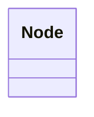

---
search:
  boost: 10.0
---

# Class: Node 


_A generic node in a KGX-formatted knowledge graph, representing a single entity or concept with a unique identifier. This class serves as the structural superclass for `named thing` in Biolink, providing the minimal KGX-compliant contract (identifier, category, etc.) that any biolink entity participating in a knowledge graph must satisfy._


<div data-search-exclude markdown="1">


URI: [namo:Node](https://w3id.org/monarch-initiative/namo/Node)





<!-- no inheritance hierarchy -->

## Slots

| Name | Cardinality and Range | Description | Inheritance |
| ---  | --- | --- | --- |


## Identifier and Mapping Information


### Schema Source


* from schema: https://w3id.org/monarch-initiative/namo


## Mappings

| Mapping Type | Mapped Value |
| ---  | ---  |
| self | namo:Node |
| native | namo:Node |


## LinkML Source

<!-- TODO: investigate https://stackoverflow.com/questions/37606292/how-to-create-tabbed-code-blocks-in-mkdocs-or-sphinx -->

### Direct

<details>
```yaml
name: Node
description: A generic node in a KGX-formatted knowledge graph, representing a single
  entity or concept with a unique identifier. This class serves as the structural
  superclass for `named thing` in Biolink, providing the minimal KGX-compliant contract
  (identifier, category, etc.) that any biolink entity participating in a knowledge
  graph must satisfy.
from_schema: https://w3id.org/monarch-initiative/namo

```
</details>

### Induced

<details>
```yaml
name: Node
description: A generic node in a KGX-formatted knowledge graph, representing a single
  entity or concept with a unique identifier. This class serves as the structural
  superclass for `named thing` in Biolink, providing the minimal KGX-compliant contract
  (identifier, category, etc.) that any biolink entity participating in a knowledge
  graph must satisfy.
from_schema: https://w3id.org/monarch-initiative/namo

```
</details></div>