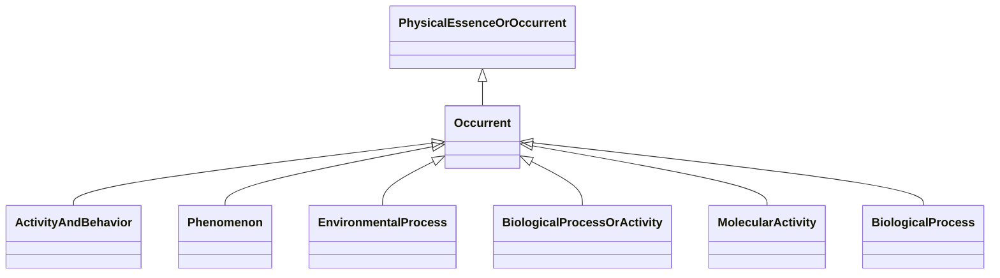

---
search:
  boost: 10.0
---

# Class: Occurrent 


_A processual entity._


<div data-search-exclude markdown="1">


URI: [namo:Occurrent](https://w3id.org/monarch-initiative/namo/Occurrent)





## Inheritance
* [PhysicalEssenceOrOccurrent](PhysicalEssenceOrOccurrent.md)
    * **Occurrent**
        * [ActivityAndBehavior](ActivityAndBehavior.md)


## Class Properties

| Property | Value |
| --- | --- |
| Mixin | Yes |


## Slots

| Name | Cardinality and Range | Description | Inheritance |
| ---  | --- | --- | --- |


## Mixin Usage

| mixed into | description |
| --- | --- |
| [Phenomenon](Phenomenon.md) | a fact or situation that is observed to exist or happen, especially one whose... |
| [EnvironmentalProcess](EnvironmentalProcess.md) | A process that occurs within or involves the components of an environmental s... |
| [BiologicalProcessOrActivity](BiologicalProcessOrActivity.md) | Either an individual molecular activity, or a collection of causally connecte... |
| [MolecularActivity](MolecularActivity.md) | An execution of a molecular function carried out by a gene product or macromo... |
| [BiologicalProcess](BiologicalProcess.md) | One or more causally connected executions of molecular functions |


## Identifier and Mapping Information


### Schema Source


* from schema: https://w3id.org/monarch-initiative/namo


## Mappings

| Mapping Type | Mapped Value |
| ---  | ---  |
| self | namo:Occurrent |
| native | namo:Occurrent |
| exact | BFO:0000003 |


## LinkML Source

<!-- TODO: investigate https://stackoverflow.com/questions/37606292/how-to-create-tabbed-code-blocks-in-mkdocs-or-sphinx -->

### Direct

<details>
```yaml
name: occurrent
description: A processual entity.
from_schema: https://w3id.org/monarch-initiative/namo
exact_mappings:
- BFO:0000003
is_a: physical essence or occurrent
mixin: true

```
</details>

### Induced

<details>
```yaml
name: occurrent
description: A processual entity.
from_schema: https://w3id.org/monarch-initiative/namo
exact_mappings:
- BFO:0000003
is_a: physical essence or occurrent
mixin: true

```
</details></div>