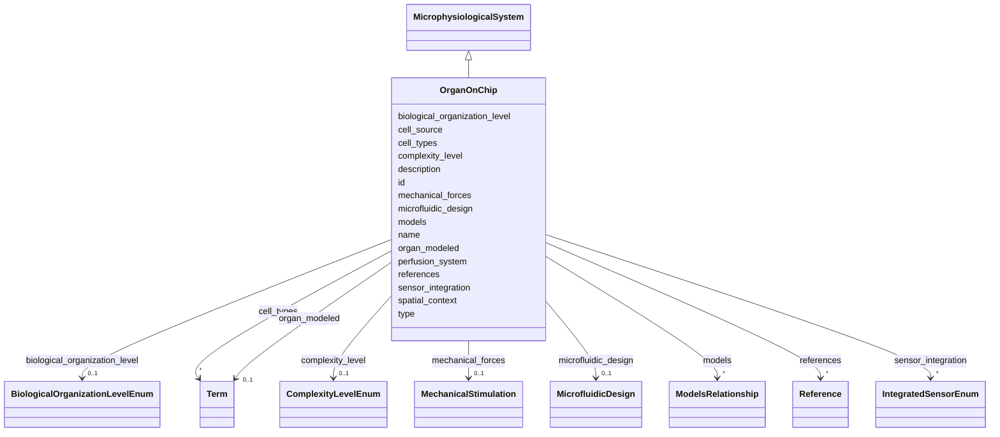

# Class: OrganOnChip 


_A model system that simulates the physiological functions of an organ using a microfluidic device. Examples: Airway-on-chip, ..._


URI: [namo:OrganOnChip](https://w3id.org/monarch-initiative/namo/OrganOnChip)





## Inheritance
* [NamedThing](NamedThing.md)
    * [ModelSystem](ModelSystem.md)
        * [NAMModel](NAMModel.md)
            * [MicrophysiologicalSystem](MicrophysiologicalSystem.md)
                * **OrganOnChip**


## Slots

| Name | Cardinality and Range | Description | Inheritance |
| ---  | --- | --- | --- |
| [organ_modeled](organ_modeled.md) | 0..1 <br/> [Term](Term.md) | The organ or anatomical structure being modeled (e | direct |
| [cell_types](cell_types.md) | * <br/> [Term](Term.md) | Cell types present in the organ-on-chip model | direct |
| [cell_source](cell_source.md) | 0..1 <br/> [String](String.md) | Source of cells (e | direct |
| [microfluidic_design](microfluidic_design.md) | 0..1 <br/> [MicrofluidicDesign](MicrofluidicDesign.md) | Detailed design specifications of the microfluidic device | [MicrophysiologicalSystem](MicrophysiologicalSystem.md) |
| [mechanical_forces](mechanical_forces.md) | 0..1 <br/> [MechanicalStimulation](MechanicalStimulation.md) | Mechanical forces applied to the model system | [MicrophysiologicalSystem](MicrophysiologicalSystem.md) |
| [perfusion_system](perfusion_system.md) | 0..1 <br/> [String](String.md) | Description of perfusion and flow systems | [MicrophysiologicalSystem](MicrophysiologicalSystem.md) |
| [sensor_integration](sensor_integration.md) | * <br/> [IntegratedSensorEnum](IntegratedSensorEnum.md) | Sensors integrated for real-time monitoring | [MicrophysiologicalSystem](MicrophysiologicalSystem.md) |
| [biological_organization_level](biological_organization_level.md) | 0..1 <br/> [BiologicalOrganizationLevelEnum](BiologicalOrganizationLevelEnum.md) | The level of biological organization represented by the model | [NAMModel](NAMModel.md) |
| [spatial_context](spatial_context.md) | 0..1 <br/> [String](String.md) | Description of spatial organization and context captured by the model | [NAMModel](NAMModel.md) |
| [complexity_level](complexity_level.md) | 0..1 <br/> [ComplexityLevelEnum](ComplexityLevelEnum.md) | Level of biological complexity represented (subcellular, cellular, tissue, or... | [NAMModel](NAMModel.md) |
| [references](references.md) | * <br/> [Reference](Reference.md) | Literature references that describe, validate, or support this model | [NAMModel](NAMModel.md) |
| [models](models.md) | * <br/> [ModelsRelationship](ModelsRelationship.md) |  | [ModelSystem](ModelSystem.md) |
| [id](id.md) | 1 <br/> [Uriorcurie](Uriorcurie.md) | A unique identifier for a thing | [NamedThing](NamedThing.md) |
| [name](name.md) | 0..1 <br/> [String](String.md) | A human-readable name for a thing | [NamedThing](NamedThing.md) |
| [description](description.md) | 0..1 <br/> [String](String.md) | A human-readable description for a thing | [NamedThing](NamedThing.md) |
| [type](type.md) | 0..1 <br/> [String](String.md) |  | [NamedThing](NamedThing.md) |


## Identifier and Mapping Information


### Schema Source


* from schema: https://w3id.org/monarch-initiative/namo


## Mappings

| Mapping Type | Mapped Value |
| ---  | ---  |
| self | namo:OrganOnChip |
| native | namo:OrganOnChip |


## LinkML Source

<!-- TODO: investigate https://stackoverflow.com/questions/37606292/how-to-create-tabbed-code-blocks-in-mkdocs-or-sphinx -->

### Direct

<details>
```yaml
name: OrganOnChip
description: 'A model system that simulates the physiological functions of an organ
  using a microfluidic device. Examples: Airway-on-chip, ...'
from_schema: https://w3id.org/monarch-initiative/namo
is_a: MicrophysiologicalSystem
attributes:
  organ_modeled:
    name: organ_modeled
    description: The organ or anatomical structure being modeled (e.g., lung, airway,
      alveolus)
    from_schema: https://w3id.org/monarch-initiative/namo
    domain_of:
    - Organoid
    - OrganOnChip
    range: Term
    bindings:
    - range: OrganEnum
      obligation_level: REQUIRED
      binds_value_of: id
    inlined: true
  cell_types:
    name: cell_types
    description: Cell types present in the organ-on-chip model
    from_schema: https://w3id.org/monarch-initiative/namo
    domain_of:
    - CellularSystem
    - OrganOnChip
    range: Term
    bindings:
    - range: CellTypeEnum
      obligation_level: REQUIRED
      binds_value_of: id
    multivalued: true
    inlined: true
    inlined_as_list: true
  cell_source:
    name: cell_source
    description: Source of cells (e.g., primary human cells, iPSC-derived, cell line,
      patient-derived)
    from_schema: https://w3id.org/monarch-initiative/namo
    domain_of:
    - CellularSystem
    - OrganOnChip

```
</details>

### Induced

<details>
```yaml
name: OrganOnChip
description: 'A model system that simulates the physiological functions of an organ
  using a microfluidic device. Examples: Airway-on-chip, ...'
from_schema: https://w3id.org/monarch-initiative/namo
is_a: MicrophysiologicalSystem
attributes:
  organ_modeled:
    name: organ_modeled
    description: The organ or anatomical structure being modeled (e.g., lung, airway,
      alveolus)
    from_schema: https://w3id.org/monarch-initiative/namo
    alias: organ_modeled
    owner: OrganOnChip
    domain_of:
    - Organoid
    - OrganOnChip
    range: Term
    bindings:
    - range: OrganEnum
      obligation_level: REQUIRED
      binds_value_of: id
    inlined: true
  cell_types:
    name: cell_types
    description: Cell types present in the organ-on-chip model
    from_schema: https://w3id.org/monarch-initiative/namo
    alias: cell_types
    owner: OrganOnChip
    domain_of:
    - CellularSystem
    - OrganOnChip
    range: Term
    bindings:
    - range: CellTypeEnum
      obligation_level: REQUIRED
      binds_value_of: id
    multivalued: true
    inlined: true
    inlined_as_list: true
  cell_source:
    name: cell_source
    description: Source of cells (e.g., primary human cells, iPSC-derived, cell line,
      patient-derived)
    from_schema: https://w3id.org/monarch-initiative/namo
    alias: cell_source
    owner: OrganOnChip
    domain_of:
    - CellularSystem
    - OrganOnChip
    range: string
  microfluidic_design:
    name: microfluidic_design
    description: Detailed design specifications of the microfluidic device
    from_schema: https://w3id.org/monarch-initiative/namo
    rank: 1000
    alias: microfluidic_design
    owner: OrganOnChip
    domain_of:
    - MicrophysiologicalSystem
    range: MicrofluidicDesign
    inlined: true
  mechanical_forces:
    name: mechanical_forces
    description: Mechanical forces applied to the model system
    from_schema: https://w3id.org/monarch-initiative/namo
    rank: 1000
    alias: mechanical_forces
    owner: OrganOnChip
    domain_of:
    - MicrophysiologicalSystem
    range: MechanicalStimulation
    inlined: true
  perfusion_system:
    name: perfusion_system
    description: Description of perfusion and flow systems
    from_schema: https://w3id.org/monarch-initiative/namo
    rank: 1000
    alias: perfusion_system
    owner: OrganOnChip
    domain_of:
    - MicrophysiologicalSystem
    range: string
  sensor_integration:
    name: sensor_integration
    description: Sensors integrated for real-time monitoring
    from_schema: https://w3id.org/monarch-initiative/namo
    rank: 1000
    alias: sensor_integration
    owner: OrganOnChip
    domain_of:
    - MicrophysiologicalSystem
    range: IntegratedSensorEnum
    multivalued: true
  biological_organization_level:
    name: biological_organization_level
    description: The level of biological organization represented by the model
    from_schema: https://w3id.org/monarch-initiative/namo
    rank: 1000
    alias: biological_organization_level
    owner: OrganOnChip
    domain_of:
    - NAMModel
    range: BiologicalOrganizationLevelEnum
  spatial_context:
    name: spatial_context
    description: Description of spatial organization and context captured by the model
    from_schema: https://w3id.org/monarch-initiative/namo
    rank: 1000
    alias: spatial_context
    owner: OrganOnChip
    domain_of:
    - NAMModel
    range: string
  complexity_level:
    name: complexity_level
    description: Level of biological complexity represented (subcellular, cellular,
      tissue, organ, system)
    from_schema: https://w3id.org/monarch-initiative/namo
    rank: 1000
    alias: complexity_level
    owner: OrganOnChip
    domain_of:
    - NAMModel
    range: ComplexityLevelEnum
  references:
    name: references
    description: Literature references that describe, validate, or support this model
    from_schema: https://w3id.org/monarch-initiative/namo
    rank: 1000
    alias: references
    owner: OrganOnChip
    domain_of:
    - NAMModel
    range: Reference
    multivalued: true
    inlined: true
    inlined_as_list: true
  models:
    name: models
    from_schema: https://w3id.org/monarch-initiative/namo
    rank: 1000
    alias: models
    owner: OrganOnChip
    domain_of:
    - ModelSystem
    range: ModelsRelationship
    multivalued: true
  id:
    name: id
    description: A unique identifier for a thing
    from_schema: https://w3id.org/monarch-initiative/namo
    rank: 1000
    slot_uri: schema:identifier
    identifier: true
    alias: id
    owner: OrganOnChip
    domain_of:
    - NamedThing
    - Reference
    range: uriorcurie
    required: true
  name:
    name: name
    description: A human-readable name for a thing
    from_schema: https://w3id.org/monarch-initiative/namo
    rank: 1000
    slot_uri: schema:name
    alias: name
    owner: OrganOnChip
    domain_of:
    - NamedThing
    range: string
  description:
    name: description
    description: A human-readable description for a thing
    from_schema: https://w3id.org/monarch-initiative/namo
    rank: 1000
    slot_uri: schema:description
    alias: description
    owner: OrganOnChip
    domain_of:
    - NamedThing
    range: string
  type:
    name: type
    from_schema: https://w3id.org/monarch-initiative/namo
    rank: 1000
    designates_type: true
    alias: type
    owner: OrganOnChip
    domain_of:
    - NamedThing
    range: string

```
</details>