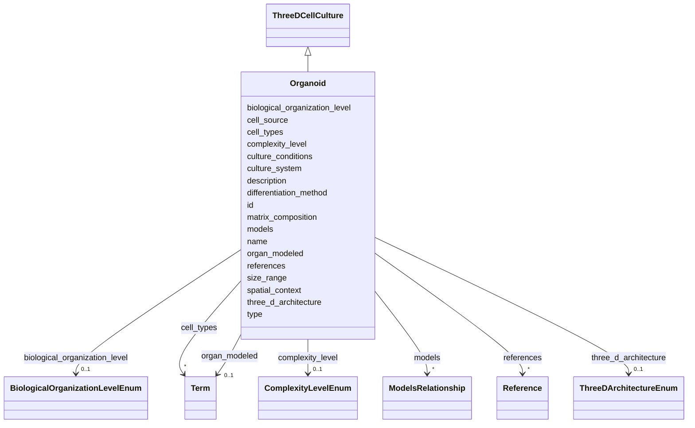

# Class: Organoid 


_A 3D cell culture system that self-organizes to recapitulate key structural and functional aspects of an organ or tissue_


URI: [namo:Organoid](https://w3id.org/monarch-initiative/namo/Organoid)





## Inheritance
* [NamedThing](NamedThing.md)
    * [ModelSystem](ModelSystem.md)
        * [NAMModel](NAMModel.md)
            * [CellularSystem](CellularSystem.md)
                * [ThreeDCellCulture](ThreeDCellCulture.md)
                    * **Organoid**


## Slots

| Name | Cardinality and Range | Description | Inheritance |
| ---  | --- | --- | --- |
| [organ_modeled](organ_modeled.md) | 0..1 <br/> [Term](Term.md) | The organ or tissue being modeled | direct |
| [differentiation_method](differentiation_method.md) | 0..1 <br/> [String](String.md) | Method used to differentiate cells into organoid (e | direct |
| [culture_system](culture_system.md) | 0..1 <br/> [String](String.md) | Culture system used (e | direct |
| [three_d_architecture](three_d_architecture.md) | 0..1 <br/> [ThreeDArchitectureEnum](ThreeDArchitectureEnum.md) | Type of 3D architecture (spheroid, organoid, scaffold-based, etc | [ThreeDCellCulture](ThreeDCellCulture.md) |
| [matrix_composition](matrix_composition.md) | 0..1 <br/> [String](String.md) | Composition of extracellular matrix or scaffold material | [ThreeDCellCulture](ThreeDCellCulture.md) |
| [size_range](size_range.md) | 0..1 <br/> [String](String.md) | Typical size range of 3D structures | [ThreeDCellCulture](ThreeDCellCulture.md) |
| [cell_types](cell_types.md) | * <br/> [Term](Term.md) | Cell types present in the cellular system | [CellularSystem](CellularSystem.md) |
| [cell_source](cell_source.md) | 0..1 <br/> [String](String.md) | Source of cells (e | [CellularSystem](CellularSystem.md) |
| [culture_conditions](culture_conditions.md) | 0..1 <br/> [String](String.md) | Standard culture conditions and media used | [CellularSystem](CellularSystem.md) |
| [biological_organization_level](biological_organization_level.md) | 0..1 <br/> [BiologicalOrganizationLevelEnum](BiologicalOrganizationLevelEnum.md) | The level of biological organization represented by the model | [NAMModel](NAMModel.md) |
| [spatial_context](spatial_context.md) | 0..1 <br/> [String](String.md) | Description of spatial organization and context captured by the model | [NAMModel](NAMModel.md) |
| [complexity_level](complexity_level.md) | 0..1 <br/> [ComplexityLevelEnum](ComplexityLevelEnum.md) | Level of biological complexity represented (subcellular, cellular, tissue, or... | [NAMModel](NAMModel.md) |
| [references](references.md) | * <br/> [Reference](Reference.md) | Literature references that describe, validate, or support this model | [NAMModel](NAMModel.md) |
| [models](models.md) | * <br/> [ModelsRelationship](ModelsRelationship.md) |  | [ModelSystem](ModelSystem.md) |
| [id](id.md) | 1 <br/> [Uriorcurie](Uriorcurie.md) | A unique identifier for a thing | [NamedThing](NamedThing.md) |
| [name](name.md) | 0..1 <br/> [String](String.md) | A human-readable name for a thing | [NamedThing](NamedThing.md) |
| [description](description.md) | 0..1 <br/> [String](String.md) | A human-readable description for a thing | [NamedThing](NamedThing.md) |
| [type](type.md) | 0..1 <br/> [String](String.md) |  | [NamedThing](NamedThing.md) |


## Identifier and Mapping Information


### Schema Source


* from schema: https://w3id.org/monarch-initiative/namo


## Mappings

| Mapping Type | Mapped Value |
| ---  | ---  |
| self | namo:Organoid |
| native | namo:Organoid |


## LinkML Source

<!-- TODO: investigate https://stackoverflow.com/questions/37606292/how-to-create-tabbed-code-blocks-in-mkdocs-or-sphinx -->

### Direct

<details>
```yaml
name: Organoid
description: A 3D cell culture system that self-organizes to recapitulate key structural
  and functional aspects of an organ or tissue
from_schema: https://w3id.org/monarch-initiative/namo
is_a: ThreeDCellCulture
attributes:
  organ_modeled:
    name: organ_modeled
    description: The organ or tissue being modeled
    from_schema: https://w3id.org/monarch-initiative/namo
    rank: 1000
    domain_of:
    - Organoid
    - OrganOnChip
    range: Term
    bindings:
    - range: OrganEnum
      obligation_level: REQUIRED
      binds_value_of: id
    inlined: true
  differentiation_method:
    name: differentiation_method
    description: Method used to differentiate cells into organoid (e.g., directed
      differentiation protocol)
    from_schema: https://w3id.org/monarch-initiative/namo
    rank: 1000
    domain_of:
    - Organoid
  culture_system:
    name: culture_system
    description: Culture system used (e.g., Matrigel dome, suspension culture, air-liquid
      interface)
    from_schema: https://w3id.org/monarch-initiative/namo
    rank: 1000
    domain_of:
    - Organoid

```
</details>

### Induced

<details>
```yaml
name: Organoid
description: A 3D cell culture system that self-organizes to recapitulate key structural
  and functional aspects of an organ or tissue
from_schema: https://w3id.org/monarch-initiative/namo
is_a: ThreeDCellCulture
attributes:
  organ_modeled:
    name: organ_modeled
    description: The organ or tissue being modeled
    from_schema: https://w3id.org/monarch-initiative/namo
    rank: 1000
    alias: organ_modeled
    owner: Organoid
    domain_of:
    - Organoid
    - OrganOnChip
    range: Term
    bindings:
    - range: OrganEnum
      obligation_level: REQUIRED
      binds_value_of: id
    inlined: true
  differentiation_method:
    name: differentiation_method
    description: Method used to differentiate cells into organoid (e.g., directed
      differentiation protocol)
    from_schema: https://w3id.org/monarch-initiative/namo
    rank: 1000
    alias: differentiation_method
    owner: Organoid
    domain_of:
    - Organoid
    range: string
  culture_system:
    name: culture_system
    description: Culture system used (e.g., Matrigel dome, suspension culture, air-liquid
      interface)
    from_schema: https://w3id.org/monarch-initiative/namo
    rank: 1000
    alias: culture_system
    owner: Organoid
    domain_of:
    - Organoid
    range: string
  three_d_architecture:
    name: three_d_architecture
    description: Type of 3D architecture (spheroid, organoid, scaffold-based, etc.)
    from_schema: https://w3id.org/monarch-initiative/namo
    rank: 1000
    alias: three_d_architecture
    owner: Organoid
    domain_of:
    - ThreeDCellCulture
    range: ThreeDArchitectureEnum
  matrix_composition:
    name: matrix_composition
    description: Composition of extracellular matrix or scaffold material
    from_schema: https://w3id.org/monarch-initiative/namo
    rank: 1000
    alias: matrix_composition
    owner: Organoid
    domain_of:
    - ThreeDCellCulture
    range: string
  size_range:
    name: size_range
    description: Typical size range of 3D structures
    from_schema: https://w3id.org/monarch-initiative/namo
    rank: 1000
    alias: size_range
    owner: Organoid
    domain_of:
    - ThreeDCellCulture
    range: string
  cell_types:
    name: cell_types
    description: Cell types present in the cellular system
    from_schema: https://w3id.org/monarch-initiative/namo
    rank: 1000
    alias: cell_types
    owner: Organoid
    domain_of:
    - CellularSystem
    - OrganOnChip
    range: Term
    bindings:
    - range: CellTypeEnum
      obligation_level: REQUIRED
      binds_value_of: id
    multivalued: true
    inlined: true
    inlined_as_list: true
  cell_source:
    name: cell_source
    description: Source of cells (e.g., primary, iPSC-derived, immortalized cell lines)
    from_schema: https://w3id.org/monarch-initiative/namo
    rank: 1000
    alias: cell_source
    owner: Organoid
    domain_of:
    - CellularSystem
    - OrganOnChip
    range: string
  culture_conditions:
    name: culture_conditions
    description: Standard culture conditions and media used
    from_schema: https://w3id.org/monarch-initiative/namo
    rank: 1000
    alias: culture_conditions
    owner: Organoid
    domain_of:
    - CellularSystem
    range: string
  biological_organization_level:
    name: biological_organization_level
    description: The level of biological organization represented by the model
    from_schema: https://w3id.org/monarch-initiative/namo
    rank: 1000
    alias: biological_organization_level
    owner: Organoid
    domain_of:
    - NAMModel
    range: BiologicalOrganizationLevelEnum
  spatial_context:
    name: spatial_context
    description: Description of spatial organization and context captured by the model
    from_schema: https://w3id.org/monarch-initiative/namo
    rank: 1000
    alias: spatial_context
    owner: Organoid
    domain_of:
    - NAMModel
    range: string
  complexity_level:
    name: complexity_level
    description: Level of biological complexity represented (subcellular, cellular,
      tissue, organ, system)
    from_schema: https://w3id.org/monarch-initiative/namo
    rank: 1000
    alias: complexity_level
    owner: Organoid
    domain_of:
    - NAMModel
    range: ComplexityLevelEnum
  references:
    name: references
    description: Literature references that describe, validate, or support this model
    from_schema: https://w3id.org/monarch-initiative/namo
    rank: 1000
    alias: references
    owner: Organoid
    domain_of:
    - NAMModel
    range: Reference
    multivalued: true
    inlined: true
    inlined_as_list: true
  models:
    name: models
    from_schema: https://w3id.org/monarch-initiative/namo
    rank: 1000
    alias: models
    owner: Organoid
    domain_of:
    - ModelSystem
    range: ModelsRelationship
    multivalued: true
  id:
    name: id
    description: A unique identifier for a thing
    from_schema: https://w3id.org/monarch-initiative/namo
    rank: 1000
    slot_uri: schema:identifier
    identifier: true
    alias: id
    owner: Organoid
    domain_of:
    - NamedThing
    - Reference
    range: uriorcurie
    required: true
  name:
    name: name
    description: A human-readable name for a thing
    from_schema: https://w3id.org/monarch-initiative/namo
    rank: 1000
    slot_uri: schema:name
    alias: name
    owner: Organoid
    domain_of:
    - NamedThing
    range: string
  description:
    name: description
    description: A human-readable description for a thing
    from_schema: https://w3id.org/monarch-initiative/namo
    rank: 1000
    slot_uri: schema:description
    alias: description
    owner: Organoid
    domain_of:
    - NamedThing
    range: string
  type:
    name: type
    from_schema: https://w3id.org/monarch-initiative/namo
    rank: 1000
    designates_type: true
    alias: type
    owner: Organoid
    domain_of:
    - NamedThing
    range: string

```
</details>