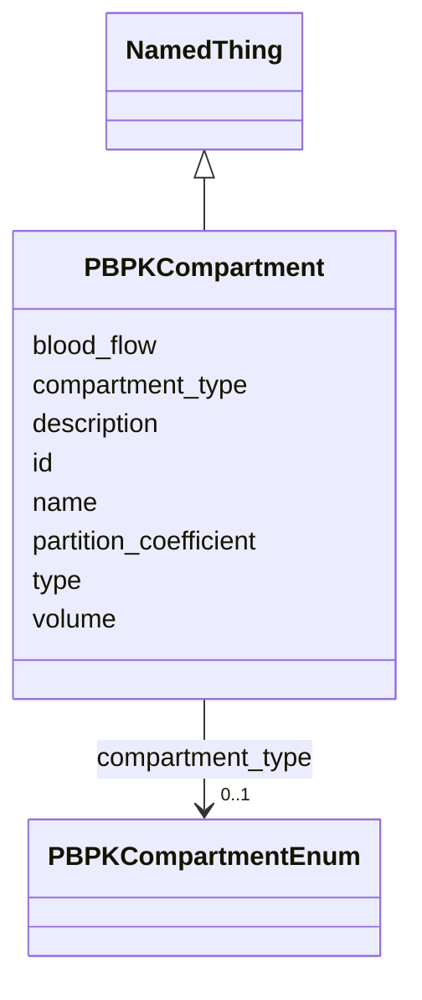

# Class: PBPKCompartment 


_A physiological compartment in a PBPK model._


URI: [namo:PBPKCompartment](https://w3id.org/monarch-initiative/namo/PBPKCompartment)





## Inheritance
* [NamedThing](NamedThing.md)
    * **PBPKCompartment**


## Slots

| Name | Cardinality and Range | Description | Inheritance |
| ---  | --- | --- | --- |
| [compartment_type](compartment_type.md) | 0..1 <br/> [PBPKCompartmentEnum](PBPKCompartmentEnum.md) | Type of physiological compartment | direct |
| [volume](volume.md) | 0..1 <br/> [Float](Float.md) | Volume of the compartment (L) | direct |
| [blood_flow](blood_flow.md) | 0..1 <br/> [Float](Float.md) | Blood flow to the compartment (L/h) | direct |
| [partition_coefficient](partition_coefficient.md) | 0..1 <br/> [Float](Float.md) | Tissue-to-plasma partition coefficient | direct |
| [id](id.md) | 1 <br/> [Uriorcurie](Uriorcurie.md) | A unique identifier for a thing | [NamedThing](NamedThing.md) |
| [name](name.md) | 0..1 <br/> [String](String.md) | A human-readable name for a thing | [NamedThing](NamedThing.md) |
| [description](description.md) | 0..1 <br/> [String](String.md) | A human-readable description for a thing | [NamedThing](NamedThing.md) |
| [type](type.md) | 0..1 <br/> [String](String.md) |  | [NamedThing](NamedThing.md) |


## Usages

| used by | used in | type | used |
| ---  | --- | --- | --- |
| [PBPKModel](PBPKModel.md) | [compartments](compartments.md) | range | [PBPKCompartment](PBPKCompartment.md) |


## Identifier and Mapping Information


### Schema Source


* from schema: https://w3id.org/monarch-initiative/namo


## Mappings

| Mapping Type | Mapped Value |
| ---  | ---  |
| self | namo:PBPKCompartment |
| native | namo:PBPKCompartment |


## LinkML Source

<!-- TODO: investigate https://stackoverflow.com/questions/37606292/how-to-create-tabbed-code-blocks-in-mkdocs-or-sphinx -->

### Direct

<details>
```yaml
name: PBPKCompartment
description: A physiological compartment in a PBPK model.
from_schema: https://w3id.org/monarch-initiative/namo
is_a: NamedThing
attributes:
  compartment_type:
    name: compartment_type
    description: Type of physiological compartment
    from_schema: https://w3id.org/monarch-initiative/namo
    rank: 1000
    domain_of:
    - PBPKCompartment
    range: PBPKCompartmentEnum
  volume:
    name: volume
    description: Volume of the compartment (L)
    from_schema: https://w3id.org/monarch-initiative/namo
    rank: 1000
    domain_of:
    - PBPKCompartment
    range: float
  blood_flow:
    name: blood_flow
    description: Blood flow to the compartment (L/h)
    from_schema: https://w3id.org/monarch-initiative/namo
    rank: 1000
    domain_of:
    - PBPKCompartment
    range: float
  partition_coefficient:
    name: partition_coefficient
    description: Tissue-to-plasma partition coefficient
    from_schema: https://w3id.org/monarch-initiative/namo
    rank: 1000
    domain_of:
    - PBPKCompartment
    range: float

```
</details>

### Induced

<details>
```yaml
name: PBPKCompartment
description: A physiological compartment in a PBPK model.
from_schema: https://w3id.org/monarch-initiative/namo
is_a: NamedThing
attributes:
  compartment_type:
    name: compartment_type
    description: Type of physiological compartment
    from_schema: https://w3id.org/monarch-initiative/namo
    rank: 1000
    alias: compartment_type
    owner: PBPKCompartment
    domain_of:
    - PBPKCompartment
    range: PBPKCompartmentEnum
  volume:
    name: volume
    description: Volume of the compartment (L)
    from_schema: https://w3id.org/monarch-initiative/namo
    rank: 1000
    alias: volume
    owner: PBPKCompartment
    domain_of:
    - PBPKCompartment
    range: float
  blood_flow:
    name: blood_flow
    description: Blood flow to the compartment (L/h)
    from_schema: https://w3id.org/monarch-initiative/namo
    rank: 1000
    alias: blood_flow
    owner: PBPKCompartment
    domain_of:
    - PBPKCompartment
    range: float
  partition_coefficient:
    name: partition_coefficient
    description: Tissue-to-plasma partition coefficient
    from_schema: https://w3id.org/monarch-initiative/namo
    rank: 1000
    alias: partition_coefficient
    owner: PBPKCompartment
    domain_of:
    - PBPKCompartment
    range: float
  id:
    name: id
    description: A unique identifier for a thing
    from_schema: https://w3id.org/monarch-initiative/namo
    rank: 1000
    slot_uri: schema:identifier
    identifier: true
    alias: id
    owner: PBPKCompartment
    domain_of:
    - NamedThing
    - Reference
    range: uriorcurie
    required: true
  name:
    name: name
    description: A human-readable name for a thing
    from_schema: https://w3id.org/monarch-initiative/namo
    rank: 1000
    slot_uri: schema:name
    alias: name
    owner: PBPKCompartment
    domain_of:
    - NamedThing
    range: string
  description:
    name: description
    description: A human-readable description for a thing
    from_schema: https://w3id.org/monarch-initiative/namo
    rank: 1000
    slot_uri: schema:description
    alias: description
    owner: PBPKCompartment
    domain_of:
    - NamedThing
    range: string
  type:
    name: type
    from_schema: https://w3id.org/monarch-initiative/namo
    rank: 1000
    designates_type: true
    alias: type
    owner: PBPKCompartment
    domain_of:
    - NamedThing
    range: string

```
</details>