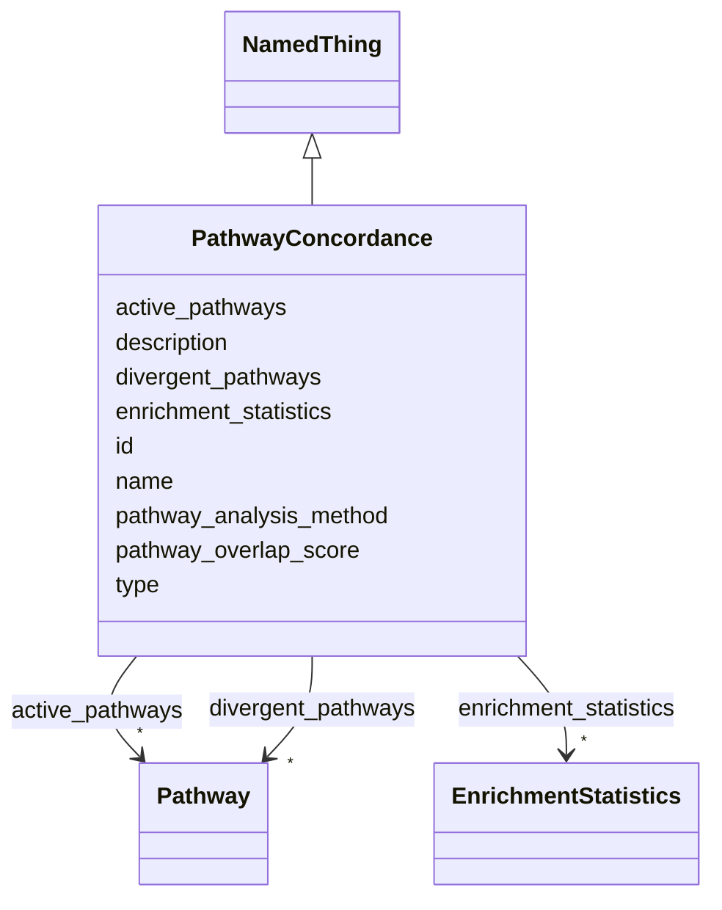

# Class: PathwayConcordance 


_Assessment of biological pathway conservation and activity between model and biological systems._


URI: [namo:PathwayConcordance](https://w3id.org/monarch-initiative/namo/PathwayConcordance)





## Inheritance
* [NamedThing](NamedThing.md)
    * **PathwayConcordance**


## Slots

| Name | Cardinality and Range | Description | Inheritance |
| ---  | --- | --- | --- |
| [pathway_overlap_score](pathway_overlap_score.md) | 0..1 <br/> [Float](Float.md) | Quantitative score (0 | direct |
| [active_pathways](active_pathways.md) | * <br/> [Pathway](Pathway.md) | List of biological pathways that are active in both systems | direct |
| [divergent_pathways](divergent_pathways.md) | * <br/> [Pathway](Pathway.md) | List of pathways that show different activity patterns | direct |
| [pathway_analysis_method](pathway_analysis_method.md) | 0..1 <br/> [String](String.md) | Method used for pathway analysis (e | direct |
| [enrichment_statistics](enrichment_statistics.md) | * <br/> [EnrichmentStatistics](EnrichmentStatistics.md) | Statistical measures of pathway enrichment | direct |
| [id](id.md) | 1 <br/> [Uriorcurie](Uriorcurie.md) | A unique identifier for a thing | [NamedThing](NamedThing.md) |
| [name](name.md) | 0..1 <br/> [String](String.md) | A human-readable name for a thing | [NamedThing](NamedThing.md) |
| [description](description.md) | 0..1 <br/> [String](String.md) | A human-readable description for a thing | [NamedThing](NamedThing.md) |
| [type](type.md) | 0..1 <br/> [String](String.md) |  | [NamedThing](NamedThing.md) |


## Usages

| used by | used in | type | used |
| ---  | --- | --- | --- |
| [StructuredConcordanceResult](StructuredConcordanceResult.md) | [pathway_concordance](pathway_concordance.md) | range | [PathwayConcordance](PathwayConcordance.md) |


## Identifier and Mapping Information


### Schema Source


* from schema: https://w3id.org/monarch-initiative/namo


## Mappings

| Mapping Type | Mapped Value |
| ---  | ---  |
| self | namo:PathwayConcordance |
| native | namo:PathwayConcordance |


## LinkML Source

<!-- TODO: investigate https://stackoverflow.com/questions/37606292/how-to-create-tabbed-code-blocks-in-mkdocs-or-sphinx -->

### Direct

<details>
```yaml
name: PathwayConcordance
description: Assessment of biological pathway conservation and activity between model
  and biological systems.
from_schema: https://w3id.org/monarch-initiative/namo
is_a: NamedThing
attributes:
  pathway_overlap_score:
    name: pathway_overlap_score
    description: Quantitative score (0.0-1.0) representing pathway overlap.
    from_schema: https://w3id.org/monarch-initiative/namo
    rank: 1000
    domain_of:
    - PathwayConcordance
    range: float
  active_pathways:
    name: active_pathways
    description: List of biological pathways that are active in both systems.
    from_schema: https://w3id.org/monarch-initiative/namo
    rank: 1000
    domain_of:
    - PathwayConcordance
    range: Pathway
    multivalued: true
    inlined: true
    inlined_as_list: true
  divergent_pathways:
    name: divergent_pathways
    description: List of pathways that show different activity patterns.
    from_schema: https://w3id.org/monarch-initiative/namo
    rank: 1000
    domain_of:
    - PathwayConcordance
    range: Pathway
    multivalued: true
    inlined: true
    inlined_as_list: true
  pathway_analysis_method:
    name: pathway_analysis_method
    description: Method used for pathway analysis (e.g., GSEA, Over-representation
      analysis).
    from_schema: https://w3id.org/monarch-initiative/namo
    rank: 1000
    domain_of:
    - PathwayConcordance
  enrichment_statistics:
    name: enrichment_statistics
    description: Statistical measures of pathway enrichment.
    from_schema: https://w3id.org/monarch-initiative/namo
    rank: 1000
    domain_of:
    - PathwayConcordance
    range: EnrichmentStatistics
    multivalued: true
    inlined: true
    inlined_as_list: true

```
</details>

### Induced

<details>
```yaml
name: PathwayConcordance
description: Assessment of biological pathway conservation and activity between model
  and biological systems.
from_schema: https://w3id.org/monarch-initiative/namo
is_a: NamedThing
attributes:
  pathway_overlap_score:
    name: pathway_overlap_score
    description: Quantitative score (0.0-1.0) representing pathway overlap.
    from_schema: https://w3id.org/monarch-initiative/namo
    rank: 1000
    alias: pathway_overlap_score
    owner: PathwayConcordance
    domain_of:
    - PathwayConcordance
    range: float
  active_pathways:
    name: active_pathways
    description: List of biological pathways that are active in both systems.
    from_schema: https://w3id.org/monarch-initiative/namo
    rank: 1000
    alias: active_pathways
    owner: PathwayConcordance
    domain_of:
    - PathwayConcordance
    range: Pathway
    multivalued: true
    inlined: true
    inlined_as_list: true
  divergent_pathways:
    name: divergent_pathways
    description: List of pathways that show different activity patterns.
    from_schema: https://w3id.org/monarch-initiative/namo
    rank: 1000
    alias: divergent_pathways
    owner: PathwayConcordance
    domain_of:
    - PathwayConcordance
    range: Pathway
    multivalued: true
    inlined: true
    inlined_as_list: true
  pathway_analysis_method:
    name: pathway_analysis_method
    description: Method used for pathway analysis (e.g., GSEA, Over-representation
      analysis).
    from_schema: https://w3id.org/monarch-initiative/namo
    rank: 1000
    alias: pathway_analysis_method
    owner: PathwayConcordance
    domain_of:
    - PathwayConcordance
    range: string
  enrichment_statistics:
    name: enrichment_statistics
    description: Statistical measures of pathway enrichment.
    from_schema: https://w3id.org/monarch-initiative/namo
    rank: 1000
    alias: enrichment_statistics
    owner: PathwayConcordance
    domain_of:
    - PathwayConcordance
    range: EnrichmentStatistics
    multivalued: true
    inlined: true
    inlined_as_list: true
  id:
    name: id
    description: A unique identifier for a thing
    from_schema: https://w3id.org/monarch-initiative/namo
    rank: 1000
    slot_uri: schema:identifier
    identifier: true
    alias: id
    owner: PathwayConcordance
    domain_of:
    - NamedThing
    - Reference
    range: uriorcurie
    required: true
  name:
    name: name
    description: A human-readable name for a thing
    from_schema: https://w3id.org/monarch-initiative/namo
    rank: 1000
    slot_uri: schema:name
    alias: name
    owner: PathwayConcordance
    domain_of:
    - NamedThing
    range: string
  description:
    name: description
    description: A human-readable description for a thing
    from_schema: https://w3id.org/monarch-initiative/namo
    rank: 1000
    slot_uri: schema:description
    alias: description
    owner: PathwayConcordance
    domain_of:
    - NamedThing
    range: string
  type:
    name: type
    from_schema: https://w3id.org/monarch-initiative/namo
    rank: 1000
    designates_type: true
    alias: type
    owner: PathwayConcordance
    domain_of:
    - NamedThing
    range: string

```
</details>