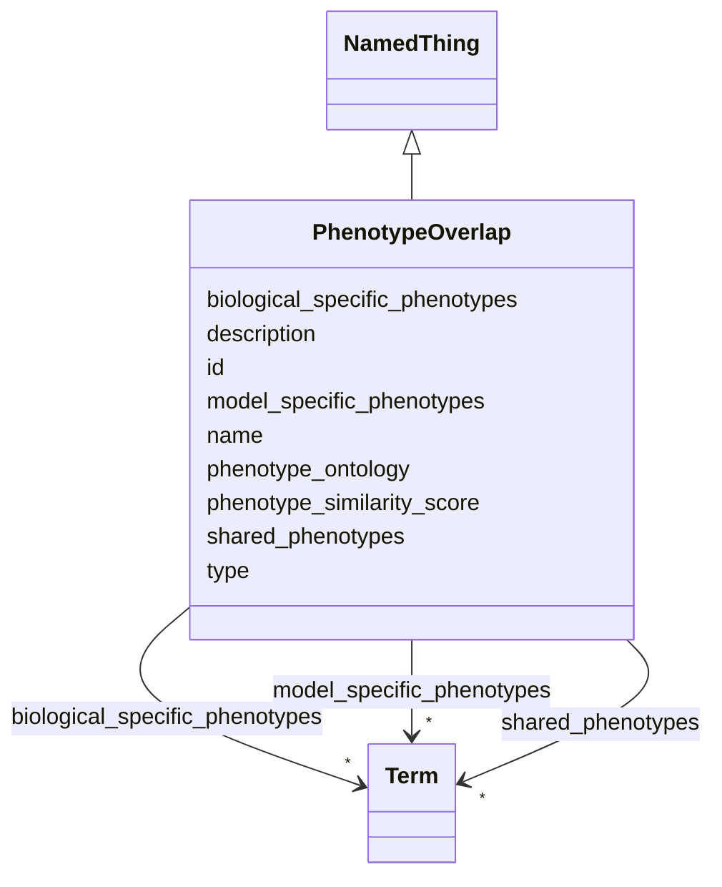

# Class: PhenotypeOverlap 


_Comparison of phenotypic manifestations between model and biological systems._


URI: [namo:PhenotypeOverlap](https://w3id.org/monarch-initiative/namo/PhenotypeOverlap)





## Inheritance
* [NamedThing](NamedThing.md)
    * **PhenotypeOverlap**


## Slots

| Name | Cardinality and Range | Description | Inheritance |
| ---  | --- | --- | --- |
| [phenotype_similarity_score](phenotype_similarity_score.md) | 0..1 <br/> [Float](Float.md) | Quantitative score (0 | direct |
| [shared_phenotypes](shared_phenotypes.md) | * <br/> [Term](Term.md) | List of phenotypes present in both model and biological system | direct |
| [model_specific_phenotypes](model_specific_phenotypes.md) | * <br/> [Term](Term.md) | List of phenotypes present only in the model system | direct |
| [biological_specific_phenotypes](biological_specific_phenotypes.md) | * <br/> [Term](Term.md) | List of phenotypes present only in the biological system | direct |
| [phenotype_ontology](phenotype_ontology.md) | 0..1 <br/> [String](String.md) | Ontology used for phenotype classification (e | direct |
| [id](id.md) | 1 <br/> [Uriorcurie](Uriorcurie.md) | A unique identifier for a thing | [NamedThing](NamedThing.md) |
| [name](name.md) | 0..1 <br/> [String](String.md) | A human-readable name for a thing | [NamedThing](NamedThing.md) |
| [description](description.md) | 0..1 <br/> [String](String.md) | A human-readable description for a thing | [NamedThing](NamedThing.md) |
| [type](type.md) | 0..1 <br/> [String](String.md) |  | [NamedThing](NamedThing.md) |


## Usages

| used by | used in | type | used |
| ---  | --- | --- | --- |
| [StructuredConcordanceResult](StructuredConcordanceResult.md) | [phenotype_overlap](phenotype_overlap.md) | range | [PhenotypeOverlap](PhenotypeOverlap.md) |


## Identifier and Mapping Information


### Schema Source


* from schema: https://w3id.org/monarch-initiative/namo


## Mappings

| Mapping Type | Mapped Value |
| ---  | ---  |
| self | namo:PhenotypeOverlap |
| native | namo:PhenotypeOverlap |


## LinkML Source

<!-- TODO: investigate https://stackoverflow.com/questions/37606292/how-to-create-tabbed-code-blocks-in-mkdocs-or-sphinx -->

### Direct

<details>
```yaml
name: PhenotypeOverlap
description: Comparison of phenotypic manifestations between model and biological
  systems.
from_schema: https://w3id.org/monarch-initiative/namo
is_a: NamedThing
attributes:
  phenotype_similarity_score:
    name: phenotype_similarity_score
    description: Quantitative score (0.0-1.0) representing phenotypic similarity.
    from_schema: https://w3id.org/monarch-initiative/namo
    rank: 1000
    domain_of:
    - PhenotypeOverlap
    range: float
  shared_phenotypes:
    name: shared_phenotypes
    description: List of phenotypes present in both model and biological system.
    from_schema: https://w3id.org/monarch-initiative/namo
    rank: 1000
    domain_of:
    - PhenotypeOverlap
    range: Term
    multivalued: true
    inlined: true
    inlined_as_list: true
  model_specific_phenotypes:
    name: model_specific_phenotypes
    description: List of phenotypes present only in the model system.
    from_schema: https://w3id.org/monarch-initiative/namo
    rank: 1000
    domain_of:
    - PhenotypeOverlap
    range: Term
    multivalued: true
    inlined: true
    inlined_as_list: true
  biological_specific_phenotypes:
    name: biological_specific_phenotypes
    description: List of phenotypes present only in the biological system.
    from_schema: https://w3id.org/monarch-initiative/namo
    rank: 1000
    domain_of:
    - PhenotypeOverlap
    range: Term
    multivalued: true
    inlined: true
    inlined_as_list: true
  phenotype_ontology:
    name: phenotype_ontology
    description: Ontology used for phenotype classification (e.g., HPO, MP).
    from_schema: https://w3id.org/monarch-initiative/namo
    rank: 1000
    domain_of:
    - PhenotypeOverlap

```
</details>

### Induced

<details>
```yaml
name: PhenotypeOverlap
description: Comparison of phenotypic manifestations between model and biological
  systems.
from_schema: https://w3id.org/monarch-initiative/namo
is_a: NamedThing
attributes:
  phenotype_similarity_score:
    name: phenotype_similarity_score
    description: Quantitative score (0.0-1.0) representing phenotypic similarity.
    from_schema: https://w3id.org/monarch-initiative/namo
    rank: 1000
    alias: phenotype_similarity_score
    owner: PhenotypeOverlap
    domain_of:
    - PhenotypeOverlap
    range: float
  shared_phenotypes:
    name: shared_phenotypes
    description: List of phenotypes present in both model and biological system.
    from_schema: https://w3id.org/monarch-initiative/namo
    rank: 1000
    alias: shared_phenotypes
    owner: PhenotypeOverlap
    domain_of:
    - PhenotypeOverlap
    range: Term
    multivalued: true
    inlined: true
    inlined_as_list: true
  model_specific_phenotypes:
    name: model_specific_phenotypes
    description: List of phenotypes present only in the model system.
    from_schema: https://w3id.org/monarch-initiative/namo
    rank: 1000
    alias: model_specific_phenotypes
    owner: PhenotypeOverlap
    domain_of:
    - PhenotypeOverlap
    range: Term
    multivalued: true
    inlined: true
    inlined_as_list: true
  biological_specific_phenotypes:
    name: biological_specific_phenotypes
    description: List of phenotypes present only in the biological system.
    from_schema: https://w3id.org/monarch-initiative/namo
    rank: 1000
    alias: biological_specific_phenotypes
    owner: PhenotypeOverlap
    domain_of:
    - PhenotypeOverlap
    range: Term
    multivalued: true
    inlined: true
    inlined_as_list: true
  phenotype_ontology:
    name: phenotype_ontology
    description: Ontology used for phenotype classification (e.g., HPO, MP).
    from_schema: https://w3id.org/monarch-initiative/namo
    rank: 1000
    alias: phenotype_ontology
    owner: PhenotypeOverlap
    domain_of:
    - PhenotypeOverlap
    range: string
  id:
    name: id
    description: A unique identifier for a thing
    from_schema: https://w3id.org/monarch-initiative/namo
    rank: 1000
    slot_uri: schema:identifier
    identifier: true
    alias: id
    owner: PhenotypeOverlap
    domain_of:
    - NamedThing
    - Reference
    range: uriorcurie
    required: true
  name:
    name: name
    description: A human-readable name for a thing
    from_schema: https://w3id.org/monarch-initiative/namo
    rank: 1000
    slot_uri: schema:name
    alias: name
    owner: PhenotypeOverlap
    domain_of:
    - NamedThing
    range: string
  description:
    name: description
    description: A human-readable description for a thing
    from_schema: https://w3id.org/monarch-initiative/namo
    rank: 1000
    slot_uri: schema:description
    alias: description
    owner: PhenotypeOverlap
    domain_of:
    - NamedThing
    range: string
  type:
    name: type
    from_schema: https://w3id.org/monarch-initiative/namo
    rank: 1000
    designates_type: true
    alias: type
    owner: PhenotypeOverlap
    domain_of:
    - NamedThing
    range: string

```
</details>