---
search:
  boost: 10.0
---

# Class: PhenotypicFeatureToEntityAssociationMixin 


_A mixin applied to any association whose subject (source node) is a phenotypic feature._


<div data-search-exclude markdown="1">


URI: [namo:PhenotypicFeatureToEntityAssociationMixin](https://w3id.org/monarch-initiative/namo/PhenotypicFeatureToEntityAssociationMixin)

```mermaid
 classDiagram
    class PhenotypicFeatureToEntityAssociationMixin
    click PhenotypicFeatureToEntityAssociationMixin href "../PhenotypicFeatureToEntityAssociationMixin/"
      FrequencyQuantifier <|-- PhenotypicFeatureToEntityAssociationMixin
        click FrequencyQuantifier href "../FrequencyQuantifier/"
      FeatureOrDiseaseQualifiersToEntityMixin <|-- PhenotypicFeatureToEntityAssociationMixin
        click FeatureOrDiseaseQualifiersToEntityMixin href "../FeatureOrDiseaseQualifiersToEntityMixin/"
      

      PhenotypicFeatureToEntityAssociationMixin <|-- PhenotypicFeatureToPhenotypicFeatureAssociation
        click PhenotypicFeatureToPhenotypicFeatureAssociation href "../PhenotypicFeatureToPhenotypicFeatureAssociation/"
      PhenotypicFeatureToEntityAssociationMixin <|-- PhenotypicFeatureToDiseaseAssociation
        click PhenotypicFeatureToDiseaseAssociation href "../PhenotypicFeatureToDiseaseAssociation/"
      

      PhenotypicFeatureToEntityAssociationMixin : frequency_qualifier
        
      PhenotypicFeatureToEntityAssociationMixin : has_count
        
      PhenotypicFeatureToEntityAssociationMixin : has_percentage
        
      PhenotypicFeatureToEntityAssociationMixin : has_quotient
        
      PhenotypicFeatureToEntityAssociationMixin : has_total
        
      PhenotypicFeatureToEntityAssociationMixin : object
        
          
    
        
        
        PhenotypicFeatureToEntityAssociationMixin --> "1" NamedThing : object
        click NamedThing href "../NamedThing/"
    

        
      PhenotypicFeatureToEntityAssociationMixin : object_aspect_qualifier
        
          
    
        
        
        PhenotypicFeatureToEntityAssociationMixin --> "0..1" GeneOrGeneProductOrChemicalEntityAspectEnum : object_aspect_qualifier
        click GeneOrGeneProductOrChemicalEntityAspectEnum href "../GeneOrGeneProductOrChemicalEntityAspectEnum/"
    

        
      PhenotypicFeatureToEntityAssociationMixin : object_direction_qualifier
        
          
    
        
        
        PhenotypicFeatureToEntityAssociationMixin --> "0..1" DirectionQualifierEnum : object_direction_qualifier
        click DirectionQualifierEnum href "../DirectionQualifierEnum/"
    

        
      PhenotypicFeatureToEntityAssociationMixin : predicate
        
      PhenotypicFeatureToEntityAssociationMixin : qualified_predicate
        
      PhenotypicFeatureToEntityAssociationMixin : sex_qualifier
        
          
    
        
        
        PhenotypicFeatureToEntityAssociationMixin --> "0..1" BiologicalSex : sex_qualifier
        click BiologicalSex href "../BiologicalSex/"
    

        
      PhenotypicFeatureToEntityAssociationMixin : subject
        
          
    
        
        
        PhenotypicFeatureToEntityAssociationMixin --> "1" PhenotypicFeature : subject
        click PhenotypicFeature href "../PhenotypicFeature/"
    

        
      PhenotypicFeatureToEntityAssociationMixin : subject_aspect_qualifier
        
          
    
        
        
        PhenotypicFeatureToEntityAssociationMixin --> "0..1" GeneOrGeneProductOrChemicalEntityAspectEnum : subject_aspect_qualifier
        click GeneOrGeneProductOrChemicalEntityAspectEnum href "../GeneOrGeneProductOrChemicalEntityAspectEnum/"
    

        
      PhenotypicFeatureToEntityAssociationMixin : subject_direction_qualifier
        
          
    
        
        
        PhenotypicFeatureToEntityAssociationMixin --> "0..1" DirectionQualifierEnum : subject_direction_qualifier
        click DirectionQualifierEnum href "../DirectionQualifierEnum/"
    

        
      
```





## Inheritance
* [FrequencyQualifierMixin](FrequencyQualifierMixin.md)
    * [FeatureOrDiseaseQualifiersToEntityMixin](FeatureOrDiseaseQualifiersToEntityMixin.md)
        * **PhenotypicFeatureToEntityAssociationMixin** [ [FrequencyQuantifier](FrequencyQuantifier.md)]


## Class Properties

| Property | Value |
| --- | --- |
| Mixin | Yes |


## Slots

| Name | Cardinality and Range | Description | Inheritance |
| ---  | --- | --- | --- |
| [sex_qualifier](sex_qualifier.md) | 0..1 <br/> [BiologicalSex](BiologicalSex.md) | a qualifier used in a phenotypic association to state whether the association... | direct |
| [has_count](has_count.md) | 0..1 <br/> [Integer](Integer.md) | number of things with a particular property | [FrequencyQuantifier](FrequencyQuantifier.md) |
| [has_total](has_total.md) | 0..1 <br/> [Integer](Integer.md) | total number of things in a particular reference set | [FrequencyQuantifier](FrequencyQuantifier.md) |
| [has_quotient](has_quotient.md) | 0..1 <br/> [Double](Double.md) |  | [FrequencyQuantifier](FrequencyQuantifier.md) |
| [has_percentage](has_percentage.md) | 0..1 <br/> [Double](Double.md) | equivalent to has quotient multiplied by 100 | [FrequencyQuantifier](FrequencyQuantifier.md) |
| [subject_aspect_qualifier](subject_aspect_qualifier.md) | 0..1 <br/> [GeneOrGeneProductOrChemicalEntityAspectEnum](GeneOrGeneProductOrChemicalEntityAspectEnum.md) | Composes with the core concept to describe new concepts of a different ontolo... | [FeatureOrDiseaseQualifiersToEntityMixin](FeatureOrDiseaseQualifiersToEntityMixin.md) |
| [subject_direction_qualifier](subject_direction_qualifier.md) | 0..1 <br/> [DirectionQualifierEnum](DirectionQualifierEnum.md) | Composes with the core concept (+ aspect if provided) to describe a change in... | [FeatureOrDiseaseQualifiersToEntityMixin](FeatureOrDiseaseQualifiersToEntityMixin.md) |
| [object_aspect_qualifier](object_aspect_qualifier.md) | 0..1 <br/> [GeneOrGeneProductOrChemicalEntityAspectEnum](GeneOrGeneProductOrChemicalEntityAspectEnum.md) | Composes with the core concept to describe new concepts of a different ontolo... | [FeatureOrDiseaseQualifiersToEntityMixin](FeatureOrDiseaseQualifiersToEntityMixin.md) |
| [object_direction_qualifier](object_direction_qualifier.md) | 0..1 <br/> [DirectionQualifierEnum](DirectionQualifierEnum.md) | Composes with the core concept (+ aspect if provided) to describe a change in... | [FeatureOrDiseaseQualifiersToEntityMixin](FeatureOrDiseaseQualifiersToEntityMixin.md) |
| [qualified_predicate](qualified_predicate.md) | 0..1 <br/> [Uriorcurie](Uriorcurie.md) | Predicate to be used in an association when subject and object qualifiers are... | [FeatureOrDiseaseQualifiersToEntityMixin](FeatureOrDiseaseQualifiersToEntityMixin.md) |
| [frequency_qualifier](frequency_qualifier.md) | 0..1 <br/> [FrequencyValue](FrequencyValue.md) | a qualifier used in a phenotypic association to state how frequent the phenot... | [FrequencyQualifierMixin](FrequencyQualifierMixin.md) |
| [subject](subject.md) | 1 <br/> [PhenotypicFeature](PhenotypicFeature.md) | connects an association to the subject of the association | [FrequencyQualifierMixin](FrequencyQualifierMixin.md) |
| [predicate](predicate.md) | 1 <br/> [Uriorcurie](Uriorcurie.md) | Has a value from the Biolink 'related_to' hierarchy | [FrequencyQualifierMixin](FrequencyQualifierMixin.md) |
| [object](object.md) | 1 <br/> [NamedThing](NamedThing.md) | connects an association to the object of the association | [FrequencyQualifierMixin](FrequencyQualifierMixin.md) |

## Defining Slots

This class is defined by the following slots:


* [subject](subject.md)


## Mixin Usage

| mixed into | description |
| --- | --- |
| [PhenotypicFeatureToPhenotypicFeatureAssociation](PhenotypicFeatureToPhenotypicFeatureAssociation.md) | Association between two concept nodes of phenotypic character, qualified by t... |
| [PhenotypicFeatureToDiseaseAssociation](PhenotypicFeatureToDiseaseAssociation.md) | An association between a phenotypic feature (sign or symptom) and a disease, ... |


## Identifier and Mapping Information


### Schema Source


* from schema: https://w3id.org/monarch-initiative/namo


## Mappings

| Mapping Type | Mapped Value |
| ---  | ---  |
| self | namo:PhenotypicFeatureToEntityAssociationMixin |
| native | namo:PhenotypicFeatureToEntityAssociationMixin |


## LinkML Source

<!-- TODO: investigate https://stackoverflow.com/questions/37606292/how-to-create-tabbed-code-blocks-in-mkdocs-or-sphinx -->

### Direct

<details>
```yaml
name: phenotypic feature to entity association mixin
description: A mixin applied to any association whose subject (source node) is a phenotypic
  feature.
from_schema: https://w3id.org/monarch-initiative/namo
is_a: feature or disease qualifiers to entity mixin
mixin: true
mixins:
- frequency quantifier
slots:
- sex qualifier
slot_usage:
  subject:
    name: subject
    examples:
    - value: HP:0002487
      description: Hyperkinesis
    - value: WBPhenotype:0000180
      description: axon morphology variant
    - value: MP:0001569
      description: abnormal circulating bilirubin level
    values_from:
    - upheno
    - hp
    - mp
    - wbphenotype
    range: phenotypic feature
defining_slots:
- subject

```
</details>

### Induced

<details>
```yaml
name: phenotypic feature to entity association mixin
description: A mixin applied to any association whose subject (source node) is a phenotypic
  feature.
from_schema: https://w3id.org/monarch-initiative/namo
is_a: feature or disease qualifiers to entity mixin
mixin: true
mixins:
- frequency quantifier
slot_usage:
  subject:
    name: subject
    examples:
    - value: HP:0002487
      description: Hyperkinesis
    - value: WBPhenotype:0000180
      description: axon morphology variant
    - value: MP:0001569
      description: abnormal circulating bilirubin level
    values_from:
    - upheno
    - hp
    - mp
    - wbphenotype
    range: phenotypic feature
attributes:
  sex qualifier:
    name: sex qualifier
    description: a qualifier used in a phenotypic association to state whether the
      association is specific to a particular sex.
    in_subset:
    - translator_minimal
    from_schema: https://w3id.org/monarch-initiative/namo
    rank: 1000
    is_a: qualifier
    domain: association
    alias: sex_qualifier
    owner: phenotypic feature to entity association mixin
    domain_of:
    - entity to phenotypic feature association mixin
    - phenotypic feature to entity association mixin
    range: biological sex
  has count:
    name: has count
    description: number of things with a particular property
    from_schema: https://w3id.org/monarch-initiative/namo
    exact_mappings:
    - LOINC:has_count
    rank: 1000
    is_a: aggregate statistic
    domain: named thing
    alias: has_count
    owner: phenotypic feature to entity association mixin
    domain_of:
    - frequency quantifier
    range: integer
  has total:
    name: has total
    description: total number of things in a particular reference set
    from_schema: https://w3id.org/monarch-initiative/namo
    rank: 1000
    is_a: aggregate statistic
    domain: named thing
    alias: has_total
    owner: phenotypic feature to entity association mixin
    domain_of:
    - frequency quantifier
    range: integer
  has quotient:
    name: has quotient
    from_schema: https://w3id.org/monarch-initiative/namo
    rank: 1000
    is_a: aggregate statistic
    domain: named thing
    alias: has_quotient
    owner: phenotypic feature to entity association mixin
    domain_of:
    - frequency quantifier
    range: double
  has percentage:
    name: has percentage
    description: equivalent to has quotient multiplied by 100
    from_schema: https://w3id.org/monarch-initiative/namo
    rank: 1000
    is_a: aggregate statistic
    domain: named thing
    alias: has_percentage
    owner: phenotypic feature to entity association mixin
    domain_of:
    - frequency quantifier
    range: double
  subject aspect qualifier:
    name: subject aspect qualifier
    description: 'Composes with the core concept to describe new concepts of a different
      ontological type. e.g. a process in which the core concept participates, a function/activity/role
      held by the core concept, or a characteristic/quality that inheres in the core
      concept.  The purpose of the aspect slot is to indicate what aspect is being
      affected in an ''affects'' association.  This qualifier specifies a change in
      the subject of an association (aka: statement).'
    examples:
    - value: stability
    - value: abundance
    - value: expression
    - value: exposure
    in_subset:
    - translator_minimal
    from_schema: https://w3id.org/monarch-initiative/namo
    rank: 1000
    is_a: aspect qualifier
    domain: association
    alias: subject_aspect_qualifier
    owner: phenotypic feature to entity association mixin
    domain_of:
    - predicate mapping
    - gene to gene association
    - named thing associated with likelihood of named thing association
    - macromolecular machine has substrate association
    - chemical affects biological entity association
    - chemical gene sensitivity association
    - gene affects chemical association
    - entity to feature or disease qualifiers mixin
    - entity to feature or variant qualifiers mixin
    - entity to feature or gene qualifiers mixin
    - feature or disease qualifiers to entity mixin
    - gene to phenotypic feature association
    - gene to disease association
    - causal gene to disease association
    - correlated gene to disease association
    range: GeneOrGeneProductOrChemicalEntityAspectEnum
  subject direction qualifier:
    name: subject direction qualifier
    description: 'Composes with the core concept (+ aspect if provided) to describe
      a change in its direction or degree. This qualifier qualifies the subject of
      an association (aka: statement).'
    examples:
    - value: increased
    - value: downregulated
    in_subset:
    - translator_minimal
    from_schema: https://w3id.org/monarch-initiative/namo
    rank: 1000
    is_a: direction qualifier
    domain: association
    alias: subject_direction_qualifier
    owner: phenotypic feature to entity association mixin
    domain_of:
    - predicate mapping
    - gene to gene association
    - macromolecular machine has substrate association
    - chemical affects biological entity association
    - chemical gene sensitivity association
    - gene affects chemical association
    - entity to feature or disease qualifiers mixin
    - entity to feature or variant qualifiers mixin
    - entity to feature or gene qualifiers mixin
    - feature or disease qualifiers to entity mixin
    range: DirectionQualifierEnum
  object aspect qualifier:
    name: object aspect qualifier
    description: 'Composes with the core concept to describe new concepts of a different
      ontological type. e.g. a process in which the core concept participates, a function/activity/role
      held by the core concept, or a characteristic/quality that inheres in the core
      concept.  The purpose of the aspect slot is to indicate what aspect is being
      affected in an ''affects'' association.  This qualifier specifies a change in
      the object of an association (aka: statement).'
    examples:
    - value: stability
    - value: abundance
    - value: expression
    - value: exposure
    in_subset:
    - translator_minimal
    from_schema: https://w3id.org/monarch-initiative/namo
    rank: 1000
    is_a: aspect qualifier
    domain: association
    alias: object_aspect_qualifier
    owner: phenotypic feature to entity association mixin
    domain_of:
    - predicate mapping
    - gene to gene association
    - named thing associated with likelihood of named thing association
    - chemical gene interaction association
    - macromolecular machine has substrate association
    - gene regulates gene association
    - chemical affects biological entity association
    - chemical gene sensitivity association
    - gene affects chemical association
    - entity to feature or disease qualifiers mixin
    - entity to feature or variant qualifiers mixin
    - entity to feature or gene qualifiers mixin
    - feature or disease qualifiers to entity mixin
    range: GeneOrGeneProductOrChemicalEntityAspectEnum
  object direction qualifier:
    name: object direction qualifier
    description: 'Composes with the core concept (+ aspect if provided) to describe
      a change in its direction or degree. This qualifier qualifies the object of
      an association (aka: statement).'
    examples:
    - value: increased
    - value: downregulated
    in_subset:
    - translator_minimal
    from_schema: https://w3id.org/monarch-initiative/namo
    rank: 1000
    is_a: direction qualifier
    domain: association
    alias: object_direction_qualifier
    owner: phenotypic feature to entity association mixin
    domain_of:
    - predicate mapping
    - gene to gene association
    - chemical entity to biological process association
    - chemical gene interaction association
    - macromolecular machine has substrate association
    - gene regulates gene association
    - chemical affects biological entity association
    - chemical gene sensitivity association
    - gene affects chemical association
    - entity to feature or disease qualifiers mixin
    - entity to feature or variant qualifiers mixin
    - entity to feature or gene qualifiers mixin
    - feature or disease qualifiers to entity mixin
    - gene to phenotypic feature association
    - gene to disease association
    - causal gene to disease association
    - correlated gene to disease association
    - chemical entity or gene or gene product regulates gene association
    range: DirectionQualifierEnum
  qualified predicate:
    name: qualified predicate
    description: Predicate to be used in an association when subject and object qualifiers
      are present and the full reading of the statement requires a qualification to
      the predicate in use in order to refine or increase the specificity of the full
      statement reading.  Has a value from the Biolink 'related_to' hierarchy, for
      example, biolink:related_to, biolink:causes, biolink:treats This qualifier holds
      a relationship to be used instead of that expressed by the primary predicate,
      in a ‘full statement’ reading of the association, where qualifier-based semantics
      are included. This is necessary only in cases where the primary predicate does
      not work in a full statement reading.
    notes:
    - 'to express the statement that “Chemical X causes increased expression of Gene
      Y”, the core triple is read using the fields subject:ChemX, predicate:affects,
      object:GeneY . . . and the full statement is read using the fields subject:ChemX,
      qualified_predicate:causes, object:GeneY, object_aspect: expression, object_direction:increased.
      The predicate ‘affects’ is needed for the core triple reading, but does not
      make sense in the full statement reading  (because “Chemical X affects increased
      expression of Gene Y'''' is not what we mean to say here: it causes increased
      expression of Gene Y)'
    examples:
    - value: biolink:causes
      description: used with `affects` predicate to express causal statements
    from_schema: https://w3id.org/monarch-initiative/namo
    rank: 1000
    is_a: qualifier
    domain: association
    alias: qualified_predicate
    owner: phenotypic feature to entity association mixin
    domain_of:
    - predicate mapping
    - gene to gene association
    - chemical entity to biological process association
    - chemical gene interaction association
    - macromolecular machine has substrate association
    - gene regulates gene association
    - chemical affects biological entity association
    - chemical gene sensitivity association
    - gene affects chemical association
    - entity to feature or disease qualifiers mixin
    - entity to feature or variant qualifiers mixin
    - entity to feature or gene qualifiers mixin
    - feature or disease qualifiers to entity mixin
    - gene to disease association
    - causal gene to disease association
    - correlated gene to disease association
    range: uriorcurie
  frequency qualifier:
    name: frequency qualifier
    description: a qualifier used in a phenotypic association to state how frequent
      the phenotype is observed in the subject
    in_subset:
    - translator_minimal
    from_schema: https://w3id.org/monarch-initiative/namo
    rank: 1000
    is_a: qualifier
    domain: association
    alias: frequency_qualifier
    owner: phenotypic feature to entity association mixin
    domain_of:
    - frequency qualifier mixin
    range: frequency value
  subject:
    name: subject
    local_names:
      ga4gh:
        local_name_source: ga4gh
        local_name_value: annotation subject
      neo4j:
        local_name_source: neo4j
        local_name_value: node with outgoing relationship
    description: connects an association to the subject of the association. For example,
      in a gene-to-phenotype association, the gene is subject and phenotype is object.
    examples:
    - value: HP:0002487
      description: Hyperkinesis
    - value: WBPhenotype:0000180
      description: axon morphology variant
    - value: MP:0001569
      description: abnormal circulating bilirubin level
    from_schema: https://w3id.org/monarch-initiative/namo
    exact_mappings:
    - owl:annotatedSource
    - OBAN:association_has_subject
    rank: 1000
    is_a: association slot
    values_from:
    - upheno
    - hp
    - mp
    - wbphenotype
    domain: association
    slot_uri: rdf:subject
    owner: phenotypic feature to entity association mixin
    domain_of:
    - association
    - gene to gene association
    - cell line to entity association mixin
    - chemical entity to entity association mixin
    - drug to entity association mixin
    - chemical to entity association mixin
    - case to entity association mixin
    - chemical entity to chemical entity association
    - named thing associated with likelihood of named thing association
    - material sample to entity association mixin
    - material sample derivation association
    - disease to entity association mixin
    - entity to exposure event association mixin
    - entity to outcome association mixin
    - frequency qualifier mixin
    - entity to phenotypic feature association mixin
    - disease or phenotypic feature to entity association mixin
    - entity to disease or phenotypic feature association mixin
    - genotype to entity association mixin
    - case to disease association
    - case to variant association
    - case to gene association
    - gene to entity association mixin
    - variant to entity association mixin
    - model to disease association mixin
    - macromolecular machine to entity association mixin
    - organism taxon to entity association
    range: phenotypic feature
    required: true
  predicate:
    name: predicate
    local_names:
      ga4gh:
        local_name_source: ga4gh
        local_name_value: annotation predicate
      translator:
        local_name_source: translator
        local_name_value: predicate
    description: Has a value from the Biolink 'related_to' hierarchy. In RDF,  this
      corresponds to rdf:predicate and in Neo4j this corresponds to the relationship
      type. The convention is for an edge label in snake_case form. For example, biolink:related_to,
      biolink:causes, biolink:treats
    from_schema: https://w3id.org/monarch-initiative/namo
    exact_mappings:
    - owl:annotatedProperty
    - OBAN:association_has_predicate
    rank: 1000
    is_a: association slot
    domain: association
    slot_uri: rdf:predicate
    owner: phenotypic feature to entity association mixin
    domain_of:
    - predicate mapping
    - association
    - gene to gene association
    - cell line to entity association mixin
    - chemical entity to entity association mixin
    - drug to entity association mixin
    - chemical to entity association mixin
    - case to entity association mixin
    - chemical entity to chemical entity association
    - named thing associated with likelihood of named thing association
    - material sample to entity association mixin
    - material sample derivation association
    - disease to entity association mixin
    - entity to exposure event association mixin
    - entity to outcome association mixin
    - frequency qualifier mixin
    - entity to phenotypic feature association mixin
    - disease or phenotypic feature to entity association mixin
    - entity to disease or phenotypic feature association mixin
    - genotype to entity association mixin
    - case to disease association
    - case to variant association
    - case to gene association
    - gene to entity association mixin
    - variant to entity association mixin
    - model to disease association mixin
    - macromolecular machine to entity association mixin
    - organism taxon to entity association
    range: uriorcurie
    required: true
  object:
    name: object
    local_names:
      ga4gh:
        local_name_source: ga4gh
        local_name_value: descriptor
      neo4j:
        local_name_source: neo4j
        local_name_value: node with incoming relationship
    description: connects an association to the object of the association. For example,
      in a gene-to-phenotype association, the gene is subject and phenotype is object.
    from_schema: https://w3id.org/monarch-initiative/namo
    exact_mappings:
    - owl:annotatedTarget
    - OBAN:association_has_object
    rank: 1000
    is_a: association slot
    domain: association
    slot_uri: rdf:object
    owner: phenotypic feature to entity association mixin
    domain_of:
    - association
    - gene to gene association
    - cell line to entity association mixin
    - chemical entity to entity association mixin
    - drug to entity association mixin
    - chemical to entity association mixin
    - case to entity association mixin
    - chemical entity to chemical entity association
    - named thing associated with likelihood of named thing association
    - material sample to entity association mixin
    - material sample derivation association
    - disease to entity association mixin
    - entity to exposure event association mixin
    - entity to outcome association mixin
    - frequency qualifier mixin
    - entity to phenotypic feature association mixin
    - disease or phenotypic feature to entity association mixin
    - entity to disease or phenotypic feature association mixin
    - genotype to entity association mixin
    - case to disease association
    - case to variant association
    - case to gene association
    - gene to entity association mixin
    - variant to entity association mixin
    - model to disease association mixin
    - macromolecular machine to entity association mixin
    - organism taxon to entity association
    range: named thing
    required: true
defining_slots:
- subject

```
</details></div>